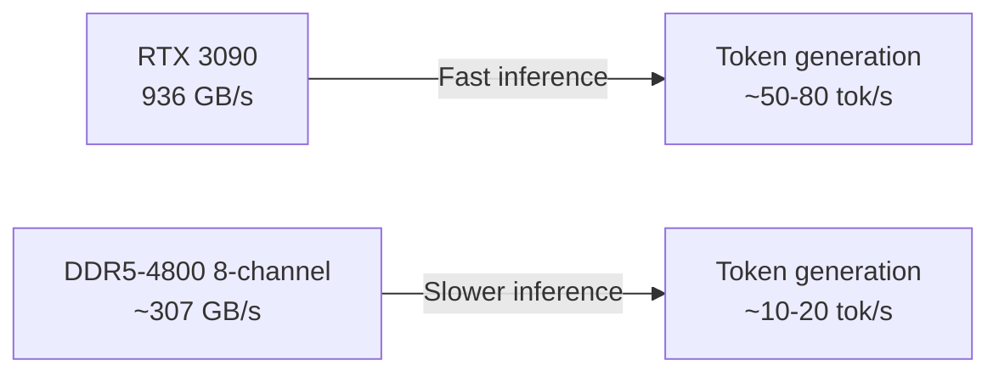
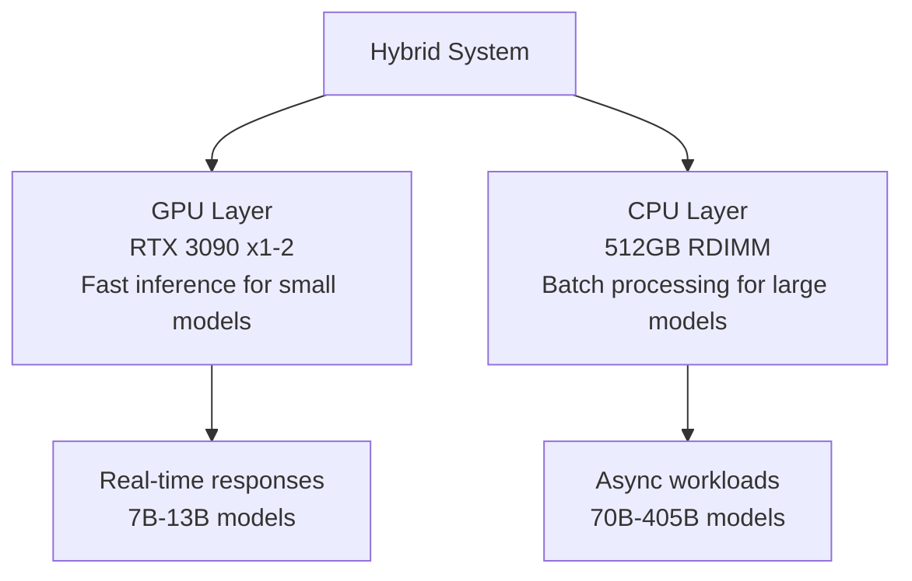

## Overview

In February 2026, a discussion on Reddit's r/LocalLLaMA community revealed that <strong>DDR5 RDIMM pricing per GB has dropped below RTX 3090 VRAM pricing per GB</strong>. The post, which garnered 392 upvotes, signals a fundamental turning point in local LLM hardware selection.

In a community where "VRAM is king" has been the prevailing wisdom, the possibility that RAM-based CPU inference could overtake GPUs in cost efficiency sent shockwaves through the local LLM space.

## Cost-per-GB Comparison: Real Numbers

### RTX 3090 VRAM Cost

The RTX 3090 packs 24GB of GDDR6X VRAM and currently trades at approximately <strong>$600–800</strong> on the used market.

- Per 24GB VRAM: <strong>$25–33/GB</strong>
- 4-card stack (96GB): <strong>$2,400–3,200</strong>
- No NVLink support — pipeline parallelism only, no tensor parallelism

### DDR5 RDIMM Cost

DDR5 RDIMM prices have plummeted, changing the equation entirely.

- DDR5-4800 RDIMM 128GB: <strong>~$200–250</strong>
- Cost per GB: <strong>$1.5–2.0/GB</strong>
- 512GB configuration: <strong>$800–1,000</strong>

```
┌─────────────────────────────────────────────┐
│      Cost per GB Comparison (Feb 2026)      │
├──────────────────┬──────────────────────────┤
│ RTX 3090 VRAM    │ $25–33/GB               │
│ DDR5 RDIMM       │ $1.5–2.0/GB             │
│ Cost gap          │ ~15–20x                 │
├──────────────────┴──────────────────────────┤
│ Cost to acquire 512GB memory                │
│ GPU (3090 x22)   │ ~$15,000                │
│ RAM (RDIMM x4)   │ ~$1,000                 │
└─────────────────────────────────────────────┘
```

## Why GPUs Still Matter: The Speed Question

While RDIMM wins overwhelmingly on cost per GB, the key factor is <strong>inference speed</strong>.

### Memory Bandwidth Comparison



- <strong>RTX 3090</strong>: GDDR6X at 936 GB/s bandwidth
- <strong>DDR5-4800 8-channel</strong>: ~307 GB/s bandwidth
- GPU provides roughly <strong>3x</strong> the bandwidth

LLM token generation speed scales nearly linearly with memory bandwidth. This means GPUs deliver roughly 3–5x faster inference for the same model.

## Cost Structure Analysis: When Does CPU Win?

### Scenario 1: Loading Massive Models

For running 70B–405B parameter models locally, VRAM capacity is the primary bottleneck.

- <strong>Llama 3.1 405B (Q4_K_M)</strong>: ~230GB required
- GPU solution: ~10 RTX 3090s ($6,000–8,000)
- RAM solution: DDR5 RDIMM 256GB ($500) + CPU/MB ($1,000–2,000)

In this case, <strong>CPU inference wins decisively on cost</strong>.

### Scenario 2: Low-Latency Responses Required

For real-time chatbots or code completion where latency matters:

- RTX 3090 running 7B–13B models: <strong>50+ tok/s</strong>
- DDR5 system running the same models: <strong>10–20 tok/s</strong>

When speed is critical, <strong>GPU remains the clear winner</strong>.

### Scenario 3: Batch Processing / Async Workloads

For document summarization, translation, or data analysis where response time is flexible:

- GPU system cost: <strong>$3,000–5,000</strong> (3090 x2–4)
- CPU system cost: <strong>$2,000–3,000</strong> (Xeon + 512GB RDIMM)
- CPU systems can <strong>run larger models at lower cost</strong>

## Community Reactions and Key Debates

Key arguments from the Reddit discussion:

### "RDIMM doesn't come with compute"

GPUs provide VRAM + compute (CUDA cores) as a package. RDIMM is pure memory, requiring a separate CPU. However, modern Xeon and EPYC processors with AVX-512 deliver surprisingly efficient CPU inference.

### "Don't forget power consumption"

- 4x RTX 3090: <strong>~1,400W</strong>
- Xeon + 512GB RDIMM system: <strong>~300–500W</strong>

The power cost difference is substantial for long-term operation.

### "Used 3090 prices may drop further"

With RTX 5090 released, used 3090 prices are declining — but RDIMM prices are falling even faster.

## Practical Build Guide: CPU Inference System

For a CPU inference system targeting large models:

### Recommended Build (~$2,500)

| Component | Model | Est. Price |
|-----------|-------|------------|
| CPU | Intel Xeon w5-2465X (16-core) | $800 |
| Motherboard | ASUS Pro WS W790E-SAGE | $700 |
| RAM | DDR5-4800 RDIMM 128GB x4 (512GB) | $800 |
| Other | PSU, case, SSD | $200 |

### llama.cpp Configuration

```bash
# Build llama.cpp with AVX-512 optimization
cmake -B build -DGGML_AVX512=ON -DGGML_AVX512_VNNI=ON
cmake --build build --config Release

# Run 405B model (Q4_K_M quantization)
./build/bin/llama-server \
  -m models/llama-3.1-405b-q4_k_m.gguf \
  --threads 16 \
  --ctx-size 8192 \
  --host 0.0.0.0 \
  --port 8080
```

## The Hybrid Approach: GPU + CPU Combined

The most practical choice is often a <strong>hybrid setup</strong>.



- Small models (7B–13B) on GPU for fast inference
- Large models (70B+) on CPU for cost-efficient execution
- Use llama.cpp's `--n-gpu-layers` to offload select layers to GPU

## Conclusion: What This Tipping Point Means

DDR5 RDIMM pricing dropping below RTX 3090 VRAM per GB isn't just a price inversion. It represents a <strong>fundamental shift in local LLM deployment strategy</strong>.

1. <strong>Large model accessibility</strong>: 405B-class models runnable on a $2,500 system
2. <strong>Diversified cost optimization</strong>: Choose GPU/CPU/hybrid based on use case
3. <strong>Lower barrier to entry</strong>: Local LLM experimentation costs have dropped significantly

If speed is your top priority, GPU remains the answer. But if your goal is <strong>"the biggest model at the lowest cost"</strong>, DDR5 RDIMM-based CPU inference is emerging as the new optimal solution in 2026.

## References

- [Reddit r/LocalLLaMA: PSA: DDR5 RDIMM price passed the point were 3090 are less expensive per gb](https://www.reddit.com/r/LocalLLaMA/comments/1r83irw/psa_ddr5_rdimm_price_passed_the_point_were_3090/)
- [llama.cpp GitHub Repository](https://github.com/ggml-org/llama.cpp)
- [DDR5 RDIMM Pricing Trends — Memory Benchmark](https://www.memorybenchmark.net/)
