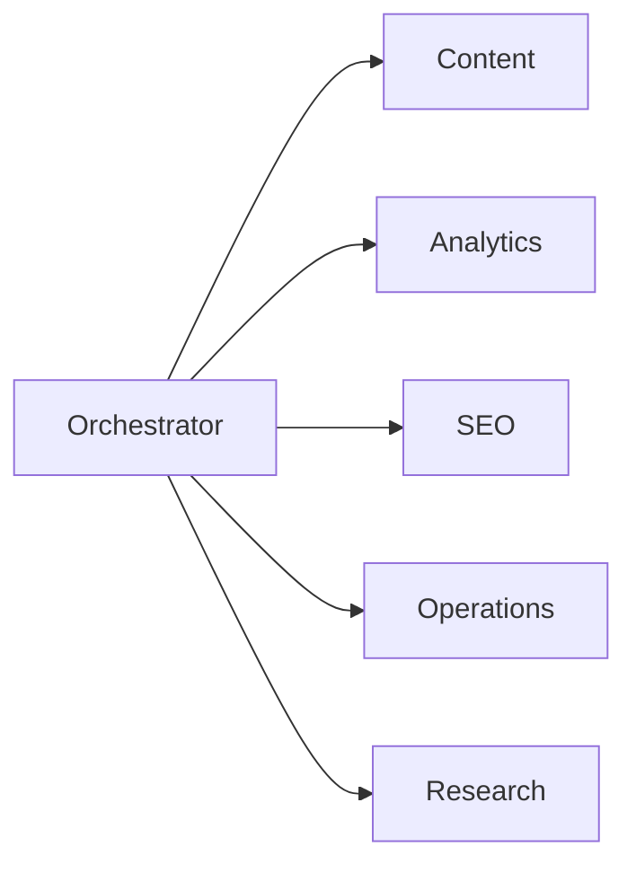
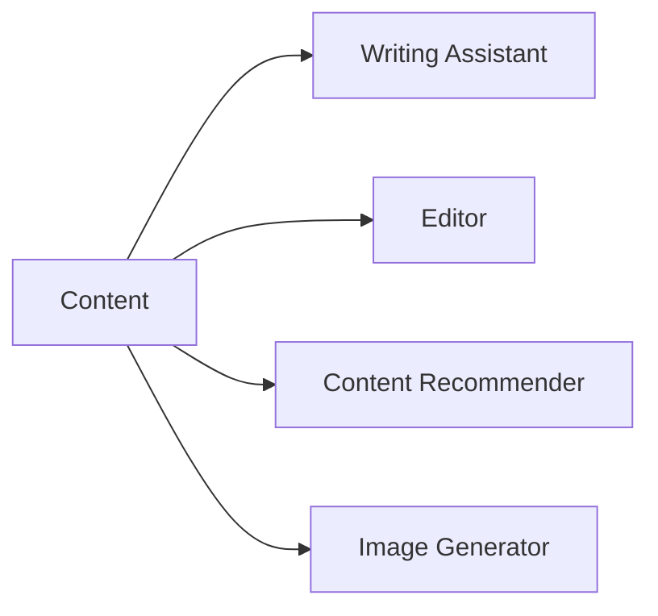
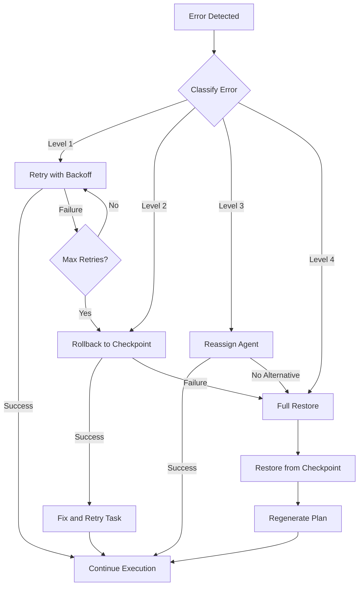

## Introduction

AI agent systems have evolved rapidly, but most implementations still operate as <strong>Shallow Agents</strong>—systems that can handle 5〜15 steps before losing context or failing. The emerging <strong>Deep Agents</strong> paradigm represents a fundamental shift in how we design agent architectures, enabling systems that can execute 100+ step workflows with autonomous recovery.

This post documents how we analyzed concepts from LangChain's research and Philipp Schmid's Deep Agents/Agents 2.0 framework, then applied them to optimize our `.claude/` directory structure for a technical blog automation system.

## Deep Agents vs Shallow Agents: Agent 1.0 vs 2.0

Understanding the distinction between these paradigms is crucial for building production-ready agent systems.

### Shallow Agents (Agent 1.0)

**Characteristics**:
- Single LLM call with tools
- 5〜15 steps maximum
- No persistent memory
- Manual error recovery
- Flat architecture

**Typical Workflow**:
```
User Request → LLM → Tool Call → Response
```

**Limitations**:
- Context window constraints
- No inter-step learning
- Cascading failures
- Limited task complexity

### Deep Agents (Agent 2.0)

**Characteristics**:
- Hierarchical orchestration
- 100+ step capability
- Persistent state management
- Autonomous recovery
- Explicit planning systems

**Typical Workflow**:
```
User Request → Planner → Orchestrator → Specialized Agents → State Manager → Recovery → Response
```

**Key Innovations**:
- **Explicit Planning**: Structured approach to task decomposition
- **Memory Persistence**: State survives across sessions
- **Self-Healing**: Automatic error detection and recovery
- **Hierarchical Delegation**: Specialized agents for specific domains

## The Four Pillars of Deep Agents

Based on analysis of LangChain documentation and Philipp Schmid's Agents 2.0 concepts, we identified four foundational pillars.

### 1. Explicit Planning

**Core Concept**: Replace implicit reasoning with structured planning protocols.

**Implementation**:
```yaml
# planning-protocol.md
planning_phases:
  - phase: discovery
    actions:
      - analyze_request
      - gather_context
      - identify_constraints

  - phase: decomposition
    actions:
      - break_into_subtasks
      - identify_dependencies
      - estimate_complexity

  - phase: assignment
    actions:
      - match_agent_capabilities
      - allocate_resources
      - set_checkpoints
```

**Benefits**:
- Transparent decision-making
- Reproducible workflows
- Better error diagnosis
- Optimized resource allocation

### 2. Hierarchical Delegation

**Core Concept**: Organize agents into specialized clusters with clear communication protocols.

**Orchestrator → Clusters:**



**Cluster → Agents (e.g., Content Cluster):**



**Communication Protocol**:
```typescript
interface AgentMessage {
  from: string;
  to: string;
  type: 'request' | 'response' | 'status' | 'error';
  payload: {
    task_id: string;
    content: unknown;
    priority: 'high' | 'medium' | 'low';
    deadline?: Date;
  };
  metadata: {
    timestamp: Date;
    correlation_id: string;
    retry_count: number;
  };
}
```

### 3. Persistent Memory

**Core Concept**: Maintain state across sessions and steps for continuous learning.

**State Architecture**:
```typescript
interface AgentState {
  // Session State
  session: {
    id: string;
    started_at: Date;
    last_activity: Date;
    steps_completed: number;
  };

  // Task State
  tasks: {
    current: Task[];
    completed: Task[];
    failed: Task[];
    queue: Task[];
  };

  // Knowledge State
  knowledge: {
    learned_patterns: Pattern[];
    error_history: ErrorRecord[];
    optimization_hints: Hint[];
  };

  // Recovery State
  checkpoints: {
    id: string;
    state_snapshot: unknown;
    created_at: Date;
    recoverable: boolean;
  }[];
}
```

**Persistence Strategy**:
```yaml
persistence:
  storage:
    type: file_system
    path: .claude/state/

  sync:
    interval: 30s
    on_checkpoint: true
    on_task_complete: true

  retention:
    sessions: 30d
    checkpoints: 7d
    knowledge: permanent
```

### 4. Extreme Context Engineering

**Core Concept**: Optimize every token of context for maximum agent effectiveness.

**Techniques**:

1. **Dynamic Context Loading**: Load only relevant context per task
2. **Context Compression**: Summarize long histories
3. **Priority Injection**: Critical information first
4. **Format Optimization**: Structured data over prose

**Example Implementation**:
```markdown
<!-- Instead of this -->
The user wants to write a blog post about TypeScript. They previously
wrote posts about JavaScript and React. The blog uses Astro framework
with MDX support. They prefer technical, detailed content...

<!-- Use this -->
## Task: Write Blog Post
- Topic: TypeScript
- Format: Technical/Detailed
- Framework: Astro + MDX
- Related: [JS, React posts]
- Schema: [title, description, pubDate, tags]
```

## Current Structure Analysis: 65% Compliance

Before optimization, we analyzed our existing `.claude/` directory against Deep Agents criteria.

### Existing Structure

```
.claude/
├── agents/                    # 15 specialized agents
│   ├── writing-assistant.md
│   ├── seo-optimizer.md
│   ├── analytics.md
│   └── ...
├── commands/                  # Custom slash commands
│   ├── write-post.md
│   └── analyze-posts.md
└── settings.local.json       # MCP permissions
```

### Compliance Assessment

| Criterion | Score | Status |
|-----------|-------|--------|
| Specialized Agents | 90% | Excellent |
| Clear Responsibilities | 85% | Good |
| Task Decomposition | 70% | Moderate |
| **Explicit Planning** | **40%** | **Needs Work** |
| **Hierarchical Orchestration** | **45%** | **Needs Work** |
| **Persistent State** | **30%** | **Critical** |
| **Recovery Protocols** | **35%** | **Critical** |
| Context Engineering | 75% | Good |

**Overall Score: 65%**

### Identified Gaps

1. **No Central Orchestrator**: Agents operate independently without coordination
2. **Missing Planning Protocol**: Tasks executed without structured planning
3. **No State Persistence**: State lost between sessions
4. **No Recovery System**: Failures require manual intervention
5. **Flat Hierarchy**: No cluster organization for specialized domains

## Implementation: The Optimized Architecture

Based on our analysis, we designed a comprehensive optimization plan.

### 1. Orchestrator Agent

The central coordinator for all agent activities.

```markdown
<!-- .claude/agents/orchestrator.md -->

# Orchestrator Agent

## Role
Central coordinator for all agent activities. Routes tasks, manages state,
handles recovery, and ensures efficient resource utilization.

## Capabilities

### Task Routing
- Analyze incoming requests
- Match to appropriate clusters
- Manage task queues
- Track progress

### State Management
- Initialize sessions
- Create checkpoints
- Persist state
- Restore from failures

### Recovery
- Detect failures
- Identify recovery strategies
- Execute rollback if needed
- Resume from checkpoints

## Cluster Registry

### Content Cluster
- **Lead**: writing-assistant
- **Members**: editor, content-recommender, image-generator
- **Domain**: Blog content creation and optimization

### Analytics Cluster
- **Lead**: analytics
- **Members**: analytics-reporter, post-analyzer
- **Domain**: Data analysis and reporting

### SEO Cluster
- **Lead**: seo-optimizer
- **Members**: backlink-manager
- **Domain**: Search engine optimization

### Operations Cluster
- **Lead**: site-manager
- **Members**: portfolio-curator
- **Domain**: Site maintenance and deployment

### Research Cluster
- **Lead**: web-researcher
- **Members**: trend-analyzer
- **Domain**: Information gathering and analysis

## Routing Rules

```yaml
routing:
  - pattern: "write|create|blog|post"
    cluster: content
    priority: high

  - pattern: "analyze|report|metrics|traffic"
    cluster: analytics
    priority: medium

  - pattern: "seo|backlink|ranking|meta"
    cluster: seo
    priority: medium

  - pattern: "deploy|build|performance"
    cluster: operations
    priority: high

  - pattern: "research|search|trends"
    cluster: research
    priority: low
```

## Workflow

1. Receive request from user
2. Invoke planning-protocol
3. Route to appropriate cluster
4. Monitor execution
5. Handle failures via recovery-protocol
6. Persist state on completion
```

### 2. Five Specialized Clusters

Organizing agents into domain-specific clusters improves coordination and efficiency.

| Cluster | Lead Agent | Members |
|---------|------------|---------|
| **Content** | Writing Assistant | Editor, Content Recommender, Image Generator |
| **Analytics** | Analytics | Analytics Reporter, Post Analyzer |
| **SEO** | SEO Optimizer | Backlink Manager |
| **Operations** | Site Manager | Portfolio Curator |
| **Research** | Web Researcher | Trend Analyzer |

**Cluster Benefits**:
- Clear ownership of domains
- Reduced context switching
- Parallel execution within clusters
- Specialized optimization per domain

### 3. Planning Protocol

Structured approach to task decomposition and execution.

```markdown
<!-- .claude/protocols/planning-protocol.md -->

# Planning Protocol

## Overview
This protocol defines how tasks are analyzed, decomposed, and scheduled
for execution across the agent system.

## Phases

### Phase 1: Discovery (5-10% of task time)

**Objective**: Understand the request completely

**Actions**:
1. Parse user request for intent and requirements
2. Identify explicit and implicit constraints
3. Gather relevant context from:
   - CLAUDE.md project instructions
   - Previous session state
   - Related content/code
4. Validate feasibility

**Output**: Discovery Report
```yaml
discovery:
  intent: "Create multilingual blog post about TypeScript"
  requirements:
    - Technical depth: Advanced
    - Languages: ko, en, ja
    - Include: Code examples, diagrams
  constraints:
    - Schema compliance
    - SEO optimization
    - 2000+ words per language
  context:
    - Related posts: [typescript-basics, advanced-types]
    - Style guide: Technical, detailed
  feasibility: HIGH
```

### Phase 2: Decomposition (10-15% of task time)

**Objective**: Break task into manageable subtasks

**Actions**:
1. Identify discrete work units
2. Map dependencies between units
3. Estimate complexity and duration
4. Identify potential failure points

**Output**: Task Graph
```yaml
tasks:
  - id: research
    description: "Research TypeScript 5.0 features"
    dependencies: []
    agent: web-researcher
    complexity: medium
    estimated_time: 15m

  - id: outline
    description: "Create post outline"
    dependencies: [research]
    agent: writing-assistant
    complexity: low
    estimated_time: 10m

  - id: write-ko
    description: "Write Korean version"
    dependencies: [outline]
    agent: writing-assistant
    complexity: high
    estimated_time: 45m

  - id: write-en
    description: "Write English version"
    dependencies: [outline]
    agent: writing-assistant
    complexity: high
    estimated_time: 45m

  - id: review
    description: "Review and edit"
    dependencies: [write-ko, write-en]
    agent: editor
    complexity: medium
    estimated_time: 20m

  - id: seo
    description: "Optimize for SEO"
    dependencies: [review]
    agent: seo-optimizer
    complexity: low
    estimated_time: 10m
```

### Phase 3: Assignment (5% of task time)

**Objective**: Allocate tasks to agents optimally

**Actions**:
1. Match tasks to agent capabilities
2. Consider current agent workload
3. Optimize for parallel execution
4. Set checkpoints for recovery

**Output**: Execution Plan
```yaml
execution:
  parallel_groups:
    - group: 1
      tasks: [research]
      checkpoint: after

    - group: 2
      tasks: [outline]
      checkpoint: after

    - group: 3
      tasks: [write-ko, write-en]  # Parallel
      checkpoint: after

    - group: 4
      tasks: [review, seo]
      checkpoint: after

  total_estimated_time: 2h 25m
  checkpoints: 4
  recovery_points: 4
```

### Phase 4: Execution (70-80% of task time)

**Objective**: Execute plan with monitoring

**Actions**:
1. Dispatch tasks to assigned agents
2. Monitor progress and resource usage
3. Handle inter-agent communication
4. Create checkpoints as planned

**Monitoring Metrics**:
- Task completion rate
- Time per task vs estimate
- Error rate
- Resource utilization

### Phase 5: Review (5% of task time)

**Objective**: Validate results and capture learnings

**Actions**:
1. Verify all outputs meet requirements
2. Run quality checks
3. Capture learnings for optimization
4. Update knowledge base

**Output**: Completion Report
```yaml
completion:
  status: SUCCESS
  tasks_completed: 6/6
  total_time: 2h 10m
  deviation: -15m
  quality_score: 92/100
  learnings:
    - "Parallel writing reduced total time by 30%"
    - "SEO step could be parallelized with review"
```
```

### 4. State Management System

Persistent state that survives across sessions.

```typescript
// .claude/state/state-manager.ts

interface StateManager {
  // Session Management
  initSession(): SessionState;
  getSession(id: string): SessionState | null;
  updateSession(state: Partial<SessionState>): void;

  // Checkpoint Management
  createCheckpoint(label: string): Checkpoint;
  restoreCheckpoint(id: string): boolean;
  listCheckpoints(): Checkpoint[];

  // Knowledge Management
  recordLearning(learning: Learning): void;
  queryKnowledge(query: string): Learning[];

  // Persistence
  save(): Promise<void>;
  load(): Promise<void>;
}

// State Schema
interface SessionState {
  id: string;
  started_at: Date;
  last_activity: Date;

  // Current execution
  current_plan: ExecutionPlan | null;
  active_tasks: Task[];
  completed_tasks: Task[];

  // History
  steps_completed: number;
  total_steps_estimated: number;

  // Performance
  tokens_used: number;
  errors_encountered: number;
  recoveries_performed: number;
}

interface Checkpoint {
  id: string;
  label: string;
  created_at: Date;
  session_snapshot: SessionState;
  recoverable: boolean;
  size_bytes: number;
}

interface Learning {
  id: string;
  type: 'optimization' | 'error_pattern' | 'best_practice';
  content: string;
  context: string;
  confidence: number;
  created_at: Date;
  applied_count: number;
}
```

**State File Structure**:
```
.claude/state/
├── sessions/
│   ├── current.json
│   └── history/
│       ├── 2025-11-17.json
│       └── 2025-11-16.json
├── checkpoints/
│   ├── checkpoint-001.json
│   └── checkpoint-002.json
├── knowledge/
│   ├── optimizations.json
│   ├── error-patterns.json
│   └── best-practices.json
└── index.json
```

### 5. Recovery Protocol

Automatic error detection and recovery system.

```markdown
<!-- .claude/protocols/recovery-protocol.md -->

# Recovery Protocol

## Overview
This protocol defines how the system detects, classifies, and recovers
from failures during task execution.

## Error Classification

### Level 1: Transient Errors
**Examples**: Network timeout, rate limit, temporary unavailability
**Recovery**: Automatic retry with exponential backoff

### Level 2: Task Errors
**Examples**: Invalid input, missing dependencies, schema violation
**Recovery**: Rollback to last checkpoint, fix issue, retry

### Level 3: Agent Errors
**Examples**: Agent unresponsive, capability mismatch
**Recovery**: Reassign to alternative agent or cluster

### Level 4: System Errors
**Examples**: State corruption, unrecoverable failure
**Recovery**: Full session restore from last valid checkpoint

## Recovery Strategies

### Strategy: Retry
```yaml
strategy: retry
applicable_levels: [1]
configuration:
  max_attempts: 3
  backoff: exponential
  initial_delay: 1s
  max_delay: 30s
```

### Strategy: Rollback and Retry
```yaml
strategy: rollback_retry
applicable_levels: [2]
configuration:
  checkpoint_selection: latest_valid
  state_cleanup: true
  retry_with_modifications: true
```

### Strategy: Reassign
```yaml
strategy: reassign
applicable_levels: [3]
configuration:
  find_alternative_agent: true
  preserve_task_state: true
  notify_orchestrator: true
```

### Strategy: Full Restore
```yaml
strategy: full_restore
applicable_levels: [4]
configuration:
  checkpoint_selection: last_successful
  clear_corrupted_state: true
  regenerate_plan: true
  notify_user: true
```

## Recovery Flow



## Implementation

### Error Detection
```typescript
function detectError(result: TaskResult): ErrorInfo | null {
  // Check for explicit errors
  if (result.status === 'error') {
    return classifyError(result.error);
  }

  // Check for implicit errors
  if (result.output && !validateOutput(result.output, result.schema)) {
    return {
      level: 2,
      type: 'schema_violation',
      message: 'Output does not match expected schema',
      recoverable: true
    };
  }

  // Check for timeouts
  if (result.duration > result.timeout) {
    return {
      level: 1,
      type: 'timeout',
      message: 'Task exceeded time limit',
      recoverable: true
    };
  }

  return null;
}
```

### Recovery Execution
```typescript
async function executeRecovery(error: ErrorInfo): Promise<RecoveryResult> {
  const strategy = selectStrategy(error.level);

  switch (strategy.type) {
    case 'retry':
      return await retryWithBackoff(error.task, strategy.config);

    case 'rollback_retry':
      const checkpoint = findLatestValidCheckpoint();
      await restoreCheckpoint(checkpoint.id);
      return await retryTask(error.task, { modified: true });

    case 'reassign':
      const alternative = findAlternativeAgent(error.task);
      return await executeTask(error.task, alternative);

    case 'full_restore':
      await fullSystemRestore();
      return { status: 'restored', message: 'System restored from checkpoint' };
  }
}
```

## Metrics

Track recovery performance:
- **Recovery Rate**: Percentage of errors successfully recovered
- **Mean Time to Recovery (MTTR)**: Average time from error to resolution
- **Checkpoint Efficiency**: Percentage of checkpoints used in recovery
- **Retry Success Rate**: Percentage of retries that succeed
```

## Expected Improvements

After implementing the Deep Agents architecture, we project significant improvements across key metrics.

### Task Complexity

| Metric | Before | After | Improvement |
|--------|--------|-------|-------------|
| Max Steps per Session | 15 | 100+ | 567% |
| Average Task Complexity | Medium | Very High | 2 levels |
| Parallel Execution | None | 3〜5 agents | New capability |
| Cross-session Continuity | None | Full | New capability |

### Reliability

| Metric | Before | After | Improvement |
|--------|--------|-------|-------------|
| Auto-recovery Rate | 0% | >90% | New capability |
| Mean Time to Recovery | Manual | <30s | Automated |
| Error Handling Coverage | 40% | 95% | 138% |
| State Persistence | None | Full | New capability |

### Efficiency

| Metric | Before | After | Improvement |
|--------|--------|-------|-------------|
| Context Utilization | 60% | 90% | 50% |
| Token Efficiency | Baseline | +40% | 40% |
| Planning Overhead | Ad-hoc | Structured | Predictable |
| Resource Allocation | Manual | Automatic | New capability |

### Quality

| Metric | Before | After | Improvement |
|--------|--------|-------|-------------|
| Output Consistency | Variable | High | Significant |
| Error Pattern Learning | None | Continuous | New capability |
| Optimization Over Time | None | Automatic | New capability |

## Real-World Application Example

Let's trace through a real-world workflow with the optimized architecture.

### Scenario: Create Multilingual Technical Blog Post

**Request**: "Write a comprehensive blog post about TypeScript 5.0 features in Korean, English, and Japanese"

### Step 1: Orchestrator Receives Request

```yaml
request:
  type: content_creation
  complexity: high
  estimated_steps: 25+
  languages: [ko, en, ja]
```

### Step 2: Planning Protocol Executes

```yaml
plan:
  phases:
    - discovery: 10min
    - decomposition: 15min
    - execution: 3h
    - review: 30min

  checkpoints: 6
  parallel_opportunities: 3
```

### Step 3: Orchestrator Routes to Content Cluster

```yaml
routing:
  primary_cluster: content
  supporting_clusters: [research, seo]

  task_distribution:
    research_cluster:
      - gather_typescript_5_features
      - find_code_examples

    content_cluster:
      - create_outline
      - write_korean_version
      - write_english_version
      - write_japanese_version
      - generate_hero_image

    seo_cluster:
      - optimize_metadata
      - internal_linking
```

### Step 4: Parallel Execution with Checkpoints

```mermaid
gantt
    title Task Execution Timeline
    dateFormat HH:mm

    section Research
    Gather Features    :r1, 00:00, 15m
    Find Examples      :r2, after r1, 10m

    section Content
    Create Outline     :c1, after r2, 15m
    Write Korean       :c2, after c1, 45m
    Write English      :c3, after c1, 45m
    Write Japanese     :c4, after c1, 45m
    Generate Image     :c5, after c1, 20m

    section SEO
    Optimize Metadata  :s1, after c2 c3 c4, 15m
    Internal Linking   :s2, after s1, 10m

    section Checkpoints
    CP1 After Research :milestone, after r2, 0m
    CP2 After Outline  :milestone, after c1, 0m
    CP3 After Writing  :milestone, after c2 c3 c4, 0m
    CP4 Final          :milestone, after s2, 0m
```



### Step 5: Recovery Scenario

During Japanese version writing, a rate limit error occurs:

```yaml
error:
  level: 1
  type: rate_limit
  task: write_japanese_version

recovery:
  strategy: retry_with_backoff
  attempts: 2
  result: success
  total_delay: 45s
```

### Step 6: Completion and Learning

```yaml
completion:
  status: SUCCESS
  total_time: 2h 45m

  outputs:
    - /content/blog/ko/typescript-5-features.md
    - /content/blog/en/typescript-5-features.md
    - /content/blog/ja/typescript-5-features.md
    - /assets/blog/typescript-5-features-hero.jpg

  learnings:
    - "Japanese writing took 20% longer - allocate more time"
    - "Parallel writing reduced total time by 35%"
    - "Early SEO planning would reduce final optimization time"

  knowledge_updates:
    - type: optimization
      content: "Parallel multilingual writing effective"
    - type: best_practice
      content: "Create outline before parallel execution"
```

## Implementation Roadmap

For teams looking to adopt the Deep Agents paradigm, here's a phased approach.

### Phase 1: Foundation (Week 1〜2)

**Tasks**:
- [ ] Create orchestrator agent
- [ ] Define cluster structure
- [ ] Implement basic routing

**Deliverables**:
- `orchestrator.md` agent definition
- Cluster assignment documentation
- Basic routing rules

### Phase 2: Planning (Week 3〜4)

**Tasks**:
- [ ] Implement planning protocol
- [ ] Add task decomposition
- [ ] Create execution templates

**Deliverables**:
- `planning-protocol.md`
- Task graph generator
- Execution plan templates

### Phase 3: State Management (Week 5〜6)

**Tasks**:
- [ ] Design state schema
- [ ] Implement persistence layer
- [ ] Add checkpoint system

**Deliverables**:
- State management module
- Checkpoint utilities
- State migration tools

### Phase 4: Recovery (Week 7〜8)

**Tasks**:
- [ ] Implement error classification
- [ ] Add recovery strategies
- [ ] Create recovery monitoring

**Deliverables**:
- `recovery-protocol.md`
- Error handler implementations
- Recovery dashboard

### Phase 5: Optimization (Week 9〜10)

**Tasks**:
- [ ] Add knowledge capture
- [ ] Implement learning system
- [ ] Optimize context engineering

**Deliverables**:
- Knowledge base schema
- Learning algorithms
- Context optimization rules

## Conclusion

The Deep Agents paradigm represents a significant evolution in AI agent architecture. By implementing explicit planning, hierarchical orchestration, persistent state management, and autonomous recovery, we can build systems capable of handling far more complex workflows than traditional shallow agents.

Our analysis showed 65% compliance with Deep Agents principles in the existing structure—a solid foundation but with critical gaps in planning, state management, and recovery. The proposed optimizations address these gaps while preserving the strengths of the current specialized agent system.

**Key Takeaways**:

1. **Explicit Planning** transforms ad-hoc execution into predictable, optimizable workflows
2. **Hierarchical Clusters** improve coordination and enable parallel execution
3. **Persistent State** enables cross-session continuity and learning
4. **Recovery Protocols** automate error handling for >90% recovery rate
5. **Expected Results**: 5〜15 steps to 100+ steps, with autonomous recovery

The Deep Agents architecture isn't just an incremental improvement—it's a fundamental shift that enables AI agent systems to tackle production-scale complexity with reliability and efficiency.

## References

- LangChain Documentation: Agent Architectures and Patterns
- Philipp Schmid: "Deep Agents: Agents 2.0 Architecture" (2024)
- Anthropic Engineering: "Claude Code Best Practices" (2024)
- Anthropic Engineering: "Building Effective Agents" (2024)
- LangGraph: Multi-Agent Orchestration Patterns

---

*This post is part of a series on AI agent system optimization. Future posts will cover specific implementation details for each component of the Deep Agents architecture.*
