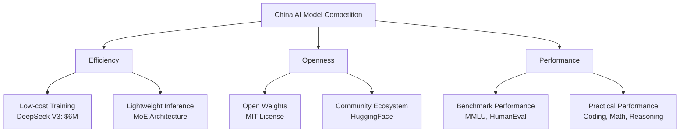

## Overview

In early 2026, a new wave of large language models (LLMs) is sweeping through China's AI industry. News that <strong>DeepSeek V4's release is imminent</strong> has generated significant buzz in the Reddit r/LocalLLaMA community. Following Qwen3.5 and GLM-5, DeepSeek V4 marks yet another milestone — the next-generation model competition among Chinese AI companies is accelerating in full force.

## DeepSeek's Journey

### The Leap from V3 to V4

DeepSeek is a Chinese AI company that has grown rapidly since its founding in 2023. Notably, <strong>DeepSeek V3</strong> achieved performance comparable to GPT-4 with a training cost of just $6 million, triggering a "Sputnik moment" in the AI industry.

Key improvements expected in V4 include:

- More sophisticated utilization of <strong>Mixture of Experts (MoE) architecture</strong>
- Significant enhancement of reasoning capabilities (integrating R1 series achievements)
- Expanded multimodal support
- Further improvements in training efficiency

### Continuing the Open Weight Strategy

One of DeepSeek's core competitive advantages is its <strong>open weight policy</strong>. By releasing model weights under the MIT License, developers worldwide can freely use and improve upon them. This strategy is expected to continue with V4.

## China's AI Model Rush — 2026 Landscape

Here's a summary of major models released (or expected) in early 2026:

| Model | Developer | Key Features |
|-------|-----------|-------------|
| <strong>DeepSeek V4</strong> | DeepSeek | MoE-based, ultra-efficient training, open weights |
| <strong>Qwen3.5</strong> | Alibaba Cloud | Large-scale parameters, multilingual enhancement |
| <strong>GLM-5</strong> | Zhipu AI | Multimodal integration, enhanced agent capabilities |
| <strong>Yi-Lightning</strong> | 01.AI | Inference optimization, cost efficiency |

### Core Axes of Competition

## Open Models vs Closed Models

The open model strategy of Chinese AI companies contrasts sharply with the closed model approach of Western companies.

### Advantages of Open Models

- <strong>Transparency</strong>: Model architecture and weights can be verified
- <strong>Customization</strong>: Fine-tuning for specific domains is possible
- <strong>Local execution</strong>: Data privacy is guaranteed
- <strong>Community innovation</strong>: Contributions like quantization and optimization

### Narrowing the Gap with Closed Models

Just as DeepSeek R1 demonstrated performance comparable to OpenAI's o1, Chinese open models are rapidly closing the performance gap with closed models. Progress in <strong>coding</strong>, <strong>mathematics</strong>, and <strong>reasoning</strong> has been particularly remarkable.

## Local LLM Community Response

The DeepSeek V4 news scored 308 points on the Reddit r/LocalLLaMA community, generating significant excitement. Key areas of interest include:

- <strong>Local execution feasibility</strong>: What will the VRAM requirements be?
- <strong>Quantization support</strong>: Plans for GGUF, GPTQ format support
- <strong>Performance benchmarks</strong>: Comparison with GPT-4o and Claude 3.5
- <strong>API pricing</strong>: Price changes compared to existing V3

## Future Outlook

### What the Accelerating Competition Means

The model rush from Chinese AI companies goes beyond mere competition — it contributes to the democratization of AI technology. The continued development of open models is expected to bring about the following changes:

1. <strong>Improved AI accessibility</strong>: Small businesses and individual developers can leverage cutting-edge models
2. <strong>Cost reduction</strong>: Continued decline in training and inference costs
3. <strong>Innovation acceleration</strong>: Community-driven model improvements and expansion of application domains
4. <strong>Geopolitical impact</strong>: A new phase in the AI technology hegemony competition

## Conclusion

As DeepSeek V4's release approaches, the next-generation model competition among Chinese AI companies is entering a new stage. The model rush, continuing with Qwen3.5 and GLM-5, will further enrich the open AI model ecosystem. For developers working with local LLMs, an exciting era is upon us.

## References

- [Reddit r/LocalLLaMA - DeepSeek V4 Release Soon](https://www.reddit.com/r/LocalLLaMA/comments/1r71tn1/deepseek_v4_release_soon/)
- [DeepSeek Official Site](https://www.deepseek.com/)
- [DeepSeek HuggingFace](https://huggingface.co/deepseek-ai)
- [Wikipedia - DeepSeek](https://en.wikipedia.org/wiki/DeepSeek)
