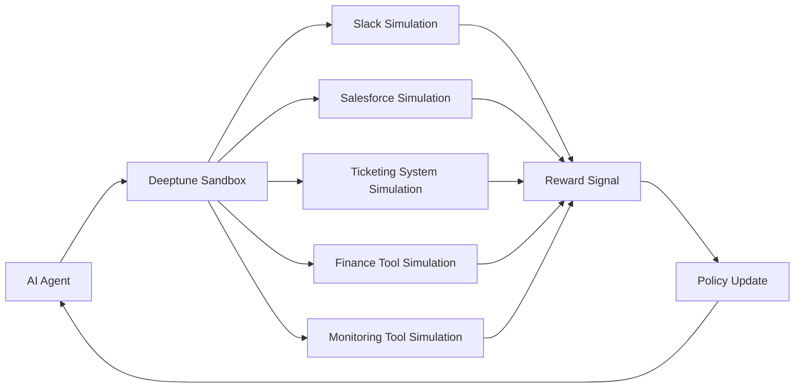
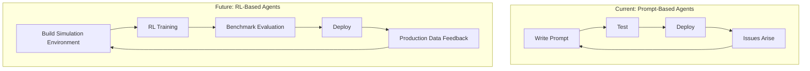

## Overview

New York-based startup **Deeptune** has raised a **$43M Series A** led by Andreessen Horowitz (a16z), with participation from 776, Abstract Ventures, and Inspired Capital. Notable angel investors include Noam Brown (OpenAI Research), Brendan Foody (CEO of Mercor), and Yash Patil (CEO of Applied Compute).

What Deeptune is building is a **"training gym"** for AI agents — high-fidelity **reinforcement learning (RL) environments** that simulate the real-world workflows of professionals like accountants, customer support agents, and DevOps engineers. Think virtual replicas of Slack, Salesforce, ticketing systems, finance tools, and monitoring dashboards where AI agents gain experience through thousands of simulated interactions.

In this article, I'll analyze why Deeptune's approach deserves attention and how engineering leaders should prepare for this trend.

---

## What Deeptune Does

### The "Sandbox" Architecture

Deeptune's core idea is straightforward: **provide AI agents with virtual environments identical to real work environments, then train them through reinforcement learning.**

If traditional LLM fine-tuning is "reading the textbook," Deeptune's RL environment is "hands-on practice in the lab." Agents check Slack messages, query customer data in Salesforce, write responses in ticketing systems — repeating entire workflows thousands of times within the simulation.

### The Team

Deeptune's team includes veterans from **Anthropic, Scale AI, Palantir, and Glean** — a combination that brings deep expertise in AI model development, data infrastructure, and enterprise software. The Anthropic connection is particularly telling: these are people who understand the limitations of LLMs firsthand and see RL as the necessary complement.

### Why RL?

Most AI agents today rely on prompt engineering and few-shot examples. The limitations of this approach are clear:

- **Poor edge case handling**: Prompts cannot cover every exception
- **No tool-use optimization**: Agents don't learn which tools to use in which order for maximum efficiency
- **Weak multi-step reasoning**: Accuracy drops sharply in workflows with 5+ sequential steps

RL addresses these problems through **experience-based learning**. Through thousands of simulated episodes, agents discover optimal action policies on their own.

---

## Why Engineering Organizations Should Pay Attention

### 1. The Bottleneck Is Shifting

Until recently, the biggest bottleneck for AI agent adoption was **model capability**. But as foundation models like GPT-4, Claude, and Gemini converge in raw performance, the bottleneck is shifting to **domain-specific adaptation**.

Deeptune's approach tackles this adaptation problem structurally. For engineering organizations, this means we're moving from an era of "persuading" general-purpose LLMs with prompts to an era of **deploying RL-trained agents** purpose-built for specific workflows. Selecting the right [agent orchestration framework](/en/blog/en/ai-agent-framework-comparison-2026-langgraph-crewai-dapr-production) becomes a critical engineering decision in this new paradigm.

### 2. The Rise of "AI Agent DevOps"

Just as CI/CD pipelines are now table stakes in software development, **[training-evaluation-deployment pipelines for AI agents](/en/blog/en/claude-code-agentic-workflow-patterns-5-types)** will soon become essential. Deeptune's RL environment handles the "training" phase of that pipeline.

### 3. The RL Market Is Exploding

The reinforcement learning market is projected to grow from **$11.6B in 2025** to **$90B+ by 2034**. A significant portion of this growth will come not from gaming or robotics, but from **enterprise workflow automation**. Deeptune is positioning itself as the infrastructure layer for this massive market.

---

## RL for Professional Workflows: Technical Analysis

### How This Differs from Traditional RL

Compared to RL used in Atari games or robot control, professional workflow RL presents unique technical challenges:

| Dimension | Game/Robot RL | Professional Workflow RL |
|-----------|--------------|------------------------|
| **State Space** | Pixels, sensor values (continuous) | Text, structured data (composite) |
| **Action Space** | Joystick inputs (limited) | API calls, text inputs (near-infinite) |
| **Reward Signal** | Score, distance (immediate) | Work quality, customer satisfaction (delayed) |
| **Episode Length** | Seconds to minutes | Minutes to hours |
| **Environment Complexity** | Physics-based | Business logic-based |

### Core Technical Challenges

**1. Environment Fidelity**

How closely the simulation matches reality determines the success of RL training. When Deeptune claims "high-fidelity" simulation of Slack, Salesforce, etc., this means going far beyond simple API mocking — it requires **reproducing actual usage patterns, data distributions, and error cases**.

**2. Reward Shaping**

Quantifying "good customer service" is not trivial. Deeptune likely employs a multi-layered reward system:

- **Completion reward**: Did the agent successfully finish the task?
- **Efficiency reward**: Did it complete with minimal steps?
- **Quality reward**: How accurate and complete is the output?
- **Safety reward**: Did it avoid dangerous actions (data deletion, incorrect financial entries, etc.)?

**3. Sim-to-Real Transfer**

Will a policy trained in simulation actually work in production? This gap is challenging even in game RL. In professional environments, **unexpected user behavior, system failures, and data inconsistencies** can make the gap significantly larger.

### Why OpenAI's Noam Brown Invested

The most notable name on the angel investor list is **Noam Brown** of OpenAI Research. As the key researcher behind poker AIs Libratus and Pluribus, he's at the frontier of RL for strategic decision-making. His investment in Deeptune is a strong statement: **"LLMs alone can't build production-grade work agents — RL is essential."**

---

## CTO/EM Action Items

### Short-Term (3-6 Months)

1. **Identify pilot workflows for AI agents**: List internal tasks that are repetitive, have clear rules, and carry low failure costs. These will be the first candidates for RL-trained agents.

2. **Document current prompt-based agent limitations**: If you've already deployed LLM-based agents, systematically catalog recurring failure patterns. This data becomes the foundation for future RL reward function design.

3. **Standardize workflows**: RL training requires clearly defined processes. Start documenting core workflows and standardizing tool usage patterns now.

### Medium-Term (6-18 Months)

4. **Build RL Ops capabilities**: Hire engineers with RL experience for your MLOps team or upskill existing members. Even with platforms like Deeptune, domain-specific customization will be necessary.

5. **Evaluate simulation environment solutions**: Assess third-party solutions like Deeptune, but verify they can handle the unique aspects of your work environment. Organizations with many proprietary systems should carefully evaluate environment construction costs.

6. **Build agent evaluation frameworks**: Before deploying RL-trained agents to production, prepare systematic benchmarks and safety testing frameworks. The [Managed Agents Production Deployment Guide](/en/blog/en/claude-managed-agents-production-deployment-guide) provides concrete evaluation approaches from real deployments.

### Long-Term (18+ Months)

7. **Design Human-in-the-Loop RL processes**: Create feedback loops that channel production experience back into RL training. This is where competitive differentiation in agent performance will come from.

8. **Establish AI agent governance**: RL-trained agents can be less predictable than prompt-based ones. You'll need governance frameworks covering monitoring, auditing, and rollback policies.

---

## Conclusion

Deeptune's $43M raise is not just startup news. It's a powerful signal that the AI agent market is **transitioning from "the age of prompt engineering" to "the age of reinforcement learning training."**

Key takeaways:

- **LLMs provide "knowledge," but RL provides "experience."** Professional-grade agents need both.
- **Simulation environments are a new infrastructure layer.** Just as CI/CD became the standard for software deployment, RL simulation will become the standard for agent deployment.
- **Start preparing now.** Workflow standardization, agent failure pattern documentation, RL Ops capability building — begin with these three.

a16z, OpenAI Research's Noam Brown, and a team of Anthropic/Scale AI veterans are all pointing in the same direction. As engineering leaders, we cannot afford to miss this inflection point.
