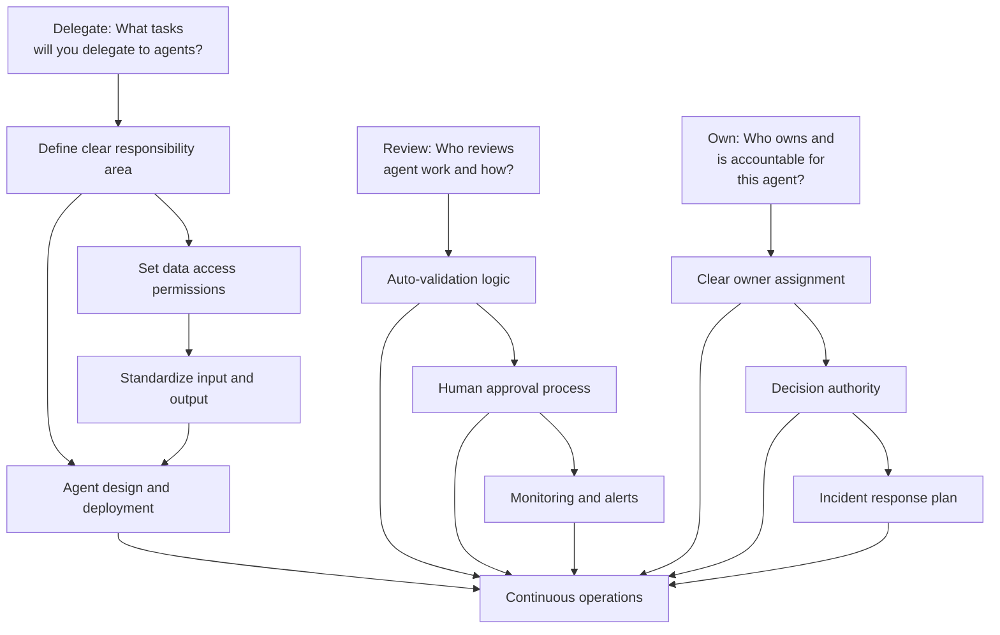
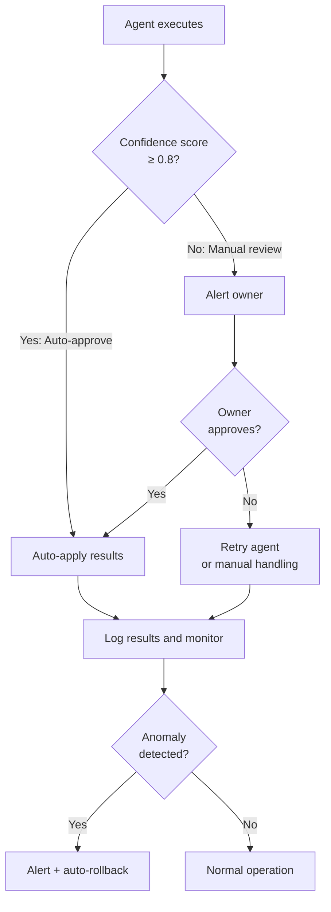
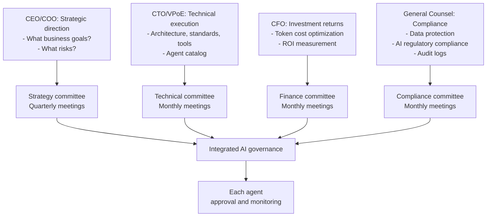

## Introduction: The Agentic AI Mirage

Since 2024, everyone promised the "AI Agent Era" was here. Some companies even built impressive demos—agents that receive Slack messages, automatically create Jira tickets, analyze data, and generate reports.

But Deloitte's 2026 Tech Trends report reveals a cold reality:

**<strong>Only 11% of enterprises worldwide are actually running Agentic AI in production.</strong>**

Where is everyone else?

- **42%**: Still developing strategy
- **35%**: Have no formal strategy
- **12%**: Stuck in experimentation

**89% of enterprises cannot reach production.** This isn't just a delay. This is organizational operational model failure.

This post isn't about "why you should adopt AI agents"—we covered that in "Enterprise AI Adoption: Why Top-Down Approaches Matter." Instead, we'll explore <strong>how to actually operate them</strong> from an EM/VPoE perspective, with concrete frameworks.

---

## Part 1: Diagnosis — Where Is Your Organization?

### Stage 1: Exploration Phase (42% — Still Developing Strategy)

"AI agents are the future. We need to do something."

Organizations at this stage show these characteristics:

- <strong>Scattered PoCs (Proof of Concepts)</strong>: Each team independently builds small agents
- <strong>Unclear ownership</strong>: "Who is responsible?" goes unanswered
- <strong>Token cost shock</strong>: Running a few small agents generates five-figure monthly bills
- <strong>No continuity</strong>: When someone leaves, their agent disappears with them

**Warning signs:**
```
Engineer 1: "Our team built a Slack AI bot"
Engineer 2: "Wait, we built one too?"
EM: "... Both in production?"
```

### Stage 2: Pilot Phase (12% — In Experimentation)

"Okay, let's take an organizational approach."

At this stage:

- <strong>A central AI team forms</strong> (or attempts to)
- <strong>A few key workflows are selected</strong>
- <strong>Early wins happen</strong>: Developer automated code review requests and it really helps
- <strong>Then stagnation sets in</strong>: Operating 5+ agents simultaneously creates management complexity that balloons

**Typical frustration point:**
```
Week 1: "This is working great!"
Week 3: "But... this agent sometimes does weird things"
Week 4: "What's causing this? Who can review the code?"
Week 5: "Let's just do it manually"
```

### Stage 3: No Strategy (35% — Directionless)

The most dangerous state. Organizations feel the need for AI agents but don't know how to proceed.

Organizations at this stage show patterns:

- <strong>High expectations, low preparedness</strong>: CEO wants "2x efficiency with AI," teams think "we don't even have basic infrastructure"
- <strong>Governance gaps</strong>: Agents access company data but no one is assigned to monitor them
- <strong>Token cost shock</strong>: According to Gartner, token costs fell 280x in two years, yet enterprise monthly AI bills reach tens of millions. Why? Usage exploded.

---

## Part 2: Root Causes of Failure — Operations, Not Technology

Gartner's warning is clear:

**<strong>40% of agentic AI projects will fail by 2027. Not due to technology gaps, but because organizations layer agents onto broken processes.</strong>**

### Root Cause 1: Not Redesigning Work Processes Alongside Automation

The most common mistake organizations make:

**Wrong approach:**
```
Existing process: Human → Collect data → Analyze → Report → Decide
↓
New process: Agent → Collect data → Analyze → Report → Human (Decide)
```

Simply substituting an agent for "manual human work." This doesn't solve the fundamental organizational bottleneck.

**Correct approach:**
```
Analysis: Why is this process slow?
- "Data collection takes 2 days" → Redesign data access architecture
- "Report format is complex" → Auto-generate reports + humans review only key items
- "Decision-making crosses multiple teams" → Restructure decision authority

Redesigned process: Agent → Real-time data access → Auto-analysis → Human approves key items only → Auto-execute
```

**According to CIO.com's 2026 Engineering Report**, leading companies' engineers no longer spend time "writing code." Instead:

- <strong>Data engineering</strong> (50%+ time): Designing data structures agents can access
- <strong>Agent orchestration</strong> (20〜30%): Coordinating multiple agents
- <strong>Governance and compliance</strong> (20%+): Defining what agents can and cannot do
- <strong>Coding</strong> (10% or less): An activity that previously consumed most time

### Root Cause 2: Hidden Work Explosion

A surprising Deloitte finding:

<strong>80% of total work consists of "boring" tasks.</strong>

- Data cleaning and validation
- Stakeholder coordination and communication
- Governance, monitoring, and compliance checks
- Workflow integration and exception handling

When agents are introduced, <strong>this hidden work suddenly becomes visible.</strong>

```
Before: "Report writing takes 3 hours"
→ After agent: "Report generates in 1 hour, but data validation takes 4 hours,
              coordinating with 3 teams takes 2 hours, compliance checks take 1 hour..."
```

These unexpected "hidden tasks" are the true cost of agent adoption.

### Root Cause 3: Exploding Token Costs

This isn't merely a cost issue—it reveals <strong>operational model design failure.</strong>

**The facts:**
- Claude/GPT-4 token costs fell 280x in two years ✓
- Yet enterprise monthly AI bills reach $10M〜$50M ✗

**Why?**

Leading companies understand:
- Agents run 24/7 (not just business hours)
- Multiple agents per workflow are needed
- Retries, exception handling, and monitoring increase token usage 5〜10x

**In a correct operational model:**
- Agents are scheduled: "when should they run?"
- Token usage is monitored with anomaly detection
- ROI per agent is measured and tracked

---

## Part 3: Delegate, Review, Own Framework

This is the **core operational model from HBR and Google Cloud's "Enterprise-Wide Agentic AI Transformation."**

### Concept Overview



### Step 1: Delegate (Assignment) — What Will You Trust to Agents?

This step is <strong>organizational design, not technology.</strong>

**Checklist:**

1. <strong>Define task scope</strong>
   - [ ] "What are the inputs to this task?" (data, signals, requests)
   - [ ] "What defines success?" (measurable outcomes)
   - [ ] "Can it fail? How will we handle that?" (exception handling)

2. <strong>Data governance</strong>
   - [ ] "What data will the agent access?"
   - [ ] "Who validates access permissions?"
   - [ ] "How do we handle sensitive data (PII, financial)?"

3. <strong>Set boundaries</strong>
   - [ ] "What can the agent NOT do?" (e.g., never delete, always require approval)
   - [ ] "Token budget?" (monthly cost ceiling)
   - [ ] "Response time requirements?" (real-time? hourly? daily?)

**Real example:**

```
Task: Generate daily customer satisfaction report

Delegate:
✓ Input: Yesterday's customer feedback data (auto-collected)
✓ Work: Sentiment analysis → Topic classification → Summary
✓ Output: Structured JSON (format the reporting system understands)
✓ Permissions: Anonymize customer names
✓ Boundaries: Never message customers directly
✓ Token budget: Don't exceed $500/day
✓ Schedule: Daily at 9 AM UTC
```

### Step 2: Review (Validation) — Automated Checks and Human Approval

This is <strong>where 89% of organizations fail.</strong>

Many organizations swing to one extreme:

**Extreme 1: Fully Automated**
```
Agent runs → Results auto-apply (no human involvement)
Risk: One mistake = massive damage
```

**Extreme 2: 100% Manual Validation**
```
Agent runs → Human reviews and approves everything
Risk: Eliminates agent benefits; increases workload
```

**Correct approach: Intelligent Review Structure**



**Review design principles:**

1. <strong>Confidence-score-based automation</strong>
   - How certain is the agent's output?
   - Typically: scores ≥0.8 auto-execute, 0.5〜0.8 need manual review, <0.5 rejected

2. <strong>Exception-based monitoring</strong>
   - Instead of reviewing everything, detect anomalies
   - "5% variance from yesterday," "2x the average amount," etc.

3. <strong>Distributed approval authority</strong>
   ```
   Low-risk tasks: Team lead auto-approves
   Medium-risk: EM or owner approval needed
   High-risk: VPoE/technical lead approval
   Regulatory impact: Legal/compliance final approval
   ```

### Step 3: Own (Accountability) — Clear Responsibility and Authority

**This is most critical.** 89% of failing organizations skip this step.

For each agent:

1. <strong>Assign clear owner</strong>
   - Usually the original person responsible for the automated task
   - Example: Daily report agent → data analyst as owner

2. <strong>Grant decision authority</strong>
   - [ ] Can change agent inputs? (e.g., analysis period)
   - [ ] Can adjust execution frequency?
   - [ ] Can modify output format?

3. <strong>Establish incident response plan (RCA: Root Cause Analysis)</strong>
   - What happens when agent fails?
   - What's the fallback process? (revert to manual)
   - How many auto-retries before escalating to humans?

**Real template:**

```markdown
## Agent Owner Checklist

### Agent: Customer_Satisfaction_Report_Generator

**Owner**: Sarah Data (Data Analytics Lead)
**Backup**: Mike Insights (Senior Analyst)

### Decision Authority
- [x] Adjust analysis period (daily → weekly)
- [x] Change included/excluded customer groups
- [x] Tune sentiment analysis thresholds
- [ ] Modify output format (requires VPoE approval)

### Monitoring
- Daily execution: Check #ai-agents Slack channel
- Success rate target: 99%+
- Token usage: $400/day (budget: $500/day)

### Incident Response
1. Auto-retry (3 times, 1-hour intervals)
2. Still failing → Alert owner in Slack
3. No response in 1 hour → Escalate
4. Fallback: Send yesterday's report (minimum service continuity)
```

---

## Part 4: EM Action Checklist — What to Do Monday Morning

If you're an EM or VPoE, execute this checklist Monday morning this week.

### Week 1: Current State Assessment

**Monday:**
- [ ] Identify current agentic AI status
  ```bash
  Q: "How many AI agents are running in production?
      (exclude prototypes)"
  ```
- [ ] Verify each agent has clear ownership
  ```bash
  Q: "Does each agent have a clearly assigned owner?
      (answer: Yes/No → if No, that's a problem)"
  ```
- [ ] Check token cost tracking system
  ```bash
  Q: "How much did we spend on AI agents last month?
      (can't answer? Emergency.)"
  ```

**Tuesday:**
- [ ] Identify failing agents
  ```bash
  Q: "Any agents taken offline in the last 3 months?
      If yes: Why? Who's the owner?"
  ```
- [ ] Uncover hidden costs
  ```bash
  Ask engineers: "Any new work created by AI agents?
                 Data validation? Monitoring? Exception handling?"
  ```

**Wednesday 〜 Friday:**
- [ ] Meet with 5 teams using agents (1 hour each)
  - What's working well?
  - What's blocked?
  - What governance is needed?

### Week 2: Problem Definition

**Monday:**
- [ ] Draft Delegate, Review, Own framework document
- [ ] Share with teams and collect feedback

**Tuesday 〜 Friday:**
- [ ] Redesign Review process for each agent
  - Current: What validation happens? (or doesn't?)
  - Target: Confidence-score-based automation + anomaly detection

### Week 3 〜 4: Execution

**Key activities:**

1. <strong>Re-assign ownership</strong>
   - Designate clear owner for every agent
   - Update job descriptions (include AI agent management)

2. <strong>Improve Review structure</strong>
   - Implement confidence-score-based automation (engineering team)
   - Build monitoring dashboard

3. <strong>Track token costs</strong>
   - Tag costs per agent
   - Establish monthly reporting

4. <strong>Create governance policies</strong>
   - What data can agents never access?
   - How do we maintain audit logs?

---

## Part 5: Governance — Why Leadership Must Be Directly Involved

This is the most critical section.

According to HBR's "Blueprint for Enterprise-Wide Agentic AI Transformation":

**<strong>Companies where senior leadership directly participates in AI governance create 3x more business value than those that don't.</strong>**

Why?

### What Governance Really Means

Governance isn't "what should agents do?" (that's a technical decision).

Governance is defining **"what business value will we create through AI agents?"**

### Governance Framework



### Four Governance Policies

**1. Data Governance**

```
Policy: What data can agents never access?

✓ Accessible:
  - Public customer data (anonymized)
  - Internal metrics (revenue, growth rate)
  - Standardized operational data

✗ Inaccessible:
  - Personally identifiable information (PII)
  - Financial account details
  - Medical/sensitive information
  - Employee personal data
  - Confidential information (M&A, etc.)
```

**2. Token Cost Governance**

```
Policy: How do we manage agent costs?

Approval by budget level:
- <$1K/month: Team lead approval
- $1K〜$10K/month: EM approval
- $10K〜$100K/month: VPoE approval
- >$100K/month: CEO/CTO approval

Anomaly detection:
- Daily cost exceeds 150% of budget → auto-stop + alert
- Monthly cost exceeds 120% of budget → review meeting
```

**3. Compliance Governance**

```
Policy: Who is responsible for agent outputs?

Principles:
- All agent outputs logged in audit trail
- Business loss from agent output → owner's responsibility
- Technical agent errors → engineering team's responsibility
- Policy violations → VPoE + legal team's responsibility

Example:
Agent exposes customer PII → investigate with legal + owner + CTO
```

**4. Performance Governance**

```
Policy: How do we define agent success?

For every agent:

1. Business metrics
   - "Save 40 hours/month" → Value: $5,000/month
   - "Error rate drops 95% → 99%" → Improved customer satisfaction
   - "Token cost: $200/month"

2. Technical metrics
   - Success rate: 99%+ target
   - Average response time: <5 seconds
   - Retry rate: <3%

3. Governance metrics
   - Compliance rate: 100%
   - Audit result: Pass/Fail
```

---

## Part 6: Implementation Roadmap (3 Months)

### Month 1: Foundation Building

**Weekly plan:**

**Week 1: Assess Current State and Form Team**
- [ ] Build AI agent inventory (production, pilot, PoC separated)
- [ ] Confirm owner/accountable person per agent
- [ ] Form AI governance task force (CEO, CTO, CFO, General Counsel)

**Week 2〜3: Define Delegate, Review, Own Framework**
- [ ] Write framework document and get board approval
- [ ] Run workshops with minimum 5 teams
- [ ] Collect and incorporate initial feedback

**Week 4: Establish Governance Policies**
- [ ] Create data access policy
- [ ] Create token cost management policy
- [ ] Define regulatory compliance requirements

### Month 2: First Implementation

**Weekly plan:**

**Week 1: Select Pilot Agents**
- [ ] Choose 3 agents for Delegate, Review, Own application (start low-risk)
- [ ] Plan redesign for each

**Week 2〜4: Redesign and Deploy Pilots**
- [ ] Delegate: Clarify inputs, outputs, permissions
- [ ] Review: Implement confidence-score-based automation
- [ ] Own: Assign owners and establish accountability structure

**Monitoring:**
- Track success rate
- Monitor token costs
- Gather user feedback

### Month 3: Scale and Optimize

**Weekly plan:**

**Week 1〜2: Evaluate Pilot Results**
- [ ] Review business metrics (time saved, error reduction)
- [ ] Review technical metrics (success rate, response time)
- [ ] Review governance compliance

**Week 3〜4: Organization-Wide Scale**
- [ ] Apply Delegate, Review, Own to all agents
- [ ] Build automated monitoring dashboard
- [ ] Establish quarterly review process

---

## Part 7: Five Mistakes EMs Must Avoid

Patterns discovered in Deloitte research:

### Mistake 1: Thinking Agents Are "Autonomous"

**Risk**: "This agent runs completely autonomously. We can step back."

**Reality**: Even autonomous agents need governance.
- Monitoring (performance metrics)
- Auditing (regulatory compliance)
- Retraining (when data changes)

**Correct mindset**: "Agents are workers, not fire-and-forget robots"

### Mistake 2: Deploying Without Monitoring

**Risk**: Deploy the agent then never check on it again.

**Reality:**
```
Week 1 after deployment: Everything works fine.
Week 2: Subtle issues appear (5% error rate)
Week 3: Someone discovers a bug—1,000 rows of data already corrupted
```

**Correct approach:**
- Week 1: Daily monitoring
- Week 2〜4: Weekly monitoring
- Month 2+: Auto-monitoring + weekly reviews

### Mistake 3: Thinking About Replacement, Not Redeployment

**Risk**: "We can eliminate this person with this agent."

**Reality**: According to Deloitte research, after agent adoption:
- Automated tasks drop 30% ✓
- New management/monitoring work increases 25%
- Net workload reduction: only 5%

**Correct approach**: "Redeploy humans to higher-value work with agents"
- Data validation → Strategic analysis
- Report generation → Insight extraction
- Schedule management → Project planning

### Mistake 4: Applying Agent Output Without Approval

**Risk**: Apply agent-generated reports directly to customers.

**Reality:**
```
Real failure cases:
1. ChatGPT-generated legal opinion had hallucinations
   → Lawyer submitted to court (disaster)

2. AI payroll calculation error → 300 employees got wrong pay
   → Regulatory violations + lawsuit risk
```

**Correct approach**: Always include a Review stage
- Low-risk: Auto-approve (confidence ≥0.9)
- Medium-risk: Team leader approval
- High-risk: EM/VPoE approval

### Mistake 5: Not Tracking Token Costs

**Risk**: "We don't know how much AI costs"

**Reality:**
```
2024: Enterprise AI monthly cost $2M
2025: $8M (4x increase)
2026: Projected $25M

Executive: "Why the jump?"
VPoE: "Well... more agents running... somehow..."
```

**Correct approach:**
```yaml
Track costs per agent:
  - Customer_Analysis_Agent: $1,200/month
  - Inventory_Optimizer: $3,500/month
  - Support_Chatbot: $2,100/month
  - ...

Detect anomalies:
  - 2x increase from yesterday → alert
  - 120% over monthly budget → review

Optimize:
  - Switch to batch processing (real-time → once daily) → 70% savings
  - Use more efficient model → 40% savings
```

---

## Conclusion: Your Next Step

Deloitte's reality is cold but clear:

**<strong>The technology is ready. What remains is the operational model.</strong>**

If you're an EM or VPoE:

1. **This Monday**: Assess your organization. "Are we in Deloitte's 11%, or still in the 89%?"

2. **This month**: Introduce the Delegate, Review, Own framework. Don't try to transform the whole organization at once—start with one agent.

3. **This quarter**: Establish governance policies. Track token costs. Measure performance.

4. **In 3 months**: Evaluate whether your organization has entered the 11%, or remains in the 89%.

HBR is right: **"Companies where senior leadership directly participates in AI governance create 3x more business value."**

When your leadership is at the center of this transformation, your organization finally arrives in the Agentic AI era.

---

## References

**Research sources:**
- Deloitte Tech Trends 2026
- Gartner Enterprise AI Survey
- HBR "Blueprint for Enterprise-Wide Agentic AI Transformation" + Google Cloud
- CIO.com "Engineering Workflows in 2026"
- MIT Sloan Management Review (AI Pilot Success Rate)

**Related posts:**
- "Enterprise AI Adoption: Why Top-Down Approaches Matter" (Strategic perspective)
- "AI Agent KPIs and Ethics: How to Measure Performance" (Governance deep-dive)
- "NIST AI Agent Security Standards" (Security perspective)
