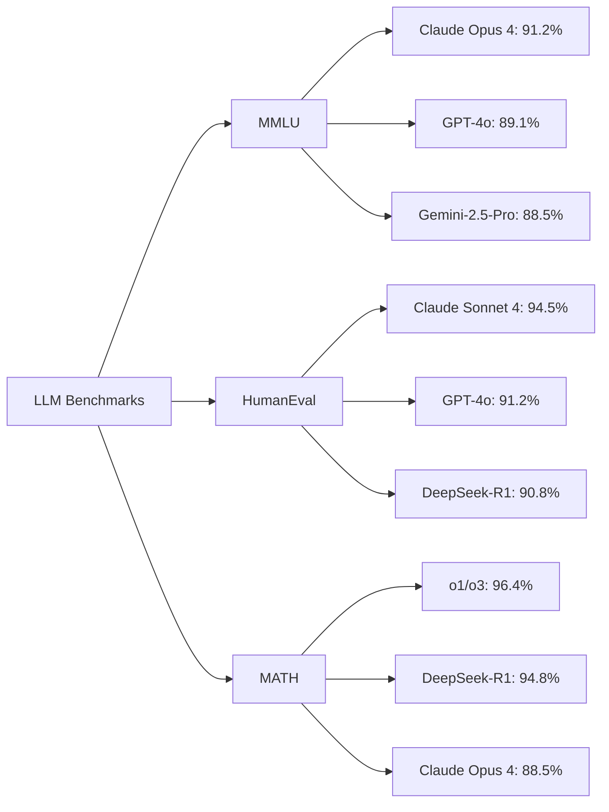
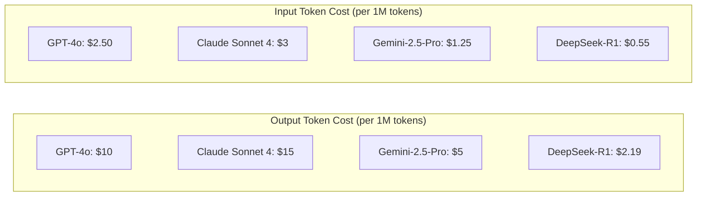
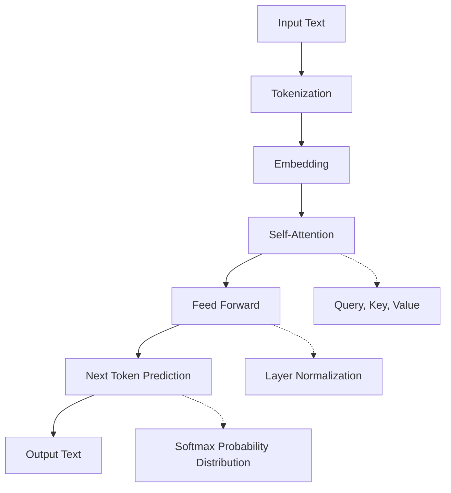
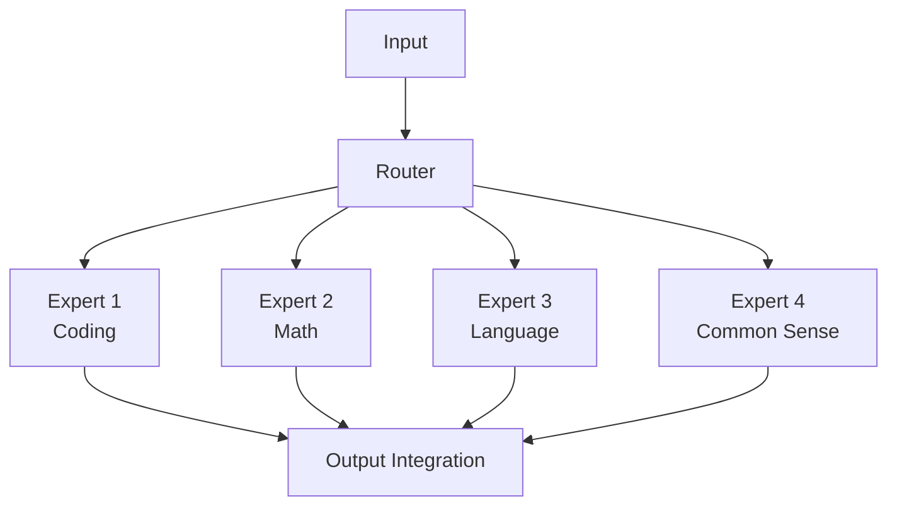
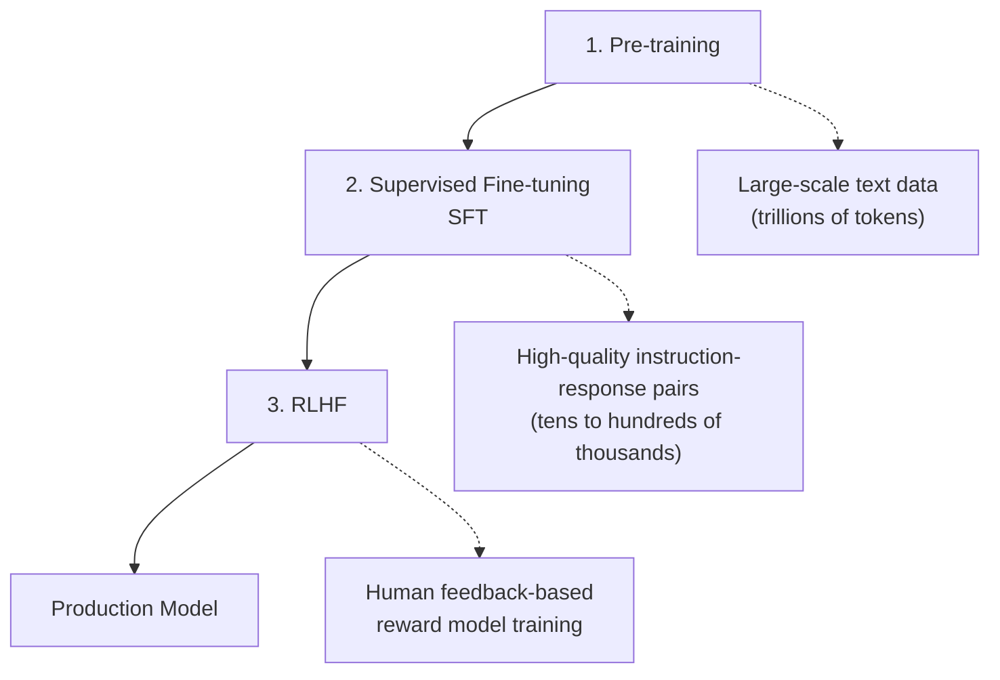
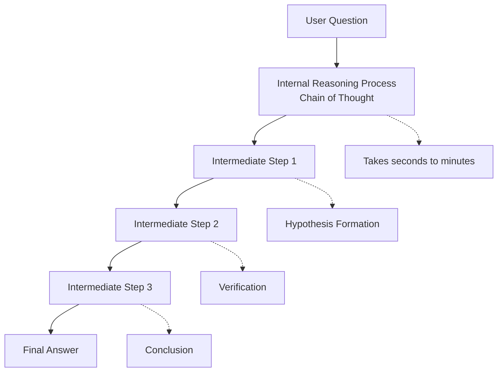
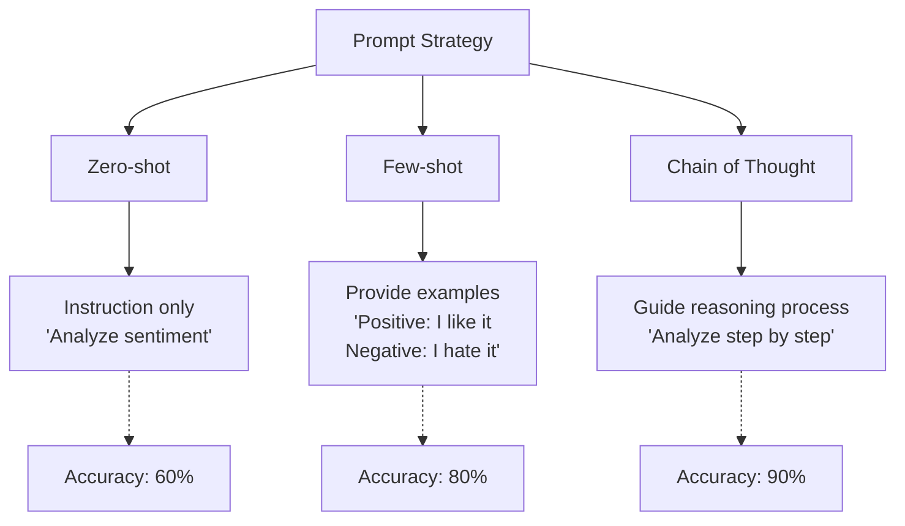
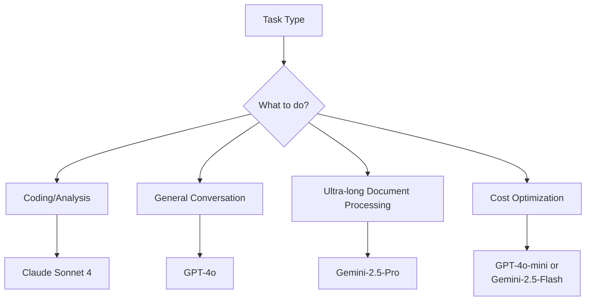

> <strong>Series: DeNA LLM Study</strong> (1/5)
>
> 1. <strong>[Part 1: LLM Fundamentals and 2025 AI Landscape](/en/blog/en/dena-llm-study-part1-fundamentals)</strong> ← Current Article
> 2. [Part 2: Structured Output and Multi-LLM Pipelines](/en/blog/en/dena-llm-study-part2-structured-output)
> 3. [Part 3: Model Training Methodologies](/en/blog/en/dena-llm-study-part3-model-training)
> 4. [Part 4: RAG Architecture and Latest Trends](/en/blog/en/dena-llm-study-part4-rag)
> 5. [Part 5: Agent Design and Multi-Agent Orchestration](/en/blog/en/dena-llm-study-part5-agent-design)

## Introduction to DeNA LLM Study

In 2025, the pace of AI technology advancement is beyond imagination. Based on LLM study materials conducted at DeNA, we'll organize everything from the basics of cutting-edge LLM technology to practical applications over 5 installments. In this Part 1, we'll explore the fundamental principles of LLMs and the current AI ecosystem in 2025.

> <strong>Source Material</strong>: This post is based on [DeNA Internal Study Materials](https://dena.github.io/llm-study20251201/).

## 2025 Major LLM Landscape

### Performance Comparison: GPT-4 vs Claude vs Gemini

As of 2025, three major LLMs dominate the market:

```markdown
| Model                              | Developer | Features     | Strengths                           |
| ---------------------------------- | --------- | ------------ | ----------------------------------- |
| <strong>GPT-5.1 / GPT-4o</strong>  | OpenAI    | 128K context | Versatility, Stability              |
| <strong>Claude Opus 4 / Sonnet 4</strong> | Anthropic | 200K context | Coding, Analysis, Long context |
| <strong>Gemini-2.5-Pro</strong>    | Google    | 1M context   | Multimodal, Ultra-long documents    |
| <strong>DeepSeek-R1</strong>       | DeepSeek  | 128K context | Reasoning, Open-source, Cost-effective |
```

### Benchmark Performance (December 2025)



> <strong>MMLU</strong>: Massive Multitask Language Understanding (57 subject knowledge evaluation)
> <strong>HumanEval</strong>: Programming capability assessment
> <strong>MATH</strong>: Mathematical problem-solving ability

### Pricing Comparison (December 2025)



> <strong>Key Insight</strong>: DeepSeek-R1 provides excellent cost-performance, and Gemini also has strong price competitiveness. Claude shows superiority in coding and analysis tasks.

## Next Token Prediction: Core Principle of LLMs

### Transformer Architecture

The Transformer, which forms the foundation of LLMs, was first introduced in Google's "Attention is All You Need" paper in 2017.



### How Next Token Prediction Works

```python
# Simple Next Token Prediction example
def predict_next_token(context: str, model: LLM) -> str:
    """
    Predict the next token from given context

    Args:
        context: "The quick brown"
        model: LLM model

    Returns:
        "fox" (token with highest probability)
    """
    # 1. Tokenization
    tokens = tokenize(context)  # ["The", "quick", "brown"]

    # 2. Embedding conversion
    embeddings = model.embed(tokens)

    # 3. Pass through Transformer layers
    hidden_states = model.forward(embeddings)

    # 4. Calculate probability distribution
    logits = model.lm_head(hidden_states[-1])  # hidden state of last token
    probs = softmax(logits)

    # 5. Select token with highest probability
    next_token = argmax(probs)  # "fox" (prob: 0.87)

    return next_token
```

> <strong>Important</strong>: LLMs operate on <strong>tokens</strong>, not words. English: 1 word ≈ 1 token, Korean: 1 word ≈ 2-3 tokens.

### Latest Research Trends: Mixture of Experts (MoE)

Since 2024, large models have been adopting MoE architecture:



<strong>Advantages</strong>:

- Computational efficiency: Only part of total parameters activated
- Specialization: Each Expert specialized in specific domains
- Scalability: Performance improvement by adding Experts

## Instruction Tuning: Making AI Follow Instructions

### Pre-training vs Fine-tuning vs RLHF



### Instruction Tuning Dataset Examples

```yaml
# SFT (Supervised Fine-Tuning) data format
- instruction: "Parse this JSON and extract the name."
  input: '{"user": {"name": "John", "age": 30}}'
  output: "John"

- instruction: "Fix the bug in this code."
  input: |
    def add(a, b):
        return a - b
  output: |
    def add(a, b):
        return a + b  # Use + instead of -

- instruction: "Translate this sentence to Korean."
  input: "Hello, world!"
  output: "안녕하세요, 세계!"
```

### Post-training Technique Comparison

| Technique                          | Purpose                        | Data Requirements              | Cost   |
| ---------------------------------- | ------------------------------ | ------------------------------ | ------ |
| <strong>SFT</strong>               | Learn to follow instructions   | Tens of thousands              | Low    |
| <strong>RLHF</strong>              | Align with human preferences   | Thousands to tens of thousands | High   |
| <strong>DPO</strong>               | Direct preference optimization | Thousands                      | Medium |
| <strong>Constitutional AI</strong> | Automate value alignment       | Very few                       | Low    |

> <strong>DPO (Direct Preference Optimization)</strong>: Proposed by Stanford in 2023, it's simpler yet more effective than RLHF.

## Reasoning Models: Thinking AI

### The Evolution of o1, o3, and DeepSeek-R1

OpenAI announced the o1 reasoning model in September 2024, and by December 2024, they unveiled the o3 model. Meanwhile, DeepSeek released DeepSeek-R1, an open-source reasoning model:



### Reasoning Model Performance Comparison

```markdown
| Benchmark                                        | GPT-4o          | o1              | o3              |
| ------------------------------------------------ | --------------- | --------------- | --------------- |
| <strong>AIME 2024</strong> (Math Olympiad)       | 13.4%           | 74.4%           | 96.7%           |
| <strong>Codeforces</strong> (Coding Competition) | 11th percentile | 89th percentile | 99th percentile |
| <strong>GPQA Diamond</strong> (Science)          | 50.6%           | 78.3%           | 87.7%           |
```

> <strong>Note</strong>: DeepSeek-R1 achieves performance comparable to o1 at much lower cost, contributing to the democratization of AI.

### Chain of Thought (CoT) Prompting

Standard models can also improve reasoning with CoT:

```markdown
# ❌ Standard Prompt

"Calculate 234 × 567."
→ High chance of incorrect answer

# ✅ CoT Prompt

"Calculate 234 × 567 step by step. Show intermediate results for each step."
→ Significantly improved accuracy
```

<strong>Actual CoT Example</strong>:

```
Question: Calculate 234 × 567.

CoT Response:
1. First, decompose 234 into 200 + 30 + 4.
2. Multiply each by 567:
   - 200 × 567 = 113,400
   - 30 × 567 = 17,010
   - 4 × 567 = 2,268
3. Add them all together:
   113,400 + 17,010 + 2,268 = 132,678

Answer: 132,678
```

## Prompt Engineering Fundamentals

### Zero-shot vs Few-shot vs Chain of Thought



### Impact of Temperature Parameter

```python
# Output variation by Temperature setting

# Temperature = 0 (Deterministic, consistent)
response = model.generate(
    "Write a Fibonacci sequence in Python.",
    temperature=0
)
# Output: Always the same code (selects highest probability token)

# Temperature = 0.7 (Balanced, recommended)
response = model.generate(
    "Write a creative story.",
    temperature=0.7
)
# Output: Moderately diverse while maintaining consistency

# Temperature = 1.5 (Creative, unstable)
response = model.generate(
    "Suggest a completely new idea.",
    temperature=1.5
)
# Output: Very diverse but low consistency, sometimes strange outputs
```

### Effective Prompt Writing Principles

1. <strong>Clarity</strong>: Avoid ambiguous instructions

   ```
   ❌ "Tell me about this"
   ✅ "Explain three main features of Claude 3.5 Sonnet in 150 characters or less."
   ```

2. <strong>Provide Context</strong>: Include background information

   ```
   ❌ "Review the code"
   ✅ "This is a React component. Review it from performance, readability, and accessibility perspectives: [code]"
   ```

3. <strong>Specify Output Format</strong>: State desired structure
   ```
   ✅ "Respond in the following format:
   1. Summary (1 sentence)
   2. Key Points (3 items)
   3. Action Plan (step by step)"
   ```

## Exercise A Insights: OpenAI API in Practice

### Basic API Usage

```python
from openai import OpenAI

client = OpenAI(api_key="your-api-key")

# Basic chat completion
response = client.chat.completions.create(
    model="gpt-4o",
    messages=[
        {"role": "system", "content": "You are a helpful AI assistant."},
        {"role": "user", "content": "What is an LLM?"}
    ],
    temperature=0.7,
    max_tokens=500
)

print(response.choices[0].message.content)
```

### Conversation History Management

```python
# Maintain conversation context
conversation_history = [
    {"role": "system", "content": "You are a Python expert."}
]

def chat(user_message: str) -> str:
    # Add user message
    conversation_history.append({"role": "user", "content": user_message})

    # API call
    response = client.chat.completions.create(
        model="gpt-4o",
        messages=conversation_history,
        temperature=0.7
    )

    # Save assistant response
    assistant_message = response.choices[0].message.content
    conversation_history.append({"role": "assistant", "content": assistant_message})

    return assistant_message

# Conversation example
print(chat("Explain list comprehension."))
print(chat("Show me example code."))  # Maintains previous context
print(chat("Convert this to dictionary comprehension."))  # Continuous conversation
```

### Token Usage Optimization

```python
import tiktoken

def count_tokens(text: str, model: str = "gpt-4") -> int:
    """Calculate token count of text"""
    encoding = tiktoken.encoding_for_model(model)
    return len(encoding.encode(text))

# Prompt optimization example
long_prompt = "This is a very long prompt..." * 100
token_count = count_tokens(long_prompt)
print(f"Token count: {token_count}")  # e.g., 8,543 tokens

# Cost calculation
input_cost = (token_count / 1_000_000) * 10  # GPT-4 Turbo input cost
print(f"Estimated cost: ${input_cost:.4f}")
```

## Key Learning Points

### 1. Model Selection Criteria



### 2. Performance Improvement Checklist

- ✅ <strong>Clear Instructions</strong>: Eliminate ambiguity
- ✅ <strong>Few-shot Examples</strong>: Provide 3-5 examples
- ✅ <strong>CoT Prompting</strong>: For complex reasoning tasks
- ✅ <strong>Temperature Adjustment</strong>: Set according to task
- ✅ <strong>Specify Output Format</strong>: Structured responses
- ✅ <strong>Context Management</strong>: Consider token limits

### 3. Practical Use Cases

| Scenario                    | Recommended Model   | Settings |
| --------------------------- | ------------------- | -------- |
| Code Review                 | Claude Sonnet 4     | temp=0.3 |
| Creative Writing            | GPT-4o              | temp=0.9 |
| Data Analysis               | Claude Sonnet 4     | temp=0.1 |
| Customer Support Chatbot    | GPT-4o-mini         | temp=0.7 |
| Long Document Summarization | Gemini-2.5-Pro      | temp=0.5 |

## Next Episode Preview

Part 2 will cover <strong>Structured Output and Multi-LLM Pipelines</strong>:

- JSON Mode and Function Calling
- Practical applications of structured output
- Multi-LLM pipeline design
- Type safety with Pydantic
- Exercise B: Building complex data extraction systems

> <strong>Next Article</strong>: [Part 2: Structured Output and Multi-LLM Pipelines](/en/blog/en/dena-llm-study-part2-structured-output)

## References

- [DeNA LLM Study Materials (Zenn)](https://dena.github.io/llm-study20251201/)
- [OpenAI API Documentation](https://platform.openai.com/docs)
- [Anthropic Claude Documentation](https://docs.anthropic.com/claude/docs)
- [Google Gemini Documentation](https://ai.google.dev/docs)
- [Attention is All You Need (Transformer paper)](https://arxiv.org/abs/1706.03762)
- [Chain of Thought Prompting](https://arxiv.org/abs/2201.11903)

---

<strong>Written</strong>: December 8, 2025
<strong>Series</strong>: DeNA LLM Study (1/5)
<strong>Tags</strong>: #LLM #AI #PromptEngineering #DeNA
