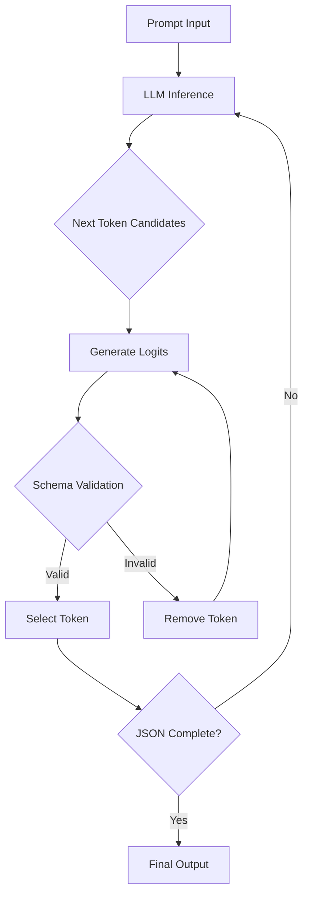
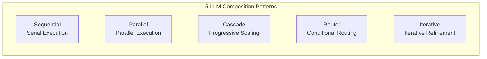

> **Series: DeNA LLM Study** (2/5)
>
> 1. [Part 1: LLM Fundamentals and 2025 AI Landscape](/en/blog/en/dena-llm-study-part1-fundamentals)
> 2. <strong>Part 2: Structured Output and Multi-LLM Pipelines</strong> ← Current Article
> 3. [Part 3: Model Training Methodologies](/en/blog/en/dena-llm-study-part3-model-training)
> 4. [Part 4: RAG Architecture and Latest Trends](/en/blog/en/dena-llm-study-part4-rag)
> 5. [Part 5: Agent Design and Multi-Agent Orchestration](/en/blog/en/dena-llm-study-part5-agent-design)

## Overview

In Part 2 of DeNA's LLM Study Series, we explore <strong>Structured Output</strong> techniques for reliably controlling LLM outputs and <strong>Multi-LLM Pipeline Patterns</strong> for building more powerful systems by combining multiple LLMs.

This article builds upon DeNA's study materials with updated information, providing patterns and best practices ready for immediate production use.

### What We'll Cover

1. **Structured Output Techniques**
   - JSON Schema and Pydantic usage
   - Constrained Decoding principles
   - Provider-specific implementations (OpenAI, Anthropic, Google)

2. **Multi-LLM Composition Patterns**
   - Sequential, Parallel, Cascade, Router, Iterative
   - Application scenarios and trade-offs for each pattern
   - Practical implementation examples

3. **Workshop B & C Content**
   - B1: Binary classification (comment classification)
   - B2: Multiple item extraction and scoring
   - B3: Nested structured output
   - C1: Parallel processing of multiple evaluation axes
   - C2: Refinement using evaluation results
   - C3: Correction-evaluation loop implementation

## 1. Structured Output

### 1.1 Why Structured Output Matters

LLMs inherently generate free-form text. However, production applications require:

- **Parseable data**: Standard formats like JSON, YAML
- **Type safety**: Field type validation (string, number, boolean, etc.)
- **Required field guarantees**: Preventing omissions
- **Nested structure support**: Complex data models

Problems with free-text output:

```python
# ❌ Problem: Parsing may fail
response = llm.generate("Extract name and age from: John is 30 years old")
# Output: "John is 30 years old. His name is John and he is 30."
# How do we parse this?
```

Advantages of structured output:

```python
# ✅ Solution: Structured output
response = llm.generate_structured(
    prompt="Extract name and age",
    schema={"name": str, "age": int}
)
# Output: {"name": "John", "age": 30}
# Ready-to-use data
```

### 1.2 JSON Schema-Based Structuring

JSON Schema is the standard for defining JSON data structure.

#### Basic Example

```json
{
  "$schema": "http://json-schema.org/draft-07/schema#",
  "type": "object",
  "properties": {
    "name": {
      "type": "string",
      "description": "User name"
    },
    "age": {
      "type": "integer",
      "minimum": 0,
      "maximum": 150
    },
    "email": {
      "type": "string",
      "format": "email"
    }
  },
  "required": ["name", "age"]
}
```

#### OpenAI Structured Outputs API (Released August 2024)

OpenAI provides native JSON Schema support:

```python
from openai import OpenAI

client = OpenAI()

response = client.chat.completions.create(
    model="gpt-4o",
    messages=[
        {"role": "user", "content": "Extract: John is 30 years old, email: john@example.com"}
    ],
    response_format={
        "type": "json_schema",
        "json_schema": {
            "name": "user_info",
            "strict": True,  # Strict mode: 100% schema compliance
            "schema": {
                "type": "object",
                "properties": {
                    "name": {"type": "string"},
                    "age": {"type": "integer"},
                    "email": {"type": "string"}
                },
                "required": ["name", "age", "email"],
                "additionalProperties": False
            }
        }
    }
)

data = json.loads(response.choices[0].message.content)
# {"name": "John", "age": 30, "email": "john@example.com"}
```

**Key Features**:

- `strict: True` option guarantees 100% schema compliance
- Constrained Decoding-based, impossible to generate invalid JSON
- No additional cost

### 1.3 Type-Safe Structuring with Pydantic

Pydantic is Python's data validation library, ideal for LLM output validation.

#### Basic Pydantic Model

```python
from pydantic import BaseModel, Field, EmailStr
from typing import List, Optional

class UserInfo(BaseModel):
    """User information model"""
    name: str = Field(description="User name")
    age: int = Field(ge=0, le=150, description="Age (0-150)")
    email: EmailStr = Field(description="Email address")
    tags: Optional[List[str]] = Field(default=None, description="Tag list")

# Pydantic model → JSON Schema automatic conversion
schema = UserInfo.model_json_schema()
```

#### Using the Instructor Library

Instructor perfectly integrates Pydantic with LLM APIs:

```python
import instructor
from openai import OpenAI

# Patch OpenAI client with Instructor
client = instructor.from_openai(OpenAI())

# Receive response directly as Pydantic model
user = client.chat.completions.create(
    model="gpt-4o",
    messages=[
        {"role": "user", "content": "Extract: John is 30, email john@example.com"}
    ],
    response_model=UserInfo  # Pass Pydantic model directly
)

print(user.name)  # "John"
print(user.age)   # 30
print(user.email) # "john@example.com"
```

**Advantages**:

- Python-native type checking
- IDE autocomplete support
- Automatic runtime validation
- Support for complex nested structures

#### Nested Structure Example (B3 Workshop)

```python
from pydantic import BaseModel
from typing import List

class Address(BaseModel):
    """Address information"""
    street: str
    city: str
    zip_code: str

class Company(BaseModel):
    """Company information"""
    name: str
    industry: str

class Person(BaseModel):
    """Person information (nested structure)"""
    name: str
    age: int
    address: Address  # Nested object
    companies: List[Company]  # Object array

# Request LLM to extract nested structure
person = client.chat.completions.create(
    model="gpt-4o",
    messages=[
        {"role": "user", "content": """
        Extract information:
        John lives at 123 Main St, New York, 10001.
        He works at Google (tech) and Microsoft (software).
        """}
    ],
    response_model=Person
)

print(person.address.city)  # "New York"
print(person.companies[0].name)  # "Google"
```

### 1.4 Constrained Decoding Principles

Constrained Decoding is a technique that <strong>blocks schema-invalid tokens in real-time</strong> when the LLM generates tokens.

#### How It Works



#### Example: JSON Generation Process

```python
# Target schema: {"name": str, "age": int}
# LLM generation process (step by step)

# Step 1: First token
# Candidates: ["{", "The", "Name", ...] → Select "{" (schema start)

# Step 2: Key generation
# Candidates: ["name", "age", "invalid", ...] → Select "name"

# Step 3: Separator
# Candidates: [":", ",", "}"] → Select ":"

# Step 4: Value generation
# Candidates: ["John", "123", "true"] → Select "John" (string type)

# Step 5: Next field
# Candidates: [",", "}"] → Select "," (age field required)

# Step 6: Second key
# Candidates: ["age", "name", ...] → Select "age"

# Step 7: Value generation
# Candidates: ["30", "John", "true"] → Select "30" (integer type)

# Step 8: Termination
# Candidates: ["}"] → Select "}" (required fields complete)

# Final output: {"name": "John", "age": 30}
```

**Key Points**:

- At each step, <strong>only schema-valid tokens are allowed</strong>
- <strong>0% possibility</strong> of generating invalid JSON
- No additional validation logic needed

#### Provider-Specific Implementations

| Provider              | Implementation                          | Notes                            |
| --------------------- | --------------------------------------- | -------------------------------- |
| **OpenAI**            | Native Structured Outputs API           | Most convenient (from Aug 2024)  |
| **Anthropic**         | Tool Use workaround                     | Uses `tools` parameter           |
| **Google Gemini**     | `response_mime_type="application/json"` | JSON Schema support (Beta)       |
| **Local (llama.cpp)** | Grammar-based decoding                  | Requires GBNF grammar definition |
| **Outlines**          | FSM-based decoding                      | Open source, supports all models |

#### Anthropic Claude Tool Use Approach

Claude uses Tool Use instead of direct JSON Schema support:

```python
import anthropic

client = anthropic.Anthropic()

response = client.messages.create(
    model="claude-sonnet-4-20250514",
    max_tokens=1024,
    tools=[
        {
            "name": "extract_user_info",
            "description": "Extract user information",
            "input_schema": {
                "type": "object",
                "properties": {
                    "name": {"type": "string"},
                    "age": {"type": "integer"}
                },
                "required": ["name", "age"]
            }
        }
    ],
    messages=[
        {"role": "user", "content": "John is 30 years old"}
    ]
)

# Extract tool use result
tool_use = next(
    block for block in response.content
    if block.type == "tool_use"
)
data = tool_use.input  # {"name": "John", "age": 30}
```

### 1.5 Workshop B: Structured Output in Practice

#### B1: Binary Classification (Sentiment Analysis)

```python
from pydantic import BaseModel
from enum import Enum

class Sentiment(str, Enum):
    """Sentiment classification"""
    POSITIVE = "positive"
    NEGATIVE = "negative"

class SentimentResult(BaseModel):
    """Sentiment analysis result"""
    text: str
    sentiment: Sentiment
    confidence: float = Field(ge=0.0, le=1.0)

# Execute classification
result = client.chat.completions.create(
    model="gpt-4o",
    messages=[
        {"role": "user", "content": "Analyze: This product is amazing!"}
    ],
    response_model=SentimentResult
)

print(result.sentiment)  # Sentiment.POSITIVE
print(result.confidence)  # 0.95
```

#### B2: Multiple Item Extraction and Scoring

```python
from typing import List

class Entity(BaseModel):
    """Named entity recognition result"""
    text: str = Field(description="Extracted text")
    type: str = Field(description="Entity type (PERSON, ORG, LOC, etc.)")
    start: int = Field(description="Start position")
    end: int = Field(description="End position")

class ExtractionResult(BaseModel):
    """Multiple item extraction result"""
    entities: List[Entity]
    total_count: int
    quality_score: float = Field(ge=0.0, le=1.0, description="Extraction quality score")

# Multiple item extraction
result = client.chat.completions.create(
    model="gpt-4o",
    messages=[
        {"role": "user", "content": """
        Extract entities from:
        "Apple CEO Tim Cook announced the new iPhone in California."
        """}
    ],
    response_model=ExtractionResult
)

for entity in result.entities:
    print(f"{entity.text} ({entity.type})")
# Apple (ORG)
# Tim Cook (PERSON)
# iPhone (PRODUCT)
# California (LOC)

print(f"Quality: {result.quality_score}")  # 0.92
```

## 2. Multi-LLM Composition Patterns

Combining multiple LLMs solves problems difficult for single LLMs.

### 2.1 Pattern Overview



### 2.2 Sequential Pattern

**Concept**: Use previous LLM's output as next LLM's input

**Application Scenarios**:

- Stepwise data transformation (translation → summarization → sentiment analysis)
- Progressive refinement (draft → grammar correction → style improvement)

```python
# Example: Translation → Summarization pipeline
async def sequential_pipeline(text: str) -> str:
    # Step 1: Translation
    translated = await llm_call(
        model="gpt-4o",
        prompt=f"Translate to English: {text}"
    )

    # Step 2: Summarization (using translation result)
    summary = await llm_call(
        model="gpt-4o-mini",  # Cheaper model for summary
        prompt=f"Summarize in 3 sentences: {translated}"
    )

    return summary

# Execute
result = await sequential_pipeline("Long Korean document...")
```

**Trade-offs**:

- ✅ Clear separation of each step
- ✅ Easy debugging
- ❌ Accumulated latency (steps × LLM call time)
- ❌ Errors propagate from early to later steps

### 2.3 Parallel Pattern

**Concept**: Execute multiple LLMs simultaneously and aggregate results

**Application Scenarios**:

- Multi-faceted evaluation (simultaneous grammar, style, content evaluation)
- Ensemble inference (voting/averaging results from multiple models)

```python
import asyncio

async def parallel_evaluation(text: str) -> dict:
    """Parallel processing of multiple evaluation axes (C1 Workshop)"""

    # Execute 3 evaluations in parallel
    tasks = [
        evaluate_grammar(text),    # Grammar evaluation
        evaluate_style(text),      # Style evaluation
        evaluate_content(text)     # Content evaluation
    ]

    # Concurrent execution (asyncio.gather)
    grammar, style, content = await asyncio.gather(*tasks)

    return {
        "grammar_score": grammar,
        "style_score": style,
        "content_score": content,
        "overall_score": (grammar + style + content) / 3
    }

async def evaluate_grammar(text: str) -> float:
    response = await llm_call(
        model="gpt-4o",
        prompt=f"Grammar score (0-100): {text}",
        response_model=ScoreResult
    )
    return response.score

# Other evaluation functions follow same pattern...
```

**Execution Time Comparison**:

```python
# Sequential: 3s × 3 = 9s
# Parallel: max(3s, 3s, 3s) = 3s
# → 66% time reduction!
```

**Trade-offs**:

- ✅ Maximum speed (parallel execution)
- ✅ Independent evaluation possible
- ❌ Increased cost (multiple simultaneous API calls)
- ❌ Result aggregation logic required

### 2.4 Cascade Pattern

**Concept**: Start with smaller models, escalate to larger models when needed

**Application Scenarios**:

- Cost optimization (simple queries use smaller models)
- Quality assurance (only complex queries use larger models)

```python
async def cascade_routing(query: str) -> str:
    """Cascade pattern: Small model → Large model"""

    # Step 1: Try with small model
    response_small = await llm_call(
        model="gpt-4o-mini",  # Cheaper model
        prompt=query,
        max_tokens=100
    )

    # Step 2: Quality validation
    quality = await evaluate_quality(response_small)

    if quality >= 0.8:
        # Quality sufficient → return small model result
        return response_small

    # Step 3: Quality insufficient → retry with large model
    response_large = await llm_call(
        model="gpt-4o",  # Powerful model
        prompt=query,
        max_tokens=500
    )

    return response_large

# Cost reduction effect
# - 80% queries: gpt-4o-mini ($0.15/1M tokens)
# - 20% queries: gpt-4o ($5/1M tokens)
# → Average cost: 0.15 × 0.8 + 5 × 0.2 = $1.12 (78% reduction)
```

**Trade-offs**:

- ✅ Maximize cost efficiency
- ✅ Maintain average quality
- ❌ Worst case latency doubles (retry)
- ❌ Quality evaluation logic required

### 2.5 Router Pattern

**Concept**: Route to optimal model based on input characteristics

**Application Scenarios**:

- Domain-specific expert models (medical, legal, technical)
- Language-specific models (Korean-specialized, English-specialized)

```python
from enum import Enum

class QueryType(str, Enum):
    TECHNICAL = "technical"
    MEDICAL = "medical"
    LEGAL = "legal"
    GENERAL = "general"

async def router_pattern(query: str) -> str:
    # Step 1: Query classification
    classification = await llm_call(
        model="gpt-4o-mini",  # Fast classifier
        prompt=f"Classify query type: {query}",
        response_model=QueryClassification
    )

    # Step 2: Route to expert model
    if classification.type == QueryType.TECHNICAL:
        model = "gpt-4o"  # Strong in technical documentation
    elif classification.type == QueryType.MEDICAL:
        model = "claude-opus-4-20250514"  # Rich medical knowledge
    elif classification.type == QueryType.LEGAL:
        model = "gpt-4o"  # Strong in legal reasoning
    else:
        model = "gpt-4o-mini"  # General queries use cheaper model

    # Step 3: Execute with selected model
    response = await llm_call(model=model, prompt=query)
    return response
```

**Trade-offs**:

- ✅ Optimal model selection
- ✅ Cost-quality optimization
- ❌ Classification error possibility
- ❌ Routing logic maintenance

### 2.6 Iterative Pattern

**Concept**: Repeat evaluation → correction to improve quality

**Application Scenarios**:

- Writing improvement (draft → feedback → correction → re-evaluation)
- Code refactoring (code → review → correction → re-review)

```python
async def iterative_improvement(
    initial_text: str,
    max_iterations: int = 3,
    target_score: float = 0.9
) -> str:
    """Correction-evaluation loop (C2, C3 Workshop)"""

    current_text = initial_text

    for iteration in range(max_iterations):
        # Step 1: Evaluation
        evaluation = await llm_call(
            model="gpt-4o",
            prompt=f"Evaluate quality (0-1): {current_text}",
            response_model=EvaluationResult
        )

        print(f"Iteration {iteration + 1}: Score = {evaluation.score}")

        # Step 2: Check target achievement
        if evaluation.score >= target_score:
            print(f"Target achieved! ({evaluation.score} >= {target_score})")
            break

        # Step 3: Correction based on feedback
        current_text = await llm_call(
            model="gpt-4o",
            prompt=f"""
            Improve the text based on feedback:

            Current text: {current_text}
            Feedback: {evaluation.feedback}

            Generate improved version.
            """
        )

    return current_text

# Execute
improved = await iterative_improvement(
    initial_text="Draft text...",
    max_iterations=3,
    target_score=0.9
)
```

**Trade-offs**:

- ✅ Progressive quality improvement
- ✅ Clear feedback loop
- ❌ Increased cost (iterations × cost)
- ❌ No convergence guarantee (infinite loop possibility)

### 2.7 Pattern Selection Guide

| Requirement         | Recommended Pattern | Reason                                   |
| ------------------- | ------------------- | ---------------------------------------- |
| Speed priority      | Parallel            | Minimize latency with parallel execution |
| Cost priority       | Cascade             | Prioritize smaller models                |
| Quality priority    | Iterative           | Quality assurance through iteration      |
| Domain-specific     | Router              | Route to expert models                   |
| Stepwise processing | Sequential          | Clear pipeline structure                 |

### 2.8 Real-World Implementation: Hybrid Pattern

In practice, multiple patterns are combined:

```python
async def hybrid_pipeline(text: str) -> str:
    """Router + Cascade + Parallel combination"""

    # Step 1: Router (query classification)
    query_type = await classify_query(text)

    if query_type == "simple":
        # Step 2a: Cascade (simple queries)
        return await cascade_routing(text)

    else:
        # Step 2b: Parallel + Iterative (complex queries)
        # Parallel draft generation and evaluation
        draft, evaluation = await asyncio.gather(
            generate_draft(text),
            evaluate_requirements(text)
        )

        # Iterative improvement
        improved = await iterative_improvement(
            draft,
            evaluation,
            max_iterations=2
        )

        return improved
```

## 3. Workshop Summary

### Workshop B: Structured Output

| Workshop | Topic                    | Core Concepts                   |
| -------- | ------------------------ | ------------------------------- |
| B1       | Binary classification    | Enum types, Pydantic validation |
| B2       | Multiple item extraction | List types, nested validation   |
| B3       | Nested structures        | Object nesting, complex schemas |

### Workshop C: Multi-LLM Composition

| Workshop | Topic                 | Core Concepts                             |
| -------- | --------------------- | ----------------------------------------- |
| C1       | Parallel evaluation   | asyncio.gather, concurrent execution      |
| C2       | Evaluation-correction | Sequential pattern, feedback utilization  |
| C3       | Iteration loop        | Iterative pattern, convergence conditions |

## 4. Latest Trends and Best Practices

### 4.1 2025 Structured Output Standard

**OpenAI Structured Outputs** has become the de facto standard:

- **Constrained Decoding-based**: 100% schema compliance
- **No additional cost**: Same price as existing API
- **Pydantic integration**: Instructor library support

**Competing Products**:

- Anthropic: Tool Use approach (indirect)
- Google: `response_mime_type` (Beta)
- Local: Outlines, llama-cpp-python

### 4.2 Cost Optimization Strategies

```python
# Combined cost efficiency strategies
async def cost_optimized_pipeline(query: str) -> str:
    # 1. Cascade: Prioritize smaller models
    result = await cascade_routing(query)

    # 2. Caching: Cache repeated queries
    cache_key = hash(query)
    if cache_key in cache:
        return cache[cache_key]

    # 3. Batch Processing: Bundle API calls
    if len(pending_queries) >= 10:
        results = await batch_call(pending_queries)

    cache[cache_key] = result
    return result
```

**Cost Reduction Effects**:

- Cascade: 70-80%
- Caching: 50-90% (depending on repeat query ratio)
- Batch: 20-30%

### 4.3 Quality Assurance Checklist

**Structured Output**:

- ✅ Define required fields (`required` array)
- ✅ Type constraints (`minimum`, `maximum`, `pattern`)
- ✅ Add descriptions (`description` field guides LLM)
- ✅ Validation logic (`Pydantic validator`)

**Pipeline Design**:

- ✅ Error handling (try-catch at each step)
- ✅ Timeout settings (prevent infinite waiting)
- ✅ Logging (record intermediate results for debugging)
- ✅ Monitoring (track cost, latency, error rate)

### 4.4 Open Source Tool Ecosystem

| Tool           | Purpose                       | Recommendation |
| -------------- | ----------------------------- | -------------- |
| **Instructor** | Pydantic ↔ LLM integration    | ⭐⭐⭐⭐⭐     |
| **Outlines**   | Constrained Decoding (local)  | ⭐⭐⭐⭐       |
| **LangChain**  | Pipeline orchestration        | ⭐⭐⭐         |
| **LlamaIndex** | RAG + Structured Outputs      | ⭐⭐⭐⭐       |
| **Guidance**   | Template-based output control | ⭐⭐⭐         |

## 5. Next Steps

### Part 3 Preview: RAG and Vector Databases

The next article covers <strong>injecting external knowledge into LLMs</strong> using RAG (Retrieval-Augmented Generation):

1. **Vector Database Fundamentals**
   - Embedding model selection
   - FAISS, Pinecone, Weaviate comparison

2. **RAG Pipeline Construction**
   - Chunking strategies
   - Retrieval optimization
   - Reranking techniques

3. **Advanced RAG Patterns**
   - Hybrid Search (keyword + vector)
   - Multi-hop Retrieval
   - Self-Query

### Suggested Practice Projects

1. **Document Processing System**
   - PDF → Structured data extraction
   - Parallel Pattern for parallel processing
   - Pydantic validation

2. **Automated Evaluation Pipeline**
   - Iterative Pattern for quality improvement
   - Multiple evaluation axes (grammar, style, content)
   - Iterate until target score reached

3. **Cost Optimization System**
   - Cascade Pattern for model selection
   - Query classification → routing
   - Caching + batch processing

## Conclusion

In DeNA LLM Study Part 2, we learned two core techniques for production LLM applications:

1. **Structured Output**
   - JSON Schema and Pydantic ensure type-safe outputs
   - Constrained Decoding guarantees 100% schema compliance
   - OpenAI Structured Outputs API is currently the best choice

2. **Multi-LLM Composition Patterns**
   - Sequential, Parallel, Cascade, Router, Iterative
   - Understanding trade-offs of each pattern
   - Using hybrid combinations in practice

**Key Messages**:

- Structured output is an <strong>essential component of production LLM applications</strong>
- <strong>Multi-LLM composition is more powerful</strong> than single LLMs
- Finding the <strong>balance between cost, speed, and quality is the core of production work</strong>

In Part 3, we'll learn how to expand LLM knowledge through RAG!

## References

### Official Documentation

- [OpenAI Structured Outputs](https://openai.com/index/introducing-structured-outputs-in-the-api/)
- [Anthropic Tool Use](https://docs.anthropic.com/claude/docs/tool-use)
- [Pydantic Official Documentation](https://docs.pydantic.dev/)
- [Instructor Library](https://python.useinstructor.com/)

### Papers and Research

- [A Unified Approach to Routing and Cascading for LLMs](https://arxiv.org/html/2410.10347v1) (2024)
- [Constrained Decoding for LLMs](https://www.aidancooper.co.uk/constrained-decoding/) (2024)
- [Generating Structured Outputs from Language Models](https://arxiv.org/html/2501.10868v1) (2025)

### Practical Guides

- [Enforcing JSON Outputs in Commercial LLMs](https://datachain.ai/blog/enforcing-json-outputs-in-commercial-llms)
- [Mastering Pydantic for LLM Workflows](https://ai.plainenglish.io/mastering-pydantic-for-llm-workflows-c6ed18fc79cc)
- [The guide to structured outputs and function calling](https://agenta.ai/blog/the-guide-to-structured-outputs-and-function-calling-with-llms)
