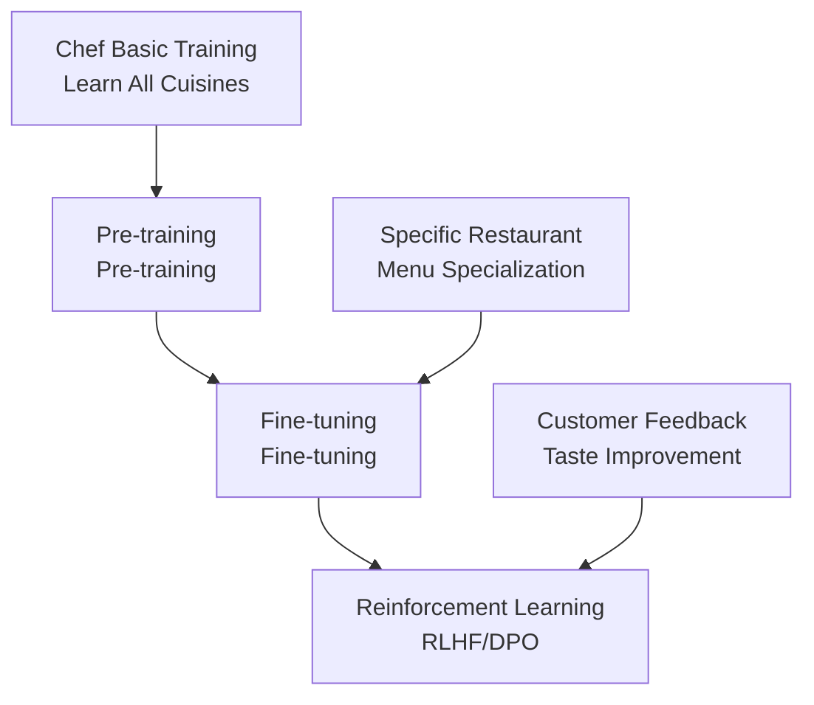
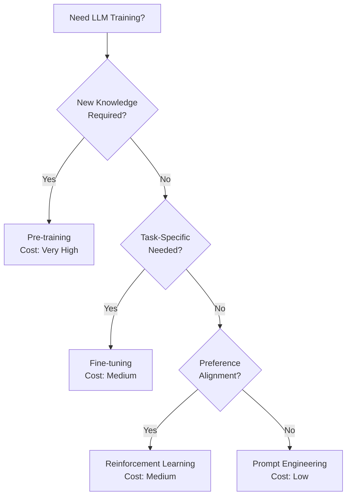
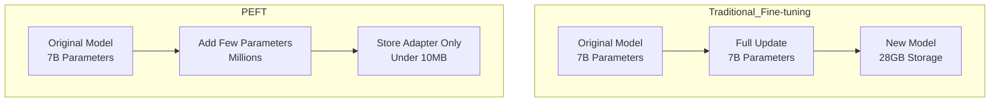
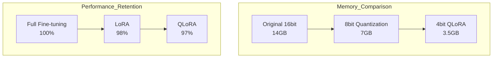
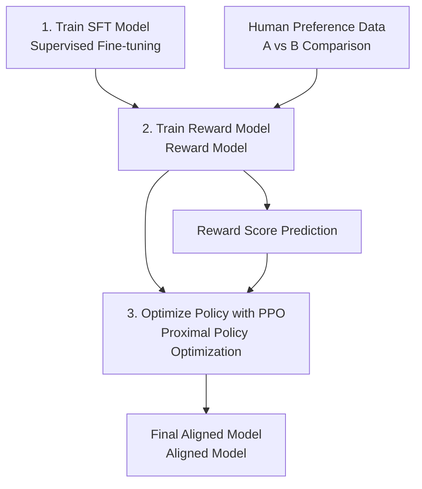
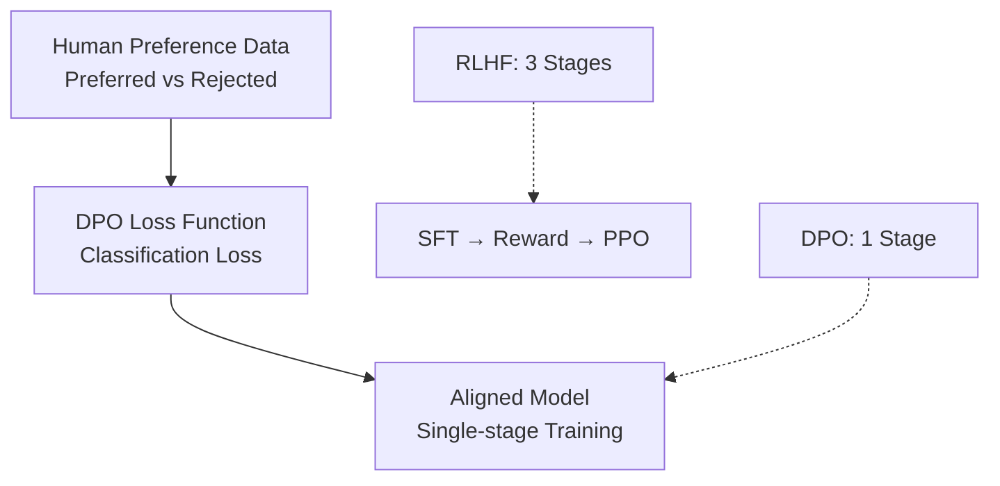
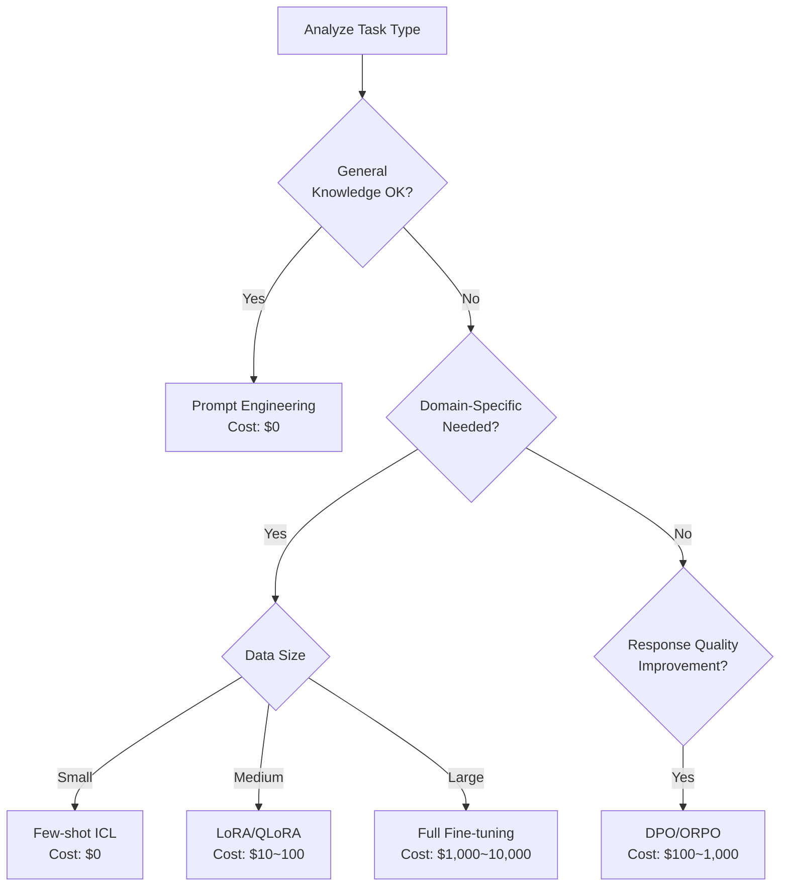

> <strong>Series: DeNA LLM Study</strong> (3/5)
>
> 1. [Part 1: LLM Fundamentals and 2025 AI Landscape](/en/blog/en/dena-llm-study-part1-fundamentals)
> 2. [Part 2: Structured Output and Multi-LLM Pipelines](/en/blog/en/dena-llm-study-part2-structured-output)
> 3. <strong>Part 3: Model Training Methodologies</strong> ← Current Article
> 4. [Part 4: RAG Architecture and Latest Trends](/en/blog/en/dena-llm-study-part4-rag)
> 5. [Part 5: Agent Design and Multi-Agent Orchestration](/en/blog/en/dena-llm-study-part5-agent-design)

## Introduction

DeNA's LLM study materials Part 3 covers diverse learning methodologies for LLMs. We'll explore the differences between pre-training, fine-tuning, and reinforcement learning, and examine the principles and practical applications of cutting-edge efficient training techniques like LoRA, QLoRA, and DPO.

This post is based on DeNA's study materials, enhanced with 2025 trends and hands-on experience.

## Pre-training vs Fine-tuning vs Reinforcement Learning

### Understanding Through Restaurant Analogy

DeNA materials explain the three learning approaches through a restaurant operation metaphor:



**Pre-training**

- <strong>Purpose</strong>: Acquire general language understanding capabilities
- <strong>Data</strong>: Tens to hundreds of TBs of web data
- <strong>Cost</strong>: Hundreds of millions to billions of dollars (GPT-4 estimated $100B+)
- <strong>Analogy</strong>: Learning all cooking techniques in culinary school

**Fine-tuning**

- <strong>Purpose</strong>: Specialize for specific tasks/domains
- <strong>Data</strong>: Thousands to tens of thousands of task-specific examples
- <strong>Cost</strong>: Hundreds to thousands of dollars
- <strong>Analogy</strong>: Becoming a pasta specialist at an Italian restaurant

**Reinforcement Learning**

- <strong>Purpose</strong>: Generate responses aligned with human preferences
- <strong>Data</strong>: Thousands to tens of thousands of preference pairs
- <strong>Cost</strong>: Thousands to tens of thousands of dollars
- <strong>Analogy</strong>: Adjusting dish flavors based on customer feedback

### Practical Decision-Making Guide



<strong>Decision Checklist</strong>:

1. <strong>Can it be solved with prompts?</strong> → Try prompt optimization first
2. <strong>Does the existing model understand the task?</strong> → Yes: RL, No: Fine-tuning
3. <strong>Is it a completely new domain?</strong> → Consider pre-training (but watch costs)

## PEFT: The Rise of Efficient Fine-tuning

### Problems with Traditional Fine-tuning

Limitations of Full Fine-tuning that updates all parameters:

- <strong>Memory Usage</strong>: Fine-tuning a 7B model requires 80GB+ VRAM
- <strong>Time Cost</strong>: Takes hours to days
- <strong>Deployment Challenges</strong>: Need to store entire model per task (tens of GBs)

### Core Idea of PEFT

Parameter-Efficient Fine-Tuning (PEFT) maximizes efficiency by <strong>training only a subset of parameters</strong>:



<strong>Major PEFT Methods</strong>:

1. <strong>Adapter</strong>: Insert small networks between layers
2. <strong>Prefix Tuning</strong>: Add trainable prefixes to inputs
3. <strong>LoRA</strong>: Update via low-rank decomposition (most popular)
4. <strong>Prompt Tuning</strong>: Train only soft prompts

## LoRA: Principles of Low-Rank Adaptation

### Mathematical Background

LoRA (Low-Rank Adaptation) is based on the following mathematical insight:

```python
# Original weight update (Full Fine-tuning)
W_new = W_original + ΔW  # ΔW is d×d size

# LoRA's low-rank decomposition
ΔW = B @ A  # B is d×r, A is r×d (r << d)

# Practical application
output = (W_original + B @ A) @ input
```

<strong>Core Idea</strong>:

- Pre-trained weights already contain abundant information
- The change amount (ΔW) needed for fine-tuning has <strong>low intrinsic dimensionality</strong>
- Therefore, ΔW can be expressed as the product of two small matrices (B, A)

### LoRA Hyperparameter Configuration Guide

```yaml
# LoRA configuration example (HuggingFace PEFT)
lora_config:
  r: 8 # Rank (intrinsic dimension)
  lora_alpha: 16 # Scaling parameter
  lora_dropout: 0.1 # Dropout rate
  target_modules: # Layers to apply
    - q_proj # Query projection
    - v_proj # Value projection
  bias: "none" # Whether to train bias
```

<strong>Hyperparameter Selection Guide</strong>:

| Parameter                       | Recommended    | Description                                                                   |
| ------------------------------- | -------------- | ----------------------------------------------------------------------------- |
| <strong>r (Rank)</strong>       | 4〜16          | Smaller saves memory, larger increases expressiveness. 8 works for most cases |
| <strong>lora_alpha</strong>     | r〜2r          | Acts like learning rate. Usually 1〜2x of r                                   |
| <strong>lora_dropout</strong>   | 0.05〜0.1      | Prevents overfitting. Set higher for small datasets                           |
| <strong>target_modules</strong> | q_proj, v_proj | Query/Value in Attention are most effective                                   |

### LoRA Variants

**DoRA (Weight-Decomposed Low-Rank Adaptation, 2024)**

```python
# DoRA: Decompose weights into magnitude and direction
W = m * (V + B @ A)
# m: trainable magnitude, V: normalized weights, B@A: LoRA
```

- <strong>Advantage</strong>: Performance closer to Full Fine-tuning
- <strong>Disadvantage</strong>: Slightly slower than LoRA

**GaLore (Gradient Low-Rank Projection, 2024)**

```python
# Project gradient to low-rank space to save memory
gradient_lowrank = project_to_lowrank(gradient)
optimizer.step(gradient_lowrank)
```

- <strong>Advantage</strong>: Compress optimizer states too → 50% additional memory savings
- <strong>Disadvantage</strong>: High implementation complexity

**LoRA+ (2024)**

```python
# Apply different learning rates to matrices A and B
lr_A = lr * eta  # Higher learning rate for A
lr_B = lr        # Default learning rate for B
```

- <strong>Advantage</strong>: 1.5〜2x convergence speed improvement
- <strong>Disadvantage</strong>: Requires hyperparameter tuning

## QLoRA: Combining Quantization with PEFT

### Innovation of 4-bit Quantization

QLoRA combines <strong>4-bit quantization</strong> with LoRA to dramatically reduce memory usage:



<strong>QLoRA Core Technologies</strong>:

1. <strong>4bit NormalFloat (NF4)</strong>: Quantization optimized for normal distributions
2. <strong>Double Quantization</strong>: Quantize quantization constants too
3. <strong>Paged Optimizers</strong>: Automatic CPU-GPU memory management

### QLoRA Practical Workflow

```python
from transformers import AutoModelForCausalLM, BitsAndBytesConfig
from peft import LoraConfig, get_peft_model

# 1. 4-bit quantization configuration
bnb_config = BitsAndBytesConfig(
    load_in_4bit=True,
    bnb_4bit_quant_type="nf4",      # NormalFloat 4bit
    bnb_4bit_compute_dtype="float16", # Compute in float16
    bnb_4bit_use_double_quant=True,   # Double quantization
)

# 2. Load model
model = AutoModelForCausalLM.from_pretrained(
    "meta-llama/Llama-2-7b-hf",
    quantization_config=bnb_config,
    device_map="auto"  # Automatic device allocation
)

# 3. LoRA configuration
lora_config = LoraConfig(
    r=8,
    lora_alpha=16,
    target_modules=["q_proj", "v_proj"],
    lora_dropout=0.1,
    bias="none",
    task_type="CAUSAL_LM"
)

# 4. Create PEFT model
model = get_peft_model(model, lora_config)

# 5. Check trainable parameters
trainable_params = sum(p.numel() for p in model.parameters() if p.requires_grad)
print(f"Trainable parameters: {trainable_params:,} ({trainable_params/7e9*100:.2f}%)")
# Output: Trainable parameters: 4,194,304 (0.06%)
```

<strong>QLoRA Practical Tips</strong>:

- <strong>GPU Memory</strong>: Train 7B model on single RTX 3090 (24GB)
- <strong>Batch Size</strong>: Use gradient accumulation (e.g., batch_size=1, gradient_accumulation_steps=16)
- <strong>Training Time</strong>: 1.5〜2x slower than Full Fine-tuning (quantization overhead)

## RLHF and DPO: Learning Human Preferences

### Complexity of RLHF

Reinforcement Learning from Human Feedback (RLHF) is powerful but complex:



<strong>RLHF Problems</strong>:

1. <strong>3-stage Pipeline</strong>: SFT → Reward Model → RL Optimization
2. <strong>Instability</strong>: PPO is sensitive to hyperparameters
3. <strong>High Cost</strong>: Reward model training + RL sampling
4. <strong>Difficult Debugging</strong>: Hard to diagnose RL convergence failures

### DPO: Direct Preference Optimization

Direct Preference Optimization (DPO) learns human preferences directly <strong>without a reward model</strong>:



<strong>DPO Loss Function</strong>:

```python
# DPO Loss (simplified formula)
loss = -log(σ(β * (log π(y_w|x) - log π(y_l|x))))

# y_w: Preferred response (chosen)
# y_l: Rejected response (rejected)
# β: Hyperparameter (typically 0.1)
# σ: Sigmoid function
```

<strong>DPO Advantages</strong>:

- <strong>Simplicity</strong>: No reward model needed, single training stage
- <strong>Stability</strong>: Classification loss is more stable than PPO
- <strong>Efficiency</strong>: 50% reduction in memory and time
- <strong>Performance</strong>: Equal or better performance than RLHF

### DPO Practical Implementation

```python
from trl import DPOTrainer

# DPO training configuration
training_args = TrainingArguments(
    output_dir="./dpo_model",
    per_device_train_batch_size=4,
    learning_rate=5e-5,
    num_train_epochs=3,
    gradient_accumulation_steps=4,
)

# Initialize DPO Trainer
dpo_trainer = DPOTrainer(
    model=model,
    args=training_args,
    train_dataset=preference_dataset,  # (prompt, chosen, rejected) format
    tokenizer=tokenizer,
    beta=0.1,  # DPO hyperparameter
)

# Run training
dpo_trainer.train()
```

<strong>Preference Data Format</strong>:

```python
preference_dataset = [
    {
        "prompt": "How to sort a list in Python?",
        "chosen": "Use the sorted() function: sorted([3,1,2])",
        "rejected": "Just use sort()"
    },
    # ...
]
```

### DPO Variants

**ORPO (Odds Ratio Preference Optimization, 2024)**

- Performs SFT and preference learning <strong>simultaneously</strong>
- No separate SFT stage needed
- Further training time reduction

**IPO (Identity Preference Optimization, 2024)**

- Can train without reference model
- Further memory reduction

**KTO (Kahneman-Tversky Optimization, 2024)**

- Uses <strong>individual feedback</strong> (good/bad) instead of pairwise comparisons
- Drastically reduced data collection costs

## Task-Specific Training Method Selection Guide

### Cost-Performance Tradeoff



### Practical Recommendations

**1. Chatbots/Conversational Systems**

```
Prompt → SFT (LoRA) → DPO
```

- Domain knowledge injection: Efficient fine-tuning with LoRA
- Dialogue quality improvement: Preference alignment with DPO

**2. Document Classification/Tagging**

```
Prompt → LoRA (Optional)
```

- Usually sufficient with prompts
- Add LoRA for extreme performance needs

**3. Code Generation**

```
Prompt → SFT (QLoRA) → RLHF/DPO
```

- Code style learning: Train on large code corpus with QLoRA
- Executability improvement: Penalize compilation errors with RLHF

**4. Summarization/Translation**

```
Prompt → DPO
```

- Base model often sufficient
- Style adjustment: Learn desired tone/length with DPO

### Memory Requirements Comparison

| Method                            | 7B Model              | 13B Model             | 70B Model              |
| --------------------------------- | --------------------- | --------------------- | ---------------------- |
| <strong>Full Fine-tuning</strong> | 80GB                  | 160GB                 | 800GB+                 |
| <strong>LoRA</strong>             | 40GB                  | 80GB                  | 400GB                  |
| <strong>QLoRA</strong>            | <strong>24GB</strong> | <strong>40GB</strong> | <strong>200GB</strong> |

<strong>Consumer GPU Viability</strong>:

- <strong>RTX 4090 (24GB)</strong>: Can train 7B with QLoRA, 3B with LoRA
- <strong>RTX 3090 (24GB)</strong>: Can train 7B with QLoRA
- <strong>RTX 4060 Ti (16GB)</strong>: Can train 3B with QLoRA

## Insights and Reflections

### Democratization of LLM Fine-tuning

The most impressive aspect of DeNA materials was that <strong>LLM fine-tuning is no longer exclusive to large corporations</strong>. With the advent of QLoRA and DPO:

- Fine-tune 7B models with 24GB VRAM
- Build domain-specific models on hundreds of dollars budget
- Use simple DPO instead of complex RLHF

### Paradigm Shift in Efficiency

Recently, <strong>Efficiency</strong> has become a trending topic:

- LoRA: 98% of Full Fine-tuning performance with 0.1% parameters
- QLoRA: Same performance with 1/4 memory
- DPO: Equal performance with 1/3 of RLHF complexity

This isn't just optimization but the result of <strong>novel mathematical insights</strong>. Low-rank hypotheses, quantization theory, implicit reward models—academic research is rapidly transitioning to practice.

### Lessons for Practitioners

1. <strong>Start with prompts</strong>: 80% can be solved with prompts
2. <strong>LoRA as default</strong>: Try LoRA first when fine-tuning is needed
3. <strong>Save resources with QLoRA</strong>: Minimal performance difference, 4x memory savings
4. <strong>Align with DPO</strong>: RLHF is legacy, DPO is the new standard
5. <strong>Measure and improve</strong>: Focus on actual task performance over benchmark scores

### 2025 Outlook

Expected trends:

- <strong>Smaller yet powerful models</strong>: Rise of compact models like Phi-3, Gemma 2
- <strong>On-device fine-tuning</strong>: Era of fine-tuning on smartphones
- <strong>Automated hyperparameter tuning</strong>: AutoML for LLM Fine-tuning
- <strong>Multimodal PEFT</strong>: Simultaneous image+text fine-tuning

## References

### Papers

- [LoRA: Low-Rank Adaptation of Large Language Models](https://arxiv.org/abs/2106.09685) (Microsoft, 2021)
- [QLoRA: Efficient Finetuning of Quantized LLMs](https://arxiv.org/abs/2305.14314) (University of Washington, 2023)
- [Direct Preference Optimization](https://arxiv.org/abs/2305.18290) (Stanford, 2023)
- [DoRA: Weight-Decomposed Low-Rank Adaptation](https://arxiv.org/abs/2402.09353) (NVIDIA, 2024)
- [GaLore: Memory-Efficient LLM Training](https://arxiv.org/abs/2403.03507) (CMU, 2024)

### Libraries

- [HuggingFace PEFT](https://github.com/huggingface/peft) - LoRA, QLoRA implementation
- [HuggingFace TRL](https://github.com/huggingface/trl) - RLHF, DPO implementation
- [Unsloth](https://github.com/unslothai/unsloth) - 2x faster LoRA training

### Tutorials

- [QLoRA Fine-tuning Tutorial](https://colab.research.google.com/drive/1VoYNfYDKcKRQRor98Zbf2-9VQTtGJ24k)
- [DPO Training Example](https://huggingface.co/docs/trl/dpo_trainer)
- [Practical LLM Fine-tuning Guide](https://product.kyobobook.co.kr/detail/S000214934825) (Kyobo Book)

---

<strong>Coming Next</strong>: "DeNA LLM Study Part 4: Production Deployment and Monitoring" will cover strategies for deploying fine-tuned models to actual services, monitoring methods, and cost optimization techniques.
