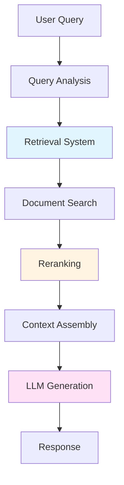
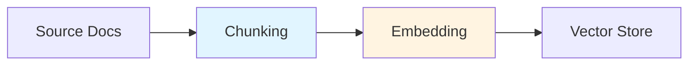
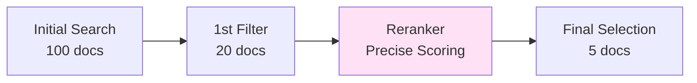
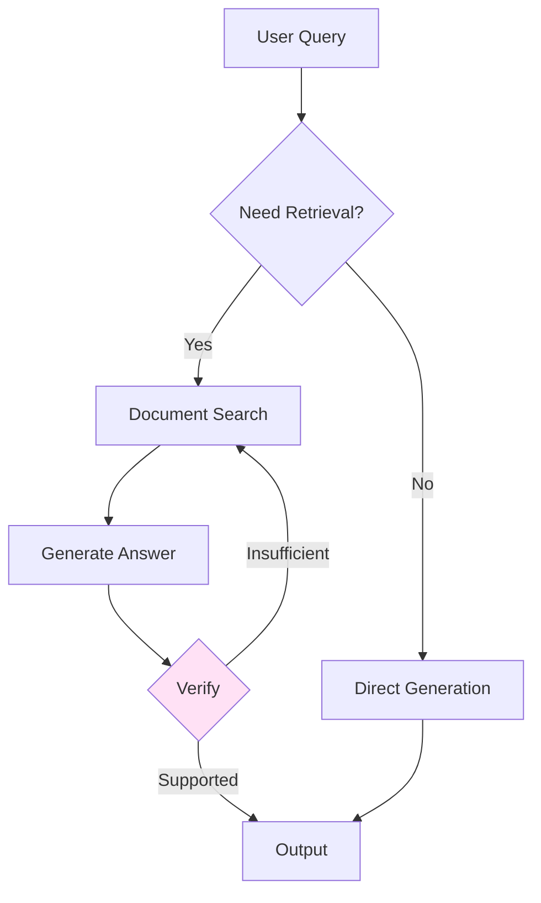
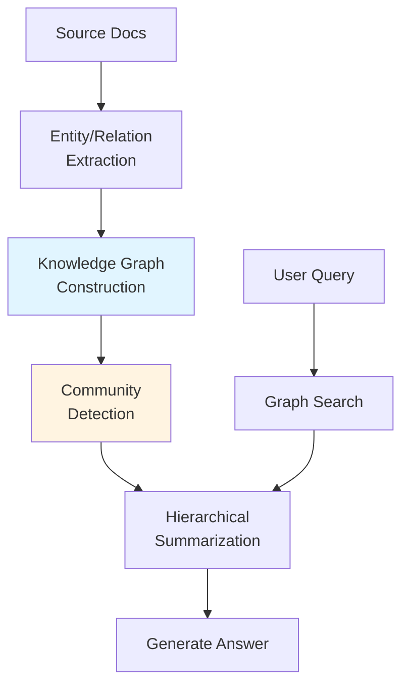
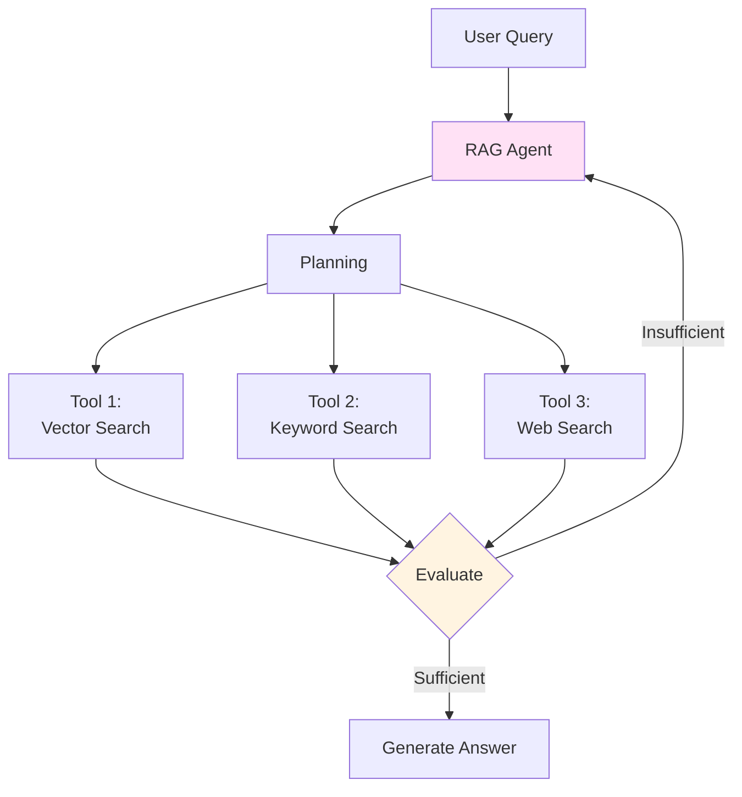
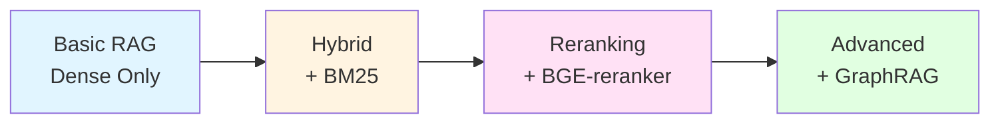
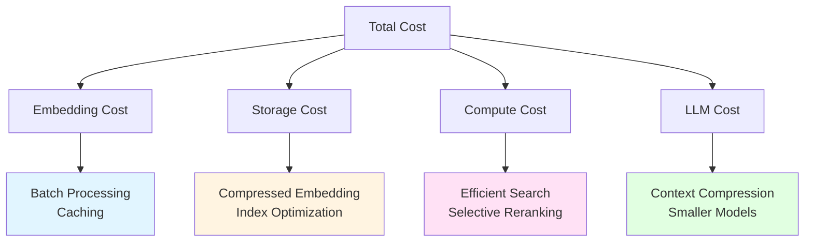

> <strong>Series: DeNA LLM Study</strong> (4/5)
>
> 1. [Part 1: LLM Fundamentals and 2025 AI Landscape](/en/blog/en/dena-llm-study-part1-fundamentals)
> 2. [Part 2: Structured Output and Multi-LLM Pipelines](/en/blog/en/dena-llm-study-part2-structured-output)
> 3. [Part 3: Model Training Methodologies](/en/blog/en/dena-llm-study-part3-model-training)
> 4. <strong>Part 4: RAG Architecture and Latest Trends</strong> ← Current Article
> 5. [Part 5: Agent Design and Multi-Agent Orchestration](/en/blog/en/dena-llm-study-part5-agent-design)

## Overview

DeNA's LLM Study Series Part 4 covers RAG (Retrieval-Augmented Generation) from core concepts to the latest trends. We've learned how to design systems that effectively leverage external knowledge beyond simple prompt engineering.

This article organizes the complete RAG architecture, hybrid search strategies, reranking techniques, and cutting-edge developments like GraphRAG and Agentic RAG based on DeNA's study materials.

## Context Engineering: LLM as Interface

The core concept emphasized in DeNA's study is that <strong>"LLM is just an interface; the retrieval system is the real core"</strong>.

### Beyond Prompt Engineering

Traditional prompt engineering focused on giving better instructions to LLMs. However, in RAG systems:

- <strong>Retrieval quality</strong> determines response quality
- <strong>Context selection</strong> prevents hallucination
- <strong>System design</strong> optimizes performance and cost



### Core Value of RAG

1. <strong>Latest Information</strong>: Access to post-training knowledge
2. <strong>Domain Knowledge Integration</strong>: Leverage internal documents and specialized knowledge
3. <strong>Hallucination Prevention</strong>: Generate grounded responses
4. <strong>Traceability</strong>: Build trust through citation

## Complete RAG Architecture

DeNA's study divides RAG into five stages:

### 1. Document Indexing



<strong>Chunking Strategies</strong>:

- <strong>Fixed Size</strong>: Split by 512 token units
- <strong>Semantic-based</strong>: Split by paragraphs or sections
- <strong>Overlap</strong>: 50〜100 token overlap for context preservation

<strong>Embedding Selection</strong>:

- <strong>OpenAI text-embedding-3</strong>: Versatility, API convenience
- <strong>Cohere Embed v3</strong>: Multilingual support, compressed embeddings
- <strong>BGE Series</strong>: Open-source, customizable

### 2. Query Expansion

Techniques to enrich short user queries:

```python
# HyDE (Hypothetical Document Embeddings)
query = "How to improve RAG performance?"

# 1. LLM generates hypothetical answer
hypothetical_answer = llm.generate(f"""
Write a detailed answer to this question:
{query}
""")

# 2. Embed and search using hypothetical answer
embedding = embed_model.encode(hypothetical_answer)
results = vector_store.search(embedding, top_k=5)
```

<strong>Query Expansion Techniques</strong>:

- <strong>HyDE</strong>: Generate hypothetical document, then search
- <strong>Multi-Query</strong>: Generate queries from multiple perspectives
- <strong>Query Decomposition</strong>: Break complex queries into sub-queries

### 3. Hybrid Search

DeNA study's core emphasis: <strong>BM25 + Dense + Sparse combination</strong>

```python
# Hybrid search implementation
def hybrid_search(query, alpha=0.5):
    # 1. BM25 (keyword-based)
    bm25_scores = bm25_retriever.search(query, top_k=20)

    # 2. Dense Vector (semantic-based)
    dense_embedding = dense_model.encode(query)
    dense_scores = vector_store.search(dense_embedding, top_k=20)

    # 3. Sparse Vector (important token-based)
    sparse_embedding = splade_model.encode(query)
    sparse_scores = sparse_store.search(sparse_embedding, top_k=20)

    # 4. Score combination (weighted average)
    combined_scores = (
        alpha * bm25_scores +
        (1 - alpha) * 0.7 * dense_scores +
        (1 - alpha) * 0.3 * sparse_scores
    )

    return combined_scores.top_k(10)
```

<strong>Characteristics of Each Method</strong>:

| Method                  | Strengths                      | Weaknesses                   |
| ----------------------- | ------------------------------ | ---------------------------- |
| <strong>BM25</strong>   | Precise keyword matching, fast | Lacks semantic understanding |
| <strong>Dense</strong>  | Captures semantic similarity   | Can miss keywords            |
| <strong>Sparse</strong> | Emphasizes important tokens    | High computational cost      |

### 4. Reranking

Stage for more precise reordering of retrieved documents:



<strong>Reranking Model Selection</strong>:

1. <strong>ColBERT (Late Interaction)</strong>
   - Token-level similarity between query and document
   - Balance of speed and accuracy
   - Advantage: Fast and effective

2. <strong>Cross-Encoder</strong>
   - Encodes query and document together
   - Highest accuracy
   - Disadvantage: Slow (requires computing all pairs)

3. <strong>BGE-reranker</strong>
   - Open-source Cross-Encoder
   - Multilingual support
   - Widely used in practice

```python
# BGE-reranker usage example
from FlagEmbedding import FlagReranker

reranker = FlagReranker('BAAI/bge-reranker-large', use_fp16=True)

# Rerank retrieved documents
pairs = [[query, doc.text] for doc in retrieved_docs]
scores = reranker.compute_score(pairs)

# Sort by score
reranked_docs = sorted(
    zip(retrieved_docs, scores),
    key=lambda x: x[1],
    reverse=True
)[:5]
```

### 5. Generation

Generate LLM response with finally selected context:

```python
def generate_with_citations(query, top_docs):
    # Assemble context
    context = "\n\n".join([
        f"[{i+1}] {doc.text}\nSource: {doc.source}"
        for i, doc in enumerate(top_docs)
    ])

    prompt = f"""
Answer the question based on the following context.
Always cite source numbers (e.g., [1], [2]).

Context:
{context}

Question: {query}

Answer:"""

    response = llm.generate(prompt)
    return response
```

## Embedding Model Comparison

Major embedding models covered in DeNA's study:

### OpenAI text-embedding-3

```python
from openai import OpenAI

client = OpenAI()

# Small model (cheap, fast)
response = client.embeddings.create(
    model="text-embedding-3-small",
    input="Your text here"
)
embedding_small = response.data[0].embedding  # 1536 dimensions

# Large model (high quality)
response = client.embeddings.create(
    model="text-embedding-3-large",
    input="Your text here",
    dimensions=3072  # max 3072 dimensions
)
embedding_large = response.data[0].embedding
```

<strong>Features</strong>:

- API-based for ease of use
- High versatility
- Cost-efficient (small: $0.02/1M tokens)

### Cohere Embed v3

```python
import cohere

co = cohere.Client('your-api-key')

# Multilingual embeddings
response = co.embed(
    texts=["Korean text", "English text", "日本語テキスト"],
    model="embed-multilingual-v3.0",
    input_type="search_query"  # or "search_document"
)

embeddings = response.embeddings  # 1024 dimensions
```

<strong>Features</strong>:

- 100+ language support
- Optimized by input type (query vs document)
- Compressed embedding support (128〜1024 dimensions)

### BGE (Beijing Academy of AI) Series

```python
from FlagEmbedding import FlagModel

# BGE-M3: Multi-functional embedding
model = FlagModel('BAAI/bge-m3', use_fp16=True)

# Dense embedding
dense_vecs = model.encode(
    ["Query text"],
    return_dense=True,
    return_sparse=False,
    return_colbert_vecs=False
)

# Sparse embedding (SPLADE-like)
sparse_vecs = model.encode(
    ["Query text"],
    return_dense=False,
    return_sparse=True,
    return_colbert_vecs=False
)

# ColBERT-style multi-vector
colbert_vecs = model.encode(
    ["Query text"],
    return_dense=False,
    return_sparse=False,
    return_colbert_vecs=True
)
```

<strong>Features</strong>:

- Open-source (commercial use allowed)
- Supports all 3 retrieval methods (Dense, Sparse, Multi-vector)
- Long context support (up to 8192 tokens)
- 100+ language support

## Grounding: Hallucination Prevention Strategies

One of RAG's most important goals is <strong>preventing hallucination</strong>.

### 1. Citation Enforcement

```python
system_prompt = """
You are an AI that answers using only the provided context.
Follow these rules strictly:

1. Cite source numbers for all claims [1], [2], etc.
2. State "Not in provided information" for absent information
3. Express "Uncertain" when not confident
4. State facts only, do not speculate
"""
```

### 2. Uncertainty Expression

```python
def generate_with_confidence(query, context):
    prompt = f"""
Context: {context}

Question: {query}

Answer in the following format:
- Answer: [Your answer]
- Confidence: [High/Medium/Low]
- Evidence: [Quote relevant parts from context]
"""
    return llm.generate(prompt)
```

### 3. Self-RAG: Self-Verification

Self-RAG allows LLMs to judge retrieval necessity and verify responses autonomously.



```python
def self_rag(query):
    # 1. Judge retrieval necessity
    need_retrieval = llm.classify(
        f"Does this question need external information? {query}"
    )

    if need_retrieval:
        # 2. Retrieve documents
        docs = retriever.search(query)

        # 3. Generate answer
        response = llm.generate_with_context(query, docs)

        # 4. Verify answer
        is_supported = llm.verify(
            f"Is this answer sufficiently supported by context? Answer: {response}"
        )

        if not is_supported:
            # Need re-retrieval or more documents
            return self_rag(query)  # Recursive call
    else:
        response = llm.generate(query)

    return response
```

## Latest RAG Trends

Latest RAG development directions covered in DeNA's study:

### 1. GraphRAG

Knowledge graph-based RAG released by Microsoft in 2024:



<strong>GraphRAG Advantages</strong>:

- <strong>Relation-based Reasoning</strong>: Leverage connections between entities
- <strong>Multi-hop Reasoning</strong>: Handle complex queries like "C who knows B of A"
- <strong>Holistic Context</strong>: Understand connections across documents

<strong>Use Cases</strong>:

- Organization chart-based Q&A
- Legal document precedent references
- Academic paper citation analysis

### 2. Agentic RAG

Autonomous RAG emerged recently, in "the era of agents":



<strong>Traditional RAG vs Agentic RAG</strong>:

| Traditional RAG                 | Agentic RAG                |
| ------------------------------- | -------------------------- |
| Single retrieval step           | Iterative retrieval        |
| Fixed pipeline                  | Dynamic tool selection     |
| Reactive to user query          | Planning and execution     |
| Terminates on retrieval failure | Retry with strategy change |

<strong>Implementation Example</strong> (LangGraph):

```python
from langgraph.graph import StateGraph, END
from langchain.tools import Tool

# Define RAG agent
class RAGAgent:
    def __init__(self):
        self.tools = [
            Tool(name="vector_search", func=self.vector_search),
            Tool(name="keyword_search", func=self.keyword_search),
            Tool(name="web_search", func=self.web_search)
        ]

    def plan(self, query):
        # LLM determines retrieval strategy
        plan = self.llm.generate(f"""
        Plan a retrieval strategy to answer this question:
        {query}

        Available tools: {[tool.name for tool in self.tools]}
        """)
        return plan

    def execute(self, query):
        max_iterations = 3
        context = []

        for i in range(max_iterations):
            # Create plan
            plan = self.plan(query)

            # Execute tools
            results = self.execute_tools(plan)
            context.extend(results)

            # Evaluate if information is sufficient
            is_sufficient = self.evaluate(query, context)

            if is_sufficient:
                break

        # Generate final response
        return self.generate_response(query, context)
```

### 3. Long RAG

RAG variant for long context processing:

<strong>Problem</strong>: Traditional RAG operates within limited context windows (4K〜8K tokens)

<strong>Solutions</strong>:

1. <strong>Hierarchical Retrieval</strong>: Narrow down from chapter → section → paragraph
2. <strong>Streaming Context</strong>: Load only necessary parts sequentially
3. <strong>Summary-based Retrieval</strong>: Search long documents via summaries first

```python
def long_rag(query, long_documents):
    # Stage 1: Select candidates via document summaries
    summaries = [doc.summary for doc in long_documents]
    candidate_docs = vector_search(query, summaries, top_k=3)

    # Stage 2: Detailed search within selected documents
    detailed_chunks = []
    for doc in candidate_docs:
        chunks = chunk_document(doc, chunk_size=512)
        relevant_chunks = vector_search(query, chunks, top_k=5)
        detailed_chunks.extend(relevant_chunks)

    # Stage 3: Generate answer with final context
    return generate_response(query, detailed_chunks)
```

### 4. Multimodal RAG (ColPali)

Retrieve not just text, but images, tables, and diagrams:

<strong>ColPali</strong>: Embed entire document pages as images

```python
from colpali import ColPali

# Embed document page images
model = ColPali()
page_embeddings = model.encode_images([
    "doc1_page1.png",
    "doc1_page2.png",
    "doc2_page1.png"
])

# Search images with text query
query_embedding = model.encode_text("What is the net profit in financial statement?")
similar_pages = vector_search(query_embedding, page_embeddings)

# Pass retrieved page images to Vision LLM
response = vision_llm.generate_with_image(
    query="What is the net profit in financial statement?",
    images=similar_pages
)
```

<strong>Multimodal RAG Advantages</strong>:

- <strong>Layout Preservation</strong>: Maintain original PDF tables and charts
- <strong>No OCR Needed</strong>: Process images directly
- <strong>Visual Context</strong>: Leverage diagrams and graphs

## Practical Application Insights

Insights for real-world application from DeNA's study:

### 1. Incremental Optimization Strategy



1. <strong>Stage 1: Basic RAG</strong>
   - Use dense vector search only
   - Build rapid prototype
   - Measure baseline performance

2. <strong>Stage 2: Hybrid Search</strong>
   - Add BM25 for keyword matching
   - Expect 10〜20% performance gain

3. <strong>Stage 3: Reranking</strong>
   - Improve precision with BGE-reranker
   - Additional 15〜25% improvement

4. <strong>Stage 4: Advanced Techniques</strong>
   - Apply GraphRAG, Agentic RAG per domain
   - Enhance complex question handling

### 2. Evaluation Metrics Setup

Key metrics for measuring RAG system performance:

```python
# Retrieval quality metrics
def evaluate_retrieval(queries, ground_truth):
    metrics = {
        'recall@k': [],  # Inclusion rate of correct docs in top k
        'mrr': [],       # Mean Reciprocal Rank
        'ndcg': []       # Normalized Discounted Cumulative Gain
    }

    for query, truth in zip(queries, ground_truth):
        retrieved = retriever.search(query, top_k=10)

        # Recall@10
        recall = len(set(retrieved) & set(truth)) / len(truth)
        metrics['recall@k'].append(recall)

        # MRR
        for i, doc in enumerate(retrieved):
            if doc in truth:
                metrics['mrr'].append(1 / (i + 1))
                break

    return {k: sum(v) / len(v) for k, v in metrics.items()}

# Generation quality metrics
def evaluate_generation(responses, references):
    from ragas import evaluate

    return evaluate(
        responses=responses,
        references=references,
        metrics=['answer_relevancy', 'faithfulness', 'context_precision']
    )
```

<strong>Target Values</strong> (DeNA study recommendations):

- <strong>Recall@10</strong>: 0.8+ (retrieve 80%+ of correct documents)
- <strong>MRR</strong>: 0.6+ (correct answer in top 2 on average)
- <strong>Answer Relevancy</strong>: 0.9+
- <strong>Faithfulness</strong>: 0.95+ (minimize hallucination)

### 3. Cost Optimization

RAG system cost structure:



<strong>Cost Reduction Strategies</strong>:

1. <strong>Embedding Optimization</strong>

   ```python
   # Reduce API calls with batch processing
   batch_size = 100
   embeddings = []
   for i in range(0, len(texts), batch_size):
       batch = texts[i:i+batch_size]
       embeddings.extend(embed_model.encode(batch))

   # Cache embeddings
   import pickle
   with open('embeddings_cache.pkl', 'wb') as f:
       pickle.dump(embeddings, f)
   ```

2. <strong>Context Compression</strong>

   ```python
   def compress_context(docs, max_tokens=2000):
       # Extract only important sentences
       sentences = extract_sentences(docs)
       scores = compute_relevance(sentences, query)

       # Select most relevant sentences within token limit
       selected = []
       total_tokens = 0
       for sent, score in sorted(zip(sentences, scores),
                                  key=lambda x: x[1],
                                  reverse=True):
           sent_tokens = count_tokens(sent)
           if total_tokens + sent_tokens <= max_tokens:
               selected.append(sent)
               total_tokens += sent_tokens

       return " ".join(selected)
   ```

3. <strong>Caching Strategy</strong>

   ```python
   from functools import lru_cache

   @lru_cache(maxsize=1000)
   def cached_retrieval(query_hash):
       return retriever.search(query_hash)

   # Usage
   query_hash = hash(query)
   results = cached_retrieval(query_hash)
   ```

### 4. Security and Privacy

Security considerations for RAG systems:

<strong>Data Isolation</strong>:

```python
def secure_rag(query, user_id):
    # Verify user document access permissions
    allowed_docs = get_user_documents(user_id)

    # Search filtered vector store
    results = vector_store.search(
        query,
        filter={"doc_id": {"$in": allowed_docs}}
    )

    return results
```

<strong>Sensitive Information Filtering</strong>:

```python
import re

def sanitize_response(response):
    # Remove personal information patterns
    patterns = {
        'email': r'\b[A-Za-z0-9._%+-]+@[A-Za-z0-9.-]+\.[A-Z|a-z]{2,}\b',
        'phone': r'\b\d{3}[-.]?\d{3,4}[-.]?\d{4}\b',
        'ssn': r'\b\d{3}[-]?\d{2}[-]?\d{4}\b'
    }

    for name, pattern in patterns.items():
        response = re.sub(pattern, f'[{name.upper()}_REDACTED]', response)

    return response
```

## Reflections and Next Steps

Through DeNA's LLM Study Part 4, I've gained a deep understanding that RAG is not simply "retrieve and generate," but an engineering domain requiring sophisticated system design.

### Key Insights

1. <strong>Retrieval is Core</strong>: LLM is interface; real value lies in accurate context retrieval
2. <strong>Hybrid Approach</strong>: Combine Dense, Sparse, BM25 for best performance
3. <strong>Reranking Essential</strong>: Precisely filter initial search results
4. <strong>Hallucination Prevention</strong>: Ensure reliability through citation, verification, Self-RAG
5. <strong>Evolving Paradigm</strong>: Continuous evolution toward GraphRAG, Agentic RAG

### Practical Application Plans

Based on this learning, I'm planning the following improvements:

1. <strong>Introduce Hybrid Search</strong>
   - Currently using Dense vectors only → Add BM25
   - Apply BGE-M3 model for multi-functional embedding

2. <strong>Build Reranking Pipeline</strong>
   - Integrate BGE-reranker-large
   - Two-stage search (100 → 20 → 5 documents)

3. <strong>Establish Evaluation Framework</strong>
   - Measure Recall@10, MRR, NDCG
   - Build A/B testing framework

4. <strong>Experiment with Agentic RAG</strong>
   - Dynamic search strategy with LangGraph
   - Handle complex multi-step questions

### Next Learning: Part 5 - Production Deployment and Monitoring

In the final Part 5 of DeNA's study series, we'll cover:

- Production deployment strategies for LLM systems
- Performance monitoring and logging
- A/B testing and continuous improvement
- Cost optimization and scalability

## References

### Papers and Surveys

- [Retrieval-Augmented Generation for LLMs: A Survey](https://arxiv.org/abs/2312.10997) (2023)
- [RAG and Beyond: A Comprehensive Survey](https://arxiv.org/abs/2409.14924) (2024)
- [Self-RAG: Learning to Retrieve, Generate, and Critique](https://arxiv.org/abs/2310.11511) (2023)

### Open Source Projects

- [FlagEmbedding (BGE Models)](https://github.com/FlagOpen/FlagEmbedding)
- [LangChain RAG Tutorial](https://python.langchain.com/docs/tutorials/rag/)
- [LlamaIndex](https://github.com/run-llama/llama_index)

### Tools and Platforms

- [Weaviate (Hybrid Search)](https://weaviate.io/)
- [Qdrant (Vector Database)](https://qdrant.tech/)
- [Pinecone (Managed Vector DB)](https://www.pinecone.io/)

### Additional Learning Resources

- [RAGFlow Blog: RAG in 2025](https://ragflow.io/blog/rag-at-the-crossroads-mid-2025-reflections-on-ai-evolution)
- [Advanced RAG Variants Explained](https://www.glukhov.org/post/2025/11/advanced-rag-variants-longrag-self-rag-graphrag/)
- [The Ultimate RAG Blueprint 2025/2026](https://langwatch.ai/blog/the-ultimate-rag-blueprint-everything-you-need-to-know-about-rag-in-2025-2026)

---

<strong>Series Continues</strong>: [Part 5: Agent Design and Multi-Agent Orchestration](/en/blog/en/dena-llm-study-part5-agent-design)
