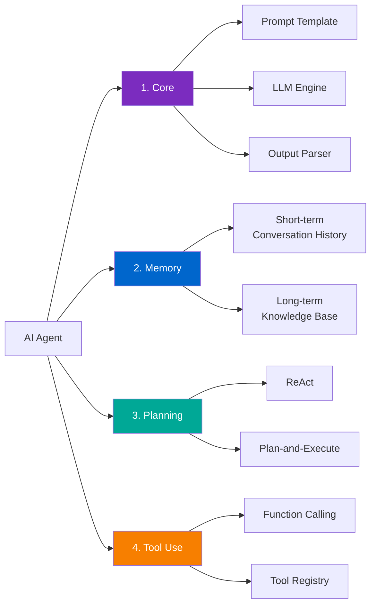
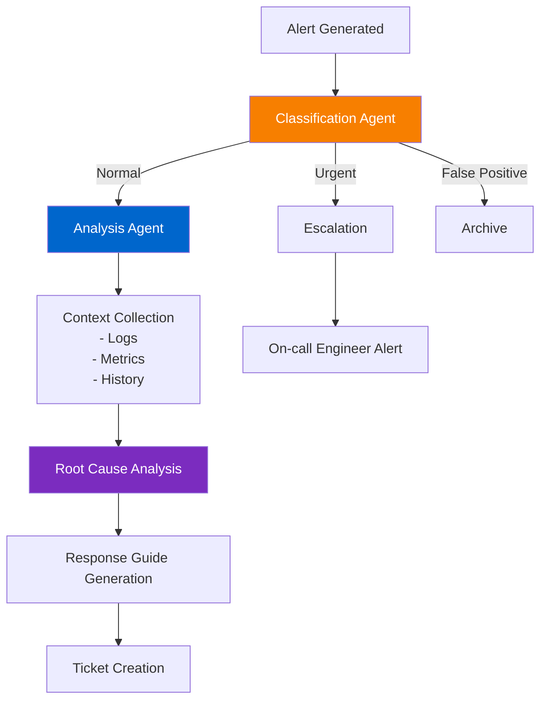

> <strong>Series: DeNA LLM Study</strong> (5/5 - Final)
>
> 1. [Part 1: LLM Fundamentals and 2025 AI Landscape](/en/blog/en/dena-llm-study-part1-fundamentals)
> 2. [Part 2: Structured Output and Multi-LLM Pipelines](/en/blog/en/dena-llm-study-part2-structured-output)
> 3. [Part 3: Model Training Methodologies](/en/blog/en/dena-llm-study-part3-model-training)
> 4. [Part 4: RAG Architecture and Latest Trends](/en/blog/en/dena-llm-study-part4-rag)
> 5. <strong>Part 5: Agent Design and Multi-Agent Orchestration</strong> ← Current Article

## Overview

This is the final installment of the DeNA LLM Study Series. Part 5 covers <strong>agent design</strong> and <strong>multi-agent orchestration</strong> using LLMs. Beyond simple prompt engineering, we'll explore how to build autonomous agent systems and address cost, performance, and reliability challenges in production environments.

### Part 5 Key Topics

1. <strong>LLM Workflows with n8n</strong> - Building agents with no-code/low-code automation platforms
2. <strong>Agent Design Principles</strong> - Core components and Self-Healing patterns
3. <strong>Multi-Agent Orchestration</strong> - 6 patterns and framework comparison (LangGraph, AutoGen, CrewAI)
4. <strong>Memory and State Management</strong> - MemGPT, A-MEM (Zettelkasten-based)
5. <strong>Production Case Study</strong> - DeNA NOC Alert Agent
6. <strong>Cost and Performance Optimization</strong> - Semantic caching, batching, SLM utilization

This article synthesizes DeNA's official study materials with the latest research findings and production case studies.

## 1. LLM Workflows with n8n

### What is n8n?

[n8n](https://n8n.io/) is a <strong>no-code/low-code workflow automation platform</strong>. As of 2025, it supports 422+ integrations and provides specialized features for building LLM agents.

<strong>Key Features</strong>:

- Visual workflow builder
- LangChain, Ollama, and major LLM framework integrations
- Native ReAct Agent pattern support
- Self-hostable (data privacy guaranteed)

### ReAct Agent Implementation

Example of implementing the ReAct (Reasoning and Acting) pattern in n8n:

```typescript
// n8n ReAct Agent workflow example
{
  "nodes": [
    {
      "type": "n8n-nodes-langchain.agent",
      "name": "ReAct Agent",
      "parameters": {
        "agentType": "react",
        "systemMessage": "You are a data analysis expert. Analyze user questions and select appropriate tools to answer.",
        "tools": ["webSearch", "calculator", "database"]
      }
    }
  ]
}
```

### 2025 Trend: Orchestration > Full Autonomy

According to DeNA study materials and recent research, the key trend for agent systems in 2025 is a <strong>shift from "full autonomy" to "orchestration"</strong>.

<strong>Reasons</strong>:

1. <strong>Cost Explosion</strong>: Unlimited API calls from autonomous agents
2. <strong>Unpredictability</strong>: Difficulty controlling agent behavior
3. <strong>Reliability Issues</strong>: Instability in production environments

Workflow tools like n8n are gaining attention precisely because they provide <strong>explicit orchestration</strong>.

## 2. Agent Design Principles

### Core Components

LLM agents consist of four core components:



#### 1. Core

The central engine of the agent.

<strong>Components</strong>:

- <strong>Prompt Template</strong>: System message, persona definition
- <strong>LLM Engine</strong>: Claude, GPT-4, Gemini, etc.
- <strong>Output Parser</strong>: Converts LLM output to structured data

#### 2. Memory

The agent's memory system.

<strong>Short-term Memory</strong>:

- Current conversation session history
- Typically last N messages (N=5〜10)
- Directly included in Context Window

<strong>Long-term Memory</strong>:

- Persistent knowledge base
- Vector Database (Pinecone, Weaviate, etc.)
- Retrieved via RAG pattern when needed

#### 3. Planning

The agent's strategy for executing complex tasks.

<strong>ReAct Pattern</strong>:

```
Thought: User requested company revenue data.
Action: query_db
Action Input: SELECT revenue FROM sales WHERE year=2024
Observation: [Result: $1.5M]
Thought: Need to compare with last year.
Action: query_db
Action Input: SELECT revenue FROM sales WHERE year=2023
Observation: [Result: $1.2M]
Thought: Need to calculate growth rate.
Action: calculate
Action Input: ((1.5 - 1.2) / 1.2) * 100
Observation: 25%
Final Answer: 2024 revenue is $1.5M, up 25% from previous year.
```

#### 4. Tool Use

Mechanism for LLM to interact with external tools.

### Function Calling Reliability Issues

Critical issue highlighted in DeNA study materials: <strong>LLM function calling is not 100% reliable</strong>.

<strong>Problem Cases</strong>:

1. <strong>Incorrect Parameters</strong>: Missing required fields, type mismatches
2. <strong>Hallucination</strong>: Calling non-existent tools
3. <strong>Infinite Loops</strong>: Repeatedly calling the same tool

### Self-Healing Pattern

Mechanism for agents to automatically recover from errors.

```typescript
class SelfHealingAgent {
  async execute(task: Task): Promise<Result> {
    const maxRetries = 3;
    let attempt = 0;

    while (attempt < maxRetries) {
      try {
        const result = await this.runTask(task);
        return result;
      } catch (error) {
        attempt++;

        // Analyze error
        const analysis = await this.analyzeError(error);

        // Select recovery strategy
        if (analysis.recoverable) {
          task = await this.adjustTask(task, analysis);
          console.log(`Retry ${attempt}: ${analysis.suggestion}`);
        } else {
          throw new UnrecoverableError(error);
        }
      }
    }

    throw new Error("Max retries exceeded");
  }
}
```

## 3. Multi-Agent Orchestration

### 6 Orchestration Patterns

Patterns for distributed processing of complex tasks across multiple agents.

#### 1. Sequential

Linear structure where one agent's output becomes the next agent's input.

<strong>Use Cases</strong>:

- Blog post creation: Research → Draft → Edit → Publish
- Data pipeline: Collect → Clean → Analyze → Visualize

<strong>Pros</strong>:

- Simple implementation
- Easy debugging
- Predictable costs

#### 2. Parallel

Structure where multiple agents work independently and simultaneously.

<strong>Use Cases</strong>:

- Content review: Quality check + Legal review + Fact checking in parallel
- Multimodal analysis: Text + Image + Audio parallel processing

#### 3. Supervisor

Structure where a central supervisor distributes tasks and integrates results.

<strong>Use Cases</strong>:

- Complex research: Supervisor distributes sub-topics to multiple workers
- Code generation: Supervisor assigns module implementations to workers

#### 4. Hierarchical

Multiple levels of supervisor-worker relationships forming a tree structure.

<strong>Use Cases</strong>:

- Large-scale project management: PM → Team Leaders → Developers
- Complex system design: Architect → Module Designers → Implementers

#### 5. Network

Structure where agents communicate freely in a P2P manner.

<strong>Use Cases</strong>:

- Creative collaboration: Idea brainstorming
- Democratic decision-making: Vote-based consensus

#### 6. Custom

Unique patterns optimized for specific problems.

### Framework Comparison: LangGraph vs AutoGen vs CrewAI

Comparison of the three major multi-agent frameworks.

| Feature                               | LangGraph            | AutoGen                   | CrewAI           |
| ------------------------------------- | -------------------- | ------------------------- | ---------------- |
| <strong>Core Concept</strong>         | Graph-based workflow | Conversation-based agents | Role-based teams |
| <strong>State Management</strong>     | Explicit state graph | Conversation history      | Built-in memory  |
| <strong>Learning Curve</strong>       | Medium               | High                      | Low              |
| <strong>Production Readiness</strong> | ⭐⭐⭐⭐⭐           | ⭐⭐⭐⭐                  | ⭐⭐⭐           |

#### LangGraph

<strong>Philosophy</strong>: <strong>Express everything as graphs</strong>

<strong>Pros</strong>:

- <strong>Clear control flow</strong>: All paths explicitly defined in graph
- <strong>Easy debugging</strong>: State tracking possible
- <strong>Production stability</strong>: Predictable behavior

#### AutoGen

<strong>Philosophy</strong>: <strong>Problem-solving through agent conversation</strong>

<strong>Pros</strong>:

- <strong>Natural collaboration</strong>: Mimics human team conversations
- <strong>Flexibility</strong>: Dynamic conversation flow
- <strong>Emergent behavior</strong>: Unexpected problem-solving

<strong>Cons</strong>:

- Cost explosion risk (unlimited conversations)
- Unpredictable
- Difficult debugging

#### CrewAI

<strong>Philosophy</strong>: <strong>Role-based team composition</strong>

<strong>Pros</strong>:

- <strong>Intuitive</strong>: Role concept is easy to understand
- <strong>Rapid prototyping</strong>: Implementation with minimal code
- <strong>Built-in memory</strong>: Automatic context management

<strong>Cons</strong>:

- Insufficient logging (debugging difficulties)
- Limitations with complex workflows
- Difficult fine-grained control

### Cost Impact of Pattern Selection

Analysis of how pattern selection affects costs in real projects.

<strong>Scenario</strong>: Blog post generation (Research + Writing + Editing)

| Pattern           | API Calls                                          | Expected Cost | Processing Time |
| ----------------- | -------------------------------------------------- | ------------- | --------------- |
| Sequential        | 3 calls                                            | $0.15         | 90 sec          |
| Parallel          | 3 calls (simultaneous)                             | $0.15         | 30 sec          |
| Supervisor        | 7 calls (supervisor 2 + workers 3 + integration 2) | $0.35         | 60 sec          |
| Network (AutoGen) | 15〜50 calls (conversation)                        | $0.75〜$2.50  | 120〜300 sec    |

<strong>Production Recommendations</strong>:

1. <strong>Clear workflow</strong> exists → Sequential or Parallel
2. <strong>Dynamic task distribution</strong> needed → Supervisor
3. <strong>Creative collaboration</strong> needed → Network (but set cost limits!)

## 4. Memory and State Management

### MemGPT Pattern

[MemGPT](https://arxiv.org/abs/2310.08560) is an innovative approach applying OS virtual memory concepts to LLMs.

<strong>Core Idea</strong>:

- <strong>Main Context (Main Memory)</strong>: LLM's Context Window
- <strong>External Storage</strong>: Vector DB, Relational DB
- <strong>Memory Manager</strong>: Swap in/out based on importance

#### Push vs Pull Hybrid

MemGPT combines two memory strategies.

<strong>Push (Active)</strong>:

- LLM automatically saves information it deems important
- Example: "This user prefers TypeScript" → Save

<strong>Pull (Reactive)</strong>:

- Search external storage when needed
- Example: User says "consider my preferences" → Search

#### Hierarchical Memory Structure

MemGPT proposes a 3-tier memory hierarchy.

```
L1: Working Memory (Context Window)
    ├─ Current conversation (5〜10 messages)
    ├─ Active task state
    └─ System prompt

L2: Recent Memory (Short-term storage)
    ├─ Recent sessions (1 week)
    ├─ Frequently referenced information
    └─ Temporary task data

L3: Long-term Memory (Long-term storage)
    ├─ User profile
    ├─ Domain knowledge
    └─ Accumulated learning data
```

### A-MEM (Zettelkasten-based)

[A-MEM](https://arxiv.org/abs/2502.12110) is an innovative memory system proposed by Rutgers University in 2025. It applies Zettelkasten (German for "note box") methodology to LLM agents.

<strong>What is Zettelkasten?</strong>

- Note organization method developed by Niklas Luhmann (sociologist)
- Assign unique IDs to each note
- Build knowledge network through note connections (links)
- Generate emergent insights

#### A-MEM Architecture

The core of A-MEM is that <strong>agents organize memory themselves</strong>.

<strong>Implementation Example</strong>:

```typescript
class AMem {
  notes: Map<string, Note>;
  graph: Graph;

  async createNote(content: string, metadata: Metadata): Promise<string> {
    const noteId = generateId();
    const note = new Note(noteId, content, metadata);

    // Auto-tagging
    const tags = await this.extractTags(content);
    note.tags = tags;

    // Calculate similarity with existing notes
    const similar = await this.findSimilarNotes(note);

    // Auto-generate connections (similarity > 0.7)
    for (const [relatedNote, similarity] of similar) {
      if (similarity > 0.7) {
        this.linkNotes(noteId, relatedNote.id, {
          type: "related",
          strength: similarity,
        });
      }
    }

    this.notes.set(noteId, note);
    return noteId;
  }
}
```

<strong>A-MEM Benefits</strong>:

1. <strong>Dynamic organization</strong>: No manual structuring needed
2. <strong>Relevance-based search</strong>: Direct matching + indirect connections
3. <strong>Emergent insights</strong>: Discover new connections between notes
4. <strong>Scalability</strong>: Efficiency maintained as knowledge grows

## 5. Production Case Study: DeNA NOC Alert Agent

Real production deployment of <strong>NOC (Network Operations Center) Alert Agent</strong> at DeNA.

### Problem Definition

<strong>Background</strong>:

- Operations team receives 100〜200 alerts daily
- 70% of alerts are false positives
- Engineers manually classify and respond to alerts

<strong>Goals</strong>:

- Automatic alert classification and prioritization
- False positive filtering
- Automatic response guide generation

### Workflow Design



### Production Deployment Considerations

Problems discovered during actual deployment and their solutions.

#### 1. Hallucination Problem

<strong>Issue</strong>: LLM mentions non-existent logs or metrics

<strong>Solution</strong>:

```typescript
// Tool call result validation
class ToolExecutor {
  async execute(toolName: string, input: any): Promise<any> {
    const tool = this.registry.get(toolName);

    // Input validation
    if (!this.validateInput(tool, input)) {
      return {
        error: "Invalid input",
        suggestion: "Please check the tool documentation",
      };
    }

    // Execute
    const result = await tool.execute(input);

    // Output validation
    if (this.isEmpty(result)) {
      return {
        error: "No data found",
        suggestion: "Try different search parameters",
      };
    }

    return result;
  }
}
```

#### 2. Latency Problem

<strong>Issue</strong>: Alert → Response takes 45 seconds on average (Target: 10 seconds)

<strong>Solutions</strong>:

- <strong>Parallel processing</strong>: Collect logs/metrics/history simultaneously
- <strong>Caching</strong>: Cache frequently used query results
- <strong>Streaming</strong>: Display partial results immediately

#### 3. Cost Problem

<strong>Issue</strong>: 200 alerts/day × $0.20 = $40/day ($1,200/month)

<strong>Solutions</strong>:

- <strong>False positive pre-filter</strong>: Filter obvious false positives with rules first
- <strong>Batching</strong>: Process similar alerts together
- <strong>SLM utilization</strong>: Use small models for simple classification

### Results

After 6 months of operation:

- <strong>False positive filtering accuracy</strong>: 92%
- <strong>Response time reduction</strong>: 15 minutes → 3 minutes average
- <strong>Engineer burden reduction</strong>: 20 hours saved per week
- <strong>Monthly operating cost</strong>: $1,200 → $350 (post-optimization)

## 6. Cost and Performance Optimization

The biggest challenges for LLM agent systems are <strong>cost</strong> and <strong>latency</strong>. Four core optimization techniques:

### 1. Semantic Caching (90% Cost Reduction)

<strong>Concept</strong>: Reuse cached responses for semantically similar queries

```typescript
// Semantic caching implementation
class SemanticCache {
  private cache: Map<string, CacheEntry> = new Map();
  private embeddings: EmbeddingModel;

  async get(query: string): Promise<string | null> {
    // Query embedding
    const queryEmbedding = await this.embeddings.encode(query);

    // Similarity search
    for (const [cachedQuery, entry] of this.cache) {
      const similarity = cosineSimilarity(queryEmbedding, entry.embedding);

      // Cache hit if similarity > 0.95
      if (similarity > 0.95) {
        console.log(`Cache hit! (similarity: ${similarity})`);
        return entry.response;
      }
    }

    return null;
  }
}
```

<strong>Impact</strong>:

- 60% cache hit rate → 60% cost reduction
- 95% latency reduction (network delay eliminated)

### 2. Batching (50% Reduction)

<strong>Concept</strong>: Bundle multiple requests for processing at once

<strong>Impact</strong>:

- Batch size of 10 → Approximately 50% cost reduction
- However, latency slightly increases (wait time)

### 3. SLM (Small Language Model, 14x Reduction)

<strong>Concept</strong>: Use smaller models for simple tasks

```typescript
// Model routing
class ModelRouter {
  private smallModel: SLM; // Llama 3.2 (8B)
  private largeModel: LLM; // Claude Sonnet 4

  async route(task: Task): Promise<Response> {
    const complexity = this.assessComplexity(task);

    if (complexity < 0.3) {
      // Simple task: SLM ($0.001)
      return await this.smallModel.execute(task);
    } else {
      // Complex task: Large Model ($0.014)
      return await this.largeModel.execute(task);
    }
  }
}
```

<strong>Impact</strong>:

- If 70% of tasks can be handled by SLM
- Cost: 70% × $0.001 + 30% × $0.014 = $0.0049 (average)
- Large Model only: $0.014
- <strong>Reduction rate: 65%</strong> (approximately 14x cheaper with SLM alone)

### 4. Quantization

<strong>Concept</strong>: Reduce model weight precision to decrease size and cost

| Quantization Level | Model Size | Accuracy Loss | Inference Speed | Use Case                        |
| ------------------ | ---------- | ------------- | --------------- | ------------------------------- |
| FP16 (Original)    | 16GB       | 0%            | 1x              | Benchmark baseline              |
| 8bit               | 8GB        | ~1%           | 1.5x            | Production (accuracy important) |
| 4bit               | 4GB        | ~3%           | 2x              | Local execution, experiments    |
| 2bit               | 2GB        | ~10%          | 3x              | Prototypes, demos               |

### Comprehensive Cost Optimization Strategy

Real-world case combining all four techniques.

<strong>Before (Pre-optimization)</strong>:

```typescript
// Process all requests with Claude Sonnet 4
const response = await claude.generate(query);
// Cost: $0.014 per request
// Latency: 2 seconds
```

<strong>After (Post-optimization)</strong>:

```typescript
async function optimizedQuery(query: string): Promise<string> {
  // 1. Semantic caching (60% hit rate)
  const cached = await cache.get(query);
  if (cached) return cached; // Cost: $0, Latency: 50ms

  // 2. Complexity assessment and model routing
  const complexity = assessComplexity(query);

  let response: string;

  if (complexity < 0.3) {
    // 3. SLM usage (70% requests)
    response = await smallModel.generate(query);
    // Cost: $0.001, Latency: 500ms
  } else {
    // 4. Large Model (30% requests)
    response = await largeModel.generate(query);
    // Cost: $0.014, Latency: 2 seconds
  }

  // Cache save
  await cache.set(query, response);

  return response;
}
```

<strong>Cost Calculation</strong>:

```
Cache hit (60%): $0 × 0.6 = $0
Cache miss:
  - SLM (28%): $0.001 × 0.28 = $0.00028
  - Large (12%): $0.014 × 0.12 = $0.00168

Average cost: $0.00196 per request
Reduction rate: 86% (Before $0.014 → After $0.00196)
```

## Key Insights and Reflections

Core insights gained from completing DeNA LLM Study Part 5.

### 1. "Orchestration" Over "Full Autonomy"

This is the core of the 2025 trend. Rather than letting agents decide everything autonomously, <strong>enabling autonomy within clear workflows</strong> is more effective in production.

### 2. Memory Creates True Agent Intelligence

Advanced memory systems like MemGPT and A-MEM transform agents from simple "prompt executors" to <strong>"learning and evolving systems"</strong>.

### 3. Choose Multi-Agent Patterns Based on Problem

There is no "one-size-fits-all" among the six patterns. Each has clear pros and cons.

### 4. Cost Optimization is Essential, Not Optional

The biggest barrier to LLM agent systems in production is <strong>cost</strong>.

<strong>Core Strategies</strong>:

1. <strong>Semantic caching</strong> - Apply to all systems (60% hit rate alone yields significant benefits)
2. <strong>SLM routing</strong> - Simple tasks (70%) with small models
3. <strong>Batching</strong> - Bundle tasks that don't need real-time processing
4. <strong>Pre-filtering</strong> - Filter obvious cases with rules

### 5. Production Agents Need "Self-Healing"

LLMs are probabilistic systems. 100% accurate responses are impossible.

## Series Recap

We've completed DeNA LLM Study Parts 1〜5. Let's look back at the entire learning journey.

### Insights from the Entire Series

1. <strong>LLMs are tools</strong>: Not omnipotent. Proper usage for the problem matters.
2. <strong>Prompts > Fine-tuning</strong>: 90% of problems can be solved with prompts.
3. <strong>RAG is essential</strong>: For latest information and domain knowledge, RAG is the answer.
4. <strong>Agents need memory</strong>: Adding memory to stateless LLMs creates true agents.
5. <strong>Cost optimization from design phase</strong>: Optimizing later costs 10x more.

## References

### DeNA Official Materials

- [DeNA Tech Blog](https://engineering.dena.com/)
- DeNA LLM Study Presentation (Internal materials, 2024)

### n8n and Workflows

- [n8n Official Documentation](https://docs.n8n.io/)
- [n8n AI Agent Guide](https://blog.n8n.io/llm-agents/)

### Multi-Agent Frameworks

- [LangGraph Official Documentation](https://langchain-ai.github.io/langgraph/)
- [AutoGen GitHub](https://github.com/microsoft/autogen)
- [CrewAI Official Site](https://www.crewai.com/)

### Memory Systems

- [MemGPT Paper](https://arxiv.org/abs/2310.08560)
- [A-MEM Paper](https://arxiv.org/abs/2502.12110)
- [A-MEM GitHub](https://github.com/agiresearch/A-mem)

### Cost Optimization

- [Semantic Caching Paper](https://arxiv.org/abs/2508.07675)
- [LLM Cost Optimization Guide](https://ai.koombea.com/blog/llm-cost-optimization)

---

<strong>DeNA LLM Study Series Complete!</strong> We hope this series helps your LLM agent development journey.
