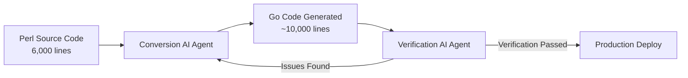
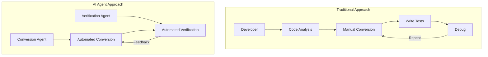

## Overview

Migrating large-scale legacy code to modern languages is a challenge every organization recognizes as important but keeps pushing down the priority list. DeNA solved this problem dramatically using AI agents. When migrating a server asset management API written in 6,000 lines of Perl to Go, they deployed two types of AI agents — a **conversion agent** and a **verification agent** — in parallel, completing what would normally take six months in **just one month**.

## Background: Why Migration Was Necessary

DeNA's server asset management API was built in Perl in 2018, managing information such as server names, purposes, and IP addresses for thousands of servers across the company's services.

While the system had no major defects, the switch to a modern language was necessary for several reasons:

- **Perl's future outlook**: Concerns about the language's longevity and shrinking community
- **Maintainability**: Difficulty recruiting developers with Perl experience
- **Resource constraints**: Despite recognizing the need, the migration kept being deprioritized due to the significant effort required

Keisuke Koike, Deputy Director of the IT Infrastructure Division at DeNA, explained: "It was clear the project would require significant effort, so we just couldn't prioritize it."

## DeNA's "AI All-In" Strategy

In February 2025, DeNA founder and chairperson Tomoko Namba announced the company's **"AI All-In" declaration** — a commitment to leveraging AI extensively to boost productivity and build an organization capable of running existing businesses with half the workforce.

As part of this strategy, the server asset management API modernization was selected as one of several AI-powered pilot projects.

## Core Strategy: Two-Agent Division of Labor

The most innovative aspect of this project was the decision to **deploy two types of AI agents with distinct specializations**.

### 1. Conversion AI Agent

- **Role**: Transform Perl code into Go code
- **Specialization**: Optimized for code generation
- **Output**: ~6,000 lines of Perl → ~10,000 lines of Go

### 2. Verification AI Agent

- **Role**: Validate the accuracy of converted Go code
- **Specialization**: Optimized for testing and quality verification
- **Process**: Feeds issues back to the conversion agent when problems are found

This two-agent system enabled rapid iteration of the **conversion → verification → correction** cycle, compressing what would take over six months manually into a single month.

## Project Timeline

| Period | Activity |
|--------|----------|
| Late Oct – Late Nov 2025 | Perl-to-Go migration execution (1 month) |
| Dec 2025 – Jan 2026 | Development environment validation (~2 months) |
| Late Jan 2026 | Production deployment |

## Insights: How to Apply AI to Legacy Migration

### The Power of Agent Specialization

Rather than asking a single AI to "convert and verify," the key was **clearly separating roles** to maximize each agent's strengths.

### Applicable Scenarios

This case study is particularly relevant for:

1. **Legacy-to-modern language migrations**: COBOL→Java, PHP→Go, Ruby→Rust, etc.
2. **Large-scale codebase transformations**: Projects involving thousands to tens of thousands of lines
3. **Resolving technical debt blocked by resource constraints**: AI dramatically improves the cost-benefit equation

### Important Considerations

- Note that DeNA allocated a **separate 2-month verification period**. Even AI-converted code requires thorough validation before production deployment.
- The design of agent role assignments was critical to success — carefully architect your agent configuration to match project requirements.

## Conclusion

DeNA's case demonstrates that AI agents can serve not just as coding assistants but as **strategic project-level resources**. Three key takeaways:

1. **Agent role separation**: Splitting conversion and verification maximizes quality in both areas
2. **Automated iteration cycles**: AI handles the conversion → verification → correction loop automatically
3. **Adequate validation periods**: Human final verification of AI-converted results remains essential

As Deputy Director Koike put it: "If AI can deliver this level of efficiency, we can start tackling projects that were previously impossible due to resource constraints." AI agents represent a genuine breakthrough for resolving technical debt.

## References

- [DeNA Migrates 6,000 Lines of Perl to Go in 1 Month Using AI Agents - Nikkei xTECH](https://xtech.nikkei.com/atcl/nxt/column/18/00001/11469/)
