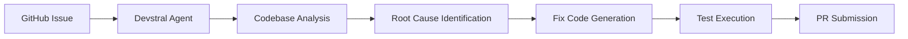
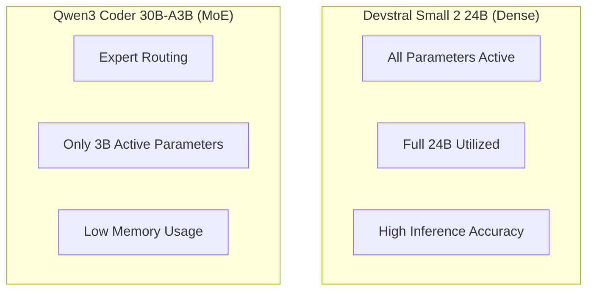
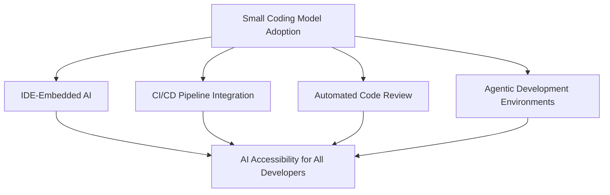

## Overview

In early 2026, the coding-focused AI model market is undergoing a remarkable shift. Mistral AI's <strong>Devstral Small 2 24B</strong> and Alibaba's <strong>Qwen3 Coder 30B</strong> have arrived almost simultaneously, ushering in the era of "coding models that run on any hardware."

These two models aren't just about being small. They can run on a single RTX 4090 or a Mac with 32GB RAM, yet outperform models with hundreds of billions of parameters in coding tasks. In this article, we compare their architectures, benchmarks, and practical use cases.

## Devstral Small 2 24B — Mistral's Agentic Coding Model

### Key Features

Devstral was born from a collaboration between Mistral AI and [All Hands AI](https://www.all-hands.dev/) as a <strong>software engineering specialized model</strong>.

- <strong>Parameters</strong>: 24B (Dense model)
- <strong>License</strong>: Apache 2.0 (fully open source)
- <strong>SWE-Bench Verified</strong>: 46.8% (open-source SOTA)
- <strong>Minimum Hardware</strong>: RTX 4090 or Mac with 32GB RAM
- <strong>Specialization</strong>: Real GitHub issue resolution, agentic coding

### Why It Matters

The most remarkable aspect of Devstral is its <strong>performance-to-size ratio</strong>. It scored higher on SWE-Bench Verified than DeepSeek-V3-0324 (671B) and Qwen3 232B-A22B. Despite being over 20x smaller, its real-world code problem-solving ability is superior.

```bash
# Run Devstral with Ollama
ollama pull devstral
ollama run devstral

# Also available on LM Studio
# MLX format for Apple Silicon optimization
```

### What Is Agentic Coding

Devstral focuses not on simple code generation but on <strong>agentic coding</strong>. This means the model understands the entire codebase, identifies relationships between components, and autonomously resolves complex bugs.



It operates on top of code agent frameworks like OpenHands or SWE-Agent, automatically resolving GitHub issues without human intervention.

## Qwen3 Coder — Alibaba's Agentic Coding Model

### Key Features

Qwen3 Coder is Alibaba's coding-specialized model series, available in multiple sizes alongside the flagship 480B-A35B.

- <strong>Flagship</strong>: Qwen3-Coder-480B-A35B (MoE, 35B active parameters)
- <strong>Small Variant</strong>: Qwen3-Coder-30B-A3B (MoE, 3B active parameters)
- <strong>Context</strong>: 256K tokens (native), 1M tokens (YaRN extension)
- <strong>License</strong>: Open source
- <strong>Specialization</strong>: Agentic coding, browser use, tool calling

### Training Innovation

The most notable aspect of Qwen3 Coder's training is the <strong>large-scale application of reinforcement learning (RL)</strong>.

1. <strong>Code RL</strong>: Large-scale RL on real-world coding tasks rather than competitive programming
2. <strong>Long-Horizon RL (Agent RL)</strong>: Long-term RL where the model solves problems through multi-turn tool interactions
3. <strong>Environment Scaling</strong>: 20,000 independent parallel environments on Alibaba Cloud infrastructure

```python
# Qwen3 Coder API usage example
from openai import OpenAI

client = OpenAI(
    api_key="your_api_key",
    base_url="https://dashscope-intl.aliyuncs.com/compatible-mode/v1",
)

# Call the qwen3-coder-plus model
completion = client.chat.completions.create(
    model="qwen3-coder-plus",
    messages=[
        {"role": "system", "content": "You are a helpful coding assistant."},
        {"role": "user", "content": "Find the bug in this function."}
    ],
)
```

### Qwen Code CLI

Alongside Qwen3 Coder, an open-source CLI tool called <strong>Qwen Code</strong> was released. Forked from Gemini CLI, it features optimized prompts and function calling protocols for Qwen models.

```bash
# Install Qwen Code
npm i -g @qwen-code/qwen-code

# Configuration
export OPENAI_API_KEY="your_api_key"
export OPENAI_BASE_URL="https://dashscope-intl.aliyuncs.com/compatible-mode/v1"
export OPENAI_MODEL="qwen3-coder-plus"

# Start coding
qwen
```

It also supports integration with Claude Code, allowing seamless integration into existing development workflows.

## Comparative Analysis

### Spec Comparison

| Feature | Devstral Small 2 24B | Qwen3 Coder 30B-A3B |
|---------|---------------------|---------------------|
| <strong>Parameters</strong> | 24B (Dense) | 30B (MoE, 3B active) |
| <strong>Architecture</strong> | Dense Transformer | Mixture of Experts |
| <strong>License</strong> | Apache 2.0 | Open source |
| <strong>SWE-Bench</strong> | 46.8% (verified) | SOTA-class (flagship) |
| <strong>Context</strong> | Standard | 256K (native) |
| <strong>Min VRAM</strong> | ~16GB (Q4) | ~4GB (3B active) |
| <strong>Runtime</strong> | RTX 4090, Mac 32GB | Raspberry Pi capable |
| <strong>Agent Frameworks</strong> | OpenHands, SWE-Agent | Qwen Code, Claude Code |

### Architecture Differences

The biggest difference between the two models is their <strong>architecture</strong>.



- <strong>Devstral</strong>: As a Dense model, all 24B parameters participate in inference. It delivers higher accuracy but requires more computational resources.
- <strong>Qwen3 Coder 30B-A3B</strong>: Using MoE (Mixture of Experts) architecture, only 3B of the 30B parameters are activated per inference. Its extreme memory efficiency makes it viable even on small devices like a Raspberry Pi.

### Use Case Recommendations

| Use Case | Recommended Model | Reason |
|----------|------------------|--------|
| <strong>Local Development (Mac/PC)</strong> | Devstral | Higher accuracy, sufficient hardware |
| <strong>Edge Devices</strong> | Qwen3 Coder | MoE enables ultra-low-spec execution |
| <strong>GitHub Issue Automation</strong> | Devstral | SWE-Bench verified performance |
| <strong>CLI-Integrated Development</strong> | Qwen3 Coder | Qwen Code CLI support |
| <strong>Privacy-Focused Enterprises</strong> | Devstral | Apache 2.0, local execution |
| <strong>Long Context Tasks</strong> | Qwen3 Coder | 256K native support |

## The Future of Local AI Coding

### Why Small Coding Models Matter

The emergence of these two models carries significance beyond a simple product launch.

1. <strong>Privacy</strong>: Get AI assistance locally without sending code to external servers
2. <strong>Cost Savings</strong>: Unlimited use on your own hardware without API costs
3. <strong>Offline Work</strong>: Use AI coding assistants without an internet connection
4. <strong>Customization</strong>: Fine-tune on your own codebase to build custom models

### Quantization and Optimization

The community is already providing various quantized versions. Calibration datasets specialized for coding models ensure quantization optimized for tool calling and code generation.

```bash
# Save VRAM with Q4 quantization
# Devstral: ~16GB → ~8GB
# Qwen3 Coder 30B-A3B: Only 3B active, already ~4GB

# Use quantized models with Ollama
ollama pull devstral:q4_k_m
```

### Developer Ecosystem Changes

As small coding models become mainstream, significant changes in the development tool ecosystem are expected.



## Conclusion

The simultaneous arrival of Devstral Small 2 24B and Qwen3 Coder 30B symbolizes the <strong>democratization of coding AI</strong>. Without large GPU clusters or expensive API subscriptions, any developer can now run production-grade coding AI on their laptop or even a Raspberry Pi.

What's particularly noteworthy is that both models adopt different architectures (Dense vs MoE) while pursuing the same goal: "locally executable agentic coding." This suggests that diverse approaches to small coding models will compete and evolve rapidly.

The era of local AI coding has already begun.

## References

- [Mistral AI - Devstral Official Announcement](https://mistral.ai/news/devstral)
- [Qwen3-Coder Official Blog](https://qwenlm.github.io/blog/qwen3-coder/)
- [r/LocalLLaMA Community Discussion](https://www.reddit.com/r/LocalLLaMA/comments/1r85o89/devstral_small_2_24b_qwen3_coder_30b_coders_for/)
- [OpenHands - Local LLM Usage Guide](https://docs.all-hands.dev/modules/usage/llms/local-llms)
