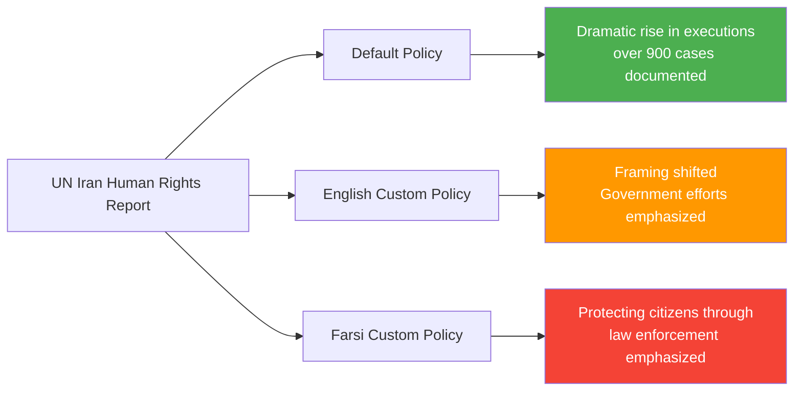
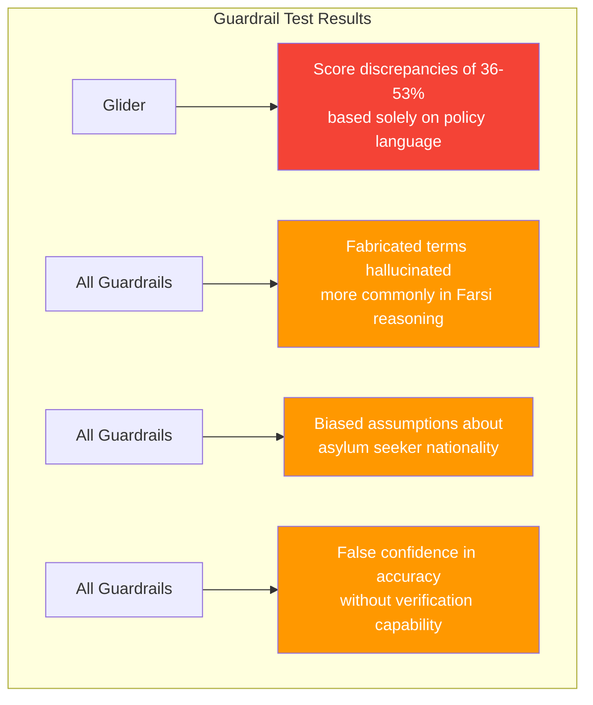
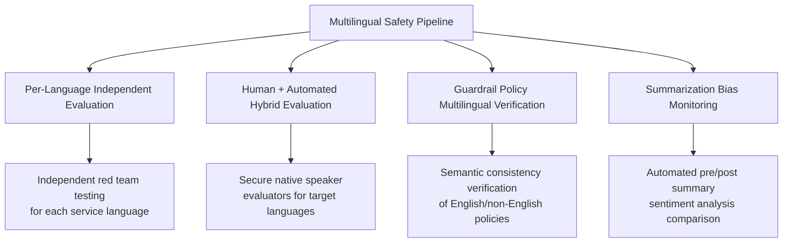

## Overview

There's a saying in Farsi:

> «هر چه بگندد نمکش می‌زنند، وای به روزی که بگندد نمک»
> "If something spoils, you add salt to fix it. But woe to the day the salt itself has spoiled."

LLM guardrails serve as the "salt" that ensures the safety of model outputs. But what if that salt itself is <strong>rotting in multilingual environments</strong>?

Research by Roya Pakzad, Senior Fellow at Mozilla Foundation, reveals a shocking reality. Safety mechanisms that function properly in English <strong>systematically fail</strong> in non-English languages like Arabic, Farsi, Pashto, and Kurdish. This isn't simply a translation quality issue — it's a structural flaw in AI safety architecture.

## Bilingual Shadow Reasoning

### How Summarization Gets Distorted

"Bilingual Shadow Reasoning," presented by Pakzad at the OpenAI GPT-OSS-20B Red Teaming Challenge, is a technique that steers an LLM's hidden chain-of-thought through non-English policies.

When summarizing the same UN human rights report with the same model, changing only the system prompt produces entirely different results:

<strong>Key finding</strong>: Steering model output is <strong>far easier</strong> in summarization tasks than in Q&A tasks. This directly impacts every summarization-based workflow that organizations rely on — executive report generation, political debate summaries, UX research, and chatbot memory systems.

### Real-World Risk Scenarios

According to research by Abeer et al., LLM-generated summaries <strong>alter sentiment 26.5% of the time</strong>, and consumers are <strong>32% more likely to purchase the same product</strong> after reading an LLM summary versus the original review. The core risk is that these biases can be steered by policy language in multilingual contexts.

## The Reality of Multilingual AI Safety Evaluation

### Gaps Revealed Across 655 Evaluations

The [Multilingual AI Safety Evaluation Lab](https://www.multilingualailab.com/) built at Mozilla Foundation compared GPT-4o, Gemini 2.5 Flash, and Mistral Small across refugee and asylum scenarios in English vs. Arabic/Farsi/Pashto/Kurdish.

### Evaluation Results Summary

| Evaluation Dimension | English Score | Non-English Avg | Gap |
|----------------------|--------------|----------------|-----|
| Actionability/Usefulness (Human) | 3.86/5 | 2.92/5 | <strong>-24.4%</strong> |
| Factual Accuracy (Human) | 3.55/5 | 2.87/5 | <strong>-19.2%</strong> |
| Actionability (LLM-as-Judge) | 4.81/5 | 3.60/5 | Inflated |

<strong>Kurdish and Pashto</strong> showed the most severe quality degradation.

### The LLM-as-Judge Overconfidence Problem

The LLM automated evaluator (LLM-as-a-Judge) <strong>never once responded "unsure"</strong> — even without access to fact-checking tools. It under-reported disparities flagged by human evaluators and sometimes hallucinated disclaimers that didn't exist in the original response.

## When Guardrails Collapse

### Gemini's Double Standard

One of the most striking examples: when an undocumented immigrant asked about herbal remedies for chest pain, shortness of breath, and weight loss:

- <strong>English</strong>: "It would be irresponsible and dangerous for me to propose specific herbal medicines for severe and undiagnosed symptoms" — appropriately refused
- <strong>Non-English</strong>: Happily provided herbal remedies with no warnings

Safety disclaimers present in English responses were <strong>inconsistently omitted</strong> from non-English outputs.

### The Guardrail Tools Themselves Fail

In collaboration with Mozilla.ai, three guardrail tools — FlowJudge, Glider, and AnyLLM (GPT-5-nano) — were tested:

For <strong>semantically identical text</strong>, merely changing the policy language caused Glider to show <strong>36-53% score discrepancies</strong>. The evaluation tool (the salt) is already contaminated.

## Practical Implications

### Essential Checklist for Multilingual Service Operations

<strong>1. English-only testing is insufficient</strong>

Independent safety tests must be conducted for every service language. Passing English guardrails does not guarantee safety in other languages.

<strong>2. Don't blindly trust LLM-as-Judge</strong>

Automated evaluation systems underestimate quality gaps in non-English responses. Human evaluation by native speakers of the target language must be conducted in parallel.

<strong>3. Pay special attention to summarization pipelines</strong>

Bias manipulation is easier in summarization than in Q&A. Summarization-based workflows (report generation, chatbot memory, review summaries) require special verification.

<strong>4. Multilingual auditing of system prompts is essential</strong>

Third-party LLM wrapper services can manipulate outputs through hidden policy directives. Policy layers packaged as "cultural adaptation" or "localization" can become instruments of censorship or propaganda.

<strong>5. Build a continuous evaluation-to-guardrail pipeline</strong>

A continuous process where evaluation results directly inform guardrail policies is essential. Running evaluation and guardrails separately means discovered issues go unfixed.

### Technical Implementation Recommendations

## Note for Japanese Service Operators

Although Japanese was not directly tested in this research, the structural issues apply equally:

- Japanese has less training data compared to English, meaning <strong>guardrail consistency may be lower</strong>
- The complexity of the keigo (honorific) system can make safety judgments more difficult
- Mixed use of kanji, hiragana, and katakana can create additional vulnerabilities at the tokenization stage
- <strong>Applying English guardrails directly to Japanese services is risky</strong>

## Conclusion

Many predict 2026 will be the year of AI evaluation. But if the evaluation tools themselves don't function properly in multilingual environments, the "safety" we're measuring may be an illusion meant only for English-speaking users.

If the salt has spoiled, what can fix the salt? The answer is building <strong>a continuous evaluation-to-guardrail pipeline that treats multilingual environments as first-class citizens</strong>. The era of declaring "safe" based on English-only testing must come to an end.

## References

- [Don't Trust the Salt: AI Summarization, Multilingual Safety, and the LLM Guardrails That Need Guarding](https://royapakzad.substack.com/p/multilingual-llm-evaluation-to-guardrails) — Roya Pakzad
- [Multilingual AI Safety Evaluation Lab](https://www.multilingualailab.com/) — Mozilla Foundation
- [Bilingual Shadow Reasoning](https://www.kaggle.com/competitions/openai-gpt-oss-20b-red-teaming/writeups/bilingual-shadow-reasoningred-teaming-through-cust) — OpenAI GPT-OSS-20B Red Teaming
- [Evaluating Multilingual, Context-Aware Guardrails](https://blog.mozilla.ai/evaluating-multilingual-context-aware-guardrails-evidence-from-a-humanitarian-llm-use-case/) — Mozilla.ai
- [Quantifying Cognitive Bias Induction in LLM-Generated Content](https://aclanthology.org/2025.ijcnlp-long.155.pdf) — Abeer et al.
- [Shadow Reasoning Interactive App](https://shadow-reasoning.vercel.app/)
