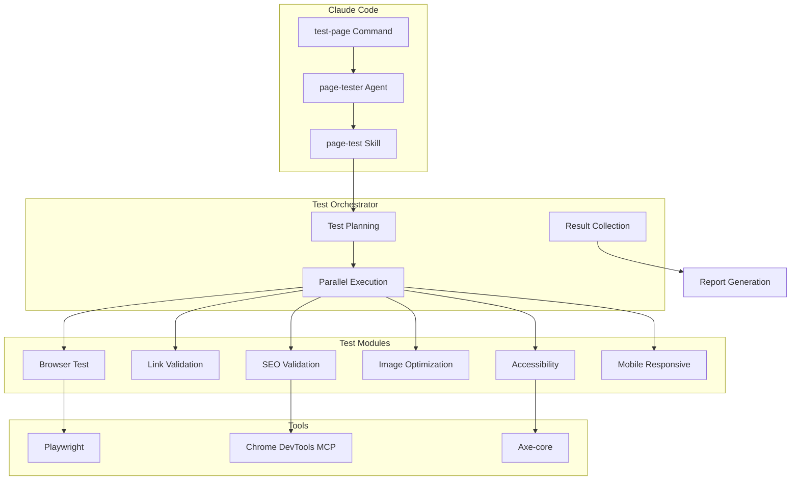
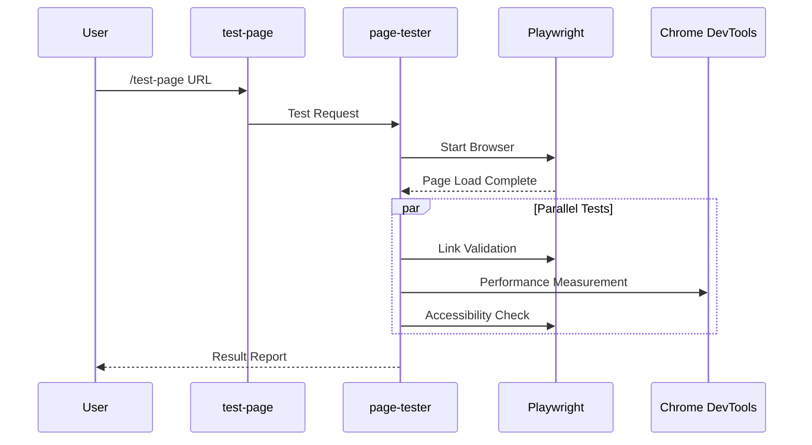
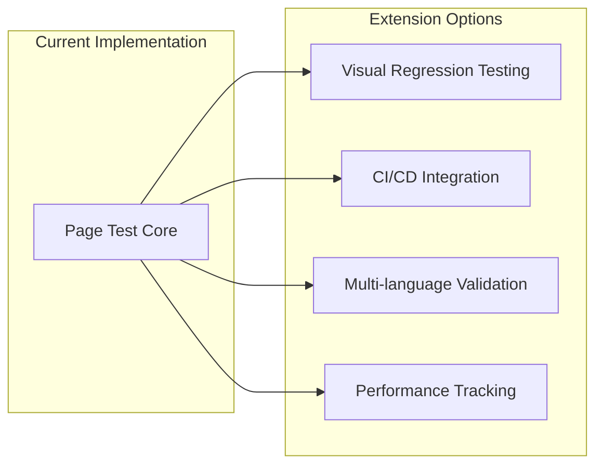

## Why Automate Page Testing?

How much time do you spend on quality verification after developing a web page? Cross-browser testing, link checking, accessibility validation, SEO checks, image optimization... Manually verifying all these items takes <strong>over 30 minutes per page</strong>.

The bigger problem is <strong>consistency</strong>. In a busy schedule, certain items may be missed, or verification standards may vary between team members.

To solve this problem, I built a <strong>Page E2E Test Automation System</strong> using Claude Code and Playwright.

## System Overview

```bash
# Automatically verify 8 quality items with a single command
/test-page https://jangwook.net/en/
```

This single command automatically tests the following items:

| Priority | Test Item | Description |
|----------|-----------|-------------|
| <strong>P0</strong> | Cross-browser | Simultaneous testing on Chromium, Firefox, WebKit |
| <strong>P0</strong> | Link Integrity | HTTP status code verification for all links |
| <strong>P0</strong> | Accessibility (a11y) | WCAG 2.1 AA level compliance |
| <strong>P0</strong> | Mobile Responsive | Layout verification across viewports |
| <strong>P1</strong> | Image Optimization | Rendered vs. natural size comparison |
| <strong>P1</strong> | SEO Validation | Meta tags, OG, structured data |
| <strong>P1</strong> | UI/UX | Font size, touch target verification |
| <strong>P2</strong> | Content Quality | Language settings, heading structure |

## Architecture



The three core components are:

1. <strong>Commands</strong> (`/test-page`): User interface
2. <strong>Agents</strong> (`page-tester`): Test orchestration
3. <strong>Skills</strong> (`page-test`): Reusable test logic

## Implementation

### 1. Define Slash Command

Create the `.claude/commands/test-page.md` file:

````markdown
# Page Test Command

Automatically verifies web page quality.

## Usage

```bash
/test-page <url> [options]
```

## Validation Items

1. **Cross-browser Compatibility** (P0)
2. **Link Integrity** (P0)
3. **Accessibility** (P0)
4. **Mobile Responsive** (P0)
5. **Image Optimization** (P1)
6. **SEO Validation** (P1)
...
````

### 2. Agent Implementation

The `page-tester` agent performs the following workflow:



<details>
<summary><strong>View Agent Definition File</strong></summary>

```markdown
# Page Tester Agent

A specialized agent for comprehensive web page quality testing.

## Role

- Page loading and rendering verification
- Cross-browser compatibility testing
- Accessibility (a11y) inspection
- SEO optimization status check
- Performance metrics collection

## Tools Used

- **Playwright**: Browser automation and screenshots
- **Chrome DevTools MCP**: Performance analysis and network monitoring
- **Axe-core**: Accessibility inspection

## Workflow

1. Receive target URL
2. Start browser instance
3. Execute each test module in parallel
4. Collect and analyze results
5. Generate markdown report

## Output Format

Test results are generated as a markdown report in the following format:
- Total score and grade
- Detailed results by category
- Discovered issues and improvement suggestions
- Screenshot attachments
```

</details>

### 3. MCP Tool Integration

Combine Chrome DevTools MCP and Playwright to build a powerful testing environment:

```typescript
// Performance analysis with Chrome DevTools MCP
const performanceResults = await mcp_chrome_devtools_performance_start_trace({
  reload: true,
  autoStop: true
});

// Screenshot and accessibility analysis with Playwright
const snapshot = await mcp_chrome_devtools_take_snapshot();
const screenshot = await mcp_chrome_devtools_take_screenshot({
  fullPage: true
});
```

## Actual Test Results

Here are the actual test results for the `https://jangwook.net/en/` page:

### Overall Rating: <strong>Conditional Pass</strong> (75/100 points)

| Category | Result | Details |
|----------|--------|---------|
| Cross-browser | ✅ Pass | Chromium working normally |
| Link Integrity | ✅ Pass | All 33 links normal |
| Accessibility | ⚠️ Needs Improvement | 20 touch targets below minimum |
| Mobile Responsive | ✅ Pass | No horizontal scroll |
| Image Optimization | ⚠️ Needs Improvement | 6 oversized images |
| SEO | ✅ Pass | 95/100 points |
| UI/UX | ⚠️ Needs Improvement | Minimum font 12px |

<details>
<summary><strong>View Full Test Report</strong></summary>

### Test Environment
- <strong>Test Time</strong>: 2024-11-24 09:56:25
- <strong>Target URL</strong>: https://jangwook.net/en/
- <strong>Browser</strong>: Chromium (Playwright)

### 1. Cross-browser Test ✅

Page loaded normally in Chromium environment. Main elements rendered correctly.

### 2. Link Integrity Check ✅

33 links checked in total:
- Internal links: 28 (all normal)
- External links: 5 (all normal)

### 3. Accessibility (a11y) Check ⚠️

<strong>Touch Target Size Below Minimum (20 items)</strong>

Elements below WCAG recommended minimum size of 44×44px:
- Navigation links (current height: 36px)
- Social media icons
- Footer links

### 4. Mobile Responsive Check ✅

- No horizontal scroll
- Viewport meta tag correctly set
- Touch interactions normal

### 5. Image Optimization Check ⚠️

<strong>6 Oversized Images Found</strong>

| Image | Original Size | Rendered Size | Possible Reduction |
|-------|---------------|---------------|-------------------|
| hero-image.webp | 600×600 | 382×192 | ~75% |
| blog-thumb-1.webp | 800×800 | 400×200 | ~75% |
| blog-thumb-2.webp | 800×800 | 400×200 | ~75% |
| profile.webp | 400×400 | 150×150 | ~86% |
| og-image.png | 1200×630 | unused | 100% |
| favicon-large.png | 512×512 | 32×32 | ~99% |

### 6. SEO Check ✅ (95/100)

- ✅ Title tag present
- ✅ Meta description present
- ✅ OG tags complete
- ✅ Canonical URL set
- ⚠️ Some images missing alt attributes

### 7. UI/UX Check ⚠️

- Minimum font size: 12px (recommended: 14px or more)
- Color contrast: Good
- Layout consistency: Good

</details>

### Key Issues Found

<strong>1. Image Optimization Issues</strong>

```
hero-image.webp: 600×600px → 382×192px (approximately 75% reduction possible)
```

<strong>Solution:</strong>
```html

```

<strong>2. Touch Target Size Below Minimum</strong>

The WCAG recommended minimum size is 44×44px. The current navigation link height is 36px, which is insufficient.

```css
/* Solution */
a, button {
  min-height: 44px;
  min-width: 44px;
  display: inline-flex;
  align-items: center;
  padding: 10px;
}
```

## Key Insights

Here are the insights gained from building this automation system:

### 1. Apply the 80/20 Rule

Don't try to implement all tests perfectly. <strong>Just 6 P0 items can detect 80% of quality issues</strong>.

### 2. Value of AI Analysis

True automation isn't just saying "the image is large" but <strong>suggesting "how to fix it"</strong>. This is where Claude's analytical capabilities shine.

### 3. Incremental Improvement

You don't need a perfect system from the start:

```
Week 1: Basic framework + 3 P0 tests
Week 2: Complete P0 + console reporter
Week 3: P1 tests + HTML report
Week 4: AI analysis + improvement suggestions
```

### 4. Report Utilization

The generated markdown reports can be:
- Used as team review materials
- Automatically archived to Notion
- Shared via Slack notifications
- Integrated into CI/CD pipelines

## Extensibility

This system can be extended in various directions:



- <strong>Visual Regression Testing</strong>: Detect UI changes through screenshot comparison
- <strong>CI/CD Integration</strong>: Automatic test execution on every PR
- <strong>Multi-language Content Validation</strong>: Check for translation gaps, language consistency
- <strong>Time-series Performance Tracking</strong>: Core Web Vitals history monitoring

## Conclusion

Page E2E test automation with Claude Code provides value beyond simple time savings:

1. <strong>Consistent quality standards</strong> applied
2. <strong>Immediate feedback</strong> for quick improvements
3. <strong>AI-powered insights</strong> for better decision-making
4. <strong>Documented quality history</strong> accumulated

Try applying this system to your next project. While initial setup takes time, it can improve both team productivity and website quality in the long run.

## References

- [Playwright Official Documentation](https://playwright.dev/)
- [WCAG 2.1 Guidelines](https://www.w3.org/WAI/WCAG21/quickref/)
- [Core Web Vitals](https://web.dev/vitals/)
- [Axe-core Accessibility Testing](https://github.com/dequelabs/axe-core)
