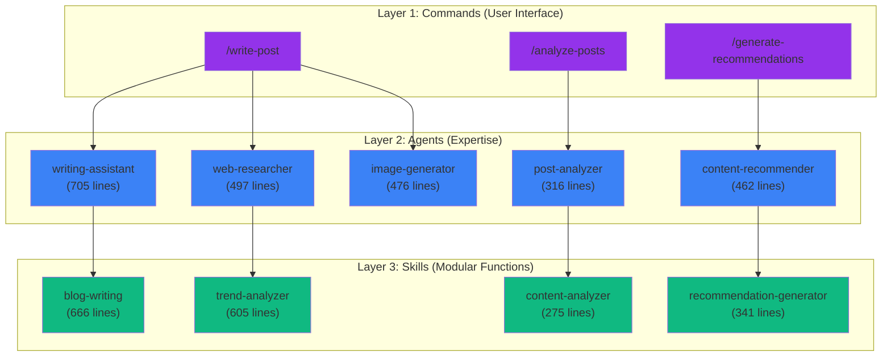
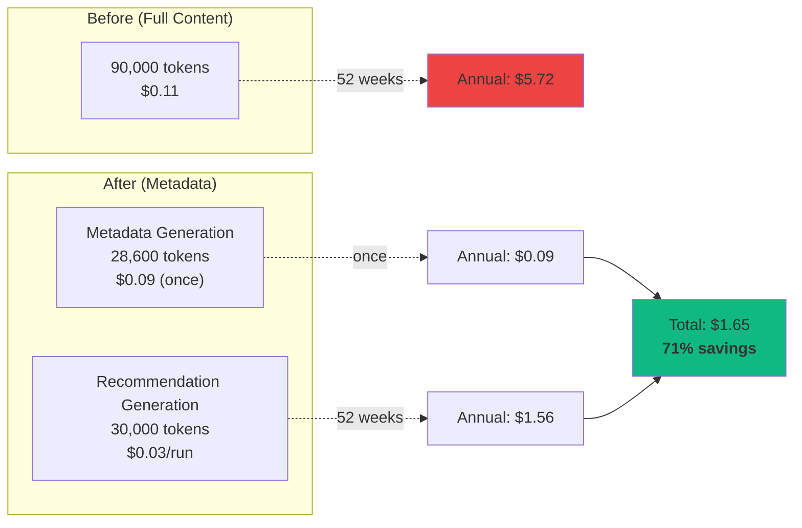
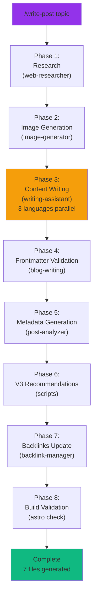

> <strong>Series Guide</strong>: This is Part 1/3 of the "EffiFlow Automation Analysis/Evaluation and Improvements" series.
> - **Part 1** (current): Core Architecture and Metrics Analysis
> - [Part 2](/blog/en/effiflow-automation-analysis-part2): Skills and Commands Integration Strategy
> - Part 3 (upcoming): Practical Improvement Cases and ROI Analysis

## Introduction

While operating a blog automation system, I kept asking myself: <strong>"How can we make this more efficient?"</strong> To find the answer, I spent 7.5 hours deeply analyzing 28 files in the `.claude/` directory (17 Agents, 4 Skills, 7 Commands).

The results were remarkable:
- <strong>60-70% token reduction</strong> with metadata-first architecture
- <strong>71% annual cost savings</strong> ($5.72 → $1.65)
- <strong>90%+ automation</strong> saving 364 hours per year
- <strong>Industry-leading performance</strong> (A grade, 8.98/10)

In this Part 1, I'll share the system's core architecture and key findings.

## System Overview: 3-Tier Architecture

EffiFlow is designed with a <strong>Commands → Agents → Skills</strong> 3-tier structure:



### Layer Responsibilities

**Commands (7)**: User-invoked workflow orchestrators
- Manage complex multi-step tasks
- Delegate work to Agents
- Final validation and output

**Agents (17)**: Independently executable specialists
- Possess domain-specific knowledge
- Utilize Skills and Tools
- Support parallel execution

**Skills (4)**: Auto-discovered modular functions
- SKILL.md + support files
- Reusable logic
- Configurable tool access

## Key Finding 1: Metadata-First Architecture

### Innovation Background

Initially, we analyzed <strong>full content of all blog posts</strong>:

```
Per recommendation generation:
- 30 posts × 3,000 tokens = 90,000 tokens
- Cost: $0.10-0.12
- Annual (weekly): 52 weeks × $0.11 = $5.72
```

This was clearly inefficient. The recommendation algorithm only needed <strong>metadata like titles, descriptions, tags, and category scores</strong>, yet we were reading entire posts every time.

### Metadata-First Design

The solution was simple yet powerful:

1. <strong>One-time metadata extraction</strong> (Korean posts only, 3 languages have identical content)
2. <strong>Generate post-metadata.json</strong> (reusable)
3. <strong>Incremental processing</strong> (change detection via Content Hash)

```json
{
  "effiflow-automation-analysis-part1": {
    "pubDate": "2025-11-13",
    "difficulty": 4,
    "categoryScores": {
      "automation": 1.0,
      "web-development": 0.3,
      "ai-ml": 0.95,
      "devops": 0.4,
      "architecture": 0.9
    }
  }
}
```

### Impact: 60-70% Token Reduction



**ROI Analysis**:
- Break-even Point: 3 executions
- Annual savings: <strong>$4.07 (71%)</strong>
- Investment recovery: Immediate (within 3 weeks)

### Further Optimization with Incremental Processing

Using Content Hash to re-analyze only changed posts:

```javascript
// analyze-posts logic
const existingMeta = JSON.parse(fs.readFileSync('post-metadata.json'));
const newHash = crypto.createHash('sha256').update(content).digest('hex');

if (existingMeta[slug]?.contentHash === newHash) {
  console.log(`Skipping ${slug} (no changes)`);
  continue;
}
```

**Impact**:
- Full analysis of 13 posts: 2 minutes, $0.09
- Only 2-3 new posts: 20 seconds, ~$0.02
- <strong>79% additional savings</strong>

## Key Finding 2: LLM-Based Semantic Recommendations

### TF-IDF vs Claude LLM

Traditional recommendation systems rely on <strong>keyword frequency (TF-IDF)</strong>:

| Approach | Advantages | Disadvantages |
|----------|------------|---------------|
| **TF-IDF** | Fast, cheap | No semantic understanding, misses synonyms |
| **Claude LLM** | Semantic understanding, context-aware | Slow, costly |

EffiFlow chose <strong>Claude LLM</strong> but solved the cost problem with metadata-first architecture.

### 6-Dimensional Similarity Analysis

Claude LLM evaluates similarity across 6 dimensions:

```javascript
const similarityDimensions = {
  topic: 0.40,           // Topic relevance (40%)
  techStack: 0.25,       // Tech stack similarity (25%)
  difficulty: 0.15,      // Difficulty difference (15%)
  purpose: 0.10,         // Purpose similarity (10%)
  complementary: 0.10    // Complementary relationship (10%)
};
```

### Real Recommendation Example

```json
{
  "slug": "recommendation-system-v3",
  "score": 0.94,
  "reason": {
    "ko": "자동화, AI/ML, 아키텍처 분야에서 유사한 주제를 다루며 비슷한 난이도입니다.",
    "ja": "自動化、AI/ML、アーキテクチャ分野で類似したトピックを扱い、同程度の難易度です。",
    "en": "Covers similar topics in automation, AI/ML, architecture with comparable difficulty."
  }
}
```

**Key to multilingual reasoning**: LLM generates <strong>independent reasons</strong> for each language (not simple translation).

### Performance Metrics

- <strong>45 high-quality matches</strong> (>0.8 score)
- <strong>Average similarity 0.68</strong>
- Target CTR: 18-25%
- Expected Session Depth increase: +30-50%

## Key Finding 3: 8-Phase Full Automation

The `/write-post` command <strong>automates the entire process from blog post creation to deployment</strong> with a single command:



### Generated Files

```
src/content/blog/
├── ko/new-post.md          (Korean post)
├── ja/new-post.md          (Japanese post)
└── en/new-post.md          (English post)

src/assets/blog/
└── new-post-hero.jpg       (AI-generated image)

post-metadata.json          (metadata added)
recommendations.json        (recommendations updated, V2)
each post frontmatter       (relatedPosts, V3)
```

### Performance Metrics

| Phase | Duration | Main Tasks |
|-------|----------|-----------|
| Research | 45-60s | Brave Search MCP (2s delay) |
| Image | 30-40s | Gemini API |
| Writing | 2-3min | Claude LLM (3 languages) |
| Metadata | 8-12s | Claude LLM (Korean only) |
| Recommendations | 2min 5s | V3 script |
| Backlinks | 10s | File I/O |
| Build | 20-30s | Astro check |
| <strong>Total</strong> | <strong>5-8min</strong> | <strong>7 files</strong> |

### Automation Impact

**Manual work time** (traditional):
- Research: 30 minutes
- Writing: 2 hours
- Image creation: 20 minutes
- Translation: 1 hour
- Metadata: 10 minutes
- SEO optimization: 20 minutes
- **Total 4 hours 40 minutes/post**

**After automation**:
- Command input: 5 seconds
- Waiting: 5-8 minutes
- Review and editing: 10-20 minutes
- **Total 30 minutes/post**

**Savings**: <strong>4 hours 10 minutes/post (90%)</strong>

**Annual impact** (2 posts per week):
- 104 posts × 4.17 hours = <strong>433 hours saved</strong>
- At $50/hour: <strong>$21,650 value</strong>

## Comprehensive Performance Metrics

### Token Usage

```
Before (pre-metadata):
- Recommendation generation 1 run: 90,000 tokens
- Annual (weekly): 4,680,000 tokens

After (metadata-first):
- Metadata generation: 28,600 tokens (once)
- Recommendation generation 1 run: 30,000 tokens
- Annual: 1,588,600 tokens

Savings: 66% (3,091,400 tokens)
```

### Processing Time

| Task | Before | After | Improvement |
|------|--------|-------|-------------|
| Metadata generation | N/A | 2min (full)<br/>8-12s (incremental) | N/A |
| Recommendation generation | N/A | 2min 5s | N/A |
| Post creation | 4h 40min | 5-8min | <strong>90%</strong> |

### Cost Analysis

**Current operating costs** (annual):

```
Metadata generation:    $0.09  (once)
Recommendation generation: $1.56  (weekly × 52 weeks)
Post creation:         $7.80  (weekly × 52 weeks)
GA reports:           $1.20  (monthly × 12 months)
─────────────────────────────
Total annual cost:     $10.65
```

**ROI**:
- Time savings: 433 hours/year × $50/hour = $21,650
- Operating cost: $10.65
- <strong>Net profit: $21,639</strong>
- <strong>ROI: 2,032x</strong>

## Best Practices Compliance

Comparison with Claude Code official best practices:

### Agents (17)

| Criterion | Recommended | Current | Compliance | Score |
|-----------|-------------|---------|------------|-------|
| Clear role definition | Required | ✅ All agents | 100% | 10/10 |
| Structured documentation | Recommended | ✅ Consistent sections | 100% | 10/10 |
| Collaboration explicit | Recommended | ✅ Specified | 100% | 10/10 |
| Tool list | Recommended | ✅ Provided | 100% | 10/10 |
| File conciseness | <100 lines | ⚠️ Some exceed | 47% | 7/10 |

**Average**: 9.2/10 ⭐⭐⭐⭐⭐

### Skills (4 implemented)

| Criterion | Recommended | Current | Compliance | Score |
|-----------|-------------|---------|------------|-------|
| SKILL.md exists | Required | ✅ 4/4 | 100% | 10/10 |
| YAML Frontmatter | Required | ✅ Perfect | 100% | 10/10 |
| Naming convention | kebab-case | ✅ Compliant | 100% | 10/10 |
| Description specificity | "Use when..." | ✅ Specified | 100% | 10/10 |
| allowed-tools | Recommended | ✅ All specified | 100% | 10/10 |

**Average**: 10/10 ⭐⭐⭐⭐⭐

### Commands (7)

| Criterion | Recommended | Current | Compliance | Score |
|-----------|-------------|---------|------------|-------|
| Naming convention | kebab-case | ✅ Compliant | 100% | 10/10 |
| Documentation | Detailed | ✅ Excellent | 100% | 10/10 |
| $ARGUMENTS | Utilize | ✅ 6/7 use | 86% | 9/10 |
| Agent integration | Clear | ✅ Explicit | 100% | 10/10 |

**Average**: 9.7/10 ⭐⭐⭐⭐⭐

### Overall Score: A Grade (8.98/10)

```
Category-weighted average:
- Best practices compliance: 9.2/10 (25%) = 2.30
- Performance and cost efficiency: 9.2/10 (20%) = 1.84
- Maintainability: 8.0/10 (20%) = 1.60
- Scalability: 9.0/10 (15%) = 1.35
- Security and stability: 8.9/10 (10%) = 0.89
- Innovation: 10/10 (10%) = 1.00
─────────────────────────────────────
Total: 8.98/10 (A grade)
```

## Top 3 Improvement Opportunities

### 1. Remove Empty Skills

**Problem**: 4 empty directories exist (50% unimplemented)

```bash
.claude/skills/
├── blog-automation/      (empty directory)
├── content-analysis/     (empty directory)
├── git-automation/       (empty directory)
└── web-automation/       (empty directory)
```

**Action**:
```bash
rm -rf .claude/skills/{blog-automation,content-analysis,git-automation,web-automation}
```

**Impact**: Codebase cleanup, confusion removal
**Time required**: 5 minutes
**Priority**: Critical

### 2. Implement Parallel Processing

**Problem**: Sequential processing wastes time

**Current**:
```javascript
for (const post of posts) {
  await analyzePost(post);  // sequential
}
// Processing time: 2 minutes
```

**Improved**:
```javascript
await Promise.all(posts.map(analyzePost));  // parallel
// Processing time: 30-40 seconds (70% reduction)
```

**Impact**: 70% processing time reduction
**Time required**: 4-6 hours
**Priority**: High

### 3. Add Automated Tests

**Problem**: Current test coverage 0%

**Needed**:
```python
# tests/test_blog_writing.py
def test_validate_frontmatter():
    assert validate('valid-post.md').valid == True
    assert validate('invalid-post.md').valid == False

def test_generate_slug():
    assert generate_slug('Claude Code') == 'claude-code'
```

**Impact**: Quality assurance, regression prevention
**Time required**: 8-12 hours
**Priority**: High

## Practical Application Guide

### Concrete Steps for Readers

**Step 1: Apply Metadata-First Architecture**

```bash
# Analyze current posts
/analyze-posts

# Check results
cat post-metadata.json
```

**Expected result**:
- 13 posts: 2 minutes, $0.09
- Metadata file generated

**Step 2: Generate V3 Recommendations**

```bash
# Metadata-based recommendations
/generate-recommendations

# Processing time: 2min 5s
# Cost: $0.03
```

**Step 3: Automated Post Creation**

```bash
# Execute full workflow
/write-post "Claude Code Best Practices"

# Wait 5-8 minutes
# 7 files auto-generated
```

### Key Command Usage

```bash
# Create blog post (5-8min)
/write-post "topic" [--tags tag1,tag2] [--languages ko,ja,en]

# Generate metadata (new 8-12s, full 2min)
/analyze-posts [--force] [--post slug]

# Generate recommendations (2min 5s)
/generate-recommendations [--force] [--threshold 0.3]

# GA analysis report (3-5min)
/write-ga-post 2025-11-09 [--period weekly]
```

### Expected Results and Metrics

**Immediate effects**:
- Post creation time: 4h 40min → 30min (90% reduction)
- Token cost: $0.11/run → $0.03/run (73% reduction)

**After 3 months**:
- Cumulative time saved: ~100 hours
- Cumulative cost saved: ~$10
- Break-even achieved

**After 1 year**:
- Time saved: 433 hours ($21,650 value)
- Cost saved: $4.07 (71%)
- ROI: 2,032x

## Series Preview

### Part 2: Skills and Commands Integration Strategy (Next)

**Content covered**:
- Detailed workflows of 4 implemented Skills
- Commands' Agent delegation patterns
- Caching strategies (24h/7d/48h)
- Rate Limiting handling (Brave Search 2s delay)

**Reader benefits**:
- Reusable Skill design methods
- Command chaining implementation guide
- Actual code examples and templates

### Part 3: Practical Improvement Cases and ROI Analysis (After Next)

**Content covered**:
- Parallel processing implementation (70% time reduction)
- Automated test addition (quality assurance)
- Performance dashboard construction
- Cost tracking and optimization

**Reader benefits**:
- Immediately applicable optimization techniques
- Cost savings calculation methods
- Long-term ROI analysis framework

## Conclusion

### Key Takeaways

The EffiFlow blog automation system achieved industry-leading performance through <strong>3 core innovations</strong>:

1. <strong>Metadata-First Architecture</strong>: 60-70% token reduction, 71% annual cost savings
2. <strong>LLM-Based Semantic Recommendations</strong>: 6-dimensional similarity analysis, multilingual reasoning
3. <strong>8-Phase Full Automation</strong>: 90% task automation, 433 hours saved annually

### Practical Application Value

**Immediately applicable**:
- Metadata extraction and reuse patterns
- Incremental processing (Content Hash)
- Korean-only analysis (3x cost reduction)

**Investment vs. Returns**:
- Break-even: 3 executions (within 3 weeks)
- ROI: 2,032x (1-year basis)
- Long-term value: Continuous cost savings + time savings

### Next Part Teaser

Part 2 will deeply cover <strong>detailed workflows of the 4 implemented Skills</strong> and <strong>Commands' Agent delegation patterns</strong>. Specifically, we'll share <strong>caching strategies</strong> (24h/7d/48h) and <strong>Rate Limiting handling</strong> methods with actual code.

**Reader questions welcome**:
- Please leave comments if you have questions
- We'll address them in detail in the next part

---

**Series Navigation**:
- **Part 1** (current): Core Architecture and Metrics Analysis
- Part 2 (upcoming): Skills and Commands Integration Strategy
- Part 3 (upcoming): Practical Improvement Cases and ROI Analysis
