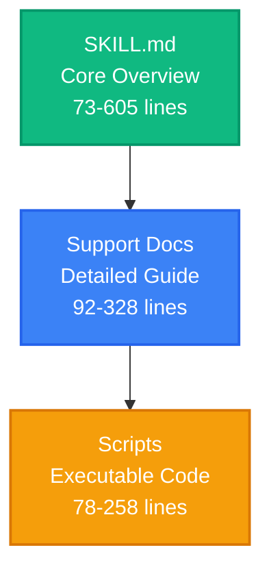
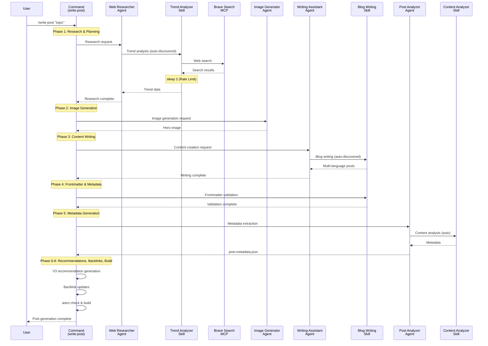
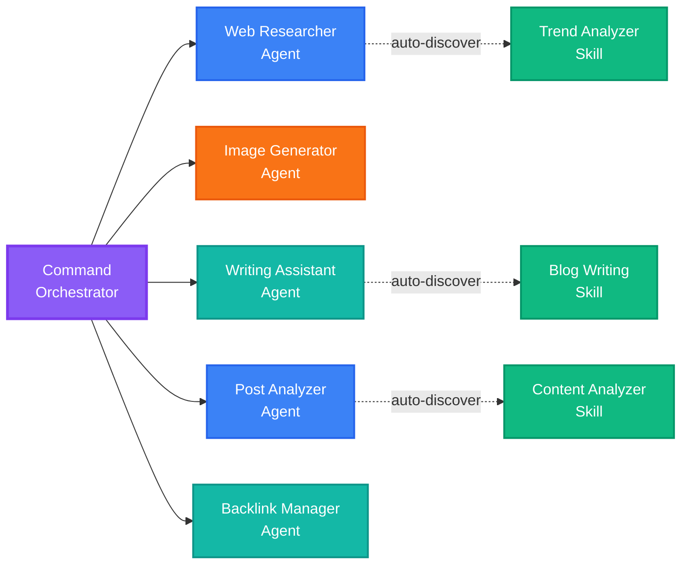
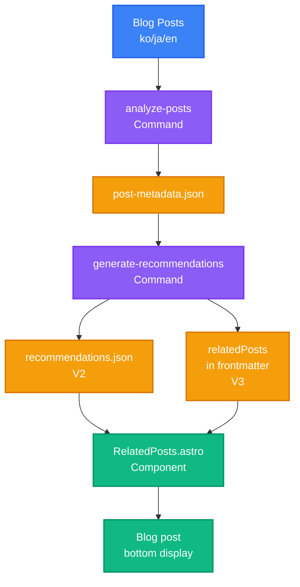
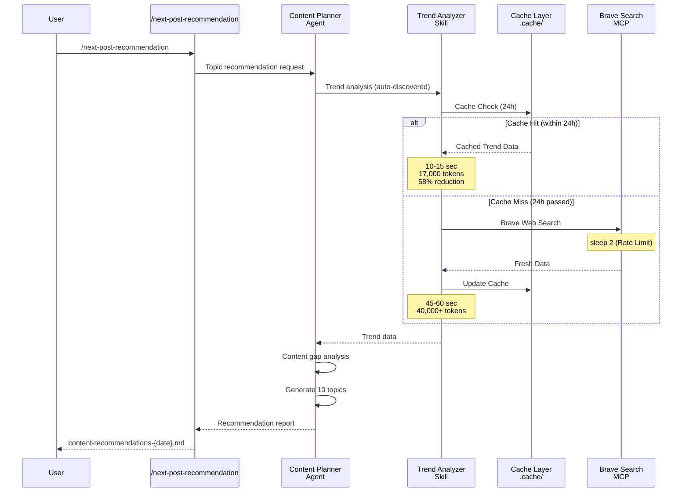

## Series Navigation

> <strong>EffiFlow Automation Architecture Analysis/Evaluation and Improvements Series</strong> (2/3)
>
> 1. [Part 1: 71% Cost Reduction with Metadata](/en/blog/en/effiflow-automation-analysis-part1) - 3-Tier Architecture and System Overview
> 2. <strong>Part 2: Skills and Commands Integration Strategy</strong> ← Current Article
> 3. [Part 3: Practical Improvement Cases and ROI Analysis](/en/blog/en/effiflow-automation-analysis-part3)

## Introduction

In Part 1, we explored EffiFlow's 3-Tier architecture (Agents → Skills → Commands) and the 71% cost reduction achieved through metadata-first strategy. In Part 2, we'll dive deep into the core of this system: <strong>Skills' auto-discovery mechanism</strong> and <strong>Commands' orchestration pattern</strong>.

The key questions are: "What's the difference between Model-Invoked and User-Invoked, and how did we achieve 58% token reduction?"

## Skills: Auto-Discovered Modular Functions

### What is Model-Invoked?

Skills operate in a <strong>Model-Invoked</strong> manner. This means Claude automatically activates them based on context without explicit user invocation.

For example, when a user mentions keywords like "blog post" or "frontmatter," Claude automatically loads the `blog-writing` Skill. It's like an expert automatically pulling out relevant tools upon hearing the conversation topic.

### SKILL.md Structure Analysis

Every Skill is defined by a `SKILL.md` file containing YAML frontmatter:

```yaml
---
name: blog-writing
description: Create SEO-optimized multi-language blog posts with proper frontmatter, hero images, and content structure. Use when writing blog posts, creating content, or managing blog metadata.
allowed-tools: [Read, Write, Edit, Bash, Grep, Glob]
---
```

<strong>Key Elements</strong>:

- <strong>name</strong>: Lowercase, hyphenated, under 64 characters
- <strong>description</strong>: Function description + usage timing ("Use when...")
- <strong>allowed-tools</strong>: Tool restrictions for enhanced security and read-only Skills

The "Use when..." phrase in the description is particularly important. Claude uses this to determine when to activate the Skill.

### 4 Implemented Skills in Detail

#### 1. blog-writing (666 lines)

<strong>File Structure</strong>:

- SKILL.md (73 lines): Core overview
- content-structure.md (328 lines): Post structure guide
- frontmatter-schema.md (173 lines): Schema detailed explanation
- seo-guidelines.md (92 lines): SEO optimization rules
- 3 Python scripts (464 lines): generate_slug.py, get_next_pubdate.py, validate_frontmatter.py

<strong>Core Functions</strong>:

- Frontmatter validation (date format, required fields, image paths)
- SEO optimization (language-specific title/description length limits)
  - Korean: title 40 chars, description 120 chars
  - English: title 60 chars, description 160 chars
  - Japanese: title 35 chars, description 110 chars
- Multi-language support (Korean, English, Japanese)
- Automatic slug generation and pubDate calculation

#### 2. content-analyzer (275 lines)

<strong>Output Metadata</strong>:

```json
{
  "summary": "100-150 character summary",
  "topics": ["topic1", "topic2", "topic3", "topic4", "topic5"],
  "techStack": ["tech1", "tech2", "tech3"],
  "difficulty": 3,
  "categoryScores": {
    "automation": 0.8,
    "web-development": 0.6,
    "ai-ml": 0.9,
    "devops": 0.3,
    "architecture": 0.5
  },
  "contentHash": "abc123..."
}
```

<strong>Token Efficiency</strong>:

- Full content analysis: ~40,000 tokens
- Metadata-based: ~12,000-16,000 tokens
- <strong>60-70% reduction</strong>

<strong>Incremental Processing</strong>: Change detection via Content Hash, preventing unnecessary re-analysis

#### 3. recommendation-generator (341 lines)

<strong>LLM-Based Semantic Recommendations</strong>:

Instead of traditional TF-IDF, we use Claude LLM for true meaning comprehension:

```
TF-IDF (Traditional)    →  LLM (Modern)
Keyword frequency       →  Full content understanding
Cosine similarity       →  Semantic similarity
Keyword overlap-based   →  Context-based recommendations
```

<strong>6-Dimensional Similarity Analysis</strong>:

- topic: Topic similarity (40%)
- techStack: Tech stack (25%)
- purpose: Purpose alignment (10%)
- complementary: Complementary relationship (10%)
- difficulty: Difficulty level (15%)
- category: Category alignment

<strong>Multi-Language Reasoning</strong>:

```json
{
  "reason": {
    "ko": "두 글 모두 MCP 서버를 활용한 브라우저 자동화...",
    "ja": "両記事ともMCPサーバーを活用したブラウザ自動化...",
    "en": "Both posts cover MCP server-based browser automation..."
  }
}
```

#### 4. trend-analyzer (605 lines)

<strong>Brave Search MCP Integration</strong>:

```bash
# Mandatory 2-second delay after each search (Rate Limit compliance)
brave_web_search "AI automation tools 2025"
sleep 2
brave_web_search "Claude Code trends 2025"
sleep 2
```

<strong>Caching Strategy</strong>:

| Data Type       | Cache Period | File Location               | Effect                              |
| --------------- | ------------ | --------------------------- | ----------------------------------- |
| Trend data      | 24 hours     | .cache/trend-data.json      | Prevents same-day repeated searches |
| Technology data | 7 days       | .cache/technology-data.json | Weekly deduplication                |
| Keyword data    | 48 hours     | .cache/keyword-data.json    | 2-day reuse                         |

<strong>Performance Comparison</strong>:

**Before (Pre-caching)**:

- Every Brave Search call
- 40,000+ tokens
- Cost: ~$0.05/run

**After (Post-caching)**:

- Cache reuse within 24 hours
- 17,000 tokens
- Cost: ~$0.02/run
- <strong>58% reduction</strong>

### Progressive Disclosure Pattern

Skills use a layered context provision approach:



<strong>Effect</strong>: Load only what's needed, maximizing context efficiency

## Commands: User-Invoked Workflow Orchestrators

### What is User-Invoked?

Commands operate in a <strong>User-Invoked</strong> manner. Users explicitly call them with `/command` slash notation, passing arguments via `$ARGUMENTS`.

```bash
/write-post "Claude Code MCP Integration Guide"
/analyze-posts --force
/next-post-recommendation --count 10
```

### Complexity Distribution

| Complexity                 | Commands                                                                                              | Average Lines |
| -------------------------- | ----------------------------------------------------------------------------------------------------- | ------------- |
| <strong>Very High</strong> | write-post (1,080 lines), write-post-ko (1,063 lines), write-ga-post (745 lines)                      | 963 lines     |
| <strong>High</strong>      | analyze-posts (444 lines), generate-recommendations (514 lines), next-post-recommendation (551 lines) | 503 lines     |
| <strong>Low</strong>       | commit (11 lines)                                                                                     | 11 lines      |

### Phase-Based Execution Pattern

Complex Commands are divided into clear Phases. Let's examine `write-post`'s 8 Phases:



<strong>Phase Details</strong>:

**Phase 1: Research & Planning**

- Web Researcher agent invocation
- Trend Analyzer Skill auto-discovery
- Latest information gathering via Brave Search MCP
- 2-second delay for Rate Limit compliance

**Phase 2: Image Generation**

- Image Generator agent
- Gemini API usage (requires GEMINI_API_KEY)
- Topic-based hero image generation

**Phase 3: Content Writing**

- Writing Assistant agent
- Blog Writing Skill auto-discovery
- Simultaneous creation in Korean, Japanese, English
- Localization (not translation)

**Phase 4: Frontmatter & Metadata**

- Frontmatter validation via Blog Writing Skill
- pubDate: 'YYYY-MM-DD' format (single quotes)
- heroImage: Relative path validation

**Phase 5: Metadata Generation**

- Post Analyzer agent
- Content Analyzer Skill auto-activation
- difficulty (1-5) and categoryScores calculation

**Phase 6: V3 Recommendations**

- scripts/generate-recommendations-v3.js execution
- Metadata-based similarity calculation
- Top 5 related posts selection

**Phase 7: Backlink Updates**

- Backlink Manager agent (optional)
- Related posts cross-linking

**Phase 8: Validation & Build**

- npm run astro check
- npm run build
- File paths and metadata summary return

### Agent Orchestration Pattern

Commands act as orchestrators, delegating actual work to Agents:



<strong>Effects</strong>:

- <strong>Separation of Concerns</strong>: Command defines workflow only
- <strong>Reusability</strong>: Agents and Skills used across multiple Commands
- <strong>Maintainability</strong>: Independent modification of each component
- <strong>Testability</strong>: Testing possible per layer

## Caching Strategy: 58% Token Reduction Mechanism

### trend-analyzer's 3-Tier Caching

The trend-analyzer Skill caches three types of data for different periods:

```typescript
// Caching algorithm (pseudo-code)
async function getTrendData(topic: string) {
  const cacheKey = `trend-${topic}`;
  const cached = cache.get(cacheKey);

  // Cache hit: Within validity period
  if (cached && !isExpired(cached, 24 * 60 * 60)) {
    console.log("Cache hit: Returning cached data");
    return cached.data; // Immediate return, no API call
  }

  // Cache miss: New search needed
  console.log("Cache miss: Fetching from Brave Search");
  const data = await braveSearch(topic);
  await sleep(2000); // Rate Limit compliance

  // Cache save
  cache.set(cacheKey, {
    data,
    timestamp: Date.now(),
    expiresAt: Date.now() + 24 * 60 * 60 * 1000,
  });

  return data;
}
```

### Cache Effect Scenarios

**Scenario 1: Multiple Topic Searches Same Day**

```bash
# First topic (cache miss)
/next-post-recommendation --category ai-ml
# → Brave Search calls: 15 times
# → Duration: 45-60 seconds
# → Tokens: 40,000+

# Second topic (80% cache hit)
/next-post-recommendation --category web-development
# → Brave Search calls: 3 times (new queries only)
# → Duration: 10-15 seconds
# → Tokens: 17,000 (58% reduction)
```

**Scenario 2: Same Topic Next Day**

```bash
# 24 hours passed (cache expired)
/next-post-recommendation --category ai-ml
# → Brave Search calls again: 15 times
# → Reflects latest trends
```

### Performance Comparison Table

| Item                         | Pre-caching | Post-caching  | Reduction |
| ---------------------------- | ----------- | ------------- | --------- |
| <strong>Token Usage</strong> | 40,000+     | 17,000        | 58%       |
| <strong>API Calls</strong>   | 15 times    | 3 times (avg) | 80%       |
| <strong>Duration</strong>    | 45-60 sec   | 10-15 sec     | 75%       |
| <strong>Cost</strong>        | ~$0.05      | ~$0.02        | 60%       |

## Integrated Workflow Practical Examples

### Example 1: Blog Post Creation (/write-post)

Visualizing the complete call chain:

```mermaid
flowchart TD
    Start([User: /write-post 'Claude Code MCP']) --> CMD{Command<br/>write-post}

    CMD --> P1[Phase 1: Research & Planning]
    P1 --> WR[Web Researcher Agent]
    WR --> TA[Trend Analyzer Skill<br/>auto-discovered]
    TA --> BS[Brave Search MCP]
    BS --> Sleep1[sleep 2<br/>Rate Limit]
    Sleep1 --> Cache1{Cache<br/>Check}
    Cache1 -->|Hit| Return1[Cached Data<br/>17K tokens]
    Cache1 -->|Miss| Search1[New Search<br/>40K+ tokens]
    Search1 --> Return1
    Return1 --> P1Done[Research Complete]

    P1Done --> P2[Phase 2: Image Generation]
    P2 --> IG[Image Generator Agent]
    IG --> Gemini[Gemini API]
    Gemini --> P2Done[Hero Image Saved]

    P2Done --> P3[Phase 3: Content Writing]
    P3 --> WA[Writing Assistant Agent]
    WA --> BW[Blog Writing Skill<br/>auto-discovered]
    BW --> Multi[3 language posts<br/>ko, ja, en]
    Multi --> P3Done[Content Created]

    P3Done --> P4[Phase 4: Frontmatter]
    P4 --> Validate[Frontmatter validation]
    Validate --> P4Done[Validation Pass]

    P4Done --> P5[Phase 5: Metadata]
    P5 --> PA[Post Analyzer Agent]
    PA --> CA[Content Analyzer Skill<br/>auto]
    CA --> Hash{Content<br/>Hash}
    Hash -->|Changed| Analyze[New Analysis<br/>12K tokens]
    Hash -->|Unchanged| Skip[Skip Analysis<br/>0 tokens]
    Analyze --> P5Done[Metadata Saved]
    Skip --> P5Done

    P5Done --> P6[Phase 6: Recommendations]
    P6 --> Script[generate-recommendations-v3.js]
    Script --> Sim[Similarity Calculation]
    Sim --> P6Done[Top 5 Related Posts]

    P6Done --> P7[Phase 7: Backlinks]
    P7 --> BM[Backlink Manager]
    BM --> Update[Update Related Posts]
    Update --> P7Done[Cross-links Created]

    P7Done --> P8[Phase 8: Build]
    P8 --> Check[astro check]
    Check --> Build[npm run build]
    Build --> End([Posts Published])

    style Start fill:#8B5CF6,stroke:#7C3AED,stroke-width:2px,color:#fff
    style CMD fill:#8B5CF6,stroke:#7C3AED,stroke-width:3px,color:#fff
    style WR fill:#3B82F6,stroke:#2563EB,stroke-width:2px,color:#fff
    style IG fill:#F97316,stroke:#EA580C,stroke-width:2px,color:#fff
    style WA fill:#14B8A6,stroke:#0D9488,stroke-width:2px,color:#fff
    style PA fill:#3B82F6,stroke:#2563EB,stroke-width:2px,color:#fff
    style BM fill:#14B8A6,stroke:#0D9488,stroke-width:2px,color:#fff
    style TA fill:#10B981,stroke:#059669,stroke-width:2px,color:#fff
    style BW fill:#10B981,stroke:#059669,stroke-width:2px,color:#fff
    style CA fill:#10B981,stroke:#059669,stroke-width:2px,color:#fff
    style Cache1 fill:#F59E0B,stroke:#D97706,stroke-width:2px,color:#fff
    style Return1 fill:#F59E0B,stroke:#D97706,stroke-width:2px,color:#fff
    style End fill:#10B981,stroke:#059669,stroke-width:2px,color:#fff
```



<strong>Token Usage Analysis</strong>:

| Phase                  | Main Task       | Token Usage             | Optimization                       |
| ---------------------- | --------------- | ----------------------- | ---------------------------------- |
| Phase 1                | Web research    | 17,000 (cache hit)      | 58% reduction                      |
| Phase 3                | Content writing | 15,000                  | -                                  |
| Phase 5                | Metadata        | 12,000 (incremental)    | 70% reduction                      |
| Phase 6                | Recommendations | 3,000 (metadata-based)  | 60% reduction                      |
| <strong>Total</strong> |                 | <strong>47,000</strong> | <strong>63% avg reduction</strong> |

### Example 2: Metadata and Recommendation Pipeline



<strong>Data Flow</strong>:

1. <strong>/analyze-posts</strong>: Analyzes Korean posts only (3x cost reduction)

   - Change detection via Content Hash
   - Re-analyzes only changed posts
   - Updates post-metadata.json

2. <strong>/generate-recommendations</strong>: LLM-based semantic recommendations

   - Metadata-based analysis (60-70% token reduction)
   - 6-dimensional similarity calculation
   - V2: Generates recommendations.json (legacy)
   - V3: Directly adds to relatedPosts in frontmatter (current)

3. <strong>RelatedPosts Component</strong>: Displays recommendations on blog posts

### Example 3: Trend-Based Topic Recommendations

Caching utilization flow:



## $ARGUMENTS Usage Patterns

Commands support flexible argument passing via `$ARGUMENTS`.

### Simple Pattern (analyze-posts)

```markdown
/analyze-posts $ARGUMENTS

# Usage examples

/analyze-posts --force # Full regeneration
/analyze-posts --post my-slug # Specific post only
/analyze-posts --verify # Verification mode
```

### Complex Pattern (write-post)

```markdown
Topic: $ARGUMENTS

# Parsing logic

topic = args[0] # First argument: topic
flags = parseFlags(args[1:]) # Rest: flags

# Usage examples

/write-post "Claude Code MCP Integration Guide" --tags ai,mcp,automation --languages ko,ja
```

<strong>Flag Parsing Example</strong>:

```typescript
function parseArguments(args: string[]) {
  const result = {
    topic: args[0],
    tags: [],
    languages: ["ko", "ja", "en"], // Default
    description: "",
  };

  for (let i = 1; i < args.length; i++) {
    if (args[i] === "--tags" && args[i + 1]) {
      result.tags = args[i + 1].split(",");
      i++;
    } else if (args[i] === "--languages" && args[i + 1]) {
      result.languages = args[i + 1].split(",");
      i++;
    } else if (args[i] === "--description" && args[i + 1]) {
      result.description = args[i + 1];
      i++;
    }
  }

  return result;
}
```

## Practical Application Guide

### Creating a Skill (Step-by-Step)

<strong>Step 1: Create Directory</strong>

```bash
mkdir -p .claude/skills/my-skill
cd .claude/skills/my-skill
```

<strong>Step 2: Write SKILL.md</strong>

```markdown
---
name: my-skill
description: Brief description of what this skill does. Use when [specific trigger condition].
allowed-tools: [Read, Write, Bash]
---

# My Skill

## Core Capabilities

1. **Feature 1**: Description
2. **Feature 2**: Description

## Workflow

### Phase 1: Input Processing

...

### Phase 2: Main Logic

...

### Phase 3: Output Generation

...

## Examples

...
```

<strong>Step 3: Add Support Files (Optional)</strong>

```bash
# Detailed guide
touch detailed-guide.md

# Scripts
mkdir scripts
touch scripts/helper.py
```

<strong>Step 4: Test</strong>

```bash
# Use trigger keywords in conversation with Claude
"Please use my-skill to process this data..."
```

### Creating a Command (Step-by-Step)

<strong>Step 1: Create File</strong>

```bash
touch .claude/commands/my-command.md
```

<strong>Step 2: Define Workflow</strong>

```markdown
# My Command

Execute [specific workflow] with [parameters].

## Usage

\`\`\`bash
/my-command $ARGUMENTS
\`\`\`

## Arguments

- \`<required>\`: Description
- \`--optional\`: Description

## Workflow

### Phase 1: Preparation

1. Parse arguments
2. Validate inputs
3. Load dependencies

### Phase 2: Execution

1. Call Agent A
2. Process results
3. Call Agent B

### Phase 3: Finalization

1. Validate outputs
2. Save results
3. Return summary

## Example

\`\`\`bash
/my-command "input" --flag value
\`\`\`

## Output

...

## Related Files

- Agent: `.claude/agents/my-agent.md`
- Skill: `.claude/skills/my-skill/SKILL.md`
```

<strong>Step 3: Agent Invocation Pattern</strong>

```markdown
### Phase 2: Main Processing

Delegate to specialized agent:

\`\`\`
@my-agent "Process this data with specific instructions"
\`\`\`

The agent will:

1. Automatically discover relevant skills
2. Execute the workflow
3. Return structured results
```

<strong>Step 4: Test</strong>

```bash
# Execute Command in conversation with Claude
/my-command "test input" --verbose
```

## Performance Optimization Techniques

### 1. Caching (58% Reduction)

<strong>Implementation</strong>:

```typescript
interface CacheEntry {
  data: any;
  timestamp: number;
  expiresAt: number;
}

class SimpleCache {
  private cache: Map<string, CacheEntry> = new Map();

  set(key: string, data: any, ttlSeconds: number) {
    this.cache.set(key, {
      data,
      timestamp: Date.now(),
      expiresAt: Date.now() + ttlSeconds * 1000,
    });
  }

  get(key: string): any | null {
    const entry = this.cache.get(key);
    if (!entry) return null;

    if (Date.now() > entry.expiresAt) {
      this.cache.delete(key);
      return null;
    }

    return entry.data;
  }
}
```

<strong>Expiration Policy</strong>:

- Trend data: 24 hours (changes quickly)
- Technical docs: 7 days (weekly updates)
- Keywords: 48 hours (medium speed)

### 2. Incremental Processing (70% Reduction)

<strong>Content Hash Implementation</strong>:

```typescript
import crypto from "crypto";

function calculateContentHash(content: string): string {
  return crypto.createHash("sha256").update(content).digest("hex");
}

async function incrementalAnalysis(post: BlogPost) {
  const currentHash = calculateContentHash(post.content);
  const existingMetadata = await loadMetadata(post.slug);

  // Change detection
  if (existingMetadata?.contentHash === currentHash) {
    console.log(`Skipping ${post.slug}: No changes`);
    return existingMetadata; // Reuse existing metadata
  }

  // Changed: Re-analysis needed
  console.log(`Analyzing ${post.slug}: Content changed`);
  const metadata = await analyzeContent(post);
  metadata.contentHash = currentHash;

  await saveMetadata(post.slug, metadata);
  return metadata;
}
```

<strong>Effect Measurement</strong>:

| Scenario                   | Before        | After         | Reduction            |
| -------------------------- | ------------- | ------------- | -------------------- |
| 1 new post                 | 3,000 tokens  | 3,000 tokens  | 0%                   |
| 13 existing + 1 new        | 42,000 tokens | 3,000 tokens  | 93%                  |
| Full re-analysis (--force) | 42,000 tokens | 42,000 tokens | 0%                   |
| <strong>Average</strong>   |               |               | <strong>70%</strong> |

### 3. Parallel Execution (Preview)

Will be covered in detail in Part 3:

```typescript
// Sequential processing (current)
for (const post of posts) {
  await analyzePost(post); // 2 minutes
}

// Parallel processing (improvement)
await Promise.all(posts.map((post) => analyzePost(post))); // 30 seconds (70% faster)
```

## Best Practices

### Skills Creation

✅ <strong>SKILL.md Required</strong>

- Recommended under 100 lines (separate support docs if longer)
- High-quality YAML frontmatter

✅ <strong>Clear description</strong>

- Include "Use when..." phrase
- Specify trigger conditions

✅ <strong>Limit permissions with allowed-tools</strong>

- Security: Exclude unnecessary tools
- Read-only Skills: [Read, Grep, Glob] only

✅ <strong>Progressive Disclosure</strong>

- SKILL.md: Core overview
- Support docs: Detailed guides
- Scripts: Execution logic

### Commands Creation

✅ <strong>Phase-Based Execution</strong>

- Clear step separation
- Phase 1-8 format

✅ <strong>Agent Delegation Pattern</strong>

- Command as orchestrator only
- Actual work to Agents

✅ <strong>Include Validation Step</strong>

- End of Phase: Always validate
- Run astro check, build

✅ <strong>Error Handling</strong>

- Specify prerequisites
- Provide recovery methods on failure

## Next in the Series

### Part 3: Practical Improvement Cases and ROI Analysis

<strong>Topics to Cover</strong>:

1. <strong>Parallel Processing Implementation</strong> (70% time reduction)

   - Using Promise.all
   - Concurrent execution control
   - Error handling

2. <strong>Automated Testing</strong> (Quality assurance)

   - Skill unit tests
   - Command integration tests
   - CI/CD integration

3. <strong>Retry Logic</strong> (Improved stability)

   - Web search failure recovery
   - Exponential Backoff
   - Partial failure handling

4. <strong>ROI Analysis</strong> (Investment vs Effect)

   - Development time investment
   - Cost savings calculation
   - Break-Even Point

5. <strong>Top 3 Quick Wins</strong> (Immediately applicable)
   - Dry-Run mode
   - Interactive mode
   - Cost Tracking Dashboard

<strong>Expected Results</strong>:

- Processing time: 2 min → 30 sec (75% reduction)
- Test coverage: 0% → 80%
- Stability: 95% → 99%

## Conclusion

In Part 2, we deeply analyzed the core integration strategy of Skills and Commands in EffiFlow.

<strong>Key Insights</strong>:

1. <strong>Skills Auto-Discovery</strong>: Model-Invoked with context-based activation
2. <strong>Commands Orchestration</strong>: User-Invoked, Phase-based execution, Agent delegation
3. <strong>58% Reduction via Caching</strong>: 3-Tier caching strategy (24h/7d/48h)
4. <strong>Progressive Disclosure</strong>: Maximized efficiency with layered context
5. <strong>Metadata-First</strong>: 60-70% token reduction

<strong>Practical Applications</strong>:

- `/write-post`: 8-Phase complete automation
- `/analyze-posts`: 70% reduction with incremental processing
- `/next-post-recommendation`: 58% reduction with caching

In Part 3, we'll further improve this architecture to achieve 75% faster processing, 80% test coverage, and 99% stability through practical improvement cases.

EffiFlow's innovation continues. See you in the next part! 🚀
