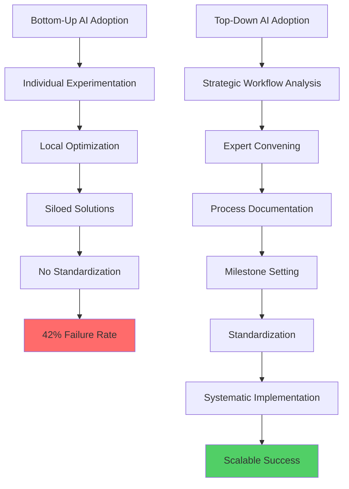

# Why Top-Down AI Adoption Works: The Real Reason Behind the 42% Failure Rate

In 2025, enterprise AI adoption has become a paradox. While companies pour billions into AI initiatives, the failure rates are alarmingly high. According to S&P Global Market Intelligence, <strong>42% of companies abandoned most of their AI initiatives before reaching production</strong> — a dramatic surge from just 17% the previous year. This isn't just a statistical anomaly; it's a wake-up call about how organizations approach technological transformation.

## The Brutal Reality: Why AI Projects Fail

The enthusiasm around generative AI has created a gold rush mentality, but the graveyard of failed AI projects tells a different story:

- <strong>S&P Global (2025)</strong>: 42% of AI projects never make it to production
- <strong>MIT Research</strong>: 95% of AI pilots fail to achieve revenue acceleration
- <strong>Gartner Prediction</strong>: By end of 2025, 50% of generative AI projects will be abandoned at the pilot stage

These aren't just numbers — they represent billions in wasted investment and countless hours of organizational effort. But more importantly, they reveal a fundamental misunderstanding about what makes AI adoption succeed.

### The Three Usual Suspects

Most post-mortems blame three familiar culprits:

1. <strong>Data Quality Issues</strong>: "Our data wasn't clean enough"
2. <strong>Integration Complexity</strong>: "It didn't play well with our existing systems"
3. <strong>Unclear Value Proposition</strong>: "We couldn't demonstrate ROI"

While these are valid challenges, they're symptoms, not root causes. The real problem runs deeper.

## The Hidden Divide: Leadership vs. Frontline Reality

Recent research by Writer reveals a troubling disconnect. There's an <strong>18 percentage point trust gap</strong> between senior executives and frontline employees when it comes to AI:

- <strong>Senior Executives</strong>: 71% trust in AI initiatives
- <strong>Frontline Employees</strong>: 53% trust in AI initiatives

This isn't just about skepticism — it's about fundamentally different perspectives on what AI can and should do.

### Why Bottom-Up Fails: The Uncomfortable Truth

Here's where we need to confront an uncomfortable reality: <strong>humans are not inherently rational decision-makers</strong>, and most people don't naturally work toward organizational growth or improvement.

Before you close this tab in disagreement, consider:

- People optimize for <strong>personal convenience</strong>, not organizational efficiency
- Employees resist change that threatens <strong>their established workflows</strong>, even if objectively better
- Individual incentives rarely align perfectly with <strong>organizational transformation goals</strong>
- Short-term comfort consistently wins over <strong>long-term optimization</strong>

This isn't cynicism — it's acknowledging human nature. And it's why bottom-up AI adoption, despite its democratic appeal, has inherent limitations.

## The BCG Formula: 10-20-70

Boston Consulting Group's research on successful AI implementations reveals a counterintuitive finding. Companies that actually scale AI successfully follow the <strong>10-20-70 principle</strong>:

- <strong>10%</strong>: Investment in AI algorithms and models
- <strong>20%</strong>: Technology infrastructure and data quality
- <strong>70%</strong>: People, processes, and cultural transformation

Yes, you read that correctly. The smallest investment goes to the actual AI technology. The vast majority goes to the human and organizational aspects.

McKinsey echoes this finding even more bluntly: <strong>The biggest barrier to AI success is leadership</strong> — not technology, not data, but how leaders approach organizational change.

## Why Top-Down Is Necessary (Not Just Better)

The case for top-down AI adoption isn't about authoritarianism or ignoring employee input. It's about <strong>systematic workflow transformation</strong> that bottom-up approaches simply cannot achieve.

### The Top-Down Playbook

<strong>Step 1: Workflow Owners Lead</strong>

Those who truly understand the workflow — not necessarily the executives, but the subject matter experts — must take the reins. This means:

- Identifying end-to-end processes, not just individual tasks
- Understanding dependencies and bottlenecks
- Recognizing where AI genuinely adds value vs. where it's performative

<strong>Step 2: Convene the Right Experts</strong>

This isn't about "getting buy-in." It's about assembling people who can:

- Map current workflows with brutal honesty
- Identify pain points without political filtering
- Envision AI-enhanced processes realistically

<strong>Step 3: Document Ruthlessly</strong>

Success requires documentation at three levels:

1. <strong>Current State</strong>: How things actually work (not how they're supposed to work)
2. <strong>Transition State</strong>: Specific changes AI will enable
3. <strong>Future State</strong>: New workflows with AI integration

<strong>Step 4: Set Measurable Milestones</strong>

Vague goals like "improve efficiency" doom projects. Instead:

- Define specific KPIs before implementation
- Establish checkpoints at 30, 60, 90 days
- Build in feedback loops that allow course correction

<strong>Step 5: Standardize and Enforce</strong>

Here's where top-down becomes essential. Once the optimal workflow is defined:

- Implement it organization-wide
- Provide comprehensive training
- Monitor adoption rigorously
- Address resistance systematically

This isn't optional. Without standardization, you get 42% failure rates.

## The Leadership Imperative

Internal power struggles, as noted in the Writer report, are a primary cause of AI project abandonment. This happens when:

- Different departments pursue competing AI initiatives
- No clear ownership exists for cross-functional workflows
- Political considerations override technical merit

Top-down leadership cuts through this by:

- Establishing clear authority structures
- Aligning incentives across departments
- Making strategic bets and sticking to them

## Case Study: The 70% Productivity Gain

BCG documented a financial services company that achieved <strong>over 50% productivity gains</strong> in lending workflows by following this approach:

- <strong>Cut manual processing time by 70%</strong>
- <strong>Reduced approval cycles from days to under 30 minutes</strong>
- <strong>Achieved scalable, repeatable results</strong>

The key? They invested heavily in <strong>people and process transformation</strong>, not just technology deployment.

## The Paradox of Choice vs. Structure

Here's the fundamental tension: employees want autonomy, but organizational transformation requires structure. The solution isn't to choose one over the other — it's to recognize when each is appropriate.

Bottom-up works for:
- Incremental improvements to existing processes
- Individual productivity enhancements
- Innovation exploration and experimentation

Top-down is necessary for:
- Fundamental workflow redesign
- Cross-functional transformation
- Scalable, organization-wide change

## Conclusion: Avoiding the 42%

If you want to avoid becoming part of the 42% failure statistic, you need to:

1. <strong>Acknowledge human nature</strong>: People won't spontaneously optimize for organizational goals
2. <strong>Invest in the 70%</strong>: People and processes matter more than algorithms
3. <strong>Document systematically</strong>: Workflows, milestones, success metrics
4. <strong>Standardize deliberately</strong>: Define the optimal process, then enforce it
5. <strong>Lead from the top</strong>: Provide clear direction, authority, and accountability

The bottom line: AI adoption isn't a technology problem. It's a <strong>leadership and organizational change management challenge</strong>. Companies that recognize this — and act accordingly — don't just avoid the 42% failure rate. They achieve the transformative results AI promises.

The question isn't whether to adopt AI top-down or bottom-up. The question is whether you're willing to do what actually works.

---

<strong>Sources:</strong>

- [S&P Global Market Intelligence (2025): AI Adoption Report](https://www.spglobal.com/market-intelligence/en/news-insights/research/ai-experiences-rapid-adoption-but-with-mixed-outcomes-highlights-from-vote-ai-machine-learning)
- [Boston Consulting Group: Closing the AI Impact Gap](https://www.bcg.com/publications/2025/closing-the-ai-impact-gap)
- [McKinsey: AI Success and Leadership](https://www.mckinsey.com/)
- [Gartner: Generative AI Predictions](https://www.gartner.com/)
- [Writer: AI Trust Gap Report](https://writer.com/)
