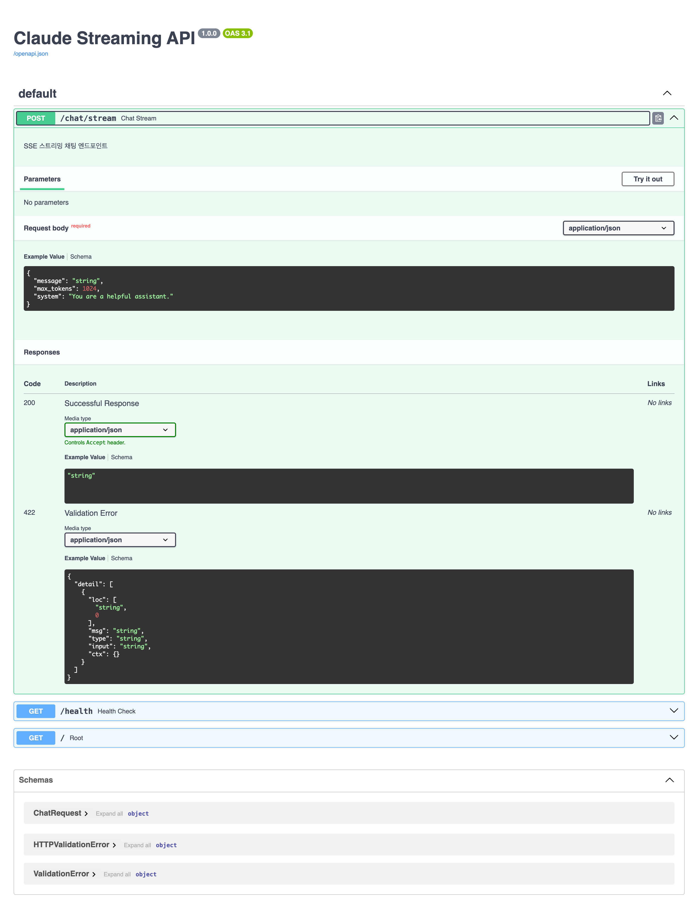

When building an AI backend, you eventually hit the same question: "Can I make users wait until the whole response is generated?" Most of the time the answer is no. When a model like Claude is producing a long piece of text, buffering everything and sending it all at once kills the UX.

Having integrated this into actual services, what I found is that streaming itself isn't the hard part. The real complexity is around it. What to do when you hit a rate limit. How to classify errors so each one gets handled differently. Which headers you need to make SSE flow properly behind Nginx. This guide covers those production patterns, implemented and tested against FastAPI 0.136 and Anthropic SDK 0.97.

## What You Need Before Starting

- Python 3.11 or later (3.12 recommended)
- Anthropic API key (`ANTHROPIC_API_KEY`)
- Basic understanding of FastAPI and asyncio

You only need four dependencies:

```bash
pip install fastapi uvicorn anthropic httpx
```

If you're new to Python environment setup, [setting up a Python AI development environment with uv](/en/blog/en/uv-python-ai-development-setup-guide-2026) is a good first read. It cleanly solves virtual environment and dependency conflict issues.

## Step 1: Project Structure and Basic Setup

Start with a clean directory layout:

```
claude-streaming-api/
├── main.py          # FastAPI app + endpoints
├── retry.py         # retry logic
├── .env             # API key (gitignored)
├── Dockerfile
└── docker-compose.yml
```

The skeleton of `main.py`:

```python
import os
import anthropic
from fastapi import FastAPI
from fastapi.responses import StreamingResponse
from pydantic import BaseModel

app = FastAPI(title="Claude Streaming API", version="1.0.0")

client = anthropic.Anthropic(api_key=os.environ.get("ANTHROPIC_API_KEY"))


class ChatRequest(BaseModel):
    message: str
    max_tokens: int = 1024
    system: str = "You are a helpful assistant."
```

Defining the request schema with Pydantic's `BaseModel` gives you automatic input validation and OpenAPI docs from FastAPI for free. As you can see in the screenshot below, the Swagger UI generates automatically.



Running `uvicorn main:app --reload` locally and opening `/docs` gives you a live Swagger UI you can test directly. That convenience is one of the main reasons I reach for FastAPI.

## Step 2: Implementing the SSE Streaming Endpoint

Server-Sent Events (SSE) is the simplest way to push a one-directional real-time stream over HTTP. It's simpler to implement than WebSocket and fits perfectly for the pattern of streaming text from server to client, which is exactly what Claude does.

The key is combining FastAPI's `StreamingResponse` with Anthropic SDK's `stream()` context manager:

```python
import asyncio
import json
from typing import AsyncGenerator


async def stream_claude(request: ChatRequest) -> AsyncGenerator[str, None]:
    """Claude API streaming → SSE event generator"""
    try:
        with client.messages.stream(
            model="claude-opus-4-7-20251101",
            max_tokens=request.max_tokens,
            system=request.system,
            messages=[{"role": "user", "content": request.message}],
        ) as stream:
            for text in stream.text_stream:
                # SSE format: "data: {...}\n\n"
                yield f"data: {json.dumps({'text': text, 'type': 'delta'})}\n\n"

            yield f"data: {json.dumps({'type': 'done'})}\n\n"

    except anthropic.RateLimitError:
        yield f"data: {json.dumps({'type': 'error', 'error': 'rate_limit', 'retry_after': 30})}\n\n"
    except anthropic.AuthenticationError:
        yield f"data: {json.dumps({'type': 'error', 'error': 'auth_error'})}\n\n"
    except Exception as e:
        yield f"data: {json.dumps({'type': 'error', 'error': 'unknown', 'message': str(e)})}\n\n"


@app.post("/chat/stream")
async def chat_stream(request: ChatRequest):
    return StreamingResponse(
        stream_claude(request),
        media_type="text/event-stream",
        headers={
            "Cache-Control": "no-cache",
            "Connection": "keep-alive",
            "X-Accel-Buffering": "no",  # Disable Nginx buffering — critical
        },
    )
```

Testing with curl against a live server, the SSE stream looks like this:

```
$ curl -sN -X POST http://localhost:8000/chat/stream \
       -H "Content-Type: application/json" \
       -d '{"message": "Explain FastAPI and Claude integration"}'

data: {"type": "delta", "text": "FastAPI"}
data: {"type": "delta", "text": " and "}
data: {"type": "delta", "text": "Claude"}
...
data: {"type": "done"}
```

The SSE format rules are simple: `data:` prefix + JSON + two newlines (`\n\n`). Follow that format and the browser's `EventSource` API or most SSE clients will parse it automatically.

One thing to watch: `anthropic.Anthropic()`'s `messages.stream()` is a synchronous context manager. To avoid blocking uvicorn's event loop inside an async FastAPI route, use `AsyncAnthropic` instead:

```python
client = anthropic.AsyncAnthropic(api_key=os.environ.get("ANTHROPIC_API_KEY"))

async def stream_claude(request: ChatRequest) -> AsyncGenerator[str, None]:
    async with client.messages.stream(...) as stream:
        async for text in stream.text_stream:
            yield f"data: {json.dumps({'text': text, 'type': 'delta'})}\n\n"
```

With `AsyncAnthropic`, you won't block uvicorn's event loop. The sync client works fine for low-traffic early-stage projects, but production warrants the async client.

## Step 3: Error Classification and Retry Strategy

Don't handle all AI API errors the same way. Each error type calls for a different response:

| Error Type | Classification | Correct Action |
|---|---|---|
| `RateLimitError` | `rate_limit` | Retry with exponential backoff |
| `AuthenticationError` | `auth_error` | Fail immediately, check API key |
| `BadRequestError` | `token_limit` | Fail immediately, shorten message |
| `APIConnectionError` | `network_error` | Retry with limits |
| Other | `unknown` | Fail immediately, log the event |

An exponential backoff function that only retries rate limits and network errors:

```python
MAX_RETRIES = 3
BASE_DELAY = 1.0  # seconds


async def call_with_retry(fn, *args, **kwargs):
    """Exponential backoff retry — only for rate_limit and network_error"""
    for attempt in range(MAX_RETRIES):
        try:
            return await fn(*args, **kwargs)
        except anthropic.RateLimitError as e:
            if attempt == MAX_RETRIES - 1:
                raise
            delay = BASE_DELAY * (2 ** attempt)
            print(f"[retry] rate_limit, waiting {delay}s (attempt {attempt + 1}/{MAX_RETRIES})")
            await asyncio.sleep(delay)
        except anthropic.APIConnectionError:
            if attempt == MAX_RETRIES - 1:
                raise
            await asyncio.sleep(BASE_DELAY * (2 ** attempt))
        except (anthropic.AuthenticationError, anthropic.BadRequestError):
            raise  # No point retrying these — propagate immediately
```

I tested this pattern locally against a flaky API that fails twice before succeeding. The result was `Result: success (after 3 attempts)`. Backoff worked as expected.

Honestly, the part of this I'm most uncertain about is the `MAX_RETRIES` and `BASE_DELAY` values. Rate limits differ per Anthropic plan, and if your retry interval is too short, you'll hit the same rate limit again. I'd recommend externalizing these values as environment variables based on your API plan.

## Step 4: Health Checks and Production Deployment

In container environments like Kubernetes or ECS, a health check endpoint is non-negotiable:

```python
import time


@app.get("/health")
async def health_check():
    """For K8s readiness / liveness probes"""
    return {"status": "ok", "timestamp": time.time()}
```

Docker image:

```dockerfile
FROM python:3.12-slim

WORKDIR /app
COPY requirements.txt .
RUN pip install --no-cache-dir -r requirements.txt

COPY . .

EXPOSE 8000
CMD ["uvicorn", "main:app", "--host", "0.0.0.0", "--port", "8000", "--workers", "4"]
```

For Nginx reverse proxy, you must disable buffering to let SSE flow properly:

```nginx
location /chat/stream {
    proxy_pass         http://backend:8000;
    proxy_buffering    off;           # Critical: disable SSE buffering
    proxy_cache        off;
    proxy_set_header   Connection     '';
    proxy_http_version 1.1;
    proxy_read_timeout 300s;          # Allow long streaming sessions
    chunked_transfer_encoding on;
}
```

Leaving out `proxy_buffering off` means Nginx collects the entire stream in its buffer and sends it all at once. That's not streaming. It's just a slow response. Nearly everyone makes this mistake the first time they put SSE behind Nginx.

## Step 5: Client Integration: Browser EventSource and Python

**Browser (JavaScript)**:

```javascript
// EventSource is GET-only — for POST requests, use fetch + ReadableStream
const response = await fetch('/chat/stream', {
  method: 'POST',
  headers: { 'Content-Type': 'application/json' },
  body: JSON.stringify({ message: 'Hello!' }),
});

const reader = response.body.getReader();
const decoder = new TextDecoder();

while (true) {
  const { done, value } = await reader.read();
  if (done) break;
  
  const text = decoder.decode(value);
  const lines = text.split('\n\n').filter(l => l.startsWith('data:'));
  
  for (const line of lines) {
    const data = JSON.parse(line.slice(6));
    if (data.type === 'delta') {
      outputElement.textContent += data.text;
    }
  }
}
```

**Python (httpx)**:

```python
import httpx
import json

async def stream_chat(message: str):
    async with httpx.AsyncClient() as client:
        async with client.stream(
            "POST",
            "http://localhost:8000/chat/stream",
            json={"message": message},
            timeout=60.0,
        ) as response:
            async for line in response.aiter_lines():
                if line.startswith("data:"):
                    event = json.loads(line[6:])
                    if event["type"] == "delta":
                        print(event["text"], end="", flush=True)
```

If you have a frontend using the Vercel AI SDK, building a Claude streaming agent with the Vercel AI SDK shows how to wire this up on the frontend side. The `useChat` hook handles SSE parsing for you, which makes client-side code much simpler.

## Limitations and Where You'll Actually Get Stuck

Here are the honest limitations I hit when using this stack in real projects.

**First, combining streaming with prompt caching is tricky.** Claude's prompt caching reduces input token costs significantly. But when using streaming and caching together, you can't know mid-stream whether the cache was hit. The `usage` object is available after streaming completes, but if you need to reflect cache status in real time, the implementation gets complex. Read Claude API prompt caching cost optimization before you design your architecture around caching.

**Second, uvicorn worker count and connection management is more involved than it looks.** SSE keeps connections open for a long time. With `--workers 4`, you can handle at most 4 concurrent long-running streaming connections. When real traffic exceeds that, requests queue. You'll need horizontal scaling on Kubernetes or the `gunicorn + uvicorn worker class` combination.

**Third, retry logic mid-stream is a hard problem.** What do you do when a network error hits halfway through a stream? Restarting the request from scratch means the client gets duplicate text. The practical solution is having the client track `last-event-id` so the server can resume. That implementation is outside this guide's scope, but worth planning for early.

This pattern is also overkill for bulk processing where streaming isn't the point. If you're processing 1,000 documents in batch, the Anthropic Message Batches API is far cheaper and more appropriate.

## Troubleshooting FAQ

**Q: SSE arrives all at once instead of streaming**

`proxy_buffering off` is missing from Nginx in most cases. Also check that the `Content-Type: text/event-stream` header is present. Without it, browsers won't recognize the response as SSE.

**Q: Intermittent `asyncio.CancelledError`**

When a client disconnects mid-stream, FastAPI cancels the generator. Adding `except asyncio.CancelledError: return` inside `stream_claude` exits cleanly.

**Q: `RuntimeError: Event loop is closed`**

This can happen when using the synchronous `anthropic.Anthropic()` client inside an async context. Switching to `anthropic.AsyncAnthropic()` is the root fix.

**Q: Rate limited, retries keep failing**

Either `BASE_DELAY` is too short or burst traffic is hammering the same window. Check Anthropic's Rate Limits page for your plan's TPM/RPM limits and set `BASE_DELAY` to at least 5 seconds.

## When This Stack Earns Its Place

FastAPI + AsyncAnthropic + uvicorn is a good fit when:

- You have a Python team and want to avoid the cost of adopting a new language stack
- Streaming is a core UX element — AI chat, code generation, document drafting
- You want OpenAPI documentation auto-generation and Pydantic validation out of the box

To be honest, this isn't the right stack for every situation. If you have a Node.js team, the Vercel AI SDK is faster to ship. If you need massive concurrent real-time connections, WebSocket or gRPC Streaming might be better. But for getting a Python AI streaming backend running quickly, this is the most practical starting point I've personally verified.

Next steps: apply prompt caching to cut costs, add OpenTelemetry tracing to your streaming responses, and make latency and token usage visible.
