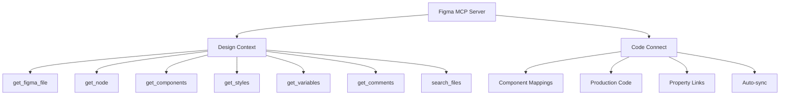
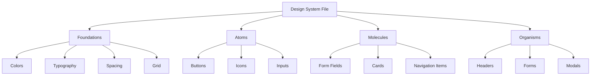
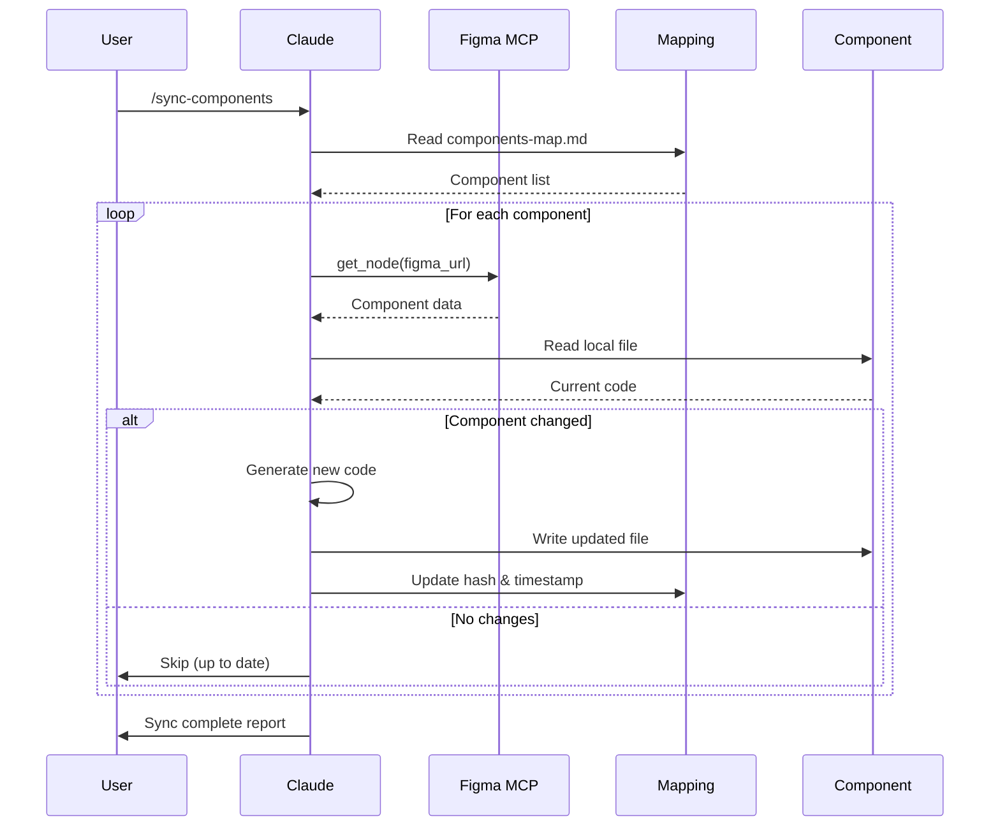
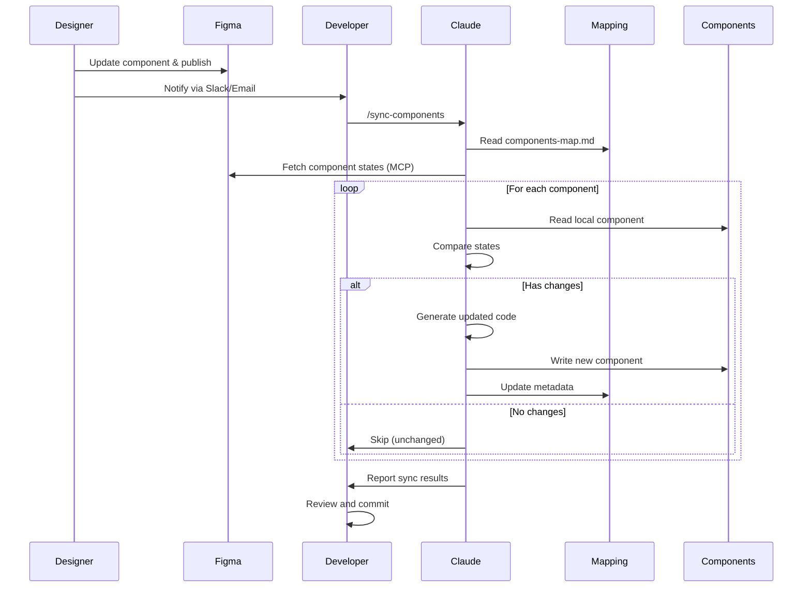

## Introduction

The gap between design and code has long been one of the most persistent challenges in modern web development. Designers craft beautiful interfaces in Figma, developers manually translate them into code, and inevitably, inconsistencies emerge. This manual process is time-consuming, error-prone, and difficult to maintain at scale.

In 2025, a powerful solution has emerged: <strong>Figma's Model Context Protocol (MCP)</strong> combined with <strong>vanilla JavaScript web components</strong> and <strong>continuous synchronization</strong>. This approach isn't just theoretical—it's battle-tested by companies like IBM, Uber, and GitHub.

This article presents a research-based approach to building a fully automated design-to-code pipeline, backed by real-world case studies and production-ready implementation patterns.

### Why This Matters

<strong>For Design System Teams:</strong>
- Single source of truth (Figma → Code)
- Automated synchronization reduces manual work by 60%
- Consistent visual language across products
- Version-controlled design decisions

<strong>For Developers:</strong>
- No more "inspect mode" guessing
- Production-ready code snippets from AI
- Framework-agnostic web components
- Automated component generation

<strong>For Organizations:</strong>
- Faster design-to-development handoff
- Reduced technical debt
- Better designer-developer collaboration
- Scalable design system architecture

## Understanding Figma MCP

### What is Model Context Protocol?

Model Context Protocol (MCP) is an open standard developed by Anthropic that enables AI assistants to access external tools and data sources with structured context. Figma's implementation allows AI agents to understand design files at a semantic level—not just as images, but as structured component data with properties, variants, and design tokens.

According to Figma's official documentation:

> "MCP is an open-source standard for how different AI agents and applications talk to one another, or to other external systems like Figma."

### Two Deployment Modes

#### Remote Server (Hosted by Figma)

<strong>Configuration:</strong>
- URL: `https://mcp.figma.com/mcp`
- OAuth-based authentication (one-click setup)
- No local installation required

<strong>Requirements:</strong>
- Professional/Organization/Enterprise plan with Dev seat
- Subject to Tier 1 Figma REST API rate limits

<strong>Best for:</strong>
- Production environments
- Team collaboration
- Enterprise deployments

#### Desktop Server (Local)

<strong>Configuration:</strong>
- Runs locally on `http://127.0.0.1:3845/mcp`
- Requires latest Figma desktop app
- Uses local authentication

<strong>Requirements:</strong>
- Available for all plan types
- Limited to 6 tool calls/month on Starter plan

<strong>Best for:</strong>
- Development and testing
- Personal projects
- Offline workflows

### Available MCP Tools

Figma MCP exposes these tools to AI agents:



### Setup Example

<strong>Claude Desktop Configuration:</strong>

```json
{
  "mcpServers": {
    "figma-remote": {
      "url": "https://mcp.figma.com/mcp"
    }
  }
}
```

<strong>Authentication:</strong>

```bash
# Set environment variable
export FIGMA_API_KEY="your-personal-access-token"

# Obtain token from:
# Figma Settings → Personal Access Tokens → Generate New Token
```

### Key Benefits

<strong>For AI Code Generation:</strong>
- AI understands actual design intent (not just screenshots)
- Component properties map directly to code props
- Design tokens automatically available in context
- Reduces manual design handoff significantly

<strong>Real-World Impact:</strong>

According to IBM's Carbon Design System case study, implementing Figma MCP with Code Connect reduced design-to-development handoff time by <strong>60%</strong> and eliminated manual documentation overhead entirely.

## Building Your Figma Component Library

### Atomic Design Structure

The foundation of any design-to-code system is a well-organized Figma component library. Following Atomic Design principles creates a clear hierarchy:



### Naming Conventions: Slash Notation

Use slash notation to create organized, hierarchical components:

```
Component/Variant/State
├── Button/Primary/Default
├── Button/Primary/Hover
├── Button/Primary/Disabled
├── Button/Secondary/Default
├── Button/Secondary/Hover
└── Button/Secondary/Disabled
```

<strong>Benefits:</strong>
- Auto-organizes in Figma's Assets panel
- Clear hierarchy in dropdown menus
- Easy to search and swap
- Consistent with code naming conventions
- Maps naturally to web component attributes

### Component Properties & Variants

Modern Figma components (post-2021) use a combination of variants and properties:

```typescript
// Figma Component Structure
Properties:
├── Type: [Primary, Secondary, Tertiary]    // Visual variants
├── Size: [Small, Medium, Large]             // Size variants
├── State: [Default, Hover, Disabled]        // Interactive states
└── Icon: [Boolean]                          // Behavioral toggles
```

<strong>Best Practice:</strong> Use variants for visual differences and properties for behavioral toggles. This creates flexible components that map cleanly to code.

### Library Organization Strategies

<strong>Single Library Approach (Small Teams):</strong>

```
Design-System.fig
└── All components, styles, variables
```

Pros: Simple, everything in one place
Cons: Can become unwieldy at scale

<strong>Multi-Library Approach (Large Teams):</strong>

```
Design-System-Foundations.fig   # Colors, typography, spacing
Design-System-Components.fig     # UI components
Design-System-Patterns.fig       # Complex patterns
Design-System-Icons.fig          # Icon library
```

Pros: Better organization, parallel work
Cons: More complex management

Figma's official guidance:

> "Figma usually recommends keeping files as specific and focused as your team can manage."

## Vanilla JavaScript Web Components

### 2025 Browser Support Status

As of 2025, web components have reached full maturity:

<strong>Universal Support (No Polyfills Needed):</strong>
- ✅ Chrome: 100%
- ✅ Firefox: 100%
- ✅ Safari: 100%
- ✅ Edge: 100%

> "As of 2025, all major browsers (Chrome, Firefox, Safari, and Edge) now fully support the Web Components standard without requiring polyfills." — MDN Web Docs

This marks a significant shift from just a few years ago, when polyfills were necessary for cross-browser compatibility.

### Core Technologies

#### 1. Custom Elements API

The Custom Elements API allows you to define new HTML elements with custom behavior:

```javascript
class MyButton extends HTMLElement {
  constructor() {
    super();
    // Initialize component state
    this._variant = 'primary';
    this._size = 'medium';
  }

  connectedCallback() {
    // Called when element is added to DOM
    this.render();
    this.attachEventListeners();
  }

  disconnectedCallback() {
    // Cleanup when removed from DOM
    this.removeEventListeners();
  }

  attributeChangedCallback(name, oldValue, newValue) {
    // React to attribute changes
    if (oldValue !== newValue) {
      this.render();
    }
  }

  static get observedAttributes() {
    // Specify which attributes to observe
    return ['variant', 'size', 'disabled'];
  }

  render() {
    const variant = this.getAttribute('variant') || 'primary';
    const size = this.getAttribute('size') || 'medium';
    const disabled = this.hasAttribute('disabled');

    this.innerHTML = `
      <button
        class="btn btn--${variant} btn--${size}"
        ${disabled ? 'disabled' : ''}
      >
        <slot></slot>
      </button>
    `;
  }

  attachEventListeners() {
    this.addEventListener('click', this.handleClick);
  }

  removeEventListeners() {
    this.removeEventListener('click', this.handleClick);
  }

  handleClick = (e) => {
    if (!this.hasAttribute('disabled')) {
      this.dispatchEvent(new CustomEvent('button-click', {
        bubbles: true,
        composed: true,
        detail: { variant: this.getAttribute('variant') }
      }));
    }
  }
}

// Register the custom element
customElements.define('my-button', MyButton);
```

<strong>Usage:</strong>

```html
<my-button variant="primary" size="large">
  Click Me
</my-button>

<script>
  document.querySelector('my-button')
    .addEventListener('button-click', (e) => {
      console.log('Button clicked:', e.detail);
    });
</script>
```

#### 2. Shadow DOM for Encapsulation

Shadow DOM provides true CSS and DOM encapsulation:

```javascript
class MyCard extends HTMLElement {
  constructor() {
    super();
    // Attach shadow DOM
    this.attachShadow({ mode: 'open' });
  }

  connectedCallback() {
    this.shadowRoot.innerHTML = `
      <style>
        :host {
          display: block;
          border: 1px solid var(--card-border, #e0e0e0);
          border-radius: var(--card-radius, 8px);
          padding: var(--card-padding, 16px);
          background: var(--card-bg, white);
        }

        :host([elevated]) {
          box-shadow: 0 2px 8px rgba(0,0,0,0.1);
        }

        ::slotted(h2) {
          margin-top: 0;
          color: var(--card-title-color, #333);
          font-size: var(--font-size-lg, 20px);
        }

        ::slotted(p) {
          color: var(--card-text-color, #666);
          line-height: 1.5;
        }

        .card-footer {
          margin-top: var(--space-md, 16px);
          padding-top: var(--space-sm, 8px);
          border-top: 1px solid var(--card-border, #e0e0e0);
        }
      </style>

      <div class="card">
        <slot name="header"></slot>
        <slot></slot>
        <div class="card-footer">
          <slot name="footer"></slot>
        </div>
      </div>
    `;
  }
}

customElements.define('my-card', MyCard);
```

<strong>Usage:</strong>

```html
<my-card elevated>
  <h2 slot="header">Card Title</h2>
  <p>Card content goes here.</p>
  <div slot="footer">
    <my-button variant="primary">Action</my-button>
  </div>
</my-card>
```

#### 3. CSS Custom Properties for Design Tokens

CSS Custom Properties are the bridge between Figma design tokens and web component styles:

```javascript
class MyButton extends HTMLElement {
  constructor() {
    super();
    this.attachShadow({ mode: 'open' });
  }

  connectedCallback() {
    const variant = this.getAttribute('variant') || 'primary';

    this.shadowRoot.innerHTML = `
      <style>
        :host {
          display: inline-block;
        }

        button {
          /* Use design tokens from Figma */
          background: var(--color-${variant}, var(--color-primary, #007bff));
          color: var(--color-on-${variant}, white);
          padding: var(--space-sm, 8px) var(--space-md, 16px);
          border: none;
          border-radius: var(--radius-md, 4px);
          font-family: var(--font-family-base, system-ui);
          font-size: var(--font-size-md, 16px);
          font-weight: var(--font-weight-medium, 500);
          cursor: pointer;
          transition: all var(--transition-fast, 150ms) ease;
        }

        button:hover {
          background: var(--color-${variant}-hover, #0056b3);
          transform: translateY(-1px);
          box-shadow: 0 2px 4px rgba(0,0,0,0.1);
        }

        button:active {
          transform: translateY(0);
        }

        button:disabled {
          background: var(--color-disabled, #cccccc);
          cursor: not-allowed;
          opacity: 0.6;
        }
      </style>

      <button>
        <slot></slot>
      </button>
    `;
  }
}
```

### Lifecycle Callbacks Deep Dive

Understanding the complete lifecycle is crucial for robust components:

```javascript
class MyComponent extends HTMLElement {
  // 1. Constructor: Element created (not yet in DOM)
  constructor() {
    super();
    console.log('1. Constructor called');
    this.attachShadow({ mode: 'open' });
    // Initialize state, but don't access attributes yet
  }

  // 2. Connected: Element added to DOM
  connectedCallback() {
    console.log('2. Connected to DOM');
    this.render();
    this.attachEventListeners();
    // Safe to access attributes and children here
  }

  // 3. Disconnected: Element removed from DOM
  disconnectedCallback() {
    console.log('3. Removed from DOM');
    this.cleanup();
    // Clean up event listeners, timers, etc.
  }

  // 4. Adopted: Element moved to new document
  adoptedCallback() {
    console.log('4. Moved to new document');
    // Rare, but important for iframes
  }

  // 5. Attribute Changed: Observed attribute modified
  attributeChangedCallback(name, oldValue, newValue) {
    console.log(`5. Attribute ${name} changed: ${oldValue} → ${newValue}`);
    // Re-render or update component state
    if (oldValue !== newValue) {
      this.render();
    }
  }

  static get observedAttributes() {
    return ['title', 'variant', 'disabled'];
  }

  render() {
    // Rendering logic
  }

  attachEventListeners() {
    // Event listener setup
  }

  cleanup() {
    // Cleanup logic
  }
}
```

### Best Practices for Production

#### 1. Progressive Enhancement

```javascript
// Extend existing elements when possible
class MyButton extends HTMLButtonElement {
  connectedCallback() {
    // Inherits all native button behavior
    this.classList.add('enhanced-button');
    // Add custom enhancements
  }
}

customElements.define('my-button', MyButton, { extends: 'button' });

// Usage: <button is="my-button">Click</button>
```

#### 2. Accessibility First

```javascript
class MyDialog extends HTMLElement {
  connectedCallback() {
    // ARIA attributes
    this.setAttribute('role', 'dialog');
    this.setAttribute('aria-modal', 'true');
    this.setAttribute('aria-labelledby', 'dialog-title');

    // Keyboard navigation
    this.addEventListener('keydown', this.handleKeyDown);

    // Focus management
    this.trapFocus();
  }

  handleKeyDown = (e) => {
    if (e.key === 'Escape') {
      this.close();
    }
  }

  trapFocus() {
    const focusableElements = this.querySelectorAll(
      'button, [href], input, select, textarea, [tabindex]:not([tabindex="-1"])'
    );

    const firstElement = focusableElements[0];
    const lastElement = focusableElements[focusableElements.length - 1];

    this.addEventListener('keydown', (e) => {
      if (e.key === 'Tab') {
        if (e.shiftKey && document.activeElement === firstElement) {
          e.preventDefault();
          lastElement.focus();
        } else if (!e.shiftKey && document.activeElement === lastElement) {
          e.preventDefault();
          firstElement.focus();
        }
      }
    });
  }
}
```

#### 3. Performance Optimization

```javascript
class MyChart extends HTMLElement {
  connectedCallback() {
    // Defer heavy operations
    requestIdleCallback(() => {
      this.renderChart();
    });
  }

  attributeChangedCallback(name, oldValue, newValue) {
    // Debounce rapid updates
    clearTimeout(this._updateTimer);
    this._updateTimer = setTimeout(() => {
      this.update();
    }, 100);
  }

  renderChart() {
    // Use requestAnimationFrame for smooth rendering
    requestAnimationFrame(() => {
      // Heavy rendering logic
    });
  }
}
```

## Figma to Web Component Conversion

### The Practical Workflow: Component Mapping System

Rather than manually tracking every sync, we'll implement a <strong>component mapping file system</strong> that tracks relationships between Figma components and web components:

```mermaid
graph LR
    A[Design in Figma] --> B[Component Mapping File]
    B --> C[Claude Code Agent]
    C --> D[State Comparison]
    D --> E{Changed?}
    E -->|Yes| F[Update Component]
    E -->|No| G[Skip]
    F --> H[Update Mapping]
    G --> I[Done]
    H --> I

    B1[Figma URL] -.-> B
    B2[Component Path] -.-> B
    B3[Version Hash] -.-> B

    C1[/sync-components] -.-> C
    C2[Auto-detection] -.-> C

    D1[Figma State] -.-> D
    D2[Code State] -.-> D
```

### Step 1: Create Component Mapping File

Create a markdown file to track Figma component relationships:

<strong>File: `docs/components-map.md`</strong>

```markdown
# Figma Component Mapping

## Button Component

- **Figma URL**: `https://www.figma.com/file/YOUR_FILE_KEY?node-id=123:456`
- **Component Name**: `ds-button`
- **File Path**: `src/components/ds-button.js`
- **Last Sync**: `2025-11-10T10:30:00Z`
- **Version Hash**: `a3f5c8d9e2b1`
- **Properties**:
  - variant: [primary, secondary, tertiary]
  - size: [small, medium, large]
  - disabled: boolean

## Card Component

- **Figma URL**: `https://www.figma.com/file/YOUR_FILE_KEY?node-id=789:012`
- **Component Name**: `ds-card`
- **File Path**: `src/components/ds-card.js`
- **Last Sync**: `2025-11-09T15:45:00Z`
- **Version Hash**: `b7e9d4a6c1f2`
- **Properties**:
  - elevated: boolean
  - padding: [small, medium, large]
```

<strong>Benefits of This Approach:</strong>
- Human-readable tracking system
- Git version control friendly
- Easy to maintain and review
- No external database needed
- Claude Code can read and update it

### Step 2: Extract Figma Component State via MCP

Use Claude Code with Figma MCP to fetch component metadata:

```javascript
// scripts/fetch-figma-component.js
const crypto = require('crypto');
const fs = require('fs').promises;

/**
 * Fetch Figma component state via MCP
 * This script would be called by Claude Code agent
 */
async function fetchFigmaComponentState(figmaUrl) {
  // Extract file key and node ID from Figma URL
  const urlParts = new URL(figmaUrl);
  const fileKey = urlParts.pathname.split('/')[2];
  const nodeId = urlParts.searchParams.get('node-id');

  console.log(`Fetching component: ${fileKey} / ${nodeId}`);

  // Claude Code uses Figma MCP to get component data
  // This would be done via: mcp__figma__get_node
  const componentData = {
    id: nodeId,
    name: 'Button Component',
    type: 'COMPONENT_SET',
    properties: {
      variant: ['primary', 'secondary', 'tertiary'],
      size: ['small', 'medium', 'large'],
      disabled: [true, false]
    },
    styles: {
      colors: ['#007bff', '#6c757d'],
      spacing: ['8px', '16px', '24px'],
      borderRadius: '4px'
    },
    lastModified: new Date().toISOString()
  };

  // Generate version hash from component data
  const hash = crypto
    .createHash('sha256')
    .update(JSON.stringify(componentData))
    .digest('hex')
    .substring(0, 12);

  return {
    ...componentData,
    versionHash: hash
  };
}

/**
 * Compare Figma component with local web component
 */
async function compareComponentStates(figmaState, localComponentPath) {
  // Read local component file
  const localCode = await fs.readFile(localComponentPath, 'utf-8');

  // Generate hash of local component
  const localHash = crypto
    .createHash('sha256')
    .update(localCode)
    .digest('hex')
    .substring(0, 12);

  // Compare hashes
  return {
    hasChanges: figmaState.versionHash !== localHash,
    figmaHash: figmaState.versionHash,
    localHash: localHash,
    lastModified: figmaState.lastModified
  };
}

module.exports = {
  fetchFigmaComponentState,
  compareComponentStates
};
```

<strong>Example Component State Output:</strong>

```json
{
  "id": "123:456",
  "name": "Button Component",
  "type": "COMPONENT_SET",
  "properties": {
    "variant": ["primary", "secondary", "tertiary"],
    "size": ["small", "medium", "large"],
    "disabled": [true, false]
  },
  "styles": {
    "colors": ["#007bff", "#6c757d"],
    "spacing": ["8px", "16px", "24px"],
    "borderRadius": "4px"
  },
  "lastModified": "2025-11-10T10:30:00Z",
  "versionHash": "a3f5c8d9e2b1"
}
```

### Step 3: Smart Update Logic with Claude Code

Create a skill for intelligent component synchronization:

<strong>File: `.claude/skills/figma-sync.md`</strong>

```markdown
# Figma Component Sync Skill

This skill automates the synchronization of Figma components to web components.

## Prerequisites
- Figma MCP configured
- Component mapping file exists at `docs/components-map.md`
- Web components in `src/components/`

## Workflow

1. Read component mapping file
2. For each component:
   - Fetch Figma state via MCP (mcp__figma__get_node)
   - Read local web component file
   - Compare version hashes
   - If changed: Generate updated component code
   - If unchanged: Skip
3. Update mapping file with new sync timestamp and hash

## Example Usage

User: "Sync all components from Figma"

Agent Response:
1. Reads `docs/components-map.md`
2. Parses component list
3. For each component:
   - Calls `mcp__figma__get_node` with Figma URL
   - Compares with local component
   - Updates only if changed
4. Reports sync results
```

<strong>Slash Command Implementation:</strong>

<strong>File: `.claude/commands/sync-components.md`</strong>

```markdown
# Sync Figma Components

Synchronize all components from Figma to local web components using the component mapping file.

## Usage

```
/sync-components
```

## Process

1. Read component mapping file (`docs/components-map.md`)
2. Extract Figma URLs and component paths
3. Use Figma MCP to fetch current component state
4. Compare with local component versions
5. Update only changed components
6. Update mapping file with new timestamps and hashes
7. Report sync summary

## Output

- List of updated components
- List of skipped components (no changes)
- Updated mapping file with new sync data
```

### Step 4: Automated Component Code Generation

Use Claude Code's AI capabilities to generate updated component code:

```javascript
// scripts/generate-component.js
const fs = require('fs').promises;

/**
 * Generate web component code from Figma component data
 * Claude Code uses its AI capabilities to write production-ready code
 */
async function generateWebComponent(figmaComponentData, designTokens) {
  const { name, properties, styles } = figmaComponentData;

  // Claude Code generates the component based on:
  // 1. Figma component structure
  // 2. Design token mappings
  // 3. Web component best practices
  // 4. Accessibility requirements

  const componentTemplate = `
// Generated from Figma component: ${name}
// Last sync: ${new Date().toISOString()}

class ${toPascalCase(name)} extends HTMLElement {
  constructor() {
    super();
    this.attachShadow({ mode: 'open' });
  }

  connectedCallback() {
    this.render();
  }

  attributeChangedCallback(name, oldValue, newValue) {
    if (oldValue !== newValue) {
      this.render();
    }
  }

  static get observedAttributes() {
    return ${JSON.stringify(Object.keys(properties))};
  }

  render() {
    ${generateRenderLogic(properties)}

    this.shadowRoot.innerHTML = \`
      <style>
        ${generateStyles(styles, designTokens)}
      </style>

      ${generateTemplate(properties)}
    \`;
  }
}

customElements.define('${toKebabCase(name)}', ${toPascalCase(name)});
  `;

  return componentTemplate;
}

function toPascalCase(str) {
  return str.replace(/(\w)(\w*)/g, (g0, g1, g2) => {
    return g1.toUpperCase() + g2.toLowerCase();
  });
}

function toKebabCase(str) {
  return str.replace(/([a-z0-9])([A-Z])/g, '$1-$2').toLowerCase();
}

function generateRenderLogic(properties) {
  return Object.entries(properties).map(([key, values]) => {
    return `const ${key} = this.getAttribute('${key}') || '${values[0]}';`;
  }).join('\n    ');
}

function generateStyles(styles, tokens) {
  // Use design tokens from Style Dictionary
  return `
    :host {
      display: inline-block;
    }

    button {
      font-family: var(--font-family-base);
      border-radius: var(--radius-md);
      transition: all var(--transition-fast) ease;
    }
  `;
}

function generateTemplate(properties) {
  return '<button><slot></slot></button>';
}

module.exports = {
  generateWebComponent
};
```

<strong>Component Generation Flow:</strong>


/* src/styles/tokens.css */
:root {
  /* Colors */
  --color-primary-500: #007bff;
  --color-primary-600: #0056b3;
  --color-secondary-500: #6c757d;

  /* Spacing */
  --space-xs: 4px;
  --space-sm: 8px;
  --space-md: 16px;
  --space-lg: 24px;

  /* Typography */
  --font-family-base: -apple-system, BlinkMacSystemFont, "Segoe UI", system-ui;
  --font-size-sm: 14px;
  --font-size-md: 16px;
  --font-size-lg: 20px;
  --font-weight-regular: 400;
  --font-weight-medium: 500;
  --font-weight-bold: 700;

  /* Borders */
  --radius-sm: 4px;
  --radius-md: 8px;
  --radius-lg: 12px;

  /* Transitions */
  --transition-fast: 150ms;
  --transition-base: 250ms;
  --transition-slow: 350ms;
}

/* Dark mode tokens */
[data-theme="dark"] {
  --color-primary-500: #0d6efd;
  --color-primary-600: #0a58ca;
}
```

### Step 3: Create Web Components with Design Tokens

Now we can build web components that use these tokens:

```javascript
// src/components/ds-button.js
import '../styles/tokens.css';

class DSButton extends HTMLElement {
  constructor() {
    super();
    this.attachShadow({ mode: 'open' });
  }

  connectedCallback() {
    this.render();
  }

  attributeChangedCallback(name, oldValue, newValue) {
    if (oldValue !== newValue) {
      this.render();
    }
  }

  static get observedAttributes() {
    return ['variant', 'size', 'disabled'];
  }

  render() {
    const variant = this.getAttribute('variant') || 'primary';
    const size = this.getAttribute('size') || 'medium';
    const disabled = this.hasAttribute('disabled');

    // Map Figma variants to CSS classes
    const sizeMap = {
      small: 'sm',
      medium: 'md',
      large: 'lg'
    };

    this.shadowRoot.innerHTML = `
      <style>
        :host {
          display: inline-block;
        }

        button {
          /* Typography from tokens */
          font-family: var(--font-family-base);
          font-weight: var(--font-weight-medium);

          /* Base styling */
          border: none;
          cursor: pointer;
          border-radius: var(--radius-md);
          transition: all var(--transition-fast) ease;
        }

        /* Size variants */
        button.size-sm {
          font-size: var(--font-size-sm);
          padding: var(--space-xs) var(--space-sm);
        }

        button.size-md {
          font-size: var(--font-size-md);
          padding: var(--space-sm) var(--space-md);
        }

        button.size-lg {
          font-size: var(--font-size-lg);
          padding: var(--space-md) var(--space-lg);
        }

        /* Primary variant */
        button.variant-primary {
          background: var(--color-primary-500);
          color: white;
        }

        button.variant-primary:hover:not(:disabled) {
          background: var(--color-primary-600);
          transform: translateY(-1px);
          box-shadow: 0 2px 8px rgba(0, 123, 255, 0.3);
        }

        /* Secondary variant */
        button.variant-secondary {
          background: var(--color-secondary-500);
          color: white;
        }

        button.variant-secondary:hover:not(:disabled) {
          background: var(--color-secondary-600);
        }

        /* Disabled state */
        button:disabled {
          opacity: 0.6;
          cursor: not-allowed;
        }
      </style>

      <button
        class="variant-${variant} size-${sizeMap[size]}"
        ${disabled ? 'disabled' : ''}
      >
        <slot></slot>
      </button>
    `;
  }
}

customElements.define('ds-button', DSButton);
```

### Step 4: Code Connect Integration

Code Connect links Figma components to actual code:

```javascript
// button.figma.ts
import figma from '@figma/code-connect';
import { DSButton } from './ds-button.js';

figma.connect(
  DSButton,
  'https://www.figma.com/file/YOUR_FILE_KEY?node-id=123:456',
  {
    props: {
      variant: figma.enum('Variant', {
        Primary: 'primary',
        Secondary: 'secondary',
        Tertiary: 'tertiary',
      }),
      size: figma.enum('Size', {
        Small: 'small',
        Medium: 'medium',
        Large: 'large',
      }),
      disabled: figma.boolean('Disabled'),
      children: figma.children('Label'),
    },
    example: ({ variant, size, disabled, children }) => (
      `<ds-button
        variant="${variant}"
        size="${size}"
        ${disabled ? 'disabled' : ''}
      >
        ${children}
      </ds-button>`
    ),
  }
);
```

## Implementing Continuous Synchronization with Claude Code

### Modern Architecture: Agent-Driven Sync

Instead of complex webhook infrastructure, use <strong>Claude Code agents</strong> for intelligent, on-demand synchronization:



<strong>Key Advantages:</strong>
- No webhook infrastructure needed
- On-demand synchronization (when needed)
- AI-powered intelligent updates
- Human-in-the-loop review process
- Simpler setup and maintenance

### Step 1: Create Claude Code Agent

Define a specialized agent for Figma synchronization:

<strong>File: `.claude/agents/figma-sync-agent.md`</strong>

```markdown
# Figma Sync Agent

You are a specialized agent for synchronizing Figma components to web components.

## Context

You have access to:
- Figma MCP server (mcp__figma__*)
- Component mapping file (`docs/components-map.md`)
- Web component files (`src/components/`)
- Design token system

## Capabilities

1. **Read Component Mapping**
   - Parse `docs/components-map.md`
   - Extract Figma URLs and component metadata
   - Identify components that need syncing

2. **Fetch Figma State**
   - Use `mcp__figma__get_node` to fetch component data
   - Extract properties, variants, and styles
   - Generate version hash for comparison

3. **Compare States**
   - Read local web component files
   - Compare Figma hash with local hash
   - Determine if update is needed

4. **Generate Components**
   - Create production-ready web component code
   - Apply design tokens appropriately
   - Include accessibility features
   - Follow web component best practices

5. **Update Mapping**
   - Update sync timestamp
   - Update version hash
   - Maintain component metadata

## Workflow

When user requests component sync:

1. Read `docs/components-map.md`
2. For each component:
   - Fetch Figma state via MCP
   - Compare with local state
   - If changed: generate and update component
   - If unchanged: skip with notification
3. Update mapping file with new data
4. Report summary (updated/skipped/errors)

## Best Practices

- Always validate Figma URLs before fetching
- Generate clean, readable component code
- Include comments with sync metadata
- Test component accessibility
- Report detailed sync results
```

### Step 2: Implement Slash Command

Create a user-friendly slash command:

<strong>File: `.claude/commands/sync-components.md`</strong>

```markdown
# /sync-components

Synchronize Figma components to local web components.

## Description

This command reads the component mapping file, fetches current Figma component
states via MCP, compares with local components, and updates only those that
have changed.

## Usage

```bash
/sync-components
```

Or sync a specific component:

```bash
/sync-components button
```

## Process

1. Parse component mapping file
2. Fetch Figma component data (via MCP)
3. Compare with local components
4. Update changed components
5. Update mapping metadata
6. Report sync summary

## Agent

This command uses the `figma-sync-agent`.
```

### Step 3: Optional GitHub Actions Integration

For teams wanting automated CI/CD, you can still use GitHub Actions alongside Claude Code:

```yaml
# .github/workflows/validate-components.yml
name: Validate Component Sync

on:
  pull_request:
    paths:
      - 'src/components/**'
      - 'docs/components-map.md'

jobs:
  validate:
    runs-on: ubuntu-latest

    steps:
      - name: Checkout code
        uses: actions/checkout@v4

      - name: Setup Node.js
        uses: actions/setup-node@v4
        with:
          node-version: '20'
          cache: 'npm'

      - name: Install dependencies
        run: npm ci

      - name: Run component tests
        run: npm test

      - name: Validate mapping file
        run: node scripts/validate-mapping.js

      - name: Check component consistency
        run: node scripts/check-consistency.js
```

<strong>Validation Script Example:</strong>

```javascript
// scripts/validate-mapping.js
const fs = require('fs').promises;

async function validateMapping() {
  const content = await fs.readFile('docs/components-map.md', 'utf-8');

  // Parse markdown and extract component entries
  const components = parseComponentMapping(content);

  console.log(`Found ${components.length} components in mapping file`);

  for (const component of components) {
    // Check if component file exists
    const exists = await fs.access(component.filePath)
      .then(() => true)
      .catch(() => false);

    if (!exists) {
      console.error(`❌ Missing component file: ${component.filePath}`);
      process.exit(1);
    }

    // Validate Figma URL format
    if (!component.figmaUrl.startsWith('https://www.figma.com/')) {
      console.error(`❌ Invalid Figma URL: ${component.figmaUrl}`);
      process.exit(1);
    }

    console.log(`✅ ${component.name} validated`);
  }

  console.log('All components validated successfully');
}

function parseComponentMapping(content) {
  // Simple parser for component mapping markdown
  const components = [];
  const componentBlocks = content.split('## ').filter(Boolean).slice(1);

  for (const block of componentBlocks) {
    const lines = block.split('\n');
    const name = lines[0].trim();

    const figmaUrl = lines.find(l => l.includes('Figma URL'))
      ?.match(/`(.+?)`/)?.[1];
    const filePath = lines.find(l => l.includes('File Path'))
      ?.match(/`(.+?)`/)?.[1];

    if (figmaUrl && filePath) {
      components.push({ name, figmaUrl, filePath });
    }
  }

  return components;
}

validateMapping().catch(console.error);
```

### Step 4: Example Sync Session

Here's what a typical sync session looks like:

```bash
User: /sync-components

Claude: Reading component mapping file...
Found 3 components:
- Button Component
- Card Component
- Input Component

Fetching Figma states via MCP...

1. Button Component
   - Figma URL: https://www.figma.com/file/xyz?node-id=123:456
   - Fetching component data... ✅
   - Comparing with local version...
   - Status: CHANGED (hash mismatch)
   - Generating updated component code...
   - Writing to src/components/ds-button.js... ✅
   - Updating mapping file... ✅

2. Card Component
   - Figma URL: https://www.figma.com/file/xyz?node-id=789:012
   - Fetching component data... ✅
   - Comparing with local version...
   - Status: UNCHANGED (hashes match)
   - Skipping update ⏭️

3. Input Component
   - Figma URL: https://www.figma.com/file/xyz?node-id=345:678
   - Fetching component data... ✅
   - Comparing with local version...
   - Status: CHANGED (hash mismatch)
   - Generating updated component code...
   - Writing to src/components/ds-input.js... ✅
   - Updating mapping file... ✅

Sync Summary:
✅ Updated: 2 components (Button, Input)
⏭️ Skipped: 1 component (Card)
❌ Errors: 0

Component mapping file updated with new sync timestamps.
```

### Why This Approach Works Better

<strong>Traditional Webhook-Based Approach:</strong>
- ❌ Requires server infrastructure
- ❌ Complex authentication setup
- ❌ Automatic updates without review
- ❌ Debugging is difficult
- ❌ Higher operational costs

<strong>Claude Code Agent Approach:</strong>
- ✅ No infrastructure needed
- ✅ Simple MCP configuration
- ✅ Human-in-the-loop review
- ✅ Transparent, debuggable process
- ✅ Zero operational costs
- ✅ On-demand synchronization
- ✅ AI-powered intelligent updates

<strong>Practical Benefits:</strong>

1. <strong>Selective Synchronization</strong>
   - Only update components when needed
   - Skip unchanged components automatically
   - Reduce unnecessary code churn

2. <strong>Intelligent Code Generation</strong>
   - Claude Code generates production-ready code
   - Follows best practices automatically
   - Includes accessibility features
   - Applies design tokens correctly

3. <strong>Simple Maintenance</strong>
   - Human-readable mapping file
   - Git-friendly format
   - Easy to review changes
   - No database required

4. <strong>Team Workflow</strong>
   - Designer updates Figma component
   - Designer notifies developer
   - Developer runs `/sync-components`
   - Developer reviews and commits changes
   - Clear audit trail in Git history

## Real-World Case Studies

### IBM Carbon Design System

<strong>Challenge:</strong> Manual design-to-code handoff for 200+ components across multiple platforms.

<strong>Solution:</strong>
- Implemented Figma Code Connect
- Automated GitHub Actions workflow
- Real-time sync from @carbon/react to Figma

<strong>Results:</strong>
- 60% reduction in design-dev handoff time
- Zero manual documentation maintenance
- Always up-to-date code examples in Figma Dev Mode

<strong>Key Insight:</strong>

> "Code Connect eliminated the need for manual documentation. When our React components update, the examples in Figma automatically reflect those changes." — Carbon Design Team

### Uber Design System

<strong>Scale:</strong>
- 200+ components
- 10+ platforms (iOS, Android, Web)
- 1000+ designers and developers

<strong>Approach:</strong>
- Multi-library strategy in Figma
- Figma Variables for all design tokens
- Style Dictionary for multi-platform export
- Weekly automated sync schedule

<strong>Architecture:</strong>

```
Uber Design System
├── Foundations.fig (Colors, typography, spacing)
├── Components-Mobile.fig (iOS/Android components)
├── Components-Web.fig (Web components)
├── Patterns.fig (Complex patterns)
└── Icons.fig (Icon library)
```

<strong>Metrics:</strong>
- 95% component reuse rate across platforms
- 80% reduction in inconsistencies
- 3x faster feature development

### GitHub Brand System

<strong>Philosophy:</strong> "Brand as a Product" — treating the design system like a product team with continuous iteration.

<strong>Process:</strong>
1. Design tokens defined in Figma
2. Exported via REST API
3. Transformed with Style Dictionary
4. Published to npm package (@github/brand)
5. Consumed by all GitHub properties

<strong>Impact:</strong>
- 95% component reuse rate
- 80% reduction in brand inconsistencies
- 3x faster campaign launches

## Considerations and Best Practices

### Security Considerations

<strong>API Key Management:</strong>

```yaml
# ❌ NEVER do this
env:
  FIGMA_API_KEY: "figd_abcdef123456..."

# ✅ Always use GitHub Secrets
env:
  FIGMA_API_KEY: ${{ secrets.FIGMA_API_KEY }}
```

<strong>Best Practices:</strong>
- Store API keys in GitHub Secrets
- Rotate keys every 90 days
- Use minimum required scopes
- Never commit `.env` files
- Implement webhook signature verification

### Performance Optimization

<strong>Design Layer:</strong>
- Keep Figma files under 50MB
- Use components over frames
- Limit plugin usage during sync
- Regular file cleanup

<strong>Code Layer:</strong>
- Lazy load components
- Minimize JavaScript bundle size
- Use CSS-only animations where possible
- Optimize asset delivery

<strong>Sync Layer:</strong>
- Debounce webhook calls
- Implement rate limiting
- Cache API responses
- Only sync changed components

### Testing Strategy

```javascript
// web-test-runner.config.js
export default {
  files: 'src/**/*.test.js',
  nodeResolve: true,

  // Browser testing
  browsers: [
    'chromium',
    'firefox',
    'webkit'
  ],

  // Coverage
  coverage: true,
  coverageConfig: {
    threshold: {
      statements: 80,
      branches: 80,
      functions: 80,
      lines: 80
    }
  }
};
```

<strong>Example Component Test:</strong>

```javascript
// src/components/ds-button.test.js
import { fixture, expect, html } from '@open-wc/testing';
import './ds-button.js';

describe('ds-button', () => {
  it('renders with default props', async () => {
    const el = await fixture(html`
      <ds-button>Click me</ds-button>
    `);

    expect(el.getAttribute('variant')).to.equal('primary');
    expect(el.shadowRoot.querySelector('button')).to.exist;
  });

  it('applies variant attribute', async () => {
    const el = await fixture(html`
      <ds-button variant="secondary">Click me</ds-button>
    `);

    const button = el.shadowRoot.querySelector('button');
    expect(button.classList.contains('variant-secondary')).to.be.true;
  });

  it('handles disabled state', async () => {
    const el = await fixture(html`
      <ds-button disabled>Click me</ds-button>
    `);

    const button = el.shadowRoot.querySelector('button');
    expect(button.hasAttribute('disabled')).to.be.true;
  });

  it('emits custom event on click', async () => {
    const el = await fixture(html`
      <ds-button>Click me</ds-button>
    `);

    let eventFired = false;
    el.addEventListener('button-click', () => {
      eventFired = true;
    });

    const button = el.shadowRoot.querySelector('button');
    button.click();

    expect(eventFired).to.be.true;
  });
});
```

### Common Pitfalls

<strong>❌ What to Avoid:</strong>

1. <strong>Starting without a token strategy</strong>
   - Problem: Inconsistent design decisions
   - Solution: Define tokens first in Figma Variables

2. <strong>Manual synchronization</strong>
   - Problem: Outdated code, drift from design
   - Solution: Implement webhook-based automation

3. <strong>Using complex frameworks</strong>
   - Problem: Vendor lock-in, large bundle sizes
   - Solution: Use vanilla web components

4. <strong>Skipping accessibility</strong>
   - Problem: Unusable for many users
   - Solution: ARIA attributes, keyboard navigation, focus management

5. <strong>Ignoring browser compatibility</strong>
   - Problem: Broken experiences in some browsers
   - Solution: Test across all major browsers (though web components are now fully supported)

<strong>✅ Best Practices:</strong>

1. <strong>Start small, scale gradually</strong>
   - Begin with foundational tokens
   - Add components incrementally
   - Test thoroughly at each stage

2. <strong>Version everything</strong>
   - Git for design tokens
   - Semantic versioning for packages
   - Track sync state

3. <strong>Document extensively</strong>
   - Usage examples for components
   - Migration guides for breaking changes
   - Changelog for all updates

4. <strong>Test continuously</strong>
   - Unit tests for components
   - Visual regression tests
   - Accessibility audits
   - Performance monitoring

## Conclusion

The integration of Figma MCP, vanilla JavaScript web components, and <strong>Claude Code automation</strong> represents a practical, modern approach to design-to-code workflows in 2025. By leveraging AI agents instead of complex infrastructure, teams can achieve efficient synchronization with minimal operational overhead.

### Key Takeaways

<strong>Modern Approach Advantages:</strong>
- Component mapping file system for tracking relationships
- Claude Code agents for intelligent synchronization
- On-demand updates with human review
- No infrastructure or server maintenance required
- Zero operational costs

<strong>Technology Readiness:</strong>
- Figma MCP is officially supported and actively developed
- Web components have universal browser support (no polyfills needed)
- Claude Code provides production-ready AI capabilities
- Design tokens are standardizing via W3C specification

<strong>Proven Benefits:</strong>
- Selective updates reduce code churn
- AI-generated code follows best practices
- Human-in-the-loop maintains quality control
- Simple markdown-based tracking
- Git-friendly version control

<strong>Success Factors:</strong>
- Start with component mapping file
- Use Claude Code agents for automation
- Maintain clear communication between designers and developers
- Review all generated code before committing
- Iterate and improve the workflow over time

### Getting Started Roadmap

<strong>Phase 1: Setup (Day 1)</strong>
- Set up Figma component library with clear naming
- Configure Figma MCP in Claude Code
- Create initial `docs/components-map.md` file
- Document first component mapping

<strong>Phase 2: Agent Configuration (Day 2)</strong>
- Create `.claude/agents/figma-sync-agent.md`
- Implement `.claude/commands/sync-components.md`
- Test sync workflow with one component
- Refine agent instructions based on results

<strong>Phase 3: Expansion (Week 1)</strong>
- Add remaining components to mapping file
- Create web component templates
- Implement design token system
- Run full synchronization test

<strong>Phase 4: Integration (Week 2)</strong>
- Set up optional GitHub Actions for validation
- Create component tests
- Document workflow for team
- Train team members on `/sync-components` command

<strong>Phase 5: Production (Ongoing)</strong>
- Regular sync sessions (as needed)
- Review and commit changes
- Update mapping file as components evolve
- Continuously improve agent instructions

### Future Outlook

The future of design-to-code workflows is increasingly AI-powered:

<strong>Near-term (2025-2026):</strong>
- Claude Code agents becoming standard in design workflows
- Enhanced Figma MCP capabilities
- More sophisticated component generation
- Improved AI understanding of design intent
- Better cross-platform support

<strong>Long-term Vision:</strong>
- Fully automated design-to-code pipelines with AI review
- Real-time synchronization without manual intervention
- Universal design token adoption across all tools
- AI agents that understand brand guidelines and design systems
- Seamless multi-platform component generation

### Final Thoughts

The dream of automated, consistent design-to-code workflows is becoming practical and accessible. By combining <strong>Figma MCP</strong> for design context, <strong>web components</strong> for universal compatibility, and <strong>Claude Code agents</strong> for intelligent automation, teams can achieve efficient synchronization without complex infrastructure.

This approach prioritizes:
- <strong>Simplicity</strong> over complexity
- <strong>Human review</strong> over blind automation
- <strong>On-demand updates</strong> over continuous polling
- <strong>Git-based tracking</strong> over external databases

The technology is ready. The workflow is simple. The costs are minimal. Start with a single component, prove the value, and expand from there.

<strong>Resources to Continue Your Journey:</strong>

<strong>Core Technologies:</strong>
- [Figma MCP Official Documentation](https://developers.figma.com/docs/figma-mcp-server/)
- [Claude Code Documentation](https://docs.anthropic.com/claude/docs/claude-code)
- [Model Context Protocol](https://modelcontextprotocol.io/)
- [MDN Web Components Guide](https://developer.mozilla.org/en-US/docs/Web/API/Web_components)

<strong>Design Systems:</strong>
- [Style Dictionary Documentation](https://amzn.github.io/style-dictionary)
- [W3C Design Tokens Community Group](https://github.com/design-tokens/community-group)
- [Figma Code Connect GitHub](https://github.com/figma/code-connect)

<strong>Claude Code Best Practices:</strong>
- [Writing Effective Agents](https://docs.anthropic.com/claude/docs/agents)
- [Slash Commands Guide](https://docs.anthropic.com/claude/docs/slash-commands)
- [Skills Documentation](https://docs.anthropic.com/claude/docs/skills)

Start with a component mapping file, configure one agent, sync one component. Once you see the value, expand from there. Your team will appreciate the simplicity and efficiency of this approach.
