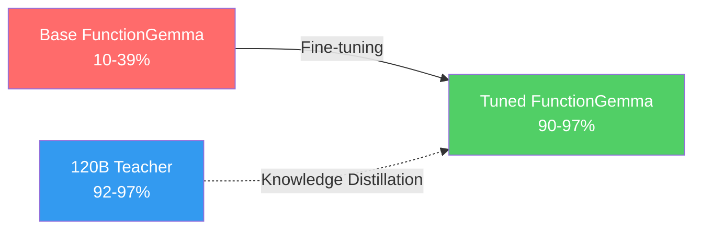

## Overview

Google's <strong>FunctionGemma 270M</strong> is a 270M-parameter model purpose-built for function calling. It's lightweight enough to run at 125 tok/s on a smartphone CPU, but its base multi-turn tool calling accuracy was only 10-39%.

The Distil Labs team fine-tuned this model using <strong>knowledge distillation</strong> from a 120B teacher, achieving <strong>90-97% accuracy</strong> — matching or exceeding the teacher despite being 445× smaller.

This is compelling additional evidence challenging the assumption that scaling is the only path to performance.

## Why Multi-Turn Is Hard

Single-turn function calling is relatively straightforward. Multi-turn introduces compounding challenges:

- <strong>Conversation history tracking</strong>: Must remember previous function call results
- <strong>Intent change handling</strong>: Users may shift intent mid-conversation
- <strong>Cumulative errors</strong>: 80% single-turn accuracy drops to 33% over 5 turns (0.8⁵)

Base FunctionGemma's projected 5-turn accuracy is effectively unusable:

| Task | Single-Turn | 5-Turn Projected |
|------|------------|-----------------|
| Smart Home Control | 38.8% | ~0.9% |
| Banking Voice Assistant | 23.4% | ~0.07% |
| Shell Command Execution | 9.9% | ~0.001% |

## Fine-Tuning Results

Distil Labs performed knowledge distillation from a 120B GPT-oss teacher model. The results were remarkable:

### Detailed Results by Task

| Task | Base | Tuned | Teacher (120B) |
|------|------|-------|---------------|
| Smart Home Control | 38.8% | <strong>96.7%</strong> | 92.1% |
| Banking Voice Assistant | 23.4% | <strong>90.9%</strong> | 97.0% |
| Shell Command Execution | 9.9% | <strong>96.0%</strong> | 97.0% |

<strong>The tuned model beat the 120B teacher on smart home control and shell commands</strong>. Only the banking task fell short — the most complex task with 14 functions and ASR noise in the input.

## Key Insights

### 1. Data Quality > Model Size

The same high-quality dataset produced strong results on both Qwen3-0.6B and FunctionGemma 270M. <strong>The key factor is task-specific, high-quality training data, not model size</strong>.

### 2. Practical Implications of a 445× Smaller Model

| Metric | 120B Teacher | 270M Tuned |
|--------|-------------|-----------|
| Parameters | 120,000M | 270M |
| Quantized Size | ~60GB+ | ~288MB |
| Runtime | GPU Server | Smartphone CPU |
| Inference Speed | - | 125 tok/s |

This enables <strong>production-ready tool calling without GPUs</strong> — on edge devices, mobile apps, and in-browser inference.

### 3. A Counter-Argument to Scaling Laws

Combined with the recent rise of open-source models like DeepSeek and Qwen, these results provide <strong>additional evidence against the assumption that increasing parameters is the only path to better performance</strong>. Proper fine-tuning on specialized tasks can overcome model size limitations.

## Open-Source Resources

All models and datasets are publicly available for reproduction:

- <strong>Smart Home Model</strong>: [distil-labs/distil-home-assistant-functiongemma](https://huggingface.co/distil-labs/distil-home-assistant-functiongemma)
- <strong>Smart Home Data</strong>: [distil-labs/distil-smart-home](https://github.com/distil-labs/distil-smart-home)
- <strong>Banking Assistant Data</strong>: [distil-labs/distil-voice-assistant-banking](https://github.com/distil-labs/distil-voice-assistant-banking)
- <strong>Shell Command Data</strong>: [distil-labs/distil-SHELLper](https://github.com/distil-labs/distil-SHELLper)

## Conclusion

The FunctionGemma 270M fine-tuning case sends an important message to the AI industry. <strong>A 270M model beating a 120B model</strong> means not every problem requires a massive model.

As demand for tool calling grows in constrained environments — edge AI, mobile deployment, IoT devices — the potential of ultra-small specialized models will only become more significant.

## References

- [Making FunctionGemma Work: Multi-Turn Tool Calling at 270M Parameters](https://www.distillabs.ai/blog/making-functiongemma-work-multi-turn-tool-calling-at-270m-parameters) — Distil Labs Blog
- [Reddit Discussion](https://www.reddit.com/r/LocalLLaMA/comments/1r6gx75/finetuned_functiongemma_270m_for_multiturn_tool_calling/) — r/LocalLLaMA
- [FunctionGemma Model Card](https://huggingface.co/google/functiongemma-270m-it) — HuggingFace
