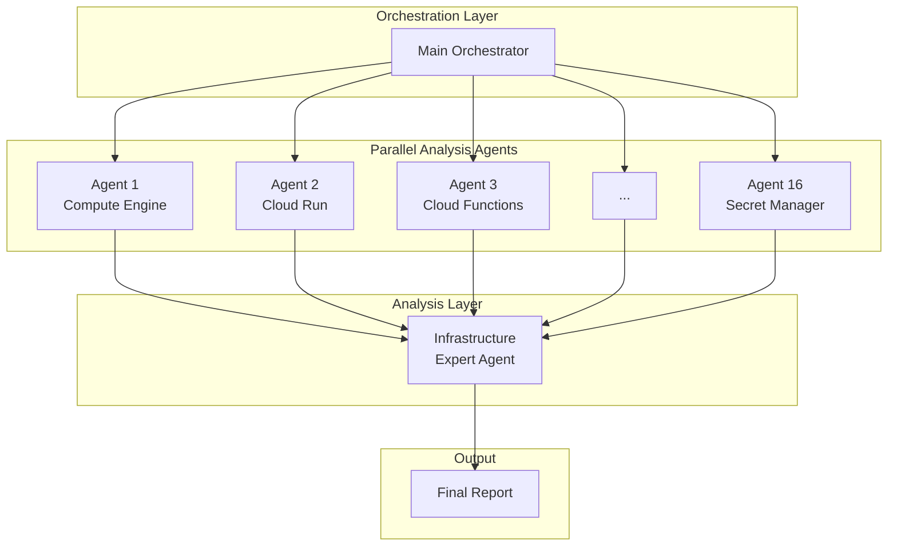
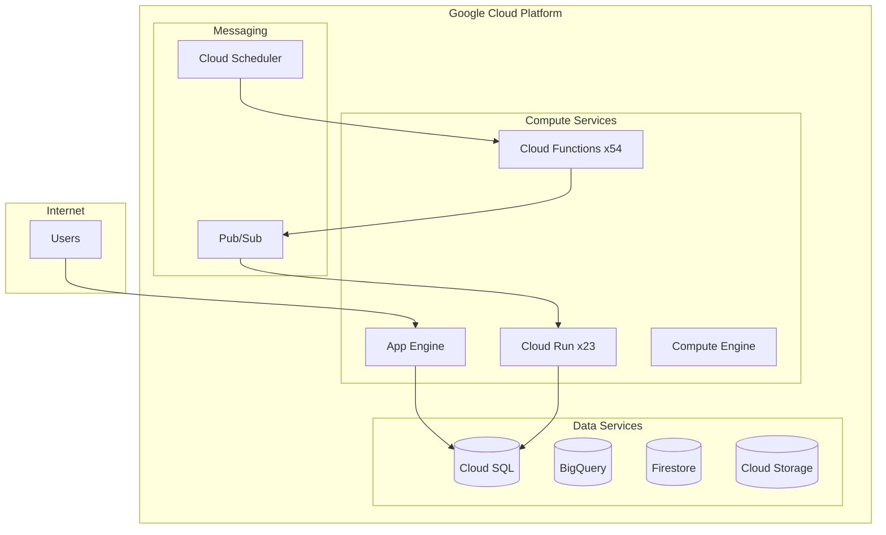

## Overview

Cloud infrastructure management grows increasingly complex over time. Dozens of services, hundreds of resources, and constantly changing configurations. Infrastructure administrators must battle security vulnerabilities, cost waste, and configuration errors daily. However, manual inspections are time-consuming and prone to missing critical issues.

To solve this problem, I built an automated infrastructure auditing system using <strong>gcloud MCP (Model Context Protocol)</strong> and AI agents. Through a parallel agent architecture, it simultaneously analyzes 16 GCP services, automatically identifying security risks, cost optimization opportunities, and operational issues.

## Problem Background

### Infrastructure Administrator Challenges

Common problems faced by infrastructure administrators in production environments:

- <strong>Service sprawl</strong>: Mix of Cloud Run, Cloud Functions, App Engine, Compute Engine, and more
- <strong>Security blind spots</strong>: API keys exposed in environment variables, overly permissive firewall rules
- <strong>Cost leakage</strong>: Unused resources, over-provisioned instances
- <strong>Technical debt</strong>: End-of-life OS, deprecated runtime versions

The traditional approach involves checking each service individually. But this has limitations:

```bash
# Traditional approach: sequential service-by-service inspection
gcloud compute instances list
gcloud run services list
gcloud functions list
gcloud sql instances list
# ... manually run dozens of commands
```

Using this method to inspect the entire infrastructure can take hours or even days.

### Limitations of Existing Tools

Google Cloud's Security Command Center and Cloud Asset Inventory are excellent tools. However:

- They rely on static rule-based detection
- Cross-service relationship analysis is limited
- Difficult to prioritize based on business context
- Lack of immediate remediation suggestions

## Solution Approach

### Introducing gcloud MCP

<strong>MCP (Model Context Protocol)</strong> is a protocol that enables AI models to interact with external tools. gcloud MCP wraps the Google Cloud CLI as an MCP server, allowing AI agents to directly query and manage GCP resources.

Key advantages:

1. <strong>Natural language interface</strong>: Query using natural language instead of complex gcloud commands
2. <strong>Context awareness</strong>: AI understands and analyzes relationships between resources
3. <strong>Automated reports</strong>: Generates structured analysis results and improvement recommendations

### Parallel Agent Architecture

Instead of a single agent sequentially checking all services, I applied a parallel sub-agent pattern:



Each sub-agent independently analyzes a specific service:

| Agent | Service | Analysis Items |
|-------|---------|----------------|
| Agent 1 | Compute Engine | VM status, OS version, snapshots |
| Agent 2 | Cloud Run | Service config, env vars, scaling |
| Agent 3 | Cloud Functions | Runtime, triggers, secrets |
| Agent 4 | Cloud SQL | DB version, backups, security |
| ... | ... | ... |
| Agent 16 | App Engine | Version management, domains, resources |

## Implementation Steps

### Step 1: Setting Up gcloud MCP

First, configure the gcloud MCP server. It can be used with Claude Desktop or other MCP-compatible clients:

```json
{
  "mcpServers": {
    "gcloud": {
      "command": "npx",
      "args": ["-y", "@anthropics/gcloud-mcp"],
      "env": {
        "GOOGLE_APPLICATION_CREDENTIALS": "/path/to/credentials.json"
      }
    }
  }
}
```

### Step 2: Define Service-Specific Analysis Agents

Create specialized analysis prompts for each GCP service:

```markdown
# Compute Engine Analysis Agent

## Goal
Analyze all Compute Engine resources in the project and identify security and operational issues.

## Analysis Items
1. VM instance list and status
2. Machine types and resource allocation
3. OS image versions (EOL status)
4. Disk and snapshot configuration
5. Network interfaces and firewall rules
6. Metadata (SSH keys, startup scripts, etc.)

## Output Format
- Resource summary table
- List of discovered issues (by severity)
- Recommended actions
```

### Step 3: Parallel Execution Orchestration

The main orchestrator runs all sub-agents simultaneously:

```python
# Conceptual code example
async def run_infrastructure_audit():
    agents = [
        Agent("compute-engine", compute_prompt),
        Agent("cloud-run", cloud_run_prompt),
        Agent("cloud-functions", functions_prompt),
        # ... 16 agents
    ]

    # Parallel execution
    results = await asyncio.gather(*[
        agent.analyze() for agent in agents
    ])

    # Aggregate results
    return aggregate_results(results)
```

### Step 4: Result Aggregation and Report Generation

The infrastructure expert agent synthesizes all results to generate a prioritized report:

```markdown
# Risk Assessment Criteria

## Critical (Immediate Action Required)
- Credentials exposed to the internet
- Fully open firewall rules
- End-of-life OS

## High (Action Within 1 Week)
- API keys in environment variables
- Deletion protection not enabled
- Databases without backups

## Medium (Action Within 1 Month)
- Deprecated runtime versions
- Unused resources
- Inadequate labeling
```

## Real-world Examples

### Sample Analysis Results

Running the parallel agent system produces reports like this:

#### Infrastructure Overview

| Category | Service | Resource Count | Status |
|----------|---------|---------------|--------|
| Compute | Compute Engine VM | 1 | Attention needed |
| Compute | Cloud Run services | 23 | Security review needed |
| Compute | Cloud Functions | 54 | Runtime upgrade needed |
| Database | Cloud SQL | 2 | 1 inactive |
| Storage | Cloud Storage | 27 | 15 with security gaps |
| Networking | VPC | 2 | Firewall review needed |

#### Major Issues Discovered

<strong>Security Vulnerabilities (Critical)</strong>

1. **API Keys Exposed in Environment Variables**
   - Location: Multiple Cloud Run/Functions services
   - Risk: Service abuse if credentials are stolen
   - Action: Migrate to Secret Manager immediately

2. **RDP Port Fully Open**
   - Location: default VPC firewall rule
   - Risk: Exposure to brute force attacks
   - Action: Restrict to specific IP ranges

3. **End-of-Life OS**
   - Location: cdp-sftp-prod VM (CentOS 7)
   - Risk: No security patches
   - Action: Migrate to Rocky Linux or Ubuntu LTS

<strong>Cost Optimization Opportunities</strong>

1. **Stopped MySQL Instance**: Only incurring storage costs
2. **80+ App Engine Versions**: Unused versions need cleanup
3. **Empty BigQuery Datasets**: 10 datasets can be deleted

### Auto-Generated Mermaid Diagrams

The system also automatically generates Mermaid diagrams to visualize infrastructure:



## Automating Regular Scans

### The Need for Periodic Auditing

Infrastructure changes daily. New services are deployed, configurations change, and new vulnerabilities are discovered. One-time audits are not enough.

### Automation with Cloud Scheduler

Regular infrastructure audits can be automated:

```yaml
# Weekly infrastructure audit schedule
schedule: "0 9 * * 1"  # Every Monday at 9 AM
target:
  type: cloud-function
  function: infrastructure-audit-trigger
notification:
  - email: infra-team@company.com
  - slack: #infra-alerts
```

### Change Tracking and Trend Analysis

By storing periodic scan results:

- Track security posture changes over time
- Identify newly emerged and resolved issues
- Analyze infrastructure growth trends
- Maintain compliance audit history

## Immediate Remediation

Another strength of gcloud MCP is the ability to immediately fix discovered issues.

### Example: Secret Manager Migration

Migrating API keys exposed in environment variables to Secret Manager:

```bash
# 1. Create secret
gcloud secrets create openai-api-key --replication-policy="automatic"

# 2. Set secret value
echo -n "sk-xxx..." | gcloud secrets versions add openai-api-key --data-file=-

# 3. Update Cloud Run service
gcloud run services update my-service \
  --update-secrets=OPENAI_API_KEY=openai-api-key:latest
```

AI agents can automatically generate these remediation commands and execute them after approval.

### Example: Firewall Rule Hardening

```bash
# Delete dangerous RDP rule
gcloud compute firewall-rules delete allow-rdp-all

# Create new rule allowing only specific IPs
gcloud compute firewall-rules create allow-rdp-office \
  --allow tcp:3389 \
  --source-ranges="203.0.113.0/24" \
  --target-tags="windows-server"
```

## Conclusion

Combining gcloud MCP with parallel agent architecture enables:

- <strong>Time savings</strong>: Complete audits that took days manually in minutes
- <strong>Consistency</strong>: Repeatable inspections with the same criteria
- <strong>Comprehensiveness</strong>: Analyze cross-service relationships
- <strong>Immediate action</strong>: Auto-generate remediation commands for discovered issues

Infrastructure administrators are freed from repetitive inspection tasks and can focus on more important architectural decisions and strategic work.

### Next Steps

1. **Install gcloud MCP**: Start from the [GitHub repository](https://github.com/anthropics/gcloud-mcp)
2. **Customize analysis agents**: Adjust to your organization's security policies and compliance requirements
3. **Set up regular scans**: Configure weekly/monthly automated audits with Cloud Scheduler
4. **Integrate notifications**: Connect with Slack, Email, PagerDuty for immediate response

Start the new paradigm of cloud infrastructure management with AI agents.
