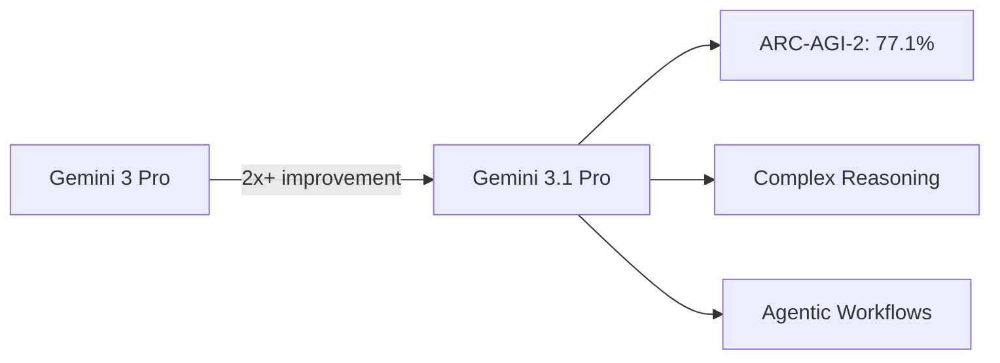
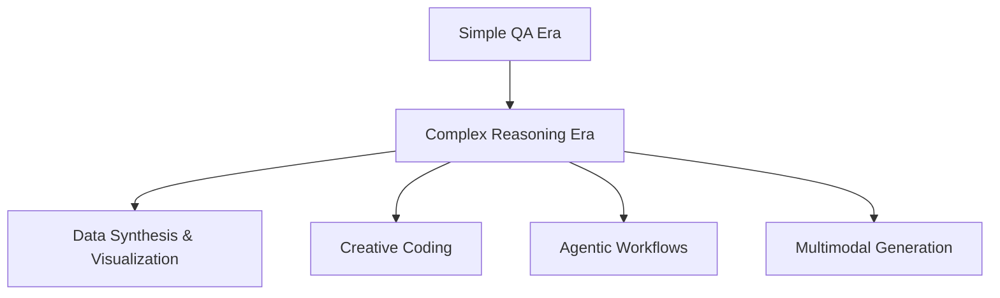

## Overview

On February 19, 2026, Google unveiled <strong>Gemini 3.1 Pro</strong>. Garnering 391 points on Hacker News, this model demonstrates a <strong>more than 2x improvement</strong> in reasoning performance over its predecessor, Gemini 3 Pro. In this post, we analyze Gemini 3.1 Pro's key performance metrics, compare it with Claude, and explore the implications of its multimodal evolution.

## Core Performance Analysis

### ARC-AGI-2 Benchmark: 77.1%

Gemini 3.1 Pro's most notable achievement is its score on the <strong>ARC-AGI-2</strong> benchmark. ARC-AGI-2 evaluates a model's ability to solve entirely new logic patterns, and Gemini 3.1 Pro achieved a <strong>verified score of 77.1%</strong>.

This represents a <strong>more than 2x</strong> improvement in reasoning performance over Gemini 3 Pro. This isn't just a score bump — it's a fundamental leap in complex problem-solving capability for tasks "where a simple answer isn't enough."

### Practical Use Cases

Google showcased four practical demonstrations of Gemini 3.1 Pro's enhanced reasoning:

- <strong>Code-based animation</strong>: Generating website-ready animated SVGs from text prompts. Being code-based rather than pixel-based, they remain crisp at any scale
- <strong>Complex system synthesis</strong>: Building a live aerospace dashboard that visualizes the ISS orbit with API integration
- <strong>Interactive design</strong>: Coding a 3D starling murmuration with hand-tracking and a generative soundscore
- <strong>Creative coding</strong>: Analyzing a literary work's atmosphere and transforming it into a modern web interface

## Comparison with Claude

### Current Competitive Landscape

With Gemini 3.1 Pro's release, the AI model competition has intensified further. Comparing Claude 4 Opus/Sonnet with Gemini 3.1 Pro on key dimensions:

| Aspect | Gemini 3.1 Pro | Claude 4 Opus |
|--------|---------------|---------------|
| ARC-AGI-2 | 77.1% (verified) | Not disclosed |
| Approach | Multimodal native | Text-centric + tool use |
| Image generation | Built-in | External tool integration |
| Code execution | Antigravity platform | Artifacts, MCP |
| Agent capabilities | Google Antigravity | Claude Code, MCP |

### Strengths of Each Model

<strong>Gemini 3.1 Pro strengths</strong>:
- Native multimodal (text, image, and code in a single model)
- Deep integration with the Google ecosystem (Vertex AI, Android Studio, NotebookLM)
- High reasoning performance on ARC-AGI-2

<strong>Claude strengths</strong>:
- Accuracy and stability with long-context tasks
- Flexible tool integration via MCP (Model Context Protocol)
- Consistent quality in coding tasks

## The Significance of Multimodal Evolution

### The "Simple Answer Isn't Enough" Era

Gemini 3.1 Pro's message is clear: <strong>"A simple answer isn't enough."</strong> This signals that AI model development is shifting from simple Q&A to complex problem-solving.

### Developer Ecosystem Expansion

Gemini 3.1 Pro is accessible across multiple platforms:

- <strong>Developers</strong>: Google AI Studio, Gemini CLI, Google Antigravity, Android Studio
- <strong>Enterprise</strong>: Vertex AI, Gemini Enterprise
- <strong>Consumers</strong>: Gemini app, NotebookLM

The emergence of <strong>Google Antigravity</strong> as an agentic development platform is particularly noteworthy. It directly competes with Anthropic's MCP ecosystem.

## Practical Implications

### Key Takeaways for Developers

1. <strong>Rethink model selection strategy</strong>: Gemini 3.1 Pro deserves serious consideration for tasks requiring complex reasoning
2. <strong>Design multimodal workflows</strong>: Text → code → visualization can now be a single pipeline
3. <strong>Compare agent development platforms</strong>: Evaluate Antigravity vs MCP vs LangChain and other agent frameworks

### Caveats

- Still in <strong>preview</strong> stage — careful evaluation is needed before production deployment
- Benchmark scores don't always reflect real-world performance perfectly
- Priority access is given to Google AI Pro/Ultra paid plan users

## Conclusion

Gemini 3.1 Pro represents a clear step forward for Google in the AI competition. The impressive 77.1% on ARC-AGI-2 and practical use cases demonstrate meaningful progress in "reasoning ability" — the core competitive edge of next-generation AI.

However, as the comparison with Claude shows, each model has unique strengths, and real-world performance may differ from benchmarks. For developers, leveraging both ecosystems is likely the wisest strategy at this point.

## References

- [Google Blog - Gemini 3.1 Pro Official Announcement](https://blog.google/innovation-and-ai/models-and-research/gemini-models/gemini-3-1-pro/)
- [Google AI Studio](https://aistudio.google.com/)
- [Google Antigravity](https://antigravity.google/)
- [Vertex AI - Gemini 3.1 Pro](https://cloud.google.com/blog/products/ai-machine-learning/gemini-3-1-pro-on-gemini-cli-gemini-enterprise-and-vertex-ai)
