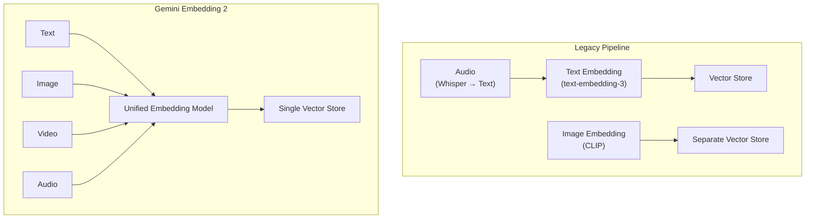
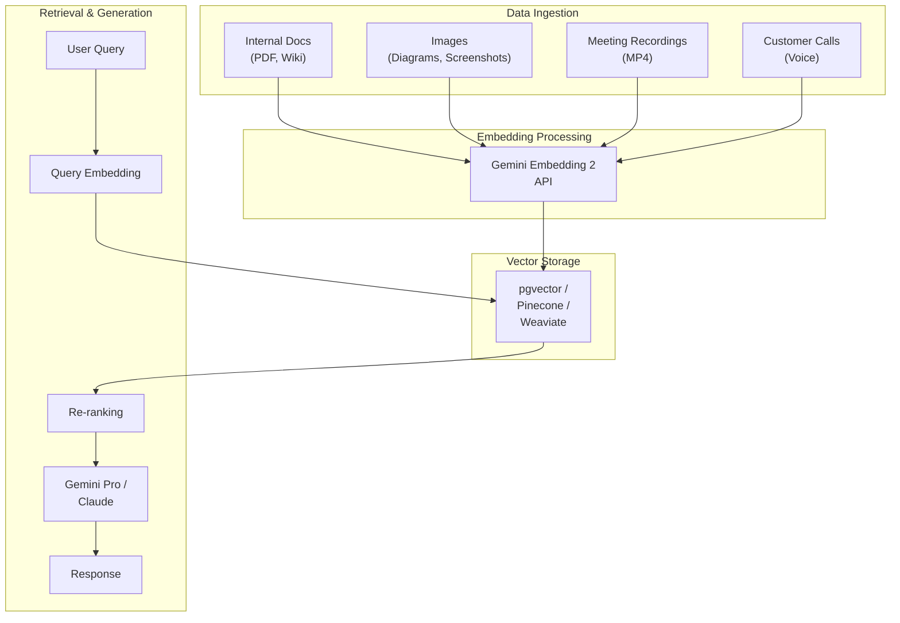

## Why Multimodal Embeddings

On March 10, 2026, Google announced <strong>Gemini Embedding 2</strong> — described as "our first native multimodal embedding model." It maps text, images, video, audio, and documents into <strong>a single vector space</strong>.

The biggest limitation of [existing RAG pipelines](/en/blog/en/dena-llm-study-part4-rag) was that they could only handle text. Even when an internal wiki contained diagrams, or a product manual included screenshots, all of that was ignored at the embedding stage. As a result, searches repeatedly failed to surface relevant information despite it being present in the knowledge base.

Gemini Embedding 2 addresses this problem at its root.

---

## Gemini Embedding 2 Key Specs

### Input Modalities

| Modality | Coverage | Constraints |
|----------|----------|-------------|
| Text | Up to 8,192 tokens | 100+ languages supported |
| Images | Up to 6 per request | PNG, JPEG |
| Video | Up to 120 seconds | MP4, MOV |
| Audio | Native processing | No intermediate text conversion needed |
| Documents | Complex docs like PDFs | Mixed text + image processing |

### Output Dimensions

The default output is a 3,072-dimensional vector. The key here is the application of <strong>Matryoshka Representation Learning (MRL)</strong>. Like Russian nesting dolls, information is arranged in a nested structure, so core information is preserved in the higher dimensions even when the dimensionality is reduced.

```
3072 dimensions (highest precision)
 └── 1536 dimensions (high precision)
      └── 768 dimensions (general purpose)
           └── 256 dimensions (lightweight, mobile/edge)
```

The reason this matters in practice is that it allows flexible tuning of the <strong>cost-accuracy tradeoff</strong>. When indexing millions of documents, a two-stage strategy becomes feasible: first-pass filtering with 256 dimensions, then re-ranking top candidates with 3,072 dimensions.

### API Access

Two gateways are available:

- <strong>Gemini API (AI Studio)</strong>: For prototyping and individual developers. Includes a free tier.
- <strong>Vertex AI (Google Cloud)</strong>: Enterprise scale. VPC-SC, CMEK, and IAM integration.

---

## Comparison with Existing Embedding Models

### Single-Modal vs. Multimodal



Three problems with the legacy approach:

1. <strong>Pipeline complexity</strong>: Each modality required a separate model, separate store, and separate retrieval logic
2. <strong>No cross-modal search</strong>: Queries like "find code related to this diagram" were impossible
3. <strong>Intermediate conversion loss</strong>: Converting audio to text lost nuance and context

### Embedding Model Spec Comparison

| Model | Modalities | Max Dimensions | MRL | Price (per 1M tokens) |
|-------|-----------|----------------|-----|----------------------|
| OpenAI text-embedding-3-large | Text only | 3,072 | Yes | $0.13 |
| Cohere embed-v4 | Text + Image | 1,024 | Yes | $0.10 |
| <strong>Gemini Embedding 2</strong> | <strong>Text + Image + Video + Audio</strong> | <strong>3,072</strong> | <strong>Yes</strong> | <strong>Free (preview)</strong> |
| Voyage AI voyage-3 | Text only | 1,024 | No | $0.06 |

Gemini Embedding 2's differentiator is clear. It is the <strong>only model to natively support all four modalities</strong>, with top-tier output dimensions, and is currently free during the preview period.

---

## Practical Application: Building a Multimodal RAG Pipeline

### Architecture Design



### Code Example: Python SDK

```python
from google import genai

# Initialize client
client = genai.Client(api_key="YOUR_API_KEY")

# Text embedding
text_result = client.models.embed_content(
    model="gemini-embedding-exp-03-07",
    contents=["Key clauses from the internal security policy document"],
    config={
        "output_dimensionality": 768,  # Reduce dimensions via MRL
        "task_type": "RETRIEVAL_DOCUMENT"
    }
)
print(f"Text vector dimensions: {len(text_result.embeddings[0].values)}")
# Output: Text vector dimensions: 768

# Image embedding (same vector space)
from google.genai import types

image = types.Part.from_uri(
    file_uri="gs://my-bucket/architecture-diagram.png",
    mime_type="image/png"
)
image_result = client.models.embed_content(
    model="gemini-embedding-exp-03-07",
    contents=[image]
)

# Cosine similarity between text and image vectors is now possible
import numpy as np

def cosine_similarity(a, b):
    return np.dot(a, b) / (np.linalg.norm(a) * np.linalg.norm(b))

similarity = cosine_similarity(
    text_result.embeddings[0].values,
    image_result.embeddings[0].values
)
print(f"Text-image similarity: {similarity:.4f}")
```

### Task Type Strategy

Gemini Embedding 2 lets you specify the embedding purpose using the `task_type` parameter:

| Task Type | Purpose | Use Case |
|-----------|---------|----------|
| `RETRIEVAL_DOCUMENT` | Document indexing | When storing RAG documents |
| `RETRIEVAL_QUERY` | Query encoding | When processing user search queries |
| `SEMANTIC_SIMILARITY` | Similarity comparison | Duplicate detection, clustering |
| `CLASSIFICATION` | Classification | Automatic document classification, labeling |
| `CLUSTERING` | Clustering | Topic modeling, grouping |

<strong>Pro tip</strong>: Always use different task types for indexing and retrieval. Using `RETRIEVAL_DOCUMENT` when storing documents and `RETRIEVAL_QUERY` when querying significantly improves asymmetric retrieval performance.

---

## EM/CTO Perspective: Adoption Considerations

### 1. Pipeline Simplification = Reduced Operational Costs

The most direct benefit of adopting multimodal embeddings is <strong>reduced pipeline complexity</strong>.

If you currently operate separate embedding pipelines per modality:
- 3–4 models → 1 model
- 2–3 vector stores → 1 vector store
- Synchronization logic eliminated
- Fewer systems to monitor

According to Google's official blog, some customers have achieved <strong>70% latency reduction</strong>.

### 2. Vendor Dependency Assessment

Gemini Embedding 2 is currently Google-exclusive. For organizations running a multi-cloud strategy, thinking through this from an [A2A + MCP hybrid architecture](/en/blog/en/a2a-mcp-hybrid-architecture-production-guide) perspective makes designing a swappable embedding layer a long-term advantage:

- <strong>Abstract the embedding layer</strong>: Design the embedding model as a swappable interface
- <strong>Vector format compatibility</strong>: 3,072-dimension vectors are compatible with most vector databases
- <strong>Leverage MRL</strong>: Dimension reduction makes it possible to match dimensions with other models

### 3. Data Governance

Sending multimodal data to an external API introduces governance considerations:

- On Vertex AI, <strong>VPC Service Controls</strong> can define data perimeters (the fine-grained enterprise data access control pattern exemplified by [BigQuery MCP prefix filtering](/en/blog/en/bigquery-mcp-prefix-filtering) is consistent across the Google ecosystem)
- <strong>CMEK (Customer-Managed Encryption Keys)</strong> is supported
- PII masking is recommended before embedding meeting recordings and customer call audio
- If Data Residency requirements apply, confirm region selection carefully

### 4. Cost Model Forecasting

The model is currently free during preview, but billing is expected after GA. Cost optimization strategy:

```
Indexing:     256 dimensions (MRL)  → 87% storage cost reduction vs. 3072
First pass:   256-dim ANN search    → fast and inexpensive
Re-ranking:   3072-dim exact match  → top 50 candidates only
```

This two-stage strategy simultaneously optimizes cost and accuracy at the scale of millions of documents.

---

## Production Migration Checklist

When transitioning from a text-only RAG to a multimodal RAG:

1. <strong>Data inventory</strong>: Assess the current state of non-text data in your organization (images, video, audio)
2. <strong>Prioritization</strong>: Apply multimodal indexing first to document types with the highest search failure rate
3. <strong>Vector DB compatibility</strong>: Confirm your existing vector store supports 3,072 dimensions (pgvector, Pinecone, and Weaviate all do)
4. <strong>A/B testing</strong>: Quantitatively compare retrieval accuracy between existing text-only and multimodal embeddings
5. <strong>Monitoring</strong>: Track cross-modal search rate, latency, and embedding API call volume
6. <strong>Security review</strong>: Obtain security and compliance approval for external transmission of multimodal data

---

## Conclusion

Gemini Embedding 2 is not simply "a new embedding model." It is a <strong>paradigm shift in RAG pipeline architecture</strong>.

Search systems that could previously only handle text can now perform unified retrieval across images, video, and audio within the same vector space. This is not just a technical advancement — it is a change that can fundamentally transform how organizations leverage unstructured data.

Key action items from an Engineering Manager's perspective:

1. <strong>Now</strong>: Run a PoC using the Gemini API during the preview period (free)
2. <strong>Within 1–2 weeks</strong>: Create an inventory of non-text data within your organization
3. <strong>Within 1 month</strong>: Design an A/B test comparing multimodal RAG against your existing RAG pipeline

---

## References

- [Gemini Embedding 2 Official Announcement Blog](https://blog.google/innovation-and-ai/models-and-research/gemini-models/gemini-embedding-2/)
- [Gemini API Developer Documentation](https://ai.google.dev/gemini-api/docs/models/gemini-embedding-2-preview)
- [Vertex AI Gemini Embedding 2 Documentation](https://docs.cloud.google.com/vertex-ai/generative-ai/docs/models/gemini/embedding-2)
- [VentureBeat: Gemini Embedding 2 Analysis](https://venturebeat.com/data/googles-gemini-embedding-2-arrives-with-native-multimodal-support-to-cut)
