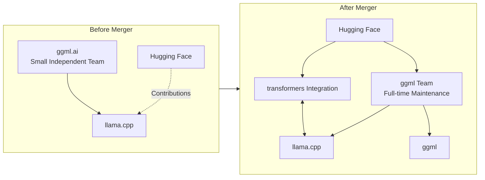
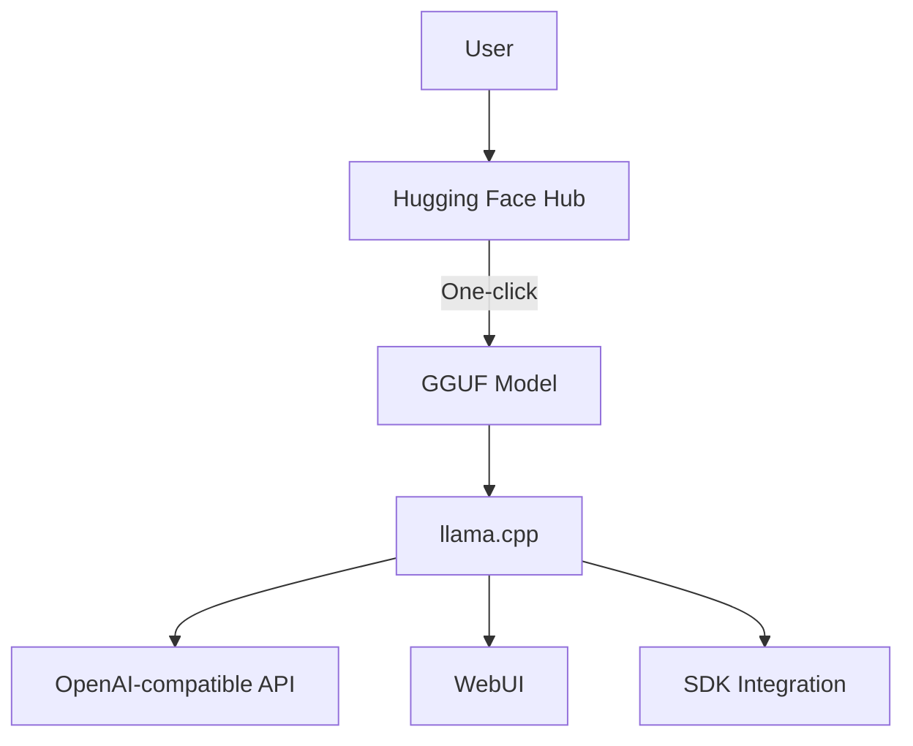
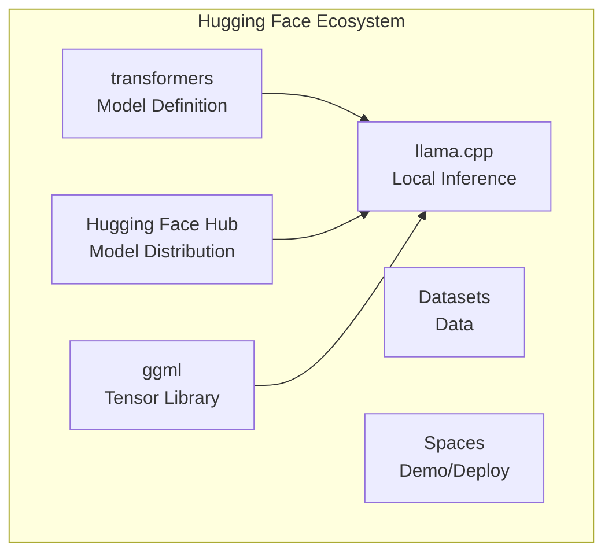

## Overview

In February 2026, a pivotal moment arrived in the history of open-source AI. <strong>ggml.ai (the founding team of llama.cpp) officially announced their decision to join Hugging Face</strong>. The announcement garnered 616 points on Hacker News and over 480 combined points on Reddit's r/LocalLLaMA, sparking significant community discussion.

This article analyzes the background behind llama.cpp and GGML joining Hugging Face, its technical implications, and the future direction of the local AI inference ecosystem.

## The Role of llama.cpp and GGML

### The Foundation of Local AI Inference

Since its launch in 2023, llama.cpp has rapidly grown into the <strong>de facto standard for local AI inference</strong>. This lightweight inference engine written in C/C++ made it possible to run LLMs on consumer hardware, leading the charge in AI democratization.

GGML is the machine learning tensor library that underpins llama.cpp. It handles the core of quantization technology, and the GGUF format has become the de facto standard for local model distribution.

```
ggml (tensor library)
  └── llama.cpp (inference engine)
        ├── GGUF (model format)
        ├── Quantization (Q4_K_M, IQ2_K, etc.)
        └── Server capabilities (OpenAI-compatible API)
```

### Impact by the Numbers

- GitHub stars: <strong>75,000+</strong>
- Dependent projects: Thousands (ollama, LM Studio, koboldcpp, etc.)
- Supported architectures: LLaMA, Mistral, Qwen, Gemma, and other major models
- Supported hardware: CPU, CUDA, Metal, Vulkan, SYCL

## Details and Background of the Merger

### What Happened

According to the [official announcement](https://github.com/ggml-org/llama.cpp/discussions/19759), Georgi Gerganov and the founding team are joining Hugging Face. The key points are:

- <strong>ggml-org projects remain open and community-driven</strong>
- The ggml team continues to lead and maintain ggml/llama.cpp full-time
- The new partnership ensures the project's long-term sustainability
- Enhanced focus on integration with the Hugging Face transformers library

### Why Hugging Face?

Since its founding in 2023, ggml.ai has supported ggml development and community growth with a small team. However, building a sustainable development structure was always a challenge.

Hugging Face has been the strongest contributing partner:

- <strong>@ngxson</strong> and <strong>@allozaur</strong> implemented core functionalities in ggml and llama.cpp
- Built a polished inference server with refined UI
- Introduced multi-modal support to llama.cpp
- Integrated llama.cpp into Hugging Face Inference Endpoints
- Improved GGUF format compatibility with the Hugging Face platform
- Implemented multiple model architectures



## Technical Focus and Future Direction

### 1. Seamless Integration with transformers

The most notable technical direction is <strong>"one-click" integration</strong> with the Hugging Face transformers library. transformers has established itself as the "Single Source of Truth" for AI model definitions.

Expected changes include:

- Faster GGUF conversion upon new model releases
- Significant reduction in model architecture compatibility issues
- Standardized quality control processes

### 2. Improved User Experience

As local inference enters a phase where it becomes a <strong>viable alternative to cloud inference</strong>, simplifying how casual users deploy and access local models becomes crucial.



### 3. Evolution of Quantization and Inference Optimization

As demonstrated by the recently merged IQ*_K/IQ*_KS quantization methods, quantization technology is evolving rapidly. With Hugging Face's resources:

- <strong>Accelerated quantization research</strong>: More researchers can participate
- <strong>Benchmark standardization</strong>: Integrated evaluation with the transformers ecosystem
- <strong>Hardware optimization</strong>: Easier optimization across diverse backends

## Ecosystem Impact

### Impact on Downstream Projects

For major projects that depend on llama.cpp, this merger is a <strong>positive signal</strong>:

| Project | Impact |
|---|---|
| <strong>ollama</strong> | Benefits from continued stable development of llama.cpp |
| <strong>LM Studio</strong> | Accelerated GGUF format standardization |
| <strong>koboldcpp</strong> | Continued access to upstream improvements |
| <strong>vLLM</strong> | Potential for improved GGML/GGUF interoperability |

### Structural Changes in Open-Source AI

This merger suggests a <strong>consolidation trend</strong> in the open-source AI ecosystem:



Hugging Face now covers all three pillars: model <strong>definition, distribution, and inference</strong>.

### Concerns and Challenges

The community has raised several concerns:

- <strong>Centralization risk</strong>: Increasing dependence on a single company
- <strong>Potential conflicts of interest</strong>: Alignment with Hugging Face's business strategy
- <strong>Community governance</strong>: Maintaining transparency in decision-making

However, the official announcement explicitly states that "the community will continue to operate fully autonomously and make technical and architectural decisions as usual."

## Future of Quantization and Inference Optimization

### Short-term Outlook (Within 6 Months)

- Establishment of <strong>automated conversion pipelines</strong> from transformers to GGUF
- GGUF files available simultaneously with new model releases
- Further improvements to IQ-series quantization and integration of new methods

### Medium to Long-term Outlook (1-2 Years)

- Standardization of <strong>edge AI inference</strong> leveraging the ggml backend
- Major improvements in browser/mobile inference (WebAssembly integration, etc.)
- Expansion of direct partnerships with hardware vendors

## Conclusion

The merger of ggml.ai with Hugging Face is not merely an organizational change. It represents a <strong>structural turning point where the ownership of local AI inference infrastructure shifts</strong>.

On the positive side, the long-term sustainability of llama.cpp is now secured, and integration with the transformers ecosystem is expected to dramatically improve user experience. At the same time, healthy oversight of consolidation within the open-source AI ecosystem remains necessary.

The future of local AI inference will evolve <strong>more stably and rapidly</strong> as a result of this merger.

## References

- [Official Announcement: ggml.ai joins Hugging Face](https://github.com/ggml-org/llama.cpp/discussions/19759)
- [llama.cpp GitHub Repository](https://github.com/ggml-org/llama.cpp)
- [Hugging Face transformers](https://github.com/huggingface/transformers)
