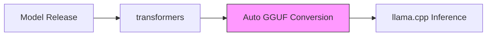
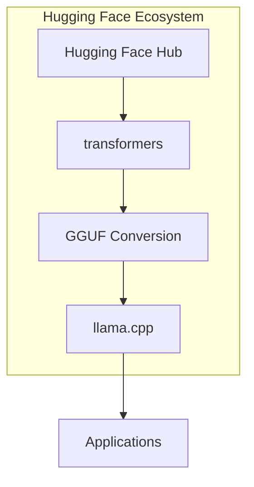

## Overview

In February 2026, <strong>the founding team of ggml.ai announced their joining of Hugging Face</strong>. With llama.cpp creator Georgi Gerganov and the core team transitioning to Hugging Face, a structural turning point has arrived for the local AI inference ecosystem.

This is not a simple acquisition. It's a strategic decision about <strong>the sustainability of open-source projects</strong> and <strong>the future of local AI infrastructure</strong>. The announcement garnered 616 points on Hacker News and 314+166 points on Reddit r/LocalLLaMA, reflecting intense community interest.

## What Was Announced

Key points from the [official announcement](https://github.com/ggml-org/llama.cpp/discussions/19759):

- <strong>ggml-org projects remain open-source and community-driven</strong>
- The ggml team continues to lead, maintain, and support ggml and llama.cpp full-time
- The new partnership ensures long-term sustainability of the projects
- Additional focus on improving integration with the Hugging Face [transformers](https://github.com/huggingface/transformers) library

## Why This Matters

### 1. Solving the Open-Source Sustainability Problem

Since its emergence in 2023, llama.cpp has become the de facto standard for local AI inference. However, maintaining this massive project with a small team was a major sustainability challenge. With Hugging Face's resources backing the project, this problem is structurally resolved.

### 2. transformers-ggml Ecosystem Integration

Currently, when new models are released, delays and compatibility issues arise during the conversion from transformers format to GGUF format. If the <strong>"single-click" integration</strong> mentioned in the announcement is realized:

- Time from model release to local inference will be dramatically reduced
- GGUF file format integration with Hugging Face Hub will become tighter
- Quantization quality control can be performed at the transformers level

### 3. User Experience Improvements

A particularly notable aspect of the announcement is the <strong>simplification of deployment for "casual users"</strong>. This signifies llama.cpp's evolution from a developer tool to general-user infrastructure.

## Existing Collaboration Achievements

Hugging Face engineers have already made significant contributions to llama.cpp:

| Area | Contribution |
|------|-------------|
| Core Features | Implementation of core ggml and llama.cpp functionality |
| Inference Server | Built a robust inference server with polished UI |
| Multimodal | Introduced multimodal support to llama.cpp |
| Infrastructure | Integrated llama.cpp into HF Inference Endpoints |
| GGUF Compatibility | Improved GGUF format compatibility with HF platform |
| Model Architectures | Implemented multiple model architectures |

Notable contributions came from [@ngxson](https://github.com/ngxson) and [@allozaur](https://github.com/allozaur).

## Community Reactions and Concerns

### Positive Reactions

- Relief about securing the project's long-term stability
- Excitement about faster new model support through transformers integration
- Trust in Hugging Face's open-source-friendly track record

### Concerns

- Whether open-source project independence will be maintained post-merger
- Impact of commercial interests on technical decision-making
- Potential changes to community governance

## Impact on the Local AI Ecosystem

This merger signifies vertical integration of the local AI inference stack:

From <strong>model repository → model definition → quantization → inference engine</strong>, everything is managed within a single ecosystem. While this could bring significant improvements to developer experience, it also necessitates discussion about ecosystem diversity.

## Technical Outlook

The technical objectives outlined in the official announcement are clear:

1. <strong>One-click integration with transformers</strong>: As the transformers framework has established itself as the "source of truth" for model definitions, improving compatibility with the ggml ecosystem is key
2. <strong>User experience improvements</strong>: With local inference reaching a meaningful level as an alternative to cloud inference, improving accessibility for general users is critical
3. <strong>Open-source superintelligence</strong>: The long-term vision presents "open-source superintelligence accessible to the world"

## Conclusion

The ggml.ai team joining Hugging Face symbolizes the local AI inference ecosystem's <strong>entry into maturity</strong>. In the process of elevating open-source projects from personal endeavors to industrial infrastructure, securing sustainable resources is an essential step.

For llama.cpp users, tangible benefits are expected: faster model support, better user experience, and long-term project stability. At the same time, sustained community attention is needed to ensure that open-source governance independence is maintained.

## References

- [Official Announcement: ggml.ai joins Hugging Face](https://github.com/ggml-org/llama.cpp/discussions/19759)
- [llama.cpp GitHub](https://github.com/ggml-org/llama.cpp)
- [Hugging Face transformers](https://github.com/huggingface/transformers)
- [ggml GitHub](https://github.com/ggml-org/ggml)
