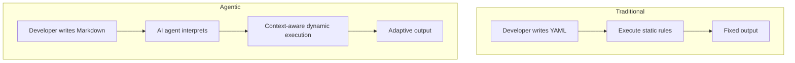
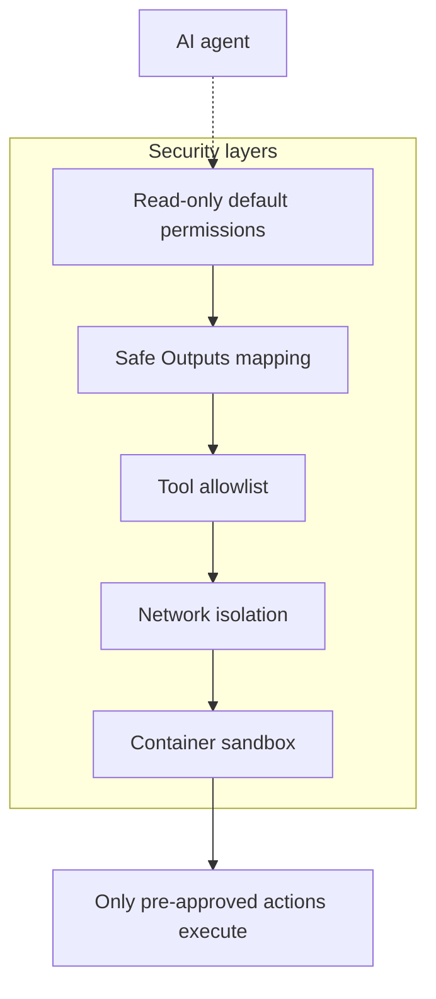
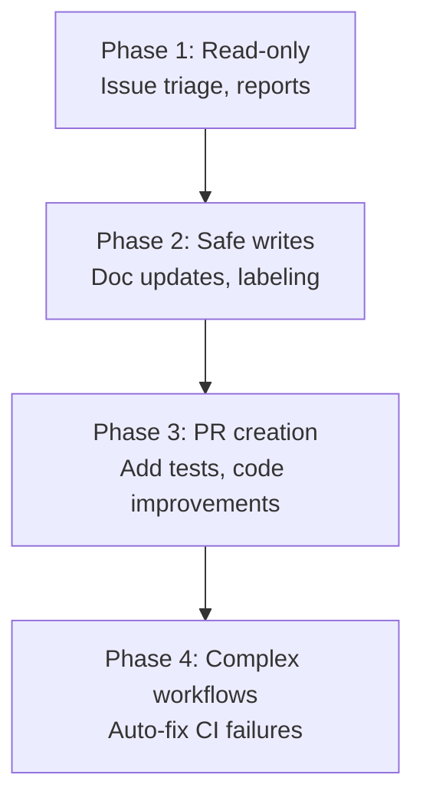

## Overview

On February 13, 2026, GitHub announced <strong>Agentic Workflows</strong> in technical preview. GitHub Actions, which has been the cornerstone of CI/CD pipelines, now natively integrates AI agents, enabling automation in areas that traditional YAML-based workflows could not address.

In this post, I analyze the architecture of Agentic Workflows, the security model, six core usage patterns, and present an adoption strategy from an Engineering Manager perspective.

## What are Agentic Workflows?

Agentic Workflows are <strong>GitHub Actions workflows where AI agents execute intentions defined in natural language</strong>. Instead of YAML, you write automation in Markdown, and coding agents like Copilot, Claude Code, and Codex perform the actual work.



The core difference is a shift from <strong>rule-based</strong> to <strong>intent-based</strong> automation. Previously, you had to specify all conditions like "if label is bug, assign to A." Now, you simply state the intent: "analyze the issue and assign it to an appropriate team member."

## Architecture Analysis

### Workflow File Structure

Agentic Workflows consist of two files.

<strong>1. Markdown File (.md)</strong> — Developer-written intent definition:

````markdown
---
on:
  schedule: daily
permissions: read-only
safe-outputs:
  - type: issue-comment
    params:
      title-prefix: "[Auto]"
  - type: label
    params:
      allowed: ["bug", "feature", "docs"]
tools:
  - github-api
---

# Auto-classify Issues

Analyze newly created issues:
1. Assign appropriate labels based on content
2. Identify related code areas and recommend assignees based on CODEOWNERS
3. Leave a classification comment
````

<strong>2. Lock File (.lock.yml)</strong> — The compiled executable Actions workflow generated by CLI:

This file is automatically generated with `gh aw compile` and should not be edited manually.

### Supported Agents

The agents currently supported in technical preview are:

| Agent | Characteristics | Cost |
|-------|-----------------|------|
| GitHub Copilot CLI | GitHub native, default setup | ~2 premium requests per run |
| Claude Code | Anthropic model, strong reasoning | Separate API key |
| OpenAI Codex | OpenAI model, code generation specialized | Separate API key |

### Security Model: Defense-in-Depth

Security is a core design principle of Agentic Workflows.



<strong>Core Security Principles</strong>:

- <strong>Read-only by default</strong>: Agents have read-only access to repositories
- <strong>Safe Outputs</strong>: Write operations are limited to pre-defined patterns (comments, labels, etc.)
- <strong>Tool allowlist</strong>: Explicitly restrict tools that agents can use
- <strong>No auto-merge PRs</strong>: Human review authority is preserved

This model is much more restrictive than running agents in traditional YAML workflows, but it is proportionally more secure.

## Six Continuous AI Patterns

GitHub positions this feature as <strong>"Continuous AI,"</strong> a new paradigm where AI participates continuously in CI/CD.

### 1. Continuous Triage—Auto-Classify Issues

AI analyzes newly created issues, assigns appropriate labels, and routes them to the right team member based on CODEOWNERS.

<strong>EM Perspective</strong>: Teams that spend 2〜3 hours per week on issue triage can save significant time with this pattern alone.

### 2. Continuous Documentation—Auto-Sync Documentation

When code changes occur, AI automatically updates README and related documentation.

<strong>EM Perspective</strong>: The PR comment "you forgot to update the docs" disappears.

### 3. Continuous Simplification—Code Improvement Suggestions

AI periodically scans the codebase, identifies refactoring opportunities, and generates improvement PRs.

### 4. Continuous Testing—Expand Test Coverage

Analyze coverage gaps and automatically generate tests for under-covered areas.

### 5. Continuous Quality—Auto-Investigate CI Failures

When CI fails, the agent analyzes logs, diagnoses root causes, and proposes fix PRs.

<strong>EM Perspective</strong>: When a late-night build fails, a fix PR is already waiting the next morning.

### 6. Continuous Reporting—Repository Health Reports

Periodically report on repository activity, technical debt, and test health.

## Getting Started: 5-Minute Setup Guide

### Step 1: Install CLI Extension

```bash
gh extension install github/gh-aw
```

### Step 2: Write Workflow Markdown

Create a `.github/workflows/triage.md` file:

````markdown
---
on:
  issues:
    types: [opened]
permissions: read-only
safe-outputs:
  - type: issue-comment
  - type: label
    params:
      allowed: ["bug", "feature", "enhancement", "docs", "question"]
---

# Auto-Classify Issues

When a new issue is opened:
1. Analyze the issue title and body
2. Assign one or more appropriate labels
3. Leave a comment explaining the classification
````

### Step 3: Compile and Commit

```bash
gh aw compile
git add .github/workflows/triage.md .github/workflows/triage.lock.yml
git commit -m "feat: add agentic workflow for issue triage"
git push
```

### Step 4: Configure Secrets

Add API keys to repository secrets based on which agent you use.

## EM/VPoE Perspective: Team Adoption Strategy

### Phased Adoption Roadmap



### Phase 1 (1〜2 weeks): Start with Read-only Work

Introduce side-effect-free tasks like issue triage and repository reports. Give your team time to evaluate AI agent judgment quality.

### Phase 2 (3〜4 weeks): Safe Write Operations

Add Safe Outputs-restricted write operations like automatic documentation updates and labeling.

### Phase 3 (1〜2 months): PR Creation

Expand to test generation and code improvement PR creation. <strong>Maintain human review at this stage.</strong>

### Phase 4 (3+ months): Complex Workflows

Compose complex workflows with multiple connected stages, like auto-fixing CI failures.

### Cost Considerations

| Item | Estimated Cost |
|------|----------------|
| Copilot (basic) | ~2 premium requests per run |
| Claude Code | Based on API token usage |
| OpenAI Codex | Based on API token usage |
| Actions execution time | Standard Actions billing |

A small team (5〜10 people) can start with approximately $50〜200 additional monthly cost.

## Comparison with Existing CI/CD

| Aspect | Traditional YAML Workflows | Agentic Workflows |
|--------|--------------------------|-------------------|
| Definition style | Declarative YAML | Intent-based Markdown |
| Flexibility | Fixed rules | Context-aware |
| Complex reasoning | Not possible | AI reasoning capable |
| Security model | Token-based permissions | Read-only + Safe Outputs |
| Debugging | Check logs | Trace agent reasoning |
| Cost | Actions minutes | Actions + AI API costs |

## Caveats and Limitations

<strong>Current Limitations</strong>:

- Technical preview stage requires caution for production use
- Agent judgments are not always accurate; human review must accompany
- Costs can be unpredictable (vary based on input token count)
- In private repositories, code context is transmitted to the agent provider

<strong>Open Source</strong>:

Released under MIT license for customization. It is a joint project of GitHub Next, Microsoft Research, and Azure Core Upstream.

## Conclusion

GitHub Agentic Workflows represent the next evolution of CI/CD. The shift is from "build and test the code" to "understand and improve the code."

As an EM, three things stand out:

1. <strong>Gradual adoption is possible</strong> — Start read-only and minimize risk
2. <strong>Security design is solid</strong> — Safe Outputs and read-only defaults prevent incidents
3. <strong>Agent selection is flexible</strong> — Choose Copilot, Claude, or Codex based on your team's needs

The transition from YAML to Markdown, from rules to intent, will likely become the standard for DevOps teams in 2026.

## References

- [GitHub Blog: Automate repository tasks with GitHub Agentic Workflows](https://github.blog/ai-and-ml/automate-repository-tasks-with-github-agentic-workflows/)
- [GitHub Changelog: Agentic Workflows Technical Preview](https://github.blog/changelog/2026-02-13-github-agentic-workflows-are-now-in-technical-preview/)
- [The New Stack: GitHub Agentic Workflows Overview](https://thenewstack.io/github-agentic-workflows-overview/)
- [InfoQ: GitHub Agentic Workflows Unleash AI-Driven Repository Automation](https://www.infoq.com/news/2026/02/github-agentic-workflows/)
