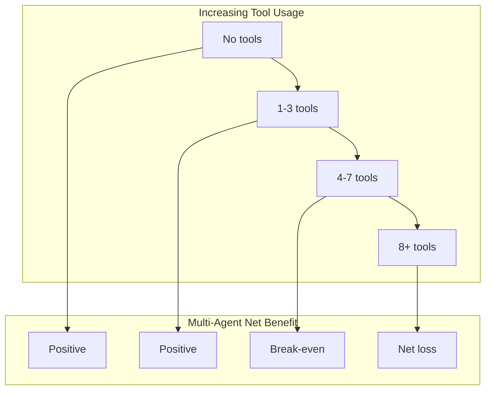

## "More agents means better performance" — This assumption is wrong

In 2026, the AI agent field has adopted what amounts to a dogma: <strong>"Deploy more agents in parallel and performance improves."</strong> The explosive growth of multi-agent frameworks like LangGraph, CrewAI, and AutoGen — and the surge in enterprise investment in agent teams — all rest on this assumption.

Google Research has published findings that directly challenge this premise. The paper <strong>"Towards a Science of Scaling Agent Systems"</strong> evaluated 180 agent configurations and found that <strong>multi-agent systems can degrade performance by up to 70% compared to a single agent under specific conditions</strong>.

For Engineering Managers, this isn't an academic curiosity — it fundamentally changes the evidence base for agent architecture decisions.

---

## Experimental Design: 180 Configurations, 5 Architectures, 4 Benchmarks

The research team designed a systematic controlled experiment. While previous agent research typically reported performance of specific architectures on specific tasks, this study cross-validated <strong>task type × architecture × LLM combination</strong> comprehensively.

```mermaid
graph TD
    subgraph 5 Architectures
        A1["Single-Agent<br/>(Baseline)"]
        A2["Independent<br/>(No Communication)"]
        A3["Centralized<br/>(Hub-and-Spoke)"]
        A4["Decentralized<br/>(Peer-to-Peer)"]
        A5["Hybrid<br/>(Mixed)"]
    end
    subgraph 4 Benchmarks
        B1["Finance-Agent<br/>(Financial Reasoning)"]
        B2["BrowseComp-Plus<br/>(Web Navigation)"]
        B3["PlanCraft<br/>(Sequential Planning)"]
        B4["Workbench<br/>(Mixed Tasks)"]
    end
    subgraph 3 LLM Families
        C1["OpenAI GPT"]
        C2["Google Gemini"]
        C3["Anthropic Claude"]
    end
    5 Architectures --> configs[180 Configuration Combinations]
    4 Benchmarks --> configs
    3 LLM Families --> configs
```

**5 Architecture Classifications:**

- <strong>Single-Agent</strong>: A single model performs all tasks (baseline)
- <strong>Independent</strong>: Multiple agents run in parallel without communication
- <strong>Centralized</strong>: An orchestrator agent directs sub-agents (Hub-and-Spoke)
- <strong>Decentralized</strong>: Agents communicate peer-to-peer
- <strong>Hybrid</strong>: Mixed centralized and decentralized structure

Three LLM families — OpenAI GPT, Google Gemini, and Anthropic Claude — were used to prevent bias toward any particular model.

---

## Key Finding 1: Parallelizable vs. Sequential — Completely Opposite Results

The most striking finding is that <strong>the effectiveness of multi-agent systems completely reverses depending on task type</strong>.

### Parallelizable Tasks: +81% Improvement

On <strong>independently decomposable tasks</strong> like financial reasoning (Finance-Agent benchmark), centralized multi-agent systems achieved 81% improvement over a single agent. The structure where multiple agents analyze different financial data segments in parallel and then integrate results proved genuinely effective.

### Sequential Tasks: -39% to -70% Degradation

However, on tasks with <strong>strict sequential ordering requirements</strong> like PlanCraft, every multi-agent variant degraded performance without exception.

```
Single-Agent baseline: 100% (reference)

Independent multi-agent: -39%
Centralized multi-agent: -52%
Decentralized multi-agent: -61%
Hybrid multi-agent: -70%
```

The research team named this phenomenon <strong>"Cognitive Budget Fragmentation."</strong> Sequential reasoning requires continuous cognitive resources to maintain full context while thinking step-by-step — and the overhead of multi-agent coordination consumes those very resources.


---

## Key Finding 2: Error Amplification — Independent Agents Are 17.2× More Dangerous

Another critical risk in multi-agent systems is <strong>error propagation</strong>. The study found that error amplification rates vary dramatically depending on architecture type.

| Architecture | Error Amplification |
|-------------|-------------------|
| Single-Agent | 1.0× (baseline) |
| Independent multi-agent | <strong>17.2×</strong> |
| Centralized multi-agent | <strong>4.4×</strong> |

The reason for 17.2× error amplification in independent architectures is clear: one agent's incorrect output becomes another agent's input, creating an <strong>error cascade</strong> where mistakes propagate through the pipeline. Centralized structures contain this to 4.4× because the orchestrator acts as a partial filter.

This has significant implications for production system design. <strong>Even when independent parallel execution appears advantageous for performance, it carries serious risk from an error tolerance perspective.</strong>

---

## Key Finding 3: Higher Tool Dependency Increases Multi-Agent Overhead

The third principle is the <strong>"Tool-Coordination Trade-off."</strong> The more tool usage a task requires — API calls, web actions, external data lookups — the sooner multi-agent coordination costs exceed the benefits.



The cause is the <strong>context synchronization cost</strong> that occurs when each agent independently calls tools. If Agent B needs to know the result of Agent A's API call, sharing that information rapidly inflates LLM context window usage and inference costs.

---

## The Predictive Framework: 87% Accuracy for Optimal Architecture Selection

The practical core of this research is a <strong>predictive model (R² = 0.513)</strong> that determines the optimal agent architecture upfront. Given nine input variables, it recommends the optimal architecture for unseen tasks with 87% accuracy.

**9 Predictor Variables:**

1. LLM baseline performance (single-agent baseline score)
2. Task decomposability score
3. Degree of sequential dependency
4. Number of tools required
5. Tool call frequency
6. Agent count
7. Coordination complexity index
8. Error tolerance requirement level
9. Context sharing necessity

While implementing this framework fully in production is challenging, using the key variables alone can substantially improve decision-making.

---

## Practical Decision Framework for Engineering Managers

Based on this research, here's a practical checklist for agent architecture selection.

### When to Use Single-Agent

```
✅ Does the task require strict ordering?
   (e.g., code analysis → refactoring → testing → deployment, in that order only)

✅ Does the task require maintaining consistent full context?
   (e.g., long document summarization, complex reasoning chains)

✅ Does each step's output strongly depend on the previous step's result?
   (e.g., step N is impossible without the result from step N-1)

✅ Is error tolerance critical and must error propagation risk be minimized?

→ Use a single powerful model
```

### When to Use Multi-Agent (Centralized)

```
✅ Can the task be decomposed into independent subtasks?
   (e.g., analyzing multiple documents separately then synthesizing)

✅ Is speed improvement through parallel processing needed?

✅ Does each subtask require specialized processing?
   (e.g., code agent + documentation agent + test agent)

✅ Can an orchestrator be designed to control error propagation?

→ Use centralized multi-agent; avoid Independent architecture
```

### When to Avoid Multi-Agent

```
❌ Is the single-agent baseline already at ~45% or higher performance?
   (Performance saturation — no additional benefit from multi-agent)

❌ Does the task require 8 or more tools?
   (Tool-Coordination Trade-off threshold exceeded)

❌ Is sequential reasoning essential for the task?
   (Cognitive Budget Fragmentation risk)

→ Replace with single agent or a simple sequential pipeline
```

---

## The New Principles of Agent Engineering in 2026

The most important message from this research is that <strong>"adding more agents is not a strategy."</strong> Multi-agent systems are powerful under the right conditions, but under the wrong conditions, they can perform significantly worse than a single agent.

According to LangChain's State of Agent Engineering 2026 report, 57% of organizations already have agents in production. But equally important to deployment speed is having <strong>quantitative justification for why a specific architecture was chosen</strong>.

The predictive framework Google Research provided isn't perfect (R² = 0.513). But introducing <strong>measurable variables and predictable logic</strong> into architecture decisions that previously relied on "gut feeling" or "following trends" is a significant advancement.

As an Engineering Manager designing your next agent system, ask this question before choosing multi-agent: <strong>"Is this task parallelizable, or is it sequential?"</strong> That answer should be the starting point for your architecture decision.

---

## References

- [Towards a Science of Scaling Agent Systems — Google Research Blog](https://research.google/blog/towards-a-science-of-scaling-agent-systems-when-and-why-agent-systems-work/)
- [arXiv Paper: 2512.08296](https://arxiv.org/abs/2512.08296)
- [Google Publishes Scaling Principles for Agentic Architectures — InfoQ (March 2026)](https://www.infoq.com/news/2026/03/google-multi-agent/)
- [State of Agent Engineering 2026 — LangChain](https://www.langchain.com/state-of-agent-engineering)
- [Stop Blindly Scaling Agents: A Reality Check from Google & MIT — Medium](https://evoailabs.medium.com/stop-blindly-scaling-agents-a-reality-check-from-google-mit-0cebc5127b1e)
