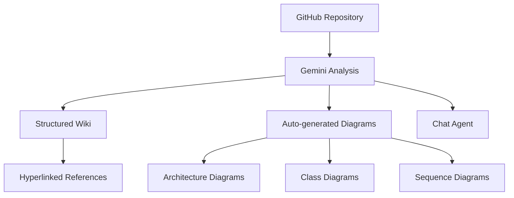
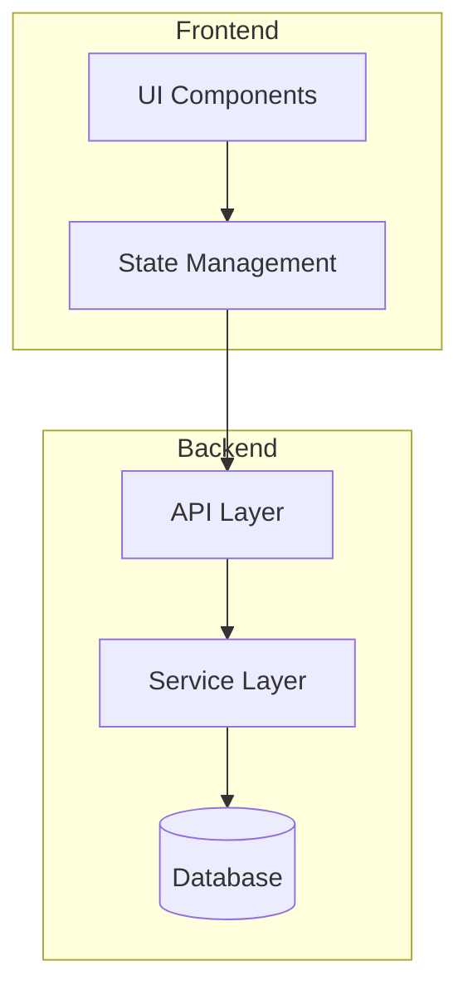
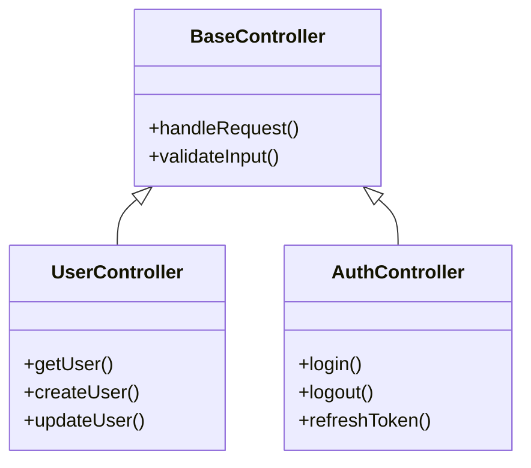
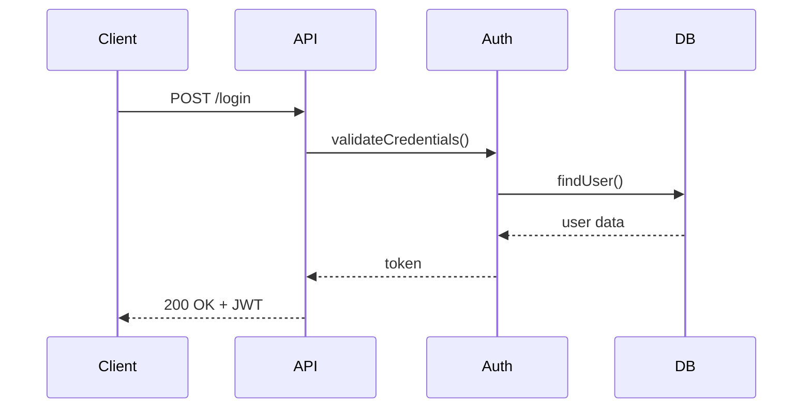
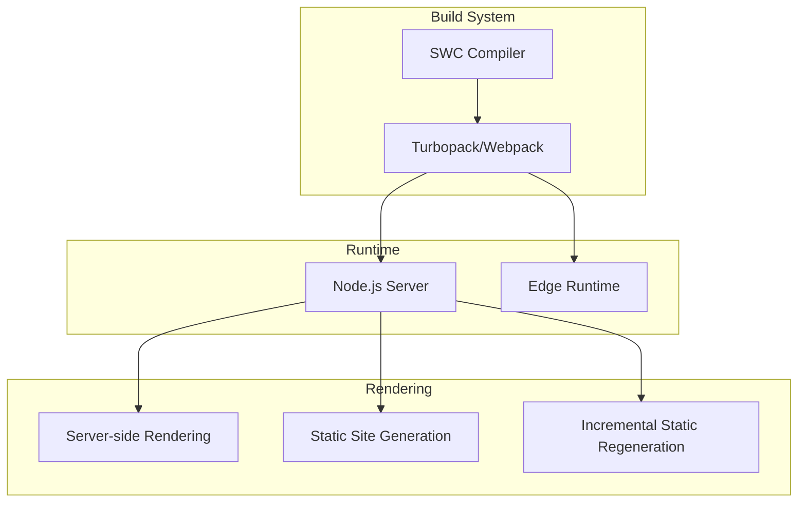

Understanding a new codebase has always been one of the most time-consuming challenges in software development. Whether you're onboarding to a new team, contributing to open source, or exploring unfamiliar repositories, the process of navigating through thousands of files to understand architecture and relationships can take days or even weeks.

Google has addressed this challenge with <strong>Code Wiki</strong>, an AI-powered documentation system that automatically generates structured, interactive documentation for any public GitHub repository. Announced on November 13, 2025, as a public preview, Code Wiki leverages Gemini's advanced language understanding to transform how developers explore and understand code.

## What is Google Code Wiki?

Code Wiki is an experimental tool from Google Labs that automatically creates comprehensive wikis for public GitHub repositories. Unlike traditional documentation that requires manual maintenance, Code Wiki uses Gemini AI to analyze codebases and generate up-to-date documentation that stays synchronized with the actual code.

The system goes beyond simple code summarization. It creates an interconnected knowledge base with hyperlinked references, architectural diagrams, and an intelligent chat agent that can answer specific questions about the codebase.



## Key Features

### 1. Automatically Updated Structured Wiki

Code Wiki generates documentation that mirrors the actual structure of your codebase. Each module, class, and function gets its own documentation page with:

- <strong>Purpose and functionality descriptions</strong>: Clear explanations of what each component does
- <strong>Parameter and return value documentation</strong>: Detailed API references
- <strong>Usage examples</strong>: Practical code snippets showing how to use components
- <strong>Related components</strong>: Links to dependent or related code sections

The wiki automatically updates when the repository changes, ensuring documentation never becomes stale.

### 2. Gemini-Powered Chat Agent

One of the most powerful features is the integrated chat agent. Instead of manually searching through documentation, you can ask natural language questions like:

- "How does the authentication flow work?"
- "What are the main entry points for this application?"
- "Show me how to implement a custom middleware"
- "What dependencies does the payment module have?"

The agent understands context and can provide specific, accurate answers with direct references to the relevant code.

### 3. Hyperlinked Code References

Every documentation page includes hyperlinks that connect concepts to their actual implementation. When reading about a class or function, you can click through to:

- The source code location
- Related tests
- Usage examples throughout the codebase
- Configuration files that affect the component

This creates a web of interconnected knowledge that makes navigation intuitive.

### 4. Auto-Generated Diagrams

Code Wiki automatically generates three types of diagrams:

<strong>Architecture Diagrams</strong>: High-level overview of system components and their relationships



<strong>Class Diagrams</strong>: Object-oriented structure showing inheritance and composition



<strong>Sequence Diagrams</strong>: Flow of operations for key processes



## How to Use Code Wiki

### Step 1: Access the Platform

Navigate to [codewiki.google](https://codewiki.google) in your browser. The interface is clean and straightforward, designed to get you exploring code quickly.

### Step 2: Search for a Repository

Enter the GitHub repository URL or search by repository name. Code Wiki supports any public GitHub repository. Popular repositories like React, Next.js, and TensorFlow already have pre-generated wikis for immediate exploration.

Example searches:
- `facebook/react`
- `vercel/next.js`
- `tensorflow/tensorflow`

### Step 3: Explore the Generated Wiki

Once you select a repository, you'll see the automatically generated documentation organized by:

- <strong>Overview</strong>: High-level description of the project
- <strong>Architecture</strong>: System design and component relationships
- <strong>Modules</strong>: Detailed documentation for each code module
- <strong>APIs</strong>: Function and class references
- <strong>Diagrams</strong>: Visual representations of the codebase

### Step 4: Use the Chat Agent

Click on the chat icon to open the Gemini-powered assistant. Start asking questions about the codebase:

```
You: How do I add a new page in Next.js?

Agent: In Next.js, you can add a new page by creating a file in the
`app` directory (for App Router) or `pages` directory (for Pages Router).

For App Router (recommended):
1. Create a new directory in `app/` with your route name
2. Add a `page.tsx` file inside

For example, to create an "about" page:
`app/about/page.tsx`

[View source: app/page.tsx]
[Related: Routing documentation]
```

### Step 5: Navigate Through Diagrams

Use the Diagrams tab to visualize different aspects of the codebase. You can:

- Zoom in/out on architecture diagrams
- Click on components to see their documentation
- Switch between different diagram types
- Export diagrams for presentations

## Practical Example: Exploring Next.js

Let's walk through a practical example of using Code Wiki to understand the Next.js framework.

### Understanding the Project Structure

When you load the Next.js repository, Code Wiki presents an overview:

```
Next.js is a React framework for building full-stack web applications.
You use React Components to build user interfaces, and Next.js for
additional features and optimizations.

Key Concepts:
- App Router: Modern routing system using React Server Components
- Pages Router: Legacy file-system based routing
- API Routes: Backend API endpoints
- Middleware: Request interception and modification
```

### Exploring Specific Features

Ask the chat agent about specific features you want to understand:

```
You: Explain how Server Components work in Next.js

Agent: Server Components in Next.js are React components that render
on the server. They provide several benefits:

1. **Zero client-side JavaScript**: Components don't add to bundle size
2. **Direct database access**: Can query databases without API routes
3. **Automatic code splitting**: Only necessary code is sent to client

By default, all components in the `app` directory are Server Components.
To make a component client-side, add 'use client' directive.

[View implementation: packages/next/src/server/app-render/]
[Related: Client Components documentation]
```

### Viewing Architecture

The architecture diagram shows how Next.js components interact:



## Gemini CLI Extension

Google is developing a Gemini CLI extension that will bring Code Wiki capabilities to your local development environment. This extension will support:

- <strong>Private repository analysis</strong>: Generate wikis for proprietary codebases
- <strong>Local IDE integration</strong>: Access documentation without leaving your editor
- <strong>Custom prompts</strong>: Tailor the documentation generation to your needs
- <strong>Team collaboration</strong>: Share generated documentation within your organization

The private repository support is coming soon. You can join the waitlist at [codewiki.google/waitlist](https://codewiki.google/waitlist) to get early access.

## Advantages and Limitations

### Advantages

<strong>Significant time savings</strong>: What traditionally took days of code exploration can now be accomplished in minutes. The AI-generated documentation provides immediate context and understanding.

<strong>Always up-to-date</strong>: Unlike manually maintained documentation that quickly becomes outdated, Code Wiki automatically synchronizes with repository changes.

<strong>Interactive exploration</strong>: The chat agent allows natural language queries, making it easier to find specific information without knowing exactly where to look.

<strong>Visual understanding</strong>: Auto-generated diagrams provide quick architectural understanding that would otherwise require significant reverse engineering.

<strong>Consistent quality</strong>: Every repository gets the same thorough documentation treatment, regardless of how well the original maintainers documented their code.

### Limitations

<strong>Public repositories only (currently)</strong>: The public preview only supports public GitHub repositories. Private repository support requires joining the waitlist.

<strong>Gemini dependency</strong>: The quality of documentation depends on Gemini's understanding, which may occasionally misinterpret complex or unconventional code patterns.

<strong>No customization</strong>: Currently, you cannot customize the documentation format or focus areas. The system generates a standard wiki structure for all repositories.

<strong>Limited language support</strong>: While Code Wiki supports most popular programming languages, some niche languages may have reduced documentation quality.

<strong>Internet dependency</strong>: Requires internet access to use, with no offline capabilities for the web version.

## Comparison with Traditional Documentation

| Feature | Traditional Docs | Code Wiki |
|---------|-----------------|-----------|
| Maintenance | Manual, often outdated | Automatic, always current |
| Creation time | Days to weeks | Minutes |
| Code references | Often broken links | Always accurate hyperlinks |
| Diagrams | Manually created | Auto-generated |
| Searchability | Basic text search | AI-powered natural language |
| Consistency | Varies by author | Uniform quality |

## Best Practices for Using Code Wiki

### 1. Start with the Overview

Before diving into specific modules, read the project overview to understand the overall architecture and design philosophy.

### 2. Use the Chat Agent for Specific Questions

Don't browse randomly. Use the chat agent to ask targeted questions about what you need to understand.

### 3. Follow Hyperlinks

When reading about a component, click through to related components to build a complete mental model of how parts interact.

### 4. Export Diagrams for Team Discussions

Use the generated diagrams in technical discussions and architectural reviews. They provide a shared visual language.

### 5. Combine with Original Documentation

Code Wiki complements but doesn't replace original project documentation. Use both sources for the most complete understanding.

## Future Implications

Code Wiki represents a significant shift in how we approach code documentation. As AI capabilities improve, we can expect:

- <strong>Real-time documentation</strong>: Documentation that updates as you write code
- <strong>Personalized explanations</strong>: Documentation tailored to your experience level
- <strong>Cross-repository understanding</strong>: Understanding how different projects interact
- <strong>Automated onboarding</strong>: AI-guided tours through codebases for new team members

## Conclusion

Google Code Wiki is a powerful tool that addresses one of the most persistent challenges in software development: understanding unfamiliar codebases. By combining Gemini's advanced language understanding with automated documentation generation, it transforms hours of code exploration into minutes of interactive discovery.

While currently limited to public repositories, the upcoming Gemini CLI extension promises to bring these capabilities to private codebases. For developers who frequently work with open source projects or are evaluating new libraries, Code Wiki is an invaluable tool that's worth exploring.

Try it today at [codewiki.google](https://codewiki.google) and experience a new way of understanding code.

---

<strong>Resources</strong>:
- [Code Wiki Official Site](https://codewiki.google)
- [Google Labs](https://labs.google)
- [Gemini CLI Documentation](https://github.com/google-gemini/gemini-cli)
