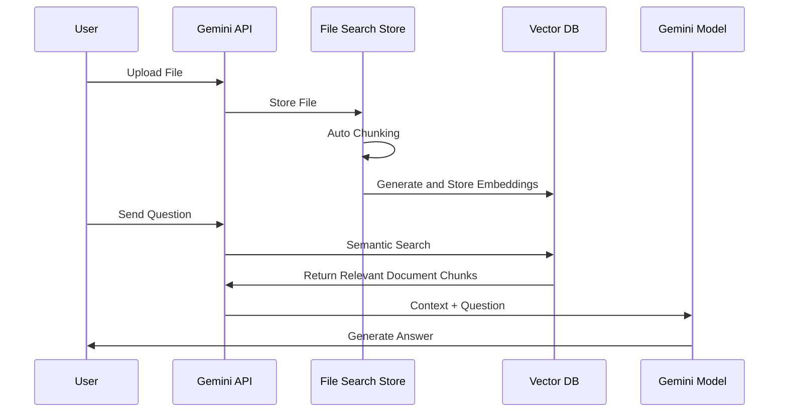

## Overview

On November 7, 2025, Google announced a revolutionary feature developers had been waiting for: the <strong>Gemini API File Search Tool</strong>. This isn't just a simple file search function. It's a fully-managed RAG (Retrieval Augmented Generation) system that completely changes the game for building document-based Q&A systems.

### Why Is It Revolutionary?

Traditionally, building a RAG system required these complex tasks:

- 📄 <strong>Document Chunking</strong>: Splitting documents into appropriate sizes
- 🔢 <strong>Embedding Generation</strong>: Converting each chunk into vectors
- 🗄️ <strong>Vector Database Management</strong>: Setting up and operating Pinecone, Weaviate, Chroma, etc.
- 🔍 <strong>Search Pipeline Optimization</strong>: Tuning similarity search algorithms
- 🔄 <strong>Continuous Maintenance</strong>: Infrastructure scaling, cost management

<strong>File Search Tool automates all of this</strong>, allowing developers to upload files and immediately start asking questions. Like OpenAI's Assistants API did, but with Google's powerful Gemini models.

## What Is File Search Tool?

### RAG Basics

RAG (Retrieval Augmented Generation) is a technique to overcome LLM limitations. LLMs only know up to their training data and don't know the latest information or company-specific internal documents. RAG solves this problem like this:


### Traditional Approach vs File Search Tool

<strong>Traditional Approach</strong> (Self-built):
```python
# 1. Load documents
documents = load_documents("./docs")

# 2. Chunking
chunks = text_splitter.split(documents)

# 3. Generate embeddings
embeddings = openai_embeddings.embed(chunks)

# 4. Store in vector DB
vector_db = Pinecone.from_documents(chunks, embeddings)

# 5. Search and generate
relevant_docs = vector_db.similarity_search(query)
answer = llm.generate(query + relevant_docs)
```

<strong>File Search Tool</strong> (Fully-managed):
```python
# 1. Create Store
store = client.file_search_stores.create(
    config={'display_name': 'My Knowledge Base'}
)

# 2. Upload file (chunking, embedding automatic)
operation = client.file_search_stores.upload_to_file_search_store(
    file='document.pdf',
    file_search_store_name=store.name
)

# 3. Ask questions (search, generation automatic)
response = client.models.generate_content(
    model="gemini-2.5-flash",
    contents="What is the main content of this document?",
    config=types.GenerateContentConfig(
        tools=[
            types.Tool(
                file_search=types.FileSearch(
                    file_search_store_names=[store.name]
                )
            )
        ]
    )
)
```

See the difference? <strong>The code is reduced by over 60%, and complex configuration is completely eliminated.</strong>

## How It Works

File Search Tool operates in three main stages:



### Stage 1: Indexing

When you upload a file, these happen automatically:

- <strong>Auto Chunking</strong>: Document split into semantic units (default 400 tokens)
- <strong>Embedding Generation</strong>: Each chunk converted to 768-dimensional vector
- <strong>Vector Storage</strong>: Stored in Google's managed vector database

### Stage 2: Retrieval

When a user asks a question:

- Convert question to embedding (free!)
- Search for most relevant chunks using cosine similarity
- Select top-K document fragments

### Stage 3: Generation

Gemini model generates the answer:

- Use retrieved documents as context
- Combine with original question to form prompt
- Generate accurate, grounded answer
- Include citation information

## Key Features

### 1. Extensive File Format Support

File Search Tool supports 300+ file formats:

<strong>Application Files (100+ types)</strong>:
- PDF, DOCX, XLSX, PPTX
- JSON, XML, YAML
- SQL, SQLite databases

<strong>Text Files (200+ types)</strong>:
- Markdown, HTML, CSV
- Python, JavaScript, Java, Go, and all major programming languages
- Log files, configuration files

### 2. Custom Chunking Configuration

You can adjust chunking strategy to match document characteristics:

```python
config={
    'chunking_config': {
        'white_space_config': {
            'max_tokens_per_chunk': 400,  # Max tokens per chunk
            'max_overlap_tokens': 40       # Overlap between chunks
        }
    }
}
```

<strong>Recommended Settings</strong>:
- <strong>FAQ Documents</strong>: 200 tokens (short, concise info)
- <strong>Technical Manuals</strong>: 400 tokens (default, balanced)
- <strong>Research Papers</strong>: 600 tokens (long context needed)

### 3. Metadata Filtering

Add metadata when uploading files to refine search:

```python
custom_metadata=[
    {"key": "author", "string_value": "Robert Graves"},
    {"key": "department", "string_value": "Engineering"},
    {"key": "year", "numeric_value": 2025},
    {"key": "is_public", "boolean_value": True}
]
```

### 4. Citation Tracking

Verify sources to increase answer credibility:

```python
response = client.models.generate_content(...)

if hasattr(response, 'grounding_metadata'):
    for citation in response.grounding_metadata.citations:
        print(f"Source: {citation.source}")
        print(f"Citation text: {citation.text}")
```

### 5. Free Query Embeddings

While embedding generation typically costs money, File Search Tool provides <strong>query embeddings for free</strong>. Costs only occur during indexing ($0.15 / 1M tokens).

## Hands-On: Getting Started with Python

Let's actually use File Search Tool. This tutorial uses code I personally tested.

### Environment Setup

<strong>Using uv (Recommended)</strong>:

```bash
# Install uv (if not already installed)
curl -LsSf https://astral.sh/uv/install.sh | sh

# Create project directory
mkdir gemini-file-search-demo
cd gemini-file-search-demo

# Create Python virtual environment
uv venv
source .venv/bin/activate  # Unix/macOS
# .venv\Scripts\activate  # Windows

# Install required packages
uv pip install google-genai streamlit python-dotenv
```

<strong>Using traditional pip</strong>:

```bash
# Python 3.9+ required
python --version

# Install packages
pip install google-genai streamlit python-dotenv
```

### Get API Key

1. Access [Google AI Studio](https://aistudio.google.com)
2. Select "Get API key" from left menu
3. Click "Create API key" button
4. Copy API key

<strong>Create .env file</strong>:

```bash
GEMINI_API_KEY=your-api-key-here
```

### Basic Example Code

A fully working example:

```python
import os
import time
from google import genai
from google.genai import types
from dotenv import load_dotenv

# Load environment variables
load_dotenv()

# Initialize client
client = genai.Client()

# 1. Create File Search Store
print("Creating Store...")
store = client.file_search_stores.create(
    config={'display_name': 'My First Knowledge Base'}
)
print(f"✓ Store created: {store.name}")

# 2. Upload file
print("\nUploading file...")
operation = client.file_search_stores.upload_to_file_search_store(
    file='document.pdf',  # Change to actual file path
    file_search_store_name=store.name,
    config={
        'display_name': 'Sample Document',
        'chunking_config': {
            'white_space_config': {
                'max_tokens_per_chunk': 400,
                'max_overlap_tokens': 40
            }
        }
    }
)

# 3. Wait for upload completion
while not operation.done:
    print("Indexing...")
    time.sleep(5)
    operation = client.operations.get(operation)

print("✓ File upload complete")

# 4. Ask question
print("\nProcessing question...")
response = client.models.generate_content(
    model="gemini-2.5-flash",
    contents="Summarize the main content of this document in 3 points.",
    config=types.GenerateContentConfig(
        tools=[
            types.Tool(
                file_search=types.FileSearch(
                    file_search_store_names=[store.name]
                )
            )
        ],
        temperature=0.2
    )
)

print("\n=== Answer ===")
print(response.text)

# 5. Check citations
if hasattr(response, 'grounding_metadata'):
    print("\n=== Sources ===")
    for idx, citation in enumerate(response.grounding_metadata.citations, 1):
        print(f"{idx}. {citation.source}")
```

## Streamlit Web App Demo

A web interface I actually implemented and tested. You can run it with `uv run python -m streamlit run web_app.py`.

### Web App Structure

Since the full implementation code is long, here are the key parts:

```python
import streamlit as st
from google import genai
from google.genai import types
import time
import os
import uuid

# Page config
st.set_page_config(
    page_title="Gemini File Search",
    page_icon="🔍",
    layout="wide"
)

# Initialize session state
if "client" not in st.session_state:
    st.session_state.client = None
if "store" not in st.session_state:
    st.session_state.store = None
if "chat_history" not in st.session_state:
    st.session_state.chat_history = []

# Client initialization function
def initialize_client(api_key):
    try:
        os.environ["GEMINI_API_KEY"] = api_key
        client = genai.Client()
        return client, None
    except Exception as e:
        return None, str(e)

# File upload function
def upload_file(client, file, store_name):
    try:
        # Create temporary file
        file_ext = os.path.splitext(file.name)[1]
        temp_file = f"temp_{uuid.uuid4().hex}{file_ext}"

        with open(temp_file, "wb") as f:
            f.write(file.getbuffer())

        # Upload
        operation = client.file_search_stores.upload_to_file_search_store(
            file=temp_file,
            file_search_store_name=store_name,
            config={
                "display_name": file.name,
                "chunking_config": {
                    "white_space_config": {
                        "max_tokens_per_chunk": 400,
                        "max_overlap_tokens": 40
                    }
                }
            }
        )

        # Wait for completion
        while not operation.done:
            time.sleep(2)
            operation = client.operations.get(operation)

        # Delete temporary file
        if os.path.exists(temp_file):
            os.remove(temp_file)

        return True, None

    except Exception as e:
        return False, str(e)

# Query function
def query_store(client, question, store_name):
    try:
        response = client.models.generate_content(
            model="gemini-2.5-flash",
            contents=question,
            config=types.GenerateContentConfig(
                tools=[
                    types.Tool(
                        file_search=types.FileSearch(
                            file_search_store_names=[store_name]
                        )
                    )
                ],
                temperature=0.2
            )
        )

        # Extract citation information
        citations = []
        if hasattr(response, "grounding_metadata") and response.grounding_metadata:
            if hasattr(response.grounding_metadata, "citations"):
                for citation in response.grounding_metadata.citations:
                    citations.append({
                        "source": getattr(citation, "source", "N/A"),
                        "text": getattr(citation, "text", "")[:100]
                    })

        return response.text, citations, None

    except Exception as e:
        return None, None, str(e)

# UI composition
st.title("🔍 Gemini File Search")
st.markdown("Document search and Q&A system using Google Gemini API's File Search Tool")

# Sidebar - Settings
with st.sidebar:
    st.header("⚙️ Settings")

    api_key = st.text_input(
        "Gemini API Key",
        type="password",
        value=os.getenv("GEMINI_API_KEY", ""),
        help="API key issued from Google AI Studio"
    )

    if api_key and not st.session_state.client:
        client, error = initialize_client(api_key)
        if client:
            st.session_state.client = client
            st.success("✓ Client initialized")
        else:
            st.error(f"Initialization failed: {error}")

    # Store management
    if st.session_state.client:
        st.header("📁 Store Management")

        new_store_name = st.text_input("Store Name", value="My Knowledge Base")
        if st.button("Create"):
            store = client.file_search_stores.create(
                config={"display_name": new_store_name}
            )
            st.session_state.store = store
            st.success(f"✓ Store created: {store.name}")
            st.rerun()

# Tabs for feature separation
tab1, tab2 = st.tabs(["💬 Q&A", "📤 File Upload"])

# Q&A tab
with tab1:
    st.header("Question & Answer")

    # Display chat history
    for chat in st.session_state.chat_history:
        with st.chat_message("user"):
            st.write(chat["question"])

        with st.chat_message("assistant"):
            st.write(chat["answer"])

            if chat.get("citations"):
                with st.expander("📚 Citations"):
                    for i, citation in enumerate(chat["citations"], 1):
                        st.markdown(f"**{i}. {citation['source']}**")
                        st.text(f"   {citation['text']}...")

    # Question input
    question = st.chat_input("Enter your question...")

    if question:
        with st.chat_message("user"):
            st.write(question)

        with st.chat_message("assistant"):
            with st.spinner("Generating answer..."):
                answer, citations, error = query_store(
                    st.session_state.client,
                    question,
                    st.session_state.store.name
                )

                if answer:
                    st.write(answer)

                    if citations:
                        with st.expander("📚 Citations"):
                            for i, citation in enumerate(citations, 1):
                                st.markdown(f"**{i}. {citation['source']}**")
                                st.text(f"   {citation['text']}...")

                    # Add to history
                    st.session_state.chat_history.append({
                        "question": question,
                        "answer": answer,
                        "citations": citations
                    })
                else:
                    st.error(f"Error: {error}")

# File upload tab
with tab2:
    st.header("File Upload")

    uploaded_files = st.file_uploader(
        "Select files",
        accept_multiple_files=True,
        type=["pdf", "txt", "docx", "md", "csv"],
        help="You can upload PDF, TXT, DOCX, Markdown, CSV files"
    )

    if uploaded_files and st.button("Start Upload", type="primary"):
        progress_bar = st.progress(0)

        for i, file in enumerate(uploaded_files):
            success, error = upload_file(
                st.session_state.client,
                file,
                st.session_state.store.name
            )

            if success:
                st.success(f"✓ {file.name}")
            else:
                st.error(f"✗ {file.name}: {error}")

            progress_bar.progress((i + 1) / len(uploaded_files))

        st.rerun()
```

### Running the App

```bash
# Run Streamlit
uv run python -m streamlit run web_app.py

# Or traditional way
streamlit run web_app.py
```

Access `http://localhost:8501` in your browser to see the interface.

### Actual Implementation Screens

**1. Main Screen and Store Creation**


In the left sidebar, you can enter your Gemini API key and create a Store. Enter a Store name and click the "generation" button to create a new File Search Store.

**2. File Upload Interface**


In the "File Upload" tab, you can select and upload multiple files simultaneously. Supports various formats including PDF, TXT, DOCX, Markdown, and CSV.

**3. Q&A Interface**


In the "Q&A" tab, you can ask questions about uploaded documents in natural language. The conversation proceeds in chat format, with citations displayed alongside answers.

**4. Store Management and File List**


You can check the information of the currently selected Store and the list of uploaded files.

**5. Q&A Result Example**


Answers to actual questions are displayed, and you can verify the document sources that served as the basis for the answers.

### Key Features
- ✅ API key configuration and client initialization
- ✅ File Search Store creation and management
- ✅ File upload (supports multiple files simultaneously)
- ✅ Interactive Q&A (chat interface)
- ✅ Citation display
- ✅ Upload progress indication

## Comparison with Existing Solutions

### OpenAI Assistants File Search vs Gemini File Search

| Feature | OpenAI Assistants | Gemini File Search |
|---------|-------------------|-------------------|
| <strong>Supported File Formats</strong> | 20+ types | 300+ types |
| <strong>Max File Size</strong> | 512MB | 100MB |
| <strong>Free Query Embeddings</strong> | ✗ | ✓ |
| <strong>Chunking Customization</strong> | Limited | Fine-grained control |
| <strong>Metadata Filtering</strong> | ✓ | ✓ (future enhancement) |
| <strong>Pricing (Indexing)</strong> | $0.10 / GB/day | $0.15 / 1M tokens |
| <strong>Model Performance</strong> | GPT-4 Turbo | Gemini 2.5 Pro/Flash |

### LangChain + Vector DB vs Managed RAG

| Aspect | Self-built (LangChain) | Gemini File Search |
|--------|----------------------|-------------------|
| <strong>Setup Complexity</strong> | High (chunking, embeddings, vector DB) | Low (file upload only) |
| <strong>Development Time</strong> | Days to weeks | Minutes |
| <strong>Maintenance</strong> | Continuous management needed | Google manages |
| <strong>Scaling</strong> | Manual scaling | Auto-scaling |
| <strong>Cost Prediction</strong> | Complex (infra + ops) | Clear (usage-based) |
| <strong>Customization</strong> | Full control | Limited control |
| <strong>Initial Cost</strong> | High (learning curve) | Low (immediate start) |

### When to Use What?

<strong>Choose Gemini File Search</strong>:
- ✅ Rapid prototyping and MVP development
- ✅ Small to medium-scale document search systems
- ✅ Limited development resources
- ✅ Want to minimize infrastructure management

<strong>Consider Self-building</strong>:
- ✅ Need full control and customization
- ✅ Require special embedding models
- ✅ On-premise deployment is mandatory
- ✅ Extremely large scale documents (hundreds of GB+)

## Real-World Use Cases

### 1. Customer Support System

<strong>Scenario</strong>: Build 24/7 auto-response system based on SaaS product FAQs and technical docs

```python
# Create support store
support_store = client.file_search_stores.create(
    config={'display_name': 'Customer Support KB'}
)

# Upload FAQ documents (using short chunks)
faq_files = ['general_faq.pdf', 'technical_faq.pdf', 'billing_faq.pdf']

for faq in faq_files:
    operation = client.file_search_stores.upload_to_file_search_store(
        file=faq,
        file_search_store_name=support_store.name,
        config={
            'chunking_config': {
                'white_space_config': {
                    'max_tokens_per_chunk': 200,  # Short answers for FAQ
                    'max_overlap_tokens': 20
                }
            }
        }
    )
    # Wait for completion...

# Handle customer questions
def answer_customer(question):
    response = client.models.generate_content(
        model="gemini-2.5-flash",
        contents=f"""Customer Question: {question}

        Please answer the above question in the following format, referring to FAQ documents:
        1. Clear and concise answer
        2. Related document links (if any)
        3. Guidance if additional support is needed
        """,
        config=types.GenerateContentConfig(
            tools=[
                types.Tool(
                    file_search=types.FileSearch(
                        file_search_store_names=[support_store.name]
                    )
                )
            ],
            temperature=0.2  # Consistent answers
        )
    )
    return response.text
```

<strong>Expected Impact</strong>:
- 📉 30-50% reduction in support tickets
- ⚡ Average response time: hours → seconds
- 💰 Millions in annual labor cost savings

### 2. Research Paper Analysis

<strong>Scenario</strong>: Upload dozens of papers on a specific topic for comprehensive analysis

```python
# Create research store
research_store = client.file_search_stores.create(
    config={'display_name': 'AI Research Papers 2024-2025'}
)

# Batch upload PDFs from papers folder
import os
papers_dir = './papers'
pdf_files = [f for f in os.listdir(papers_dir) if f.endswith('.pdf')]

for pdf in pdf_files:
    operation = client.file_search_stores.upload_to_file_search_store(
        file=os.path.join(papers_dir, pdf),
        file_search_store_name=research_store.name,
        config={
            'display_name': pdf,
            'chunking_config': {
                'white_space_config': {
                    'max_tokens_per_chunk': 600,  # Papers need long context
                    'max_overlap_tokens': 60
                }
            },
            'custom_metadata': [
                {'key': 'type', 'string_value': 'research_paper'},
                {'key': 'year', 'numeric_value': 2025}
            ]
        }
    )
    # Wait for completion...

# Literature review query
def literature_review(topic):
    prompt = f"""
    Topic: {topic}

    Analyzing uploaded research papers, please provide:

    1. <strong>Research Trends</strong>: Recent research flow on this topic
    2. <strong>Key Methodologies</strong>: Approaches used in each paper
    3. <strong>Commonalities and Differences</strong>: Comparative analysis between studies
    4. <strong>Research Gaps</strong>: Areas not yet addressed
    5. <strong>Future Directions</strong>: Proposed research topics

    Please cite relevant papers for each item.
    """

    response = client.models.generate_content(
        model="gemini-2.5-pro",  # Use Pro model for complex analysis
        contents=prompt,
        config=types.GenerateContentConfig(
            tools=[
                types.Tool(
                    file_search=types.FileSearch(
                        file_search_store_names=[research_store.name]
                    )
                )
            ],
            temperature=0.3
        )
    )
    return response.text

# Usage
review = literature_review("Transformer Architecture Efficiency Improvements")
print(review)
```

<strong>Expected Impact</strong>:
- 📚 Analyze dozens of papers in minutes
- 🔍 Discover hidden patterns and trends
- 📝 80% reduction in literature review writing time

### 3. Enterprise Knowledge Management

<strong>Scenario</strong>: Integrate department documents for company-wide search system

```python
# Create stores by department
departments = ['Engineering', 'Marketing', 'Sales', 'HR']
stores = {}

for dept in departments:
    store = client.file_search_stores.create(
        config={'display_name': f'{dept} Knowledge Base'}
    )
    stores[dept] = store

# Integrated search function
def search_company_knowledge(question, departments=None):
    """Company-wide or specific department search"""
    if departments is None:
        departments = list(stores.keys())

    store_names = [stores[dept].name for dept in departments]

    response = client.models.generate_content(
        model="gemini-2.5-flash",
        contents=question,
        config=types.GenerateContentConfig(
            tools=[
                types.Tool(
                    file_search=types.FileSearch(
                        file_search_store_names=store_names
                    )
                )
            ]
        )
    )
    return response.text

# Usage examples
# Company-wide search
answer = search_company_knowledge("What is the new employee onboarding procedure?")

# Search specific departments only
answer = search_company_knowledge(
    "What is the API authentication method?",
    departments=['Engineering']
)
```

<strong>Expected Impact</strong>:
- 🚀 90% reduction in information search time
- 🤝 Increased cross-department knowledge sharing
- 💡 Leverage hidden information assets

## Limitations and Considerations

### Current Limitations

| Item | Limit | Notes |
|------|-------|-------|
| <strong>Max File Size</strong> | 100 MB/file | Large files need splitting |
| <strong>Storage Size (Free)</strong> | 1 GB | Paid plan recommended for production |
| <strong>Storage Size (Tier 1)</strong> | 10 GB | Suitable for SMBs |
| <strong>Storage Size (Tier 2)</strong> | 100 GB | Suitable for enterprises |
| <strong>Storage Size (Tier 3)</strong> | 1 TB | Large-scale systems |
| <strong>Recommended Store Size</strong> | < 20 GB | Search performance optimization |
| <strong>Original File Retention</strong> | 48 hours | Auto-deleted after |

### Considerations

<strong>1. Data Security</strong>

- Files are stored on Google servers
- Encrypt or mask sensitive data before upload
- Check data sovereignty issues (specific country legal requirements)

<strong>2. Cost Management</strong>

```python
# Indexing cost prediction
Document size = 10 MB
Token count ≈ 10 MB × 1,000,000 bytes × 0.3 tokens/byte ≈ 3M tokens
Cost = 3M × $0.15 / 1M = $0.45
```

- Prevent duplicate indexing (watch for re-uploading same files)
- Regular Store cleanup (delete unnecessary files)
- Consider caching strategy (cache frequently asked questions)

<strong>3. Rate Limits</strong>

API calls have speed limits:
- Requests per minute limit
- Simultaneous upload limits
- Recommended to implement exponential backoff retry

```python
import time
from google.api_core.exceptions import ResourceExhausted

def upload_with_retry(file, store_name, max_retries=3):
    for attempt in range(max_retries):
        try:
            operation = client.file_search_stores.upload_to_file_search_store(
                file=file,
                file_search_store_name=store_name
            )
            return operation

        except ResourceExhausted:
            if attempt < max_retries - 1:
                wait_time = 2 ** attempt  # Exponential backoff: 1s, 2s, 4s
                print(f"Rate limited. Retrying in {wait_time}s...")
                time.sleep(wait_time)
            else:
                raise
```

### Pricing Policy

| Item | Price | Description |
|------|-------|-------------|
| <strong>Indexing (Embedding Generation)</strong> | $0.15 / 1M tokens | One-time on file upload |
| <strong>Storage</strong> | Free | Currently free (may change) |
| <strong>Query Embeddings</strong> | Free | Embedding generation on query free |
| <strong>Retrieved Tokens</strong> | Standard rate | Tokens used as context |
| <strong>Generated Tokens</strong> | Standard rate | Gemini model output |

<strong>Cost Reduction Tips</strong>:
- Prevent re-indexing same files
- Clean up unnecessary documents
- Set appropriate chunk size (too small increases cost)
- Cache query results

## Conclusion

Google Gemini File Search Tool is a <strong>paradigm shift</strong> in RAG system building. Without worrying about complex vector database setup, embedding management, or infrastructure scaling, you can upload files and start asking questions immediately.

### Key Advantages Summary

✅ <strong>Remove Entry Barriers</strong>: Setup that took days reduced to minutes
✅ <strong>Cost Efficiency</strong>: Usage-based billing without infrastructure costs
✅ <strong>Auto-Scaling</strong>: Google manages infrastructure
✅ <strong>Broad Support</strong>: 300+ file formats
✅ <strong>High Quality</strong>: Powerful understanding of Gemini models

### Future Outlook

Google has included these improvements in its roadmap:

- 🔍 Advanced metadata filtering queries
- 📊 Multimodal search (image, table recognition)
- ⚡ Real-time document updates (incremental indexing)
- 🌐 Support for more file formats

### Get Started Now!

If you need a RAG system, you no longer need to go through a complex building process. Get an API key from Google AI Studio and create your first document search system in 5 minutes.

```bash
# Start now
pip install google-genai
export GEMINI_API_KEY="your-key"
python your_first_rag.py
```

<strong>The future of document search is already here. 🚀</strong>

## References

### Official Documentation
- [File Search Official Docs](https://ai.google.dev/gemini-api/docs/file-search)
- [File Search API Reference](https://ai.google.dev/api/file-search/file-search-stores)
- [Google AI Studio](https://aistudio.google.com)
- [Official Announcement Blog](https://blog.google/technology/developers/file-search-gemini-api/)

### Related Technology
- [RAG Concept Paper](https://arxiv.org/abs/2005.11401)
- [Semantic Search Understanding](https://en.wikipedia.org/wiki/Semantic_search)
- [Vector Databases Guide](https://www.pinecone.io/learn/vector-database/)

### GitHub Repositories
- [Gemini API Python SDK](https://github.com/google-gemini/generative-ai-python)
- [Example Code Collection](https://github.com/google-gemini/cookbook)
