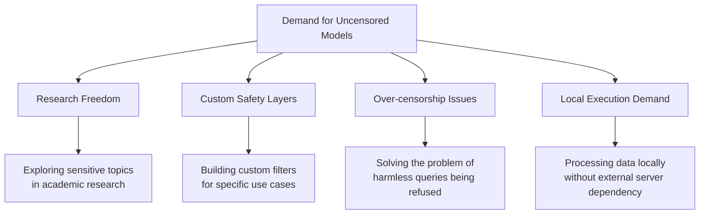
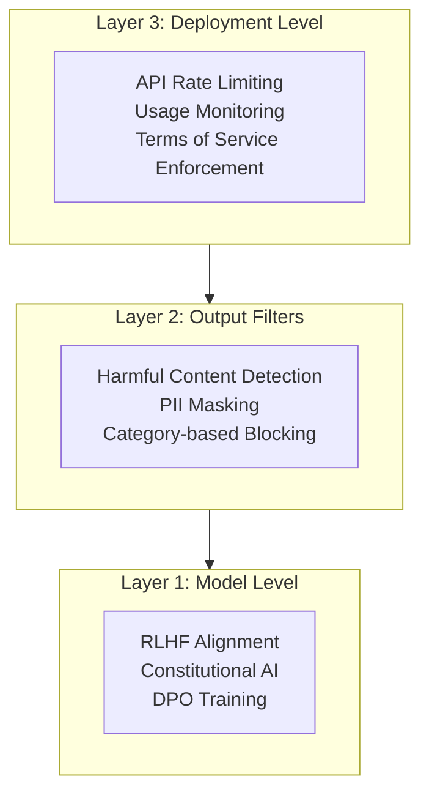
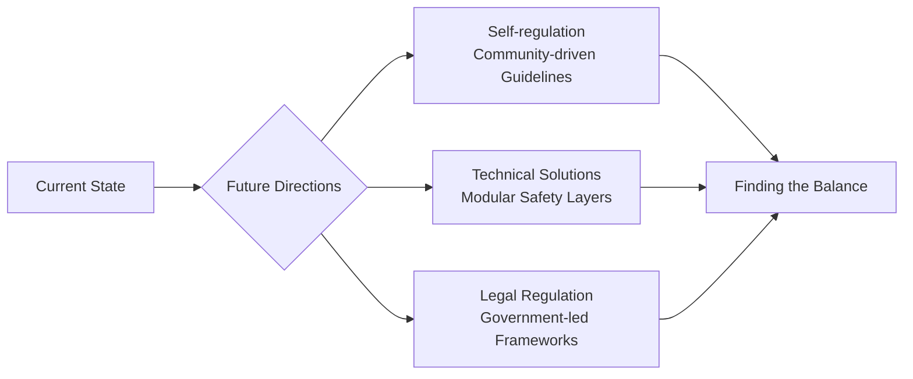

## Overview

In early 2026, a major wave rippled through the open-source LLM community. The release of <strong>GPT-OSS 120B Uncensored</strong>, a 117-billion-parameter uncensored model, has sparked intense debate around "removing AI censorship" on Reddit's r/LocalLLaMA and beyond.

This post examines the technical background of GPT-OSS 120B Uncensored, why uncensored models are gaining traction, and the technical and ethical issues surrounding safety guardrails.

## What Is GPT-OSS 120B Uncensored?

### Model Overview

GPT-OSS 120B Uncensored is an open-source model that removes <strong>safety filters</strong> and <strong>RLHF-based censorship layers</strong> from existing large language models.

- <strong>Parameters</strong>: Approximately 117 billion (117B)
- <strong>Platform</strong>: Hugging Face
- <strong>Derivatives</strong>: Various community fine-tuned versions including Aggressive variants
- <strong>Formats</strong>: bf16, GGUF, and various quantized versions available

### What "Uncensored" Really Means

"Uncensored" here doesn't simply mean allowing profanity or adult content. Technically, it encompasses the following changes:

```
Standard model safety pipeline:
[User Input] → [Input Filter] → [Model Inference] → [Output Filter] → [RLHF Alignment] → [Response]

Uncensored model:
[User Input] → [Model Inference] → [Response]
```

- <strong>RLHF alignment removal</strong>: Disabling forced steering toward "helpful but harmless" behavior
- <strong>Refusal pattern removal</strong>: Eliminating training data for "I'm sorry, I can't help with that" type responses
- <strong>Topic restriction removal</strong>: Relaxing response limitations in sensitive domains like medicine, law, and chemistry

## Why Are Uncensored Models Gaining Attention?

### The Researcher and Developer Perspective



The key reasons uncensored models are supported in the r/LocalLLaMA community:

1. <strong>Over-censorship problem</strong>: Commercial models frequently refuse harmless requests
2. <strong>Research purposes</strong>: Unrestricted models are essential for bias research and red-team testing
3. <strong>Custom safety layers</strong>: Demand for building proprietary safety mechanisms on top of base models
4. <strong>Privacy</strong>: Processing sensitive data locally without sending it to external APIs

### Community Response

The topic garnered over 224 points on Reddit r/LocalLLaMA, demonstrating strong interest from the open-source AI community. Opinions are broadly divided:

- <strong>Supporters</strong>: "AI models are just tools — users should bear responsibility"
- <strong>Critics</strong>: "Unrestricted access increases the risk of misuse"

## The Safety Guardrail Debate

### Technical Perspective: How Guardrails Are Implemented

Current LLM safety measures operate across three main layers:



Uncensored models remove the constraints at <strong>Layer 1 (Model Level)</strong>. For researchers, this is like accessing raw materials, but it also means all safety mechanisms are stripped away.

### Ethical Perspective: The Open-Source AI Dilemma

The release of uncensored models exposes the fundamental dilemma of open-source AI:

| Issue | Open-Source Freedom Advocates | Safety-First Proponents |
|-------|------------------------------|------------------------|
| <strong>Access</strong> | Equal AI access for everyone | Arming malicious actors too |
| <strong>Transparency</strong> | Resolving opaque censorship criteria | Transparency and unrestricted access are different things |
| <strong>Innovation</strong> | Unrestricted experimentation drives innovation | Innovation shouldn't come at the cost of societal harm |
| <strong>Responsibility</strong> | Users, not tool makers, are responsible | Providers bear responsibility for foreseeable harm |

### Regulatory Landscape

AI regulation efforts across major jurisdictions are also shaping this debate:

- <strong>EU AI Act</strong>: Mandating obligations for high-risk AI systems, with open-source exemptions under discussion
- <strong>United States</strong>: Emphasizing voluntary self-regulation via executive orders, reluctant to regulate open-source models
- <strong>Japan</strong>: Soft regulatory approach through AI business operator guidelines
- <strong>China</strong>: Strong pre-emptive regulation through Generative AI Management Provisions

## Technical Considerations

### Local Execution Environment

Minimum requirements for running a 120B-parameter model locally:

```bash
# bf16 full precision: ~240GB VRAM required
# GGUF Q4 quantization: ~60-70GB VRAM/RAM
# GGUF Q2 quantization: ~35-40GB VRAM/RAM

# Typical execution setup (llama.cpp)
./llama-server \
  --model gpt-oss-120b-uncensored-Q4_K_M.gguf \
  --ctx-size 4096 \
  --n-gpu-layers 80 \
  --host 0.0.0.0 \
  --port 8080
```

### Building Custom Safety Layers

An approach to maintaining safety while leveraging uncensored models:

```python
# Pattern for building custom safety layers on uncensored models
class CustomSafetyLayer:
    def __init__(self, base_model, safety_config):
        self.model = base_model
        self.config = safety_config
        self.classifier = self._load_safety_classifier()
    
    def generate(self, prompt: str) -> str:
        # Input validation (domain-specific custom rules)
        if self._check_input(prompt):
            response = self.model.generate(prompt)
            # Output filtering (use-case-specific custom rules)
            return self._filter_output(response)
        return self._get_rejection_message(prompt)
    
    def _check_input(self, prompt: str) -> bool:
        # Custom input validation for organization/use case
        risk_score = self.classifier.evaluate(prompt)
        return risk_score < self.config.threshold
```

The advantage of this approach is the ability to build <strong>safety mechanisms optimized for specific use cases</strong>. A medical chatbot applies medical rules while an educational one applies educational rules.

## The Future Direction of Open-Source AI

The uncensored model debate extends beyond a simple "censorship vs. freedom" dichotomy into governance questions for the open-source AI ecosystem.



The most promising direction is a <strong>modular safety architecture</strong>:
- Base models released without restrictions
- Safety layers provided as separate modules
- Appropriate safety levels selected based on use case
- Clear accountability at the deployment layer

## Conclusion

The emergence of GPT-OSS 120B Uncensored raises a fundamental question facing the open-source AI community: <strong>"Can technological freedom and safety coexist?"</strong>

Key takeaways:

1. <strong>Uncensored models are neutral tools</strong>: Legitimate use cases exist for research and custom safety layer development
2. <strong>Over-censorship is a real problem</strong>: Excessive refusals from commercial models are driving uncensored demand
3. <strong>Modular safety is the answer</strong>: Separating base models from safety layers is the most practical approach
4. <strong>Community governance is needed</strong>: Legal regulation alone cannot control the open-source ecosystem
5. <strong>Ongoing dialogue is essential</strong>: Ethical frameworks must evolve at the pace of technological advancement

As long as open-source LLMs continue to evolve, this debate will remain a core agenda item in AI development.

## References

- [Reddit r/LocalLLaMA — GPT-OSS 120B Uncensored Discussion](https://www.reddit.com/r/LocalLLaMA/)
- [Hugging Face — GPT-OSS 120B Uncensored Model Page](https://huggingface.co/models?search=uncensored+120b)
- [EU AI Act Official Documentation](https://artificialintelligenceact.eu/)
- [NIST AI Risk Management Framework](https://www.nist.gov/artificial-intelligence/ai-risk-management-framework)
