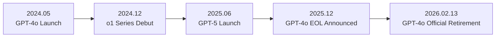
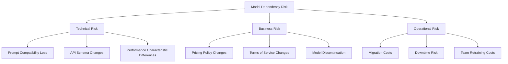
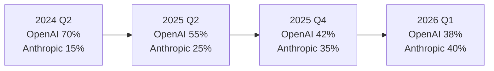
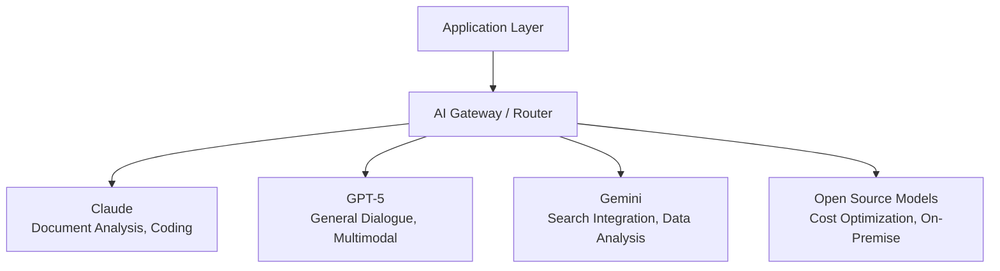
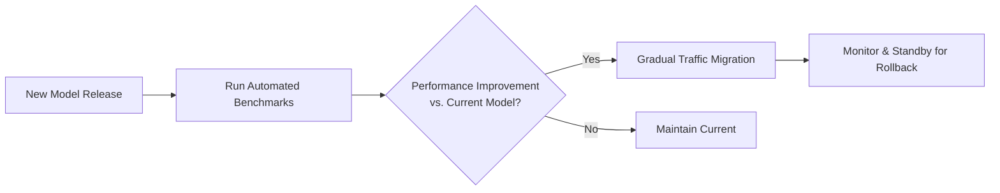

## Overview

On February 13, 2026, OpenAI's GPT-4o officially retires. It's been roughly two years since its launch in May 2024. This event is more than a simple model swap. It's a case that <strong>vividly exposes the structural risks companies face when depending on a single model</strong>, and it's also a key to understanding how Anthropic's Claude overtook OpenAI in the enterprise market.

In this article, we analyze the impact of GPT-4o's retirement on corporate AI strategy, why Claude has risen in the enterprise market, and why a multi-model strategy is essential.

## GPT-4o Retirement: What Changes

### Timeline

GPT-4o was released in May 2024 and established itself as OpenAI's flagship model. Its multimodal capabilities, fast response times, and reasonable pricing led many companies to integrate it into production systems.



### Affected Companies

Companies running production systems that directly call the GPT-4o API face the following challenges:

- <strong>API Endpoint Migration</strong>: Adapting to changes in GPT-4o-specific parameters and response formats
- <strong>Prompt Re-optimization</strong>: The cost of rewriting prompts for the new model
- <strong>Performance Regression Testing</strong>: Verifying existing workflows maintain quality on the new model
- <strong>Cost Structure Changes</strong>: Budget restructuring due to token pricing changes in successor models

## What Is Model Dependency Risk

### The AI Version of Vendor Lock-in

Similar to traditional vendor lock-in in software, a new form of dependency has emerged in the AI space: <strong>Model Lock-in</strong>.



### Real-World Case: The Dilemma of GPT-4o-Dependent Companies

Let's examine the typical problems faced by companies deeply dependent on GPT-4o:

1. <strong>Depreciation of Prompt Engineering Assets</strong>: Prompts optimized over months don't work the same on the new model
2. <strong>Loss of Fine-tuned Models</strong>: Custom models fine-tuned on GPT-4o may lose compatibility
3. <strong>Resetting Evaluation Criteria</strong>: Quality benchmarks and evaluation pipelines need to be rebuilt from scratch

## Claude's Enterprise Market Share Overtake

### Why Companies Are Moving to Claude

Anthropic's Claude has shown remarkable growth in the enterprise market since late 2025. Several structural factors explain this trend:

<strong>1. Safety-First Philosophy</strong>

Anthropic delivers safety technologies like Constitutional AI in enterprise-ready formats. This approach has earned high trust in heavily regulated sectors like finance, healthcare, and legal.

<strong>2. Consistent API Policies</strong>

While OpenAI created uncertainty for enterprise customers with frequent model changes and API updates, Anthropic has maintained relatively stable model versioning and clear deprecation policies.

<strong>3. Superior Coding and Analysis Capabilities</strong>

Since Claude 3.5 Sonnet, the Claude series has outperformed competing models in coding, document analysis, and long-form processing. It's particularly well-regarded for internal document processing and automated code review.

<strong>4. Practical 200K Context Window</strong>

Claude's 200K-token context window provides direct value in enterprise environments for analyzing lengthy contracts, technical documentation, and codebases.

### Market Share Shifts



These figures are synthesized from industry analyst estimates based on enterprise API usage. Claude adoption rates have surged particularly among Fortune 500 AI deployments.

## Multi-Model Strategy: Managing Risk

### Basic Multi-Model Architecture

A multi-model strategy to escape single-model dependency follows this structure:



### Practical Implementation Strategies

#### 1. Introducing an Abstraction Layer

```typescript
// AI Gateway abstraction example
interface AIProvider {
  name: string;
  chat(messages: Message[], options: ModelOptions): Promise<Response>;
  embed(text: string): Promise<number[]>;
}

class AIRouter {
  private providers: Map<string, AIProvider>;
  private fallbackChain: string[];

  async route(task: TaskType, messages: Message[]): Promise<Response> {
    const primary = this.selectProvider(task);
    try {
      return await primary.chat(messages, this.getOptions(task));
    } catch (error) {
      // Switch to next provider along the fallback chain
      return this.fallback(task, messages, error);
    }
  }

  private selectProvider(task: TaskType): AIProvider {
    // Select the optimal provider based on task type
    switch (task) {
      case 'code-review': return this.providers.get('claude');
      case 'multimodal': return this.providers.get('gpt5');
      case 'search-augmented': return this.providers.get('gemini');
      default: return this.providers.get('claude');
    }
  }
}
```

#### 2. Ensuring Prompt Portability

Principles for designing model-portable prompts:

- <strong>Avoid model-specific features</strong>: Don't rely on system prompt techniques that only work on a specific model
- <strong>Use structured outputs</strong>: JSON Schema-based response formats ensure cross-model compatibility
- <strong>Standardize evaluation criteria</strong>: Build model-agnostic quality evaluation pipelines

#### 3. Continuous Benchmarking



## What Companies Should Do Now

### Immediately Actionable Checklist

1. <strong>Audit current model dependencies</strong>: Catalog all AI models and API call points in production
2. <strong>Establish fallback strategies</strong>: Build automated mechanisms to switch to alternative models during primary model outages
3. <strong>Manage prompt assets</strong>: Version-control prompts and automate model-specific conversion testing
4. <strong>Run cost simulations</strong>: Pre-simulate cost structures for multi-model operations
5. <strong>Diversify team capabilities</strong>: Develop generalist AI engineering skills rather than single-model specialists

### Long-Term Perspective

The AI model market will change even faster going forward. [In February 2026 alone, more than 7 major models are launching simultaneously](/en/blog/ai-model-rush-february-2026). In this environment, <strong>going all-in on a single model is accumulating technical debt</strong>.

## Conclusion

GPT-4o's retirement is a natural generational shift in the AI industry, but it becomes a crisis for unprepared companies. The core lessons from this event are:

1. <strong>Single-model dependency is technical debt</strong>: Every model eventually retires
2. <strong>Abstraction layers are insurance</strong>: Multi-model routing via AI Gateways is not optional—it's essential
3. <strong>Claude's rise wasn't accidental</strong>: Stability, performance, and enterprise-friendly policies drove the market shift
4. <strong>Multi-model strategy is competitive advantage</strong>: A strategic approach leveraging each model's strengths wins

AI models are tools. The real competitive advantage isn't depending on any single tool—it's having the <strong>flexibility to swap tools</strong> as needed.

## References

- [OpenAI Model Deprecation Policy](https://platform.openai.com/docs/deprecations)
- [Anthropic Claude Enterprise](https://www.anthropic.com/enterprise)
- [February 2026 AI Model Rush Analysis](/en/blog/ai-model-rush-february-2026)
