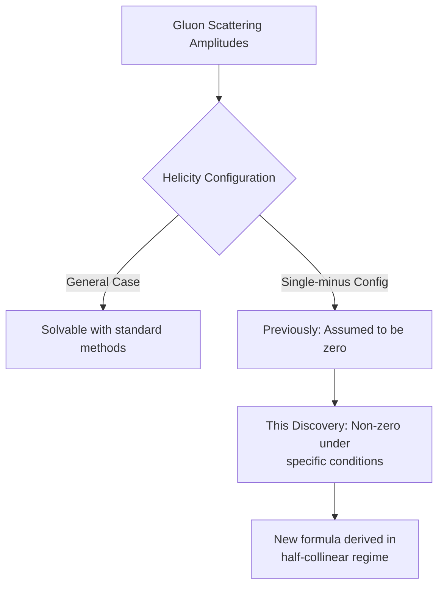
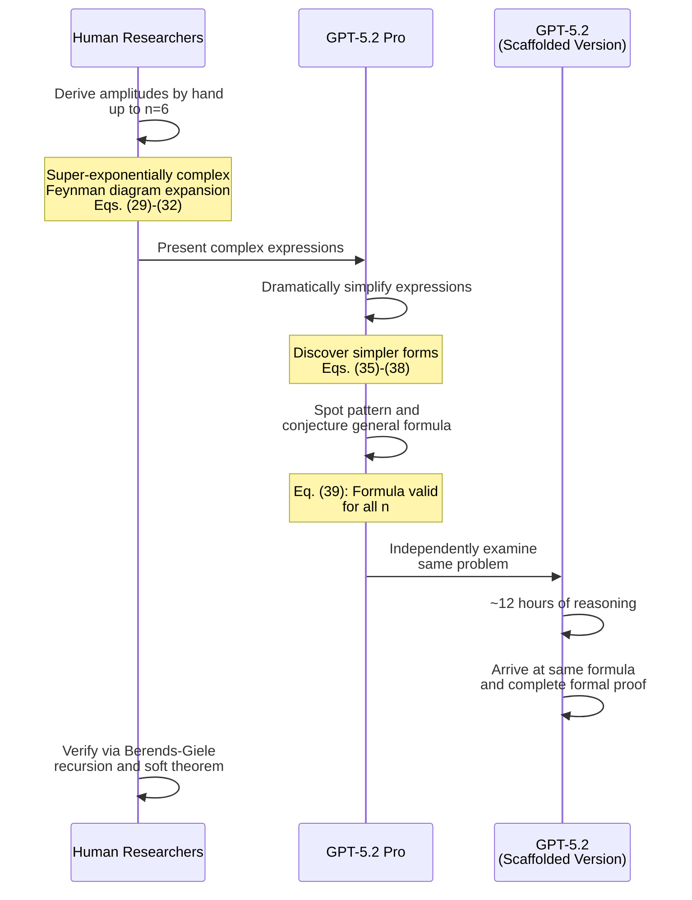
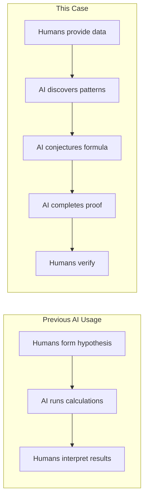
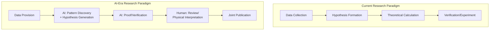

## Overview

In February 2026, OpenAI announced a groundbreaking achievement in theoretical physics. <strong>GPT-5.2 Pro</strong> independently conjectured a new formula for gluon scattering amplitudes (gluons being the particles that carry the strong nuclear force) and <strong>completed a formal proof of its validity</strong>.

The result was published as a preprint on arXiv, authored jointly with researchers from the Institute for Advanced Study at Princeton, Harvard University, and the University of Cambridge. This marks a historic turning point where AI transitions from being a "tool" to a "discoverer" in scientific research.

## What Was Discovered

### Rediscovering Single-Minus Gluon Amplitudes

The paper is titled <strong>"Single-minus gluon tree amplitudes are nonzero."</strong> It addresses a fundamental concept in particle physics: scattering amplitudes.

Standard textbook arguments held that when one gluon has negative helicity and the remaining n-1 gluons have positive helicity, the tree-level amplitude must be zero.

This research demonstrates that in the <strong>"half-collinear regime"</strong> — a specific and precisely defined slice of momentum space — the amplitude does not vanish.

### Why It Matters

Simplifications in scattering amplitudes have repeatedly revealed deeper structures in quantum field theory. This discovery:

- <strong>Overturns textbook assumptions</strong>: Proves that amplitudes long assumed to be zero are in fact non-zero
- <strong>Extends to gravitons</strong>: The same analysis applies to particles mediating gravity
- <strong>Opens new research frontiers</strong>: Serves as a starting point for numerous follow-up investigations

## AI's Role: From Tool to Discoverer

### GPT-5.2's Specific Contributions

AI's role in this research went far beyond computational assistance.

<strong>Step 1</strong>: Human researchers derived scattering amplitudes by hand up to n=6. These were extremely complex expressions.

<strong>Step 2</strong>: GPT-5.2 Pro dramatically simplified these expressions.

<strong>Step 3</strong>: It spotted a pattern in the simplified forms and conjectured a general formula valid for all n (Eq. 39 in the paper).

<strong>Step 4</strong>: An internal scaffolded version of GPT-5.2 independently arrived at the same formula after roughly 12 hours of reasoning and <strong>produced a formal proof</strong>.

### The Crucial Difference from Previous AI Usage

Previously, hypothesis generation was the human's role. In this case:

- <strong>Pattern recognition</strong>: Identified regularities in complex expressions
- <strong>Hypothesis generation</strong>: Independently conjectured a general formula
- <strong>Proof</strong>: Completed a formal proof through ~12 hours of autonomous reasoning

This is one of the first significant cases where AI has taken on the core of the scientific discovery process.

## Reactions from the Scientific Community

### Nima Arkani-Hamed, Professor of Physics, Institute for Advanced Study

> "It happens frequently in this part of physics that expressions for some physical observables, calculated using textbook methods, look terribly complicated, but turn out to be very simple. [...] <strong>I am looking forward to seeing this trend continue towards a general purpose 'simple formula pattern recognition' tool in the near future.</strong>"

### Nathaniel Craig, Professor of Physics, UCSB

> "This preprint felt like <strong>a glimpse into the future of AI-assisted science</strong>, with physicists working hand-in-hand with AI to generate and validate new insights. There is no question that dialogue between physicists and LLMs can <strong>generate fundamentally new knowledge</strong>."

## Impact on Scientific Research Workflows

### A Paradigm Shift in Research

This case demonstrates the potential for fundamental changes in scientific research workflows.

<strong>1. Superhuman Pattern Recognition</strong>

Discovering patterns in super-exponentially complex expressions that are difficult for humans to recognize. GPT-5.2 achieved this, opening the path toward what Arkani-Hamed describes as a "general purpose simple formula pattern recognition tool."

<strong>2. Extended Autonomous Reasoning</strong>

Completing a formal proof over 12 hours demonstrates that AI is capable of deep, sustained thinking — not just short responses.

<strong>3. A New Human-AI Collaboration Model</strong>

This research established a new collaboration pattern where humans perform foundational calculations and AI handles discoveries beyond that. The author list includes Kevin Weil of OpenAI "on behalf of OpenAI," formally recognizing AI's contribution.

### Looking Ahead

The research team has already used GPT-5.2 to:

- Complete the extension from gluons to <strong>gravitons</strong>
- Pursue additional generalizations
- Plan to report these AI-assisted results separately

## Implications for Engineers

### Technical Perspective

This case offers important implications for software engineering:

- <strong>Evolution of AI reasoning</strong>: 12 hours of continuous reasoning and formal proof suggest capabilities beyond code generation and bug fixing
- <strong>Collaboration patterns with domain experts</strong>: The model where humans define problems and AI explores solutions applies to other fields
- <strong>Importance of verification</strong>: The process of humans verifying AI-generated results using established methods (Berends-Giele recursion) remains critical

### The AI Authorship Question

In this paper, Kevin Weil of OpenAI is listed as an author "on behalf of OpenAI." This raises new questions about how to formally recognize AI's scientific contributions.

## Conclusion

GPT-5.2's derivation of new results in theoretical physics marks <strong>a historic turning point where AI functions as a scientific discoverer</strong>. Not merely a computational tool, but a participant in pattern discovery, formula conjecture, and formal proof — the core of the scientific discovery process.

This case provides a template for the future of AI-assisted scientific research: human researchers and AI collaborating as equal partners to reach discoveries that neither could achieve alone. A new era of science is dawning.

## References

- [OpenAI Official Announcement: GPT-5.2 derives a new result in theoretical physics](https://openai.com/index/new-result-theoretical-physics)
- [arXiv Preprint: Single-minus gluon tree amplitudes are nonzero (arXiv:2602.12176)](https://arxiv.org/abs/2602.12176)
