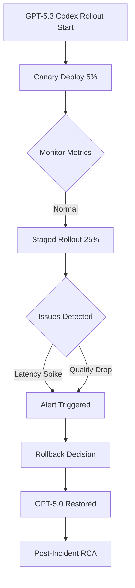
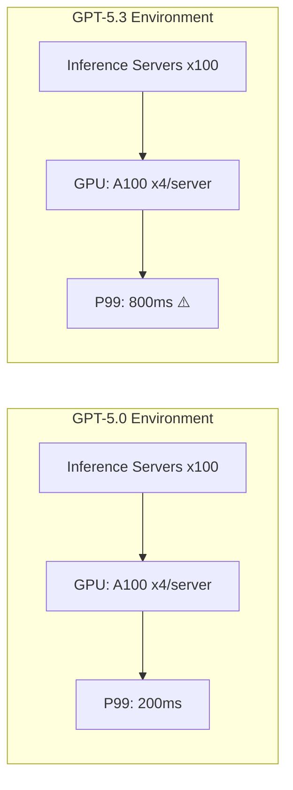

## Overview

In February 2026, GitHub discovered critical reliability issues while rolling out GPT-5.3-based Codex across the platform and made the decision to <strong>temporarily roll back to the previous version (GPT-5.0)</strong>. This incident served as a stark reminder that AI model version upgrades are not simple feature improvements—they directly impact the stability of the entire production infrastructure.

This article analyzes the background and causes of the GitHub Codex rollback and discusses how engineering managers (EMs) should approach AI model upgrade risk management.

## Timeline of Events

### What Is GPT-5.3 Codex?

Codex, the core engine behind GitHub Copilot, provides code generation, auto-completion, and code review capabilities built on OpenAI's GPT models. The upgrade to GPT-5.3 targeted the following improvements:

- <strong>Improved code generation accuracy</strong>: Enhanced multi-file context understanding
- <strong>Faster response times</strong>: Latency reduction through inference optimization
- <strong>New language support</strong>: Expanded support for systems programming languages like Rust and Zig

### Issues During Rollout

The rollout followed a phased approach (canary → staged rollout), but the following issues emerged during the broader deployment phase:

1. <strong>Response latency spike</strong>: P99 latency increased 3–5x compared to baseline
2. <strong>Code suggestion quality degradation</strong>: Increased hallucination rates in TypeScript and Python
3. <strong>VSCode extension crashes</strong>: IDE instability due to surging memory usage
4. <strong>API rate limiting issues</strong>: Cascading failures from overloaded backend inference servers

### The Rollback Decision

The GitHub engineering team decided on an immediate rollback to GPT-5.0, weighing <strong>user impact</strong> and <strong>recovery time</strong>. This was a judgment call based on the "safety-first" principle.

## Technical Analysis: Why Did This Happen?

### 1. Model Size vs. Inference Cost Trade-off

GPT-5.3 had approximately 40% more parameters than 5.0. While theoretically this promises higher-quality output, in a production environment:

- <strong>Increased GPU memory usage</strong> → Fewer concurrent requests per server
- <strong>Longer inference time</strong> → Worse user-perceived latency
- <strong>Reduced batch processing efficiency</strong> → Lower throughput per server

### 2. Prompt Compatibility Issues

System prompts and few-shot examples optimized for GPT-5.0 behaved unexpectedly with 5.3. Specifically:

- <strong>Changed code context window handling</strong>: Differences in file boundary recognition logic
- <strong>Tokenization changes</strong>: Subtle differences in the code tokenizer affecting output
- <strong>Strengthened safety filters</strong>: Overly aggressive filtering blocking legitimate code suggestions

### 3. Infrastructure Scaling Mismatch

Insufficient capacity planning when serving a larger model on the same infrastructure was one of the root causes.

## Lessons from an Engineering Manager's Perspective

### 1. AI Model Upgrades Are Infrastructure Changes

AI model version upgrades should never be treated as simple "software updates." Model changes entail:

- <strong>Infrastructure capacity reassessment</strong>: GPU, memory, network bandwidth
- <strong>Performance baseline reset</strong>: SLA/SLO recalibration
- <strong>Full integration test re-execution</strong>: Downstream service impact evaluation

### 2. Canary Deployments Alone Are Insufficient

In this incident, the canary deployment (5%) failed to surface the issues. This highlights several pitfalls:

- <strong>Traffic pattern differences</strong>: Canary users may have different usage patterns than the general population
- <strong>Load-dependent issues</strong>: Bottlenecks that only appear at certain concurrency levels
- <strong>Time-accumulated problems</strong>: Issues like memory leaks that worsen over time

<strong>Countermeasure</strong>: Shadow traffic testing and load testing must be conducted alongside canary deployments.

### 3. Establish Rollback Strategy in Advance

GitHub's team was able to roll back quickly because <strong>the rollback plan was established beforehand</strong>. As an EM, you should ensure:

- <strong>Feature flag-based deployment</strong>: Design for runtime model version switching
- <strong>Automatic rollback triggers</strong>: Auto-restore when core metrics (latency, error rate) exceed thresholds
- <strong>Rollback rehearsals</strong>: Regularly test rollback scenarios

### 4. User Communication Framework

Transparent communication with users during platform incidents is key to maintaining trust:

- <strong>Immediate status page updates</strong>: Announce within 15 minutes of incident detection
- <strong>Appropriate level of technical disclosure</strong>: Don't over-detail, but clearly state cause and countermeasures
- <strong>Recovery timeline sharing</strong>: Share estimated times even when uncertain

## AI Model Upgrade Risk Management Framework

Here's a checklist for engineering organizations managing AI model version upgrades:

### Pre-deployment

| Item | Details |
|------|---------|
| Benchmark testing | Compare accuracy/latency/throughput vs. existing model |
| Infrastructure capacity verification | Assess and provision for new model resource requirements |
| Prompt compatibility verification | Validate existing system prompts |
| Rollback plan | Feature flags, auto-triggers, rehearsals |
| Shadow testing | Pre-validation using replicated real traffic |

### During Deployment

| Item | Details |
|------|---------|
| Staged rollout | 5% → 25% → 50% → 100% |
| Real-time monitoring | Latency, error rates, user feedback |
| Auto-rollback thresholds | P99 > 2x baseline → auto-halt |
| User impact analysis | Track actual user experience metrics |

### Post-deployment

| Item | Details |
|------|---------|
| RCA (Root Cause Analysis) | Analyze root causes of any issues |
| Postmortem sharing | Blameless postmortem culture |
| Process improvement | Update checklists, enhance automation |

## Impact on the VSCode Extension Ecosystem

This incident also left important implications for the VSCode extension developer ecosystem:

- <strong>Extension stability dependencies</strong>: When the Copilot extension becomes unstable, other extensions are affected too
- <strong>Resource usage guidelines needed</strong>: Memory/CPU limits for AI-based extensions
- <strong>Graceful degradation patterns</strong>: Design IDEs to function normally even during backend failures

## Conclusion

GitHub's GPT-5.3 Codex rollback incident demonstrates <strong>how complex an engineering challenge production AI model deployment truly is</strong>. The assumption that simply applying a "better model" will improve the service is dangerous.

The key takeaways for engineering managers:

1. <strong>AI model changes require the same level of risk management as infrastructure changes</strong>
2. <strong>Triple validation with canary deployment + shadow testing + load testing is essential</strong>
3. <strong>The rollback plan must be part of the deployment plan</strong>
4. <strong>User communication is as important as the technical response</strong>

We hope this incident catalyzes further maturation of deployment processes for AI-based services.

## References

- [GitHub Status — Codex Rollback Announcement](https://x.com/github/status/2021040916451164412)
- [GitHub Copilot Official Documentation](https://docs.github.com/en/copilot)
- [Google SRE Book — Release Engineering](https://sre.google/sre-book/release-engineering/)
- [Progressive Delivery: Feature Flags, Canary, and Shadow Traffic](https://launchdarkly.com/blog/progressive-delivery/)
