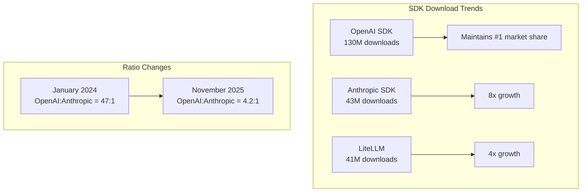
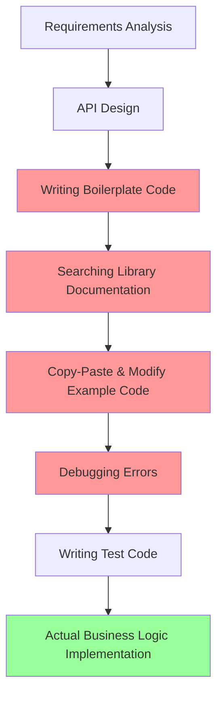
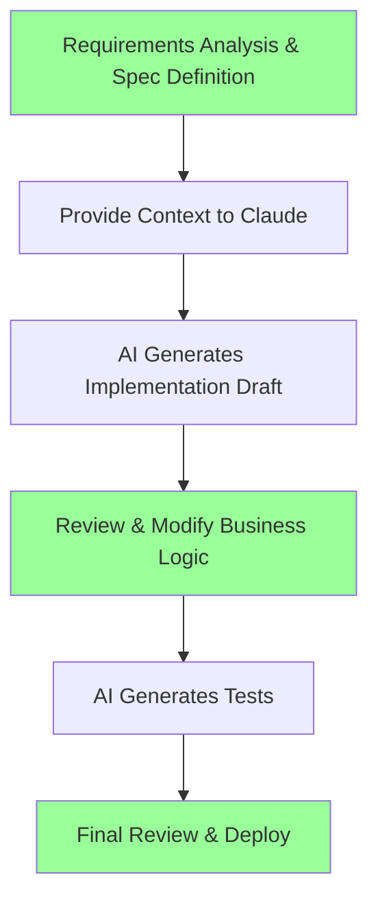

## Overview

Greptile's **"The State of AI Coding 2025"** report has been gaining significant attention in the industry. This report quantitatively analyzes how AI coding tools have actually impacted developer productivity, based on data from March to November 2025.

In this article, I'll summarize the key findings from the report and discuss the practical changes that AI coding tools have brought, based on my personal experience.

> **Note**: This article is a review of the [Greptile State of AI Coding 2025](https://www.greptile.com/state-of-ai-coding-2025) report.

## Key Findings Summary

### 1. Dramatic Changes in Developer Productivity Metrics

Here are the most notable figures from the report:

| Metric | Change Rate | Details |
|--------|-------------|---------|
| **Code output per developer** | **+76%** | 4,450 lines → 7,839 lines |
| **PR size (median)** | **+33%** | 57 lines → 76 lines |
| **Lines changed per file** | **+20%** | 18 lines → 22 lines |

Particularly impressive is that medium-sized teams (6-15 developers) recorded an **89% increase in code output**. This shows that AI tools are effective not just for individual developers but also in team collaboration environments.

### 2. Rapid Growth of the AI Tool Ecosystem

While OpenAI still leads the market, Anthropic's growth is remarkable. The **1,547x growth** figure demonstrates how rapidly Claude is being adopted in the developer community.

### 3. Standardization of CLAUDE.md Files

According to the report, **67% of repositories have adopted CLAUDE.md rule files**. This means providing codebase context to AI agents has become a standard in development workflows.

17% of repositories use all three formats (CLAUDE.md, .cursorrules, .github/copilot-instructions.md), showing that multi-AI tool environments are becoming reality.

### 4. Model Performance Benchmarks

| Model | TTFT (p50) | Cost Multiplier |
|-------|-----------|-----------------|
| Claude Opus 4.5 | < 2.5s | 3.30x |
| Claude Sonnet 4.5 | < 2.5s | 2.00x |
| GPT-5.1 | > 5s | 1x (baseline) |
| GPT-5 Codex | > 5s | 1x |
| Gemini 3 Pro | 13.1s | 1.40x |

Anthropic models show superiority in response speed, which directly impacts developer experience. Reduced latency during code writing keeps the development flow uninterrupted, improving productivity.

## My Experience: Being Able to Focus Only on Specifications and Business Logic

While the report's numbers are impressive, what matters more to me is the **fundamental change in how I work**.

### Before: When Implementation Details Consumed My Time

Previously, I **spent over 70% of development time on implementation details**:
- "How do I configure this library?"
- "What does this error message mean?"
- "I saw similar code somewhere..."
- "How should I structure the test code?"

### After: Currently Focusing on Business Logic

Now I **focus on specification definition and business logic review**:

1. **Clear specification writing**: Clear definition of "what to build"
2. **Context provision**: Project structure and rules via CLAUDE.md
3. **Output review**: Confirming AI-generated code meets business requirements
4. **Core logic tuning**: Handling complex business rules and edge cases

### Specific Productivity Improvement Examples

#### 1. New Feature Development

**Before**: 2-3 hours to add a single new API endpoint
- Routing configuration
- Request/response type definitions
- Error handling
- Writing tests

**Now**: Under 30 minutes
- Explain requirements to Claude
- Review generated code
- Fine-tune business logic
- Run and verify tests

#### 2. Debugging

**Before**: Error log analysis → Stack Overflow search → Trial and error (1-2 hours)

**Now**: Provide error message and context → Cause analysis and solution (10-20 minutes)

#### 3. Code Review

**Before**: Manually checking code style, potential bugs, and performance issues

**Now**: AI does first-pass review, then I focus only on core business logic and architecture decisions

### Quantitative Perceived Changes

| Work Area | Time Saved | Main Reason |
|-----------|------------|-------------|
| Boilerplate code | **90%** | AI generates instantly based on patterns |
| Library learning | **80%** | Context-based examples instead of documentation |
| Debugging | **70%** | Automated error cause analysis |
| Test writing | **75%** | Automatic test case generation |
| Code refactoring | **60%** | Pattern recognition and improvement suggestions |

## The True Meaning of Productivity Improvement

The report mentions a 76% increase in code output, but I believe there's **a more significant change**.

### 1. Reduced Cognitive Load

With AI tools reducing the burden of "how to implement," I can now dedicate more energy to thinking about **"what to build"**.

### 2. Eased Learning Curve

The barrier to adopting new technologies or frameworks has lowered. Instead of reading documentation from scratch, I can immediately get concrete examples tailored to my current codebase.

### 3. Easier Experimentation

Being able to quickly turn ideas into prototypes allows for more experiments and iterations.

## Points to Be Careful About

Of course, AI coding tools are not a silver bullet.

### 1. Importance of Context Provision

For AI to produce good results, **clear context and requirements** are needed. The quality of rule files like CLAUDE.md directly affects the quality of outputs.

### 2. Necessity of Review

AI-generated code should not be used as-is. Especially:
- Security-related code
- Business-critical logic
- Performance-sensitive parts

### 3. Importance of Domain Knowledge

AI is a tool. **Domain expertise and system design capability** remain core competencies for developers.

## Conclusion

Greptile's report demonstrates with data that AI coding tools are positively impacting development productivity. Figures like 76% code output increase and 33% PR size increase support this.

However, the more meaningful change for me is the **transformation in how I work**. Not being consumed by implementation details, I can now **focus on specifications and business logic**. This is what I consider the true productivity improvement brought by AI coding tools.

Developers in the AI era are no longer "people who type code." Their role is evolving into **"people who define problems and design solutions."** And this change is just the beginning.

## References

- [Greptile - The State of AI Coding 2025](https://www.greptile.com/state-of-ai-coding-2025)
- [Anthropic - Claude Code Best Practices](https://www.anthropic.com/engineering/claude-code-best-practices)
- [GitHub - Copilot Impact Report 2024](https://github.blog/news-insights/research/the-state-of-the-octoverse-2024/)
