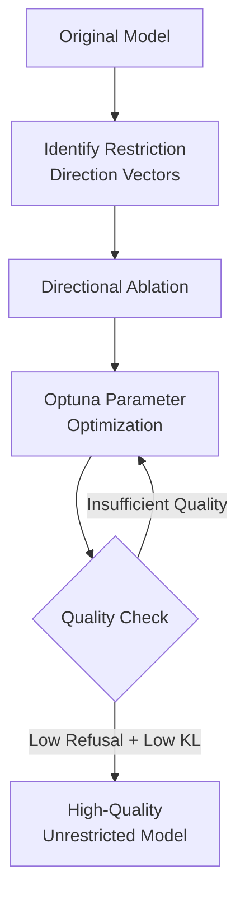
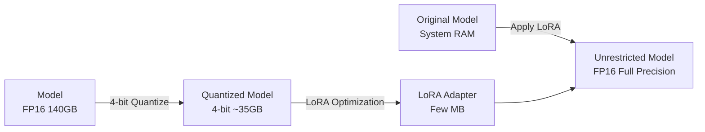
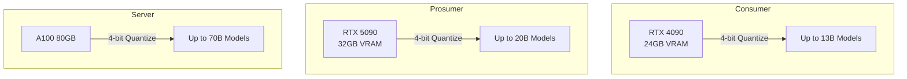

## Overview

When running local LLMs, <strong>VRAM shortage</strong> remains the biggest bottleneck. Abliteration (censorship removal) of large models typically requires loading the full model in full precision, consuming tens of gigabytes of VRAM.

In February 2026, <strong>Heretic 1.2</strong> was released. Earning 268 points on Reddit r/LocalLLaMA, it received strong community recognition. This version introduces <strong>up to 70% VRAM reduction</strong> through 4-bit quantization and a new abliteration technique called <strong>Magnitude-Preserving Orthogonal Ablation (MPOA)</strong>.

## What Is Heretic

[Heretic](https://github.com/p-e-w/heretic) is a tool that automatically removes censorship (safety alignment) from transformer-based language models. Within three months of its initial release, the community has published <strong>over 1,300 models</strong> using Heretic.

Heretic's core technology relies on two pillars:

- <strong>Directional Ablation</strong>: Removing specific directional vectors from the model to disable restrictions
- <strong>TPE-based Parameter Optimization</strong>: Using [Optuna](https://optuna.org/) to co-minimize refusal count and KL divergence



## 70% VRAM Reduction: LoRA-Based Quantization Engine

### The Previous Challenge

Traditional abliteration required loading the entire model in full precision (FP16/BF16) into VRAM. For a 70B parameter model, this means approximately <strong>140GB of VRAM</strong>.

### The New Approach

Heretic 1.2 introduces a <strong>LoRA-based abliteration engine</strong> implemented by contributor accemlcc.

```yaml
# Heretic configuration example
quantization: bnb_4bit    # Enable 4-bit quantization
orthogonalize_direction: true  # Enable MPOA
row_normalization: full        # Row normalization
```

Here's how this approach works:

1. <strong>4-bit Quantized Loading</strong>: Using bitsandbytes to load the model in 4-bit, reducing VRAM usage by up to 70%
2. <strong>LoRA Adapter Optimization</strong>: PEFT-based optimization of abliteration parameters in the quantized state
3. <strong>Full Precision Export</strong>: Re-loading the original model in system RAM and applying the optimized LoRA adapter



### Real-World VRAM Comparison

| Model Size | Traditional | Heretic 1.2 (4-bit) | Reduction |
|:---:|:---:|:---:|:---:|
| 7B | ~14GB | ~4.2GB | 70% |
| 13B | ~26GB | ~7.8GB | 70% |
| 70B | ~140GB | ~42GB | 70% |

Consumer GPUs (RTX 4090, 24GB VRAM) can now process <strong>13B-class models</strong>.

## MPOA: A New Technique for High-Quality Abliteration

### What Is Magnitude-Preserving Orthogonal Ablation

MPOA is an abliteration technique developed by Jim Lai that <strong>minimizes quality degradation</strong> compared to conventional methods.

Traditional abliteration changes the magnitude (norm) of weights when removing restriction direction vectors, degrading model capabilities. MPOA solves this with:

1. <strong>Orthogonal Projection</strong>: Projecting vectors onto a subspace orthogonal to the restriction direction
2. <strong>Norm Preservation</strong>: Restoring the norm of projected vectors to their original magnitude
3. <strong>Optuna Optimization</strong>: Using Optuna to optimize weight parameters and automate layer selection

### Benchmark Comparison

From Heretic's official example, comparing results on the gpt-oss-20b model:

| Model | UGI Score | W/10 | NatInt | Writing |
|:---|:---:|:---:|:---:|:---:|
| Heretic Version (MPOA) | <strong>39.05</strong> | Win | Win | Win |
| Traditional Derestricted | 34.22 | — | — | — |

The Heretic version outperforms across all categories, achieving <strong>approximately 14% improvement in UGI score</strong>.

### Configuration

```yaml
# Enable MPOA
orthogonalize_direction: true
row_normalization: full
```

Just two lines of configuration to benefit from MPOA.

## Other Notable Features

### Vision Language Model (VLM) Support

Heretic 1.2 adds <strong>VLM support</strong> thanks to contributor anrp. Only the text decoder portion is abliterated while the image encoder remains intact.

### Automatic Session Save and Resume

Even if a crash occurs during a long optimization run, Heretic automatically saves progress. Upon restart, it resumes from where it left off. You can also manually interrupt with Ctrl+C and resume later.

## Practical Guide: Using Heretic 1.2

### Prerequisites

- Python 3.10+
- CUDA-capable GPU (NVIDIA GPU required for 4-bit quantization)
- Sufficient system RAM (for full precision export)

### Installation and Execution

```bash
# Install Heretic
pip install heretic

# Basic run (4-bit quantization + MPOA)
heretic --model meta-llama/Llama-3.1-8B-Instruct \
  --quantization bnb_4bit \
  --orthogonalize-direction true \
  --row-normalization full
```

### Recommended Hardware Configurations



## Community Response

The Reddit r/LocalLLaMA post earned <strong>268 points</strong>, reflecting strong community approval. On HuggingFace, <strong>over 1,300 models</strong> created with Heretic have been published, representing more than a third of all abliterated models.

Key highlights from the community:

- <strong>Cost Efficiency</strong>: Large model processing now possible on consumer GPUs
- <strong>Quality Improvement</strong>: MPOA surpasses conventional techniques
- <strong>Ease of Use</strong>: Fully automated workflow

## Conclusion

Heretic 1.2 simultaneously solves two major challenges in local LLM operations:

1. <strong>Dramatic VRAM Reduction</strong>: 4-bit quantization makes previously expensive GPU-dependent processing feasible on consumer hardware
2. <strong>Improved Abliteration Quality</strong>: MPOA removes restrictions while preserving model capabilities

As the democratization of local LLMs accelerates, tools like Heretic play a crucial role in building <strong>an environment where anyone can leverage high-quality models</strong>.

## References

- [Heretic GitHub Repository](https://github.com/p-e-w/heretic)
- [Reddit r/LocalLLaMA: Heretic 1.2 Release Thread](https://www.reddit.com/r/LocalLLaMA/comments/1r4n3as/heretic_12_released_70_lower_vram_usage_with/)
- [Arditi et al. 2024 — Refusal in Language Models Is Mediated by a Single Direction](https://arxiv.org/abs/2406.11717)
- [Jim Lai — Norm-Preserving Biprojected Abliteration](https://huggingface.co/blog/grimjim/norm-preserving-biprojected-abliteration)
- [Heretic HuggingFace Organization](https://huggingface.co/heretic-org)
