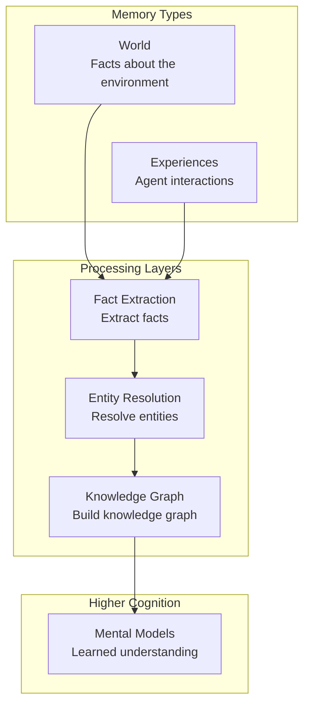
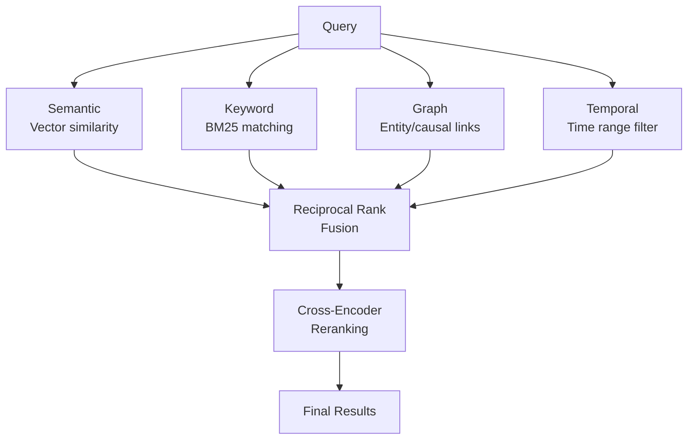
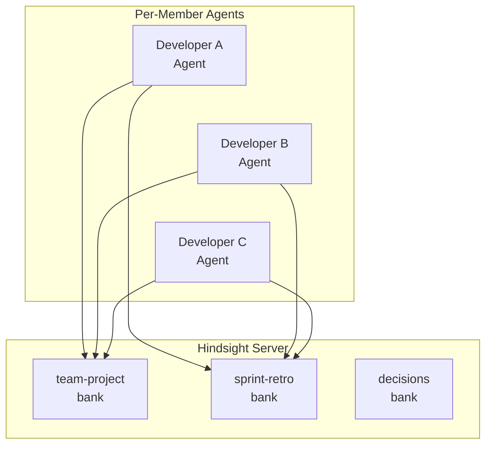

## The Memory Problem with AI Agents

Any Engineering Manager who has deployed AI agents to production has likely experienced this at least once. You ask the agent, "Do you remember what we discussed yesterday?" and it just stares back blankly. Once a conversation ends, all context vanishes, and the next session starts from scratch.

There have been many attempts to solve this problem with RAG (Retrieval-Augmented Generation) or simple vector databases, but most stopped at "retrieval" without advancing to "learning." Simply searching past conversations is fundamentally different from extracting patterns from experience and forming mental models.

<strong>Hindsight</strong> is an open-source project that tackles this problem head-on. Compatible with [MCP (Model Context Protocol)](/en/blog/en/mcp-server-build-practical-guide-2026), it integrates immediately with major AI tools like Claude, Cursor, and VS Code. It achieved 91.4% on the LongMemEval benchmark, making it the first agent memory system to break the 90% barrier.

## Hindsight's Architecture

Hindsight organizes memory using biomimetic data structures inspired by human cognitive architecture.



Memory is divided into three main layers:

- <strong>World</strong>: Facts about the environment ("The stove is hot")
- <strong>Experiences</strong>: Records of the agent's own interactions ("I touched the stove and it was hot")
- <strong>Mental Models</strong>: Learned understanding formed by reflecting on raw memories

The key difference from existing RAG systems is precisely these Mental Models. Rather than simply storing and retrieving data, the system analyzes memories and forms patterns, creating a structure where agents "learn from experience."

## Three Core Operations

### Retain — Storing Memories

This is not simple text storage. Retain uses an LLM to automatically extract and normalize facts, temporal information, entities, and relationships from the input content.

```python
from hindsight_client import Hindsight

client = Hindsight(base_url="http://localhost:8888")

# Stored as structured memory, not plain text
client.retain(
    bank_id="project-alpha",
    content="Kim (team lead) completed the auth module refactoring in Sprint 23. "
            "Migrated from session-based to JWT, improving response time by 40%.",
    context="sprint-retrospective",
    timestamp="2026-03-15T10:00:00Z"
)
```

With this single call, Hindsight internally performs the following:

1. Entity extraction: "Kim (team lead)", "Sprint 23", "auth module"
2. Relationship mapping: "Kim (team lead) -> completed -> auth module refactoring"
3. Fact normalization: "session -> JWT migration", "40% response time improvement"
4. Temporal indexing: recorded as an event that occurred on 2026-03-15
5. Vector embedding generation and knowledge graph update

### Recall — Retrieving Memories

Recall executes four parallel retrieval strategies simultaneously:



```python
result = client.recall(
    bank_id="project-alpha",
    query="What are the recent changes related to authentication?",
    max_tokens=4096
)
```

The results from all four strategies are merged using <strong>Reciprocal Rank Fusion</strong>, and the final ranking is determined through <strong>Cross-Encoder Reranking</strong>.

### Reflect — Reflection and Learning

Reflect is the core capability that elevates Hindsight from a simple memory system to a "[learning system](/en/blog/en/hermes-agent-self-evolving-ai-framework)."

```python
insight = client.reflect(
    bank_id="project-alpha",
    query="Are there recurring patterns in our team's sprint retrospectives?",
)
```

Reflect comprehensively analyzes stored memories to:
- Discover recurring patterns
- Infer causal relationships between multiple memories
- Automatically update Mental Models

## MCP Integration: Getting Started in 5 Minutes

### Installation and Execution

```bash
export OPENAI_API_KEY=sk-xxx
docker run --rm -it --pull always \
  -p 8888:8888 -p 9999:9999 \
  -e HINDSIGHT_API_LLM_API_KEY=$OPENAI_API_KEY \
  -v $HOME/.hindsight-docker:/home/hindsight/.pg0 \
  ghcr.io/vectorize-io/hindsight:latest
```

- <strong>Port 8888</strong>: API + MCP endpoint
- <strong>Port 9999</strong>: Admin UI

### MCP Client Configuration

```json
{
  "mcpServers": {
    "hindsight": {
      "type": "http",
      "url": "http://localhost:8888/mcp/my-project/"
    }
  }
}
```

### Supported LLM Providers

| Provider | Config Value | Notes |
|----------|-------------|-------|
| OpenAI | `openai` | Default |
| Anthropic | `anthropic` | Claude |
| Google | `gemini` | Gemini |
| Groq | `groq` | Fast inference |
| Ollama | `ollama` | [Local model](/en/blog/en/local-llm-private-mcp-server-gemma4-fastmcp) |
| LM Studio | `lmstudio` | Local |

## Deployment Strategy from an Engineering Manager's Perspective

### Phase 1: Start with a Personal Agent

Use it for 2〜3 weeks and observe the reduction in repetitive questions, context-switching adaptation speed, and mental model quality.

### Phase 2: Build Team Shared Memory



Separate banks by purpose:
- <strong>team-project</strong>: Codebase, architecture decisions, tech stack information
- <strong>sprint-retro</strong>: Sprint retrospectives, velocity metrics, recurring issues
- <strong>decisions</strong>: ADRs, rationale behind technology choices

### Phase 3: Operational Monitoring

## Practical Use Case Scenarios

### Scenario 1: Accelerating Onboarding
### Scenario 2: Automated Sprint Retrospective Analysis
### Scenario 3: Technical Decision Tracking

## Comparison with Existing Approaches

| Feature | Simple Vector DB | RAG | Knowledge Graph | Hindsight |
|---------|-----------------|-----|-----------------|-----------|
| Storage | Embeddings only | Document chunking + embeddings | Entities + relationships | Facts + entities + time series + vectors |
| Retrieval | Vector similarity only | Vector + keyword | Graph traversal | Quad-parallel retrieval + reranking |
| Learning | None | None | Limited | Automatic Mental Model formation |
| Time Awareness | None | Limited | Limited | Native temporal indexing |
| Benchmark | - | - | - | LongMemEval 91.4% |

## Points to Consider

1. <strong>Processing Latency</strong>: If you recall immediately after retain, processing may not yet be complete.
2. <strong>LLM Costs</strong>: Internal processing requires separate LLM calls.
3. <strong>Data Security</strong>: Memories may contain sensitive information.
4. <strong>Mental Model Quality</strong>: Automatically generated mental models are not always accurate.

## Conclusion

Hindsight is a project that represents meaningful progress in the field of AI agent memory. It is open source under the MIT license, and you can get started in 5 minutes with a single Docker command.

## References

- [Hindsight GitHub](https://github.com/vectorize-io/hindsight)
- [Hindsight Official Documentation](https://hindsight.vectorize.io/)
- [Hindsight Research Paper (arXiv)](https://arxiv.org/abs/2512.12818)
- [MCP Agent Memory Blog Post](https://hindsight.vectorize.io/blog/2026/03/04/mcp-agent-memory)
