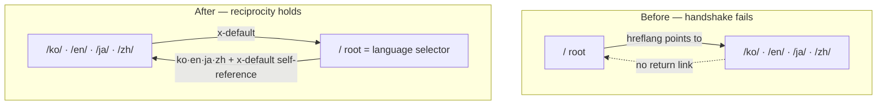

I pointed a 30-line script at my site's `dist/` folder. All 248 blog posts came back green. Exactly one came back red, and it was the homepage.

```text
[PASS] return-link reciprocity    broken pairs : 0   (one post, four languages)
...
[FAIL] return-link reciprocity    broken pairs : 4   (whole site, 249 pages)
[FAIL] self-referencing hreflang   missing      : 1
```

hreflang is the tag that tells a search engine "the Korean and English versions of this page live over here." Adding it is easy. The catch is that it is a <strong>bidirectional contract</strong>. If only one side extends a hand, there is no handshake, and Google discards the annotation entirely. I knew this rule from the docs, but I got curious whether my own site actually honored it, so I measured. The result is above. Let me work through it.

## What hreflang guarantees, and what it doesn't

Lower your expectations first. hreflang does not raise rankings. Google Search Central describes the tag as a tool that "points users to the most appropriate version of your page by language or region." It is a <strong>routing signal</strong>, not a ranking boost.

That distinction matters in practice. I used to vaguely assume that clean hreflang would lift each language version in its own market. Wrong assumption. What hreflang actually does is this: when a Korean user searches, it <strong>swaps</strong> an already-ranking result for the correct language, so the Korean version shows instead of the English one. It does not manufacture a ranking that was not already there.

Get it wrong, though, and the downside is real. A non-reciprocal annotation is ignored, and in the worst case the engine gets confused about which version is canonical and serves the wrong language. So hreflang is less "add it to win, skip it to break even" and more "get it exactly right to break even, get it wrong to lose." Once you internalize that asymmetry, spending time on validation stops feeling optional.

## The return-link rule, and why one side isn't enough

Google's sentence is short and blunt: "If two pages don't both point to each other, the tags will be ignored."

Unpacked, that is three things.

1. <strong>Return link</strong>: if A names B as an alternate, B must name A back.
2. <strong>Self-reference</strong>: each page lists itself in its own hreflang set. The English version must include itself (en) in its list.
3. <strong>Absolute URLs</strong>: `href` must be a full address with protocol and domain.

The strictness made sense once I thought about it. hreflang has to stop an untrusted third party from claiming my page as their alternate. If it accepted a one-way declaration, any random site could announce "my Spanish version is your popular English page" and pollute the signal. Requiring both sides to name each other is a kind of mutual signature. From a spam-resistance angle it is actually a clean design.

The trouble is that this rule is hard to satisfy by hand. Four languages and a few hundred posts means a few hundred clusters. One misaligned list and that cluster is silently ignored. No error surfaces on screen. So I wrote a checker.

## I audited my own site

The script reads every `index.html` in the build output (`dist/`), pulls out the hreflang links, builds a graph, and verifies that the return links actually exist. The `hreflang` attributes on RSS feeds are not HTML pages, so I filtered those out.

````javascript
// hreflang-audit.mjs (core)
function extractHreflang(html) {
  const out = [];
  const linkRe = /<link\b[^>]*rel=["']alternate["'][^>]*>/gi;
  for (const m of html.match(linkRe) || []) {
    if (/type=["']application\/rss\+xml["']/i.test(m)) continue; // skip RSS
    const lang = (m.match(/hreflang=["']([^"']+)["']/i) || [])[1];
    const href = (m.match(/href=["']([^"']+)["']/i) || [])[1];
    if (lang && href) out.push({ lang, href });
  }
  return out;
}
// does each annotation's target point back at us?
const target = pages.get(a.href);
if (target && !target.alts.some(t => t.href === url)) brokenReturn++;
````

First I checked a single post's four language versions. I used the [Lighthouse accessibility post](/en/blog/en/a11y-lighthouse-audit-fix-2026) as the target.

```text
$ node hreflang-audit.mjs dist a11y-lighthouse-audit-fix-2026
pages with hreflang annotations : 4
----------------------------------------------------
[PASS] return-link reciprocity    broken pairs : 0
[PASS] self-referencing hreflang   missing      : 0
[PASS] x-default present            missing      : 0
[PASS] absolute URLs                relative     : 0
[PASS] language code format         invalid      : 0
```

Clean. Open the actual tags and the four languages name each other, and themselves, precisely.

```html
<!-- what /en/blog/en/a11y-.../ emits -->
<link rel="canonical" href="https://jangwook.net/en/blog/en/a11y-lighthouse-audit-fix-2026/">
<link rel="alternate" hreflang="ko" href="https://jangwook.net/ko/blog/ko/a11y-lighthouse-audit-fix-2026/">
<link rel="alternate" hreflang="en" href="https://jangwook.net/en/blog/en/a11y-lighthouse-audit-fix-2026/">
<link rel="alternate" hreflang="ja" href="https://jangwook.net/ja/blog/ja/a11y-lighthouse-audit-fix-2026/">
<link rel="alternate" hreflang="zh" href="https://jangwook.net/zh/blog/zh/a11y-lighthouse-audit-fix-2026/">
<link rel="alternate" hreflang="x-default" href="https://jangwook.net/en/blog/en/a11y-lighthouse-audit-fix-2026/">
```

So far, satisfying. But widening the scope to the whole site changed the picture.

```text
$ node hreflang-audit.mjs dist
pages with hreflang annotations : 249
----------------------------------------------------
[FAIL] return-link reciprocity    broken pairs : 4
[FAIL] self-referencing hreflang   missing      : 1
[PASS] x-default present            missing      : 0
[PASS] absolute URLs                relative     : 0
[PASS] language code format         invalid      : 0

first broken return links:
  https://jangwook.net/
    → https://jangwook.net/ko/ (ko) has NO return link
  https://jangwook.net/
    → https://jangwook.net/en/ (en) has NO return link
  https://jangwook.net/
    → https://jangwook.net/ja/ (ja) has NO return link
  https://jangwook.net/
    → https://jangwook.net/zh/ (zh) has NO return link
```

All four broken pairs pointed at one place: the language-less <strong>bare root</strong> `https://jangwook.net/`. The 248 posts were perfect; a single homepage was throwing off its cluster.

## Why only the homepage broke

Put the two pages' actual tags side by side and the cause is immediate.

```html
<!-- what the bare root / emits -->
<link rel="canonical" href="https://jangwook.net/">
<link rel="alternate" hreflang="ko" href="https://jangwook.net/ko/">
<link rel="alternate" hreflang="en" href="https://jangwook.net/en/">
<link rel="alternate" hreflang="ja" href="https://jangwook.net/ja/">
<link rel="alternate" hreflang="zh" href="https://jangwook.net/zh/">
<link rel="alternate" hreflang="x-default" href="https://jangwook.net/en/">

<!-- what the /en/ home emits -->
<link rel="canonical" href="https://jangwook.net/en/">
<link rel="alternate" hreflang="ko" href="https://jangwook.net/ko/">
<link rel="alternate" hreflang="en" href="https://jangwook.net/en/">
<link rel="alternate" hreflang="ja" href="https://jangwook.net/ja/">
<link rel="alternate" hreflang="zh" href="https://jangwook.net/zh/">
<link rel="alternate" hreflang="x-default" href="https://jangwook.net/en/">
```

The bare root `/` declares itself canonical and then names `/ko/` `/en/` `/ja/` `/zh/` as alternates. But `/en/`'s list contains no `/`. `/en/` names only itself and the other three languages. So the root reaches toward the language homes, yet not one language home reaches back toward the root. Handshake failed. On top of that, the root omits itself (`/`) from its own list, so it has no self-reference either. The "missing self : 1" the checker flagged is exactly this root.

Honestly, this is a common trap. On multilingual sites the language-less "neutral root" usually redirects to one of the language homes or acts as a language picker. But when that root <strong>emits its own hreflang hub as if it were an independent canonical page</strong>, it becomes an intruder in a cluster the language homes already completed among themselves. The language homes do not know the root exists, so they have no reason to build a return link to it.

One more thing. x-default points at `/en/`. That is not wrong in itself. Google explicitly allows x-default to target a specific language version. But the intent of x-default is "a page for users who match no language," meaning a language selector or an auto-redirecting home. The neutral root `/` is the best fit for that role. The current setup is the awkward middle: there is a neutral root, yet x-default points at English, and that neutral root floats loose in the cluster.

I reproduced the mechanic minimally to be sure. Two pages where hub A names B, but B does not name A, then run the checker.

```text
===== BROKEN =====
[FAIL] return-link reciprocity    broken pairs : 1
[FAIL] self-referencing hreflang   missing      : 1

===== FIXED (every page names itself + all variants, mutually) =====
[PASS] return-link reciprocity    broken pairs : 0
[PASS] self-referencing hreflang   missing      : 0
[PASS] x-default present            missing      : 0
```

The fix is one of three. (1) 301-redirect the root to a language home so it leaves the cluster entirely; (2) hand the root's `canonical` to a language home to clean up the duplicate signal; or (3) make the root the real x-default target and have every language home name the root via x-default, restoring reciprocity. I think (3) is the most honest semantically. But it touches a live site's canonical and redirects, so I plan to re-verify in staging that the 248 healthy clusters stay intact, then roll it out separately. I did not improvise a live SEO change in this post. The checker becomes the regression test: after the fix, run the same script and confirm green.

<strong>Update, 2026-07-04</strong>: The fix has shipped. Following option (3), the home cluster's x-default now points to the neutral root `/`, and the checker above is a permanent postbuild gate in the build pipeline. Re-run result: 253 pages, 0 broken pairs, 0 missing self-references — all green.

Before and after, side by side, the problem is obvious at a glance.



## The three implementation methods — when to use which

There are three ways to emit hreflang, and Google is firm that "the three methods are equivalent." Equivalent should be read as <strong>pick one, but never mix them</strong>. If HTML tags and a sitemap say different things about the same page, you have only built yourself a validation nightmare.

| Method | Where it goes | Strength | Weakness | Best when |
|--------|--------------|----------|----------|-----------|
| HTML `<link>` tags | each page `<head>` | easiest to implement and inspect; auto-generated by a static build | N tags per page; heavy HTML at scale | static blog, a few hundred pages |
| HTTP `Link:` header | response headers | works for non-HTML files (PDF, images) | needs server/CDN config; awkward to eyeball | non-HTML resources, easy header control |
| Sitemap `xhtml:link` | XML sitemap | leaves HTML untouched; good at scale, managed in one place | sitemap bloats; needs a generation pipeline | tens of thousands of pages, hard-to-edit CMS |

My blog is a static build, so HTML tags fit. At a few hundred pages the "heavy HTML" weakness of the tag method is not a burden yet. If it grew to tens of thousands, I would consider moving to the sitemap method. In that case, as with [emitting LocalBusiness structured data server-side](/en/blog/en/localbusiness-structured-data-server-side-vs-js-2026), stamping the signal deterministically at build time is far safer than managing it by hand.

## The mines people step on — especially Chinese

My site passed the language-code check, but the rule has several common traps, so here is a checklist.

- <strong>Misused region codes</strong>: the UK is `GB`, not `UK`. `EU` and `UN` are not ISO 3166-1 Alpha 2 either, so they are invalid. This is a mistake Google calls out officially.
- <strong>Language vs region confusion</strong>: `hreflang="us"` is wrong. `us` is a region, not a language. Write the language first, like `en-US`.
- <strong>Chinese subtags</strong>: my site uses bare `zh`. It is valid, but it cannot distinguish Simplified from Traditional. If only mainland readers matter, `zh` is fine; if you also target Taiwan or Hong Kong, `zh-Hans` / `zh-Hant` is more precise. This blog started with a single Simplified variant when I added Chinese support late, and looking back I should have at least declared `zh-Hans`. I am logging that as my own miss.
- <strong>Relative paths</strong>: `href="/en/..."` will not do. It must be an absolute URL.
- <strong>Combining with noindex</strong>: if an hreflang target is `noindex`, the signals contradict each other. You are telling the engine not to index a page while pointing users to it as an alternate.

That last item ties directly into [controlling AI crawlers with robots.txt](/en/blog/en/ai-crawler-control-robots-txt-llms-txt-2026). Indexing, crawling, and language signals live scattered across different files and tags, but when they contradict, a crawler either reads them in the most conservative way or ignores them. Half the job is not adding signals; it is keeping the signals from fighting each other.

## So, what a developer should do now

The order comes down to this.

1. <strong>Audit the build output.</strong> Look at the HTML that actually shipped, not the source template. Point the 30-line script above at `dist/` and it catches return links, self-reference, absolute URLs, and code format in one pass, in about five seconds.
2. <strong>Never drop self-reference.</strong> Each page's hreflang list must include itself. Forgetting this is the single most common error.
3. <strong>Sort out the neutral root.</strong> Check whether a language-less `/` is emitting its own canonical and hreflang hub. Redirect it, hand its canonical to a language home, or make it the x-default target to create reciprocity.
4. <strong>Standardize on one method.</strong> Do not mix HTML tags, HTTP headers, and sitemaps.
5. <strong>Wire the checker into CI.</strong> Run it after every build and fail the build when broken pairs are non-zero. That is how I plan to use this script. On the day I add a fifth language, it will stop that new language from silently breaking an existing cluster.

If I keep only one line: hreflang is not done when you "added it," but when it "interlocks bidirectionally in the build output." And you verify that with a script, not your eyes. Even I, knowing the docs cold, had a broken homepage and never noticed.

---

If you want to check whether a multilingual site's hreflang, canonical, and structured data actually interlock in the build output, or you want to set up a structure that emits those signals deterministically from static or server-side rendering, I take on consulting and implementation work personally. One small regression guard like the checker above prevents quiet mistakes across hundreds of pages. Reach me through the contact link on the blog profile.
