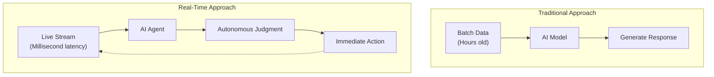
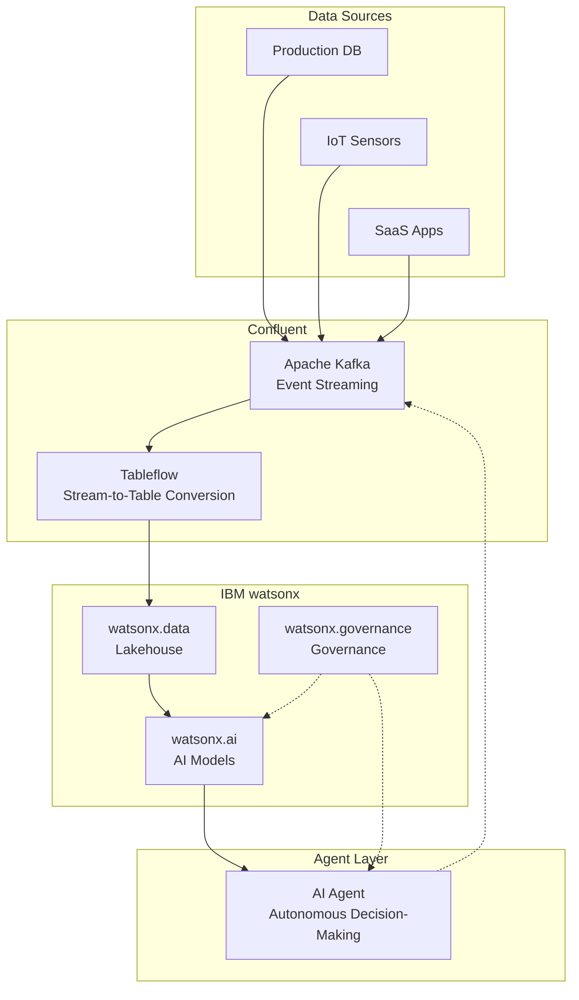
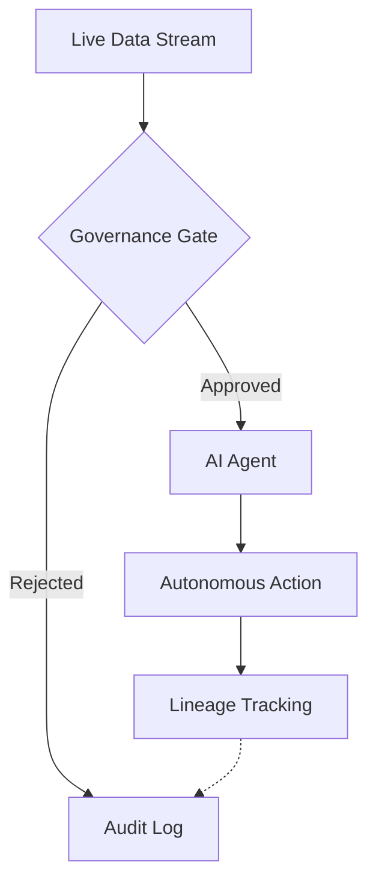

## Overview

On March 17, 2026, IBM completed its acquisition of data streaming platform company Confluent for <strong>$11 billion</strong>. With Confluent's Apache Kafka-based platform — used by over 40% of Fortune 500 companies — now integrated into the IBM watsonx ecosystem, <strong>real-time data streaming has cemented itself as the core infrastructure for enterprise AI agents</strong>.

This acquisition goes beyond a routine M&A deal. It clearly signals the direction in which data architecture is evolving in the AI era. From Engineering Managers to CTOs, here is an analysis of how engineering leaders should interpret this shift.

## Why Real-Time Data — The "Data Latency Gap" Problem

### Limitations of Traditional AI Systems

Most enterprise AI systems run on <strong>batch processing</strong>. They collect data, refine it through ETL (Extract, Transform, Load) pipelines, and then feed it into models.

```
[Production DB] → [ETL Pipeline] → [Data Warehouse] → [AI Model]
                Hours〜days of latency
```

In this architecture, the data an AI model references is always a <strong>"snapshot of the past."</strong> It cannot reflect real-time changes in market conditions, customer behavior, or system state.

### What AI Agents Demand

AI agents in 2026 are not simple chatbots that answer questions. They are <strong>autonomous systems that make judgments, take actions, and verify outcomes</strong>. [LangGraph, CrewAI, and Dapr](/en/blog/en/ai-agent-framework-comparison-2026-langgraph-crewai-dapr-production) are among the frameworks powering these agents — and if those agents base decisions on "yesterday's data," the results cannot be trusted.



Closing this <strong>"Data Latency Gap"</strong> is precisely why IBM acquired Confluent.

## IBM + Confluent Integration Architecture

### Key Integration Points

IBM SVP Rob Thomas described this acquisition as <strong>"the final piece of the Agentic AI puzzle."</strong> Here is the concrete integration architecture:



### Zero-Copy Data Sharing

The most noteworthy technology is the <strong>integration of Confluent's Tableflow with watsonx.data</strong>.

Previously, using Kafka's streaming data in AI models required a separate ETL step. With Tableflow, you can <strong>query Kafka streams directly as if they were database tables</strong>.

```python
# Before: ETL pipeline required
raw_data = kafka_consumer.poll()
transformed = etl_pipeline.transform(raw_data)
warehouse.insert(transformed)
result = ai_model.predict(warehouse.query("SELECT * FROM orders"))

# With Tableflow integration: zero-copy direct query
result = ai_model.predict(
    watsonx_data.query("SELECT * FROM kafka_stream.orders")
)
```

This approach <strong>eliminates ETL costs</strong>, reduces data latency to milliseconds, and enables AI agents to always act on the freshest data available.

## Strategic Implications for CTOs and VPoEs

### 1. The Rise of the "Live Agentic AI" Paradigm

This acquisition signals the direction of the entire industry. A "Live Agentic AI" paradigm — where AI agents operate on <strong>live event streams</strong> rather than static data — is now taking hold.

<strong>Practical impact:</strong>
- Evaluate migrating existing batch-based ML pipelines to streaming architectures
- Build Kafka and event-streaming competencies within data engineering teams
- Recognize that AI agent decision quality is directly tied to data freshness

### 2. The Critical Role of Governance and Lineage

When real-time data directly influences AI agent decision-making, the importance of <strong>[data governance](/en/blog/en/nist-ai-agent-security-standards)</strong> rises sharply.



<strong>Checkpoints:</strong>
- Build data lineage tracking systems
- Preserve the evidence behind AI agent decisions in an auditable format
- Apply Policy-Based Access Control (PBAC)

### 3. Vendor Lock-In vs. Open Source Strategy

IBM's integrated platform is powerful, but it comes with <strong>vendor lock-in risk</strong>. Alternative strategies a CTO should consider:

| Approach | Pros | Cons |
|----------|------|------|
| IBM Full Stack (Confluent + watsonx) | Unified management, built-in governance | High cost, vendor lock-in |
| OSS Combo (Kafka + custom AI) | Flexibility, cost savings | Integration complexity, DIY governance |
| Hybrid (Confluent Cloud + multi-AI) | Unified data layer, AI flexibility | Complex architecture management |

### 4. Organizational Capability Transformation

This shift is not just a technology problem. It also requires a transformation of <strong>organizational structure and capabilities</strong>.

<strong>Evolving role of data engineering teams:</strong>
- Batch ETL operations → Event streaming architecture design
- Data warehouse management → Real-time data pipeline operations
- Static reporting → Optimizing data feeds for AI agents

<strong>Expanded role of AI/ML engineers:</strong>
- Model training/deployment → Agent orchestration
- Offline evaluation → Real-time monitoring and feedback loop design

## Practical Application: Getting Started

You do not need IBM-Confluent-scale infrastructure to apply the real-time data + AI agent pattern. It works at a small scale too.

### Minimal Setup Example

```yaml
# docker-compose.yml (minimal real-time AI agent stack)
services:
  kafka:
    image: confluentinc/cp-kafka:latest
    ports:
      - "9092:9092"

  agent-worker:
    build: ./agent
    environment:
      - KAFKA_BOOTSTRAP_SERVERS=kafka:9092
      - LLM_API_KEY=${LLM_API_KEY}
    depends_on:
      - kafka

  monitoring:
    image: grafana/grafana:latest
    ports:
      - "3000:3000"
```

### Event-Driven AI Agent Pattern

```python
from confluent_kafka import Consumer
import anthropic

client = anthropic.Anthropic()
consumer = Consumer({
    'bootstrap.servers': 'localhost:9092',
    'group.id': 'ai-agent-group',
    'auto.offset.reset': 'latest'
})
consumer.subscribe(['business-events'])

while True:
    msg = consumer.poll(1.0)
    if msg is None:
        continue

    event = json.loads(msg.value())

    # AI agent makes judgments based on real-time events
    response = client.messages.create(
        model="claude-sonnet-4-6",
        max_tokens=1024,
        messages=[{
            "role": "user",
            "content": f"Analyze the following business event and suggest actions: {event}"
        }]
    )

    # Publish the agent's decision back as an event
    producer.produce(
        'agent-decisions',
        json.dumps({"event": event, "decision": response.content})
    )
```

## Conclusion

IBM's acquisition of Confluent sends a clear message: <strong>"The data infrastructure for the AI agent era must be real-time."</strong> The $11 billion price tag proves that real-time data streaming is not just a technology trend — it is <strong>foundational infrastructure for enterprise AI</strong>. [Deloitte's 2026 Agentic AI analysis](/en/blog/en/deloitte-agentic-ai-operations-2026) similarly identifies real-time data connectivity as a top enabler of production agent operations.

Actions engineering leaders can take right now:

1. <strong>Audit your current data architecture's latency</strong> — Measure how "fresh" the data your AI agents reference actually is
2. <strong>Run a streaming PoC</strong> — Apply a Kafka-based streaming pilot to your most time-sensitive workflows
3. <strong>Design a governance framework</strong> — Establish policies and audit mechanisms before real-time data feeds into AI decision-making
4. <strong>Build a team capability roadmap</strong> — Plan cross-functional skill development across data engineering and AI engineering

From batch to streaming, from chatbots to agents — the relationship between data and AI is being fundamentally redefined.

## References

- [IBM Completes Acquisition of Confluent — IBM Newsroom](https://newsroom.ibm.com/2026-03-17-ibm-completes-acquisition-of-confluent,-making-real-time-data-the-engine-of-enterprise-ai-and-agents)
- [IBM Solidifies AI Infrastructure Dominance with $11 Billion Confluent Acquisition](https://www.financialcontent.com/article/marketminute-2026-3-19-ibm-solidifies-ai-infrastructure-dominance-with-11-billion-confluent-acquisition)
- [IBM closes $11B Confluent deal for AI data](https://www.stocktitan.net/news/IBM/ibm-completes-acquisition-of-confluent-making-real-time-data-the-lbuwdbharsqe.html)
- [Deloitte Agentic AI Strategy](https://www.deloitte.com/us/en/insights/topics/technology-management/tech-trends/2026/agentic-ai-strategy.html)
