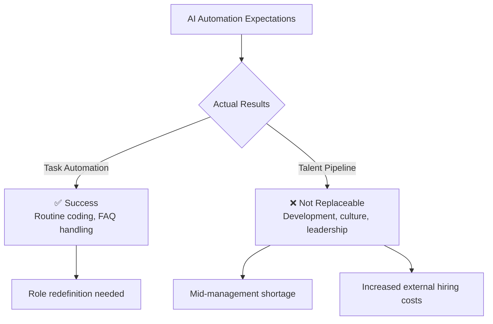
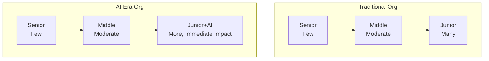
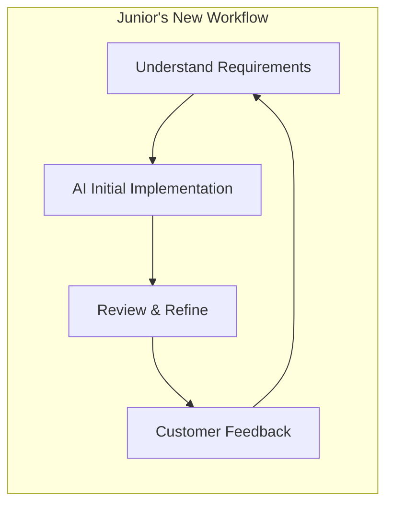

## Introduction

"AI will replace entry-level jobs"—a prediction repeated across the tech industry for years is now hitting a major turning point.

In February 2026, <strong>IBM's CHRO Nickle LaMoreaux</strong> made a striking announcement: IBM is <strong>tripling its entry-level hiring</strong>—specifically for "software developers and all these jobs we're being told AI can do."

According to [Fortune's report](https://fortune.com/2026/02/13/tech-giant-ibm-tripling-gen-z-entry-level-hiring-according-to-chro-rewriting-jobs-ai-era/), IBM isn't alone—Dropbox and Cognizant are making similar moves.

As an Engineering Manager (EM), this trend is deeply instructive. Let's examine the gap between AI replacement "expectations" and "reality," and what it reveals about the essence of organizational design.

## AI Replacement: Reality vs Expectations

### The Expected Scenario

From 2023 to 2025, many executives painted a clear vision:

- Entry-level coding tasks can be automated by AI
- Reduce junior engineer hiring; shift to lean, senior-heavy teams
- A Korn Ferry report found that <strong>37% of organizations planned to replace entry-level roles with AI</strong>

### What IBM Actually Experienced

The reality IBM encountered was quite different:

- Entry-level <strong>tasks</strong> can be automated, but the <strong>talent development pipeline</strong> cannot be replaced
- Cutting junior headcount leads to a <strong>severe shortage of mid-level managers</strong> within 3–5 years
- External hiring is costlier, and outside hires take longer to adapt to internal culture

LaMoreaux stated:

> "The companies three to five years from now that are going to be the most successful are those companies that doubled down on entry-level hiring in this environment."

### Lessons for EMs

AI excels at task automation, but organizational sustainability is a separate challenge entirely. Long-term team health requires a continuous development pipeline.

## Enterprise Workforce Planning: IBM's Strategic Pivot

### From "Cutting" to "Redefining"

What's fascinating about IBM's approach is that they're not simply hiring more juniors—they're <strong>redefining the roles themselves</strong>:

| Traditional Role | AI-Era Role |
|---|---|
| Software Engineer: Routine coding | Software Engineer: Customer interaction + AI-assisted design |
| HR Staff: Direct Q&A responses | HR Staff: Chatbot intervention + exception handling |
| Junior: Execute tasks per senior instructions | Junior: Leverage AI tools for immediate impact |

### Dropbox's Perspective

Dropbox CPO Melanie Rosenwasser offered a vivid comparison of Gen Z's AI proficiency:

> "It's like they're biking in the Tour de France and the rest of us still have training wheels. Honestly, that's how much they're lapping us in proficiency."

Dropbox plans to <strong>expand its internship and new grad programs by 25%</strong>.

### Cognizant's "Inverted Pyramid" Vision

Cognizant CEO Ravi Kumar S also foresees structural organizational change:

> "That pyramid is going to be broader and shorter, and the path to expertise is going to be faster."

## Organizational Design: What EMs Should Consider Now

### 1. The Talent Pipeline Is Infrastructure

Like roads and utilities, the talent pipeline is infrastructure that can't be measured by short-term ROI. IBM's case demonstrates that the <strong>cost of stopping the pipeline</strong> far exceeds the <strong>cost of maintaining it</strong>.

As EMs, it's critical to propose 3–5 year workforce plans to leadership, not just optimize quarterly headcount.

### 2. Reinvent the Junior Role

If AI replaces traditional junior tasks, the role itself needs redefinition:

- <strong>AI Orchestrator</strong>: Combining AI tools to solve problems
- <strong>Domain Bridge</strong>: Translating between technology and customers
- <strong>Quality Gatekeeper</strong>: Reviewing and testing AI-generated code

### 3. Design Hybrid AI + Human Organizations

What previously took a junior engineer a week can now be done in 1–2 days with AI assistance. But that freed-up time goes toward <strong>customer interaction and domain understanding</strong>—exactly the "more durable skills" IBM aims to build.

### 4. Rethink Hiring Strategy

While 37% of companies in Korn Ferry's survey planned to replace junior roles with AI, IBM is going in the opposite direction. Key considerations for EMs:

- AI-literate new grads can adopt AI tools faster than existing employees
- LinkedIn data shows <strong>AI literacy is the fastest-growing skill in the U.S.</strong>
- A "junior who masters AI" may outperform a "senior who doesn't use AI"

## Conclusion: AI Is an Amplifier, Not a Replacement

IBM's decision sends a powerful message to the tech industry:

1. <strong>AI automates tasks, but cannot automate talent development</strong>
2. <strong>Cutting entry-level hiring creates significant medium-to-long-term risk</strong>
3. <strong>Role redefinition—not elimination—is the core of AI-era organizational strategy</strong>

As Cognizant's CEO put it perfectly:

> "AI is an amplifier of human potential. It's not a displacement strategy."

As EMs, we need to rethink not just AI tool adoption, but <strong>organizational design itself</strong>. Instead of cutting juniors, design new roles and environments where they can grow alongside AI—that's the condition for building organizations that thrive 3–5 years from now.

## References

- [Fortune: IBM is tripling Gen Z entry-level hiring](https://fortune.com/2026/02/13/tech-giant-ibm-tripling-gen-z-entry-level-hiring-according-to-chro-rewriting-jobs-ai-era/)
- [Korn Ferry: Companies plan to replace entry roles with AI](https://www.hrdive.com/news/companies-plan-to-replace-entry-roles-ai/804870/)
- [LinkedIn: AI literacy is fastest-growing skill](https://www.linkedin.com/pulse/linkedin-skills-rise-2025-15-fastest-growing-us-linkedin-news-hy0le/)
