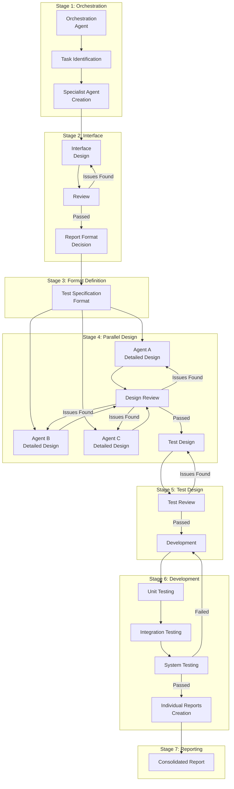
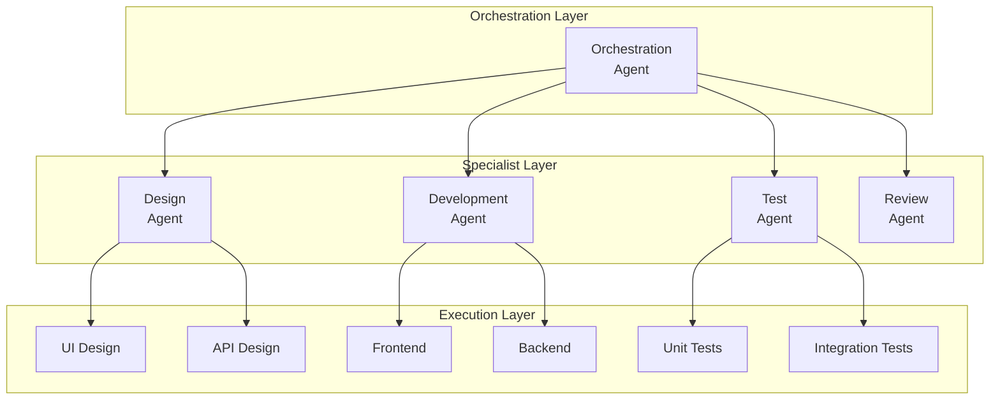
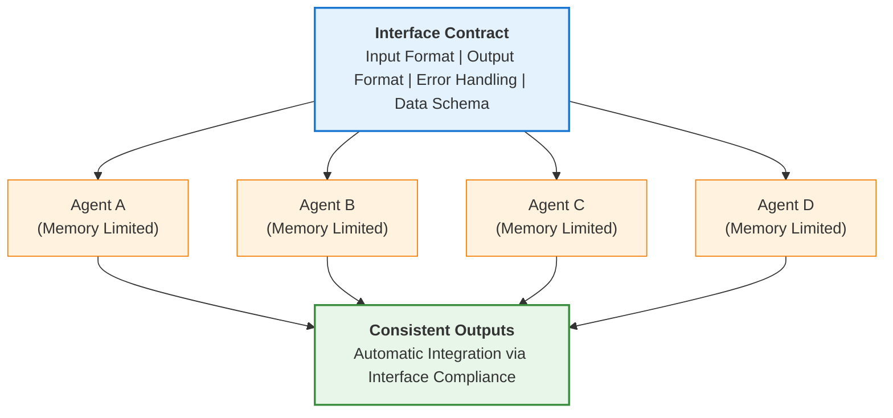
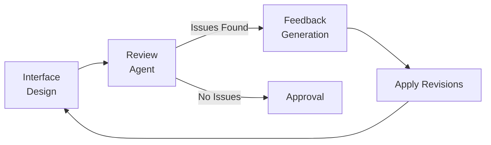
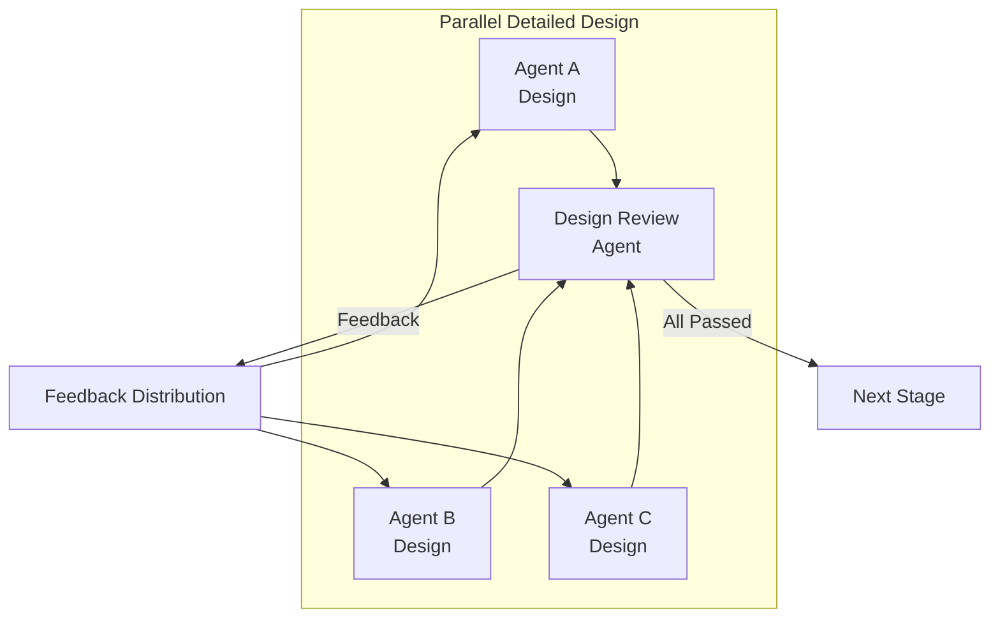
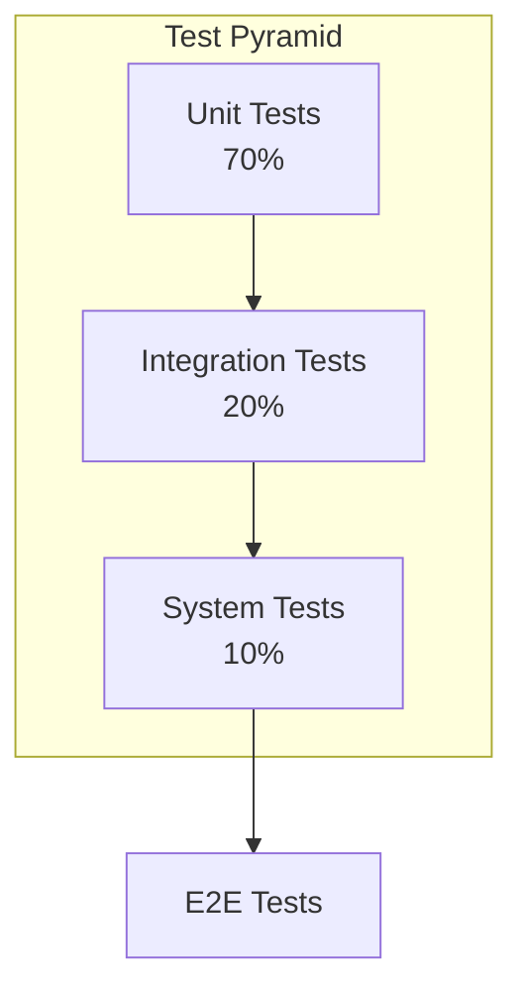
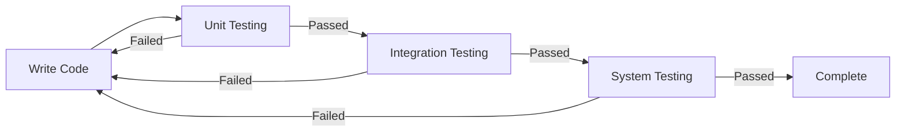
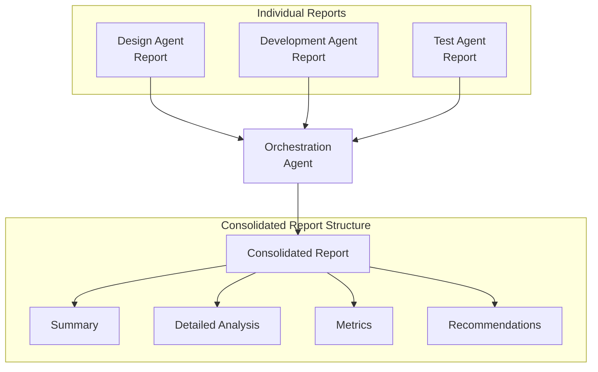
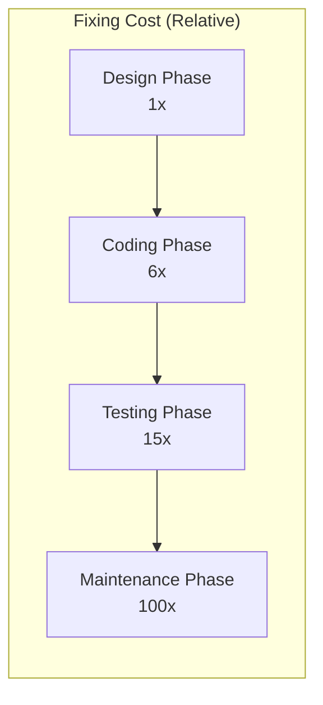

## Introduction

Error management in complex software development projects has always been one of the greatest challenges. As features multiply and inter-system dependencies become more complex, even a simple bug can frequently threaten the stability of the entire system. Traditional development methodologies have proposed various approaches to solve this problem, but with the advent of the AI era, an entirely new paradigm has emerged.

### Core Insight of This Methodology

The core of the methodology introduced in this post is simple:

> **"By designing interfaces first and having all agents adhere to these interface contracts, errors are minimized despite individual agents' memory limitations."**

LLM-based agents have an inherent constraint: <strong>context window (memory) limitations</strong>. In complex projects, it's difficult for a single agent to grasp the entire context. However, by establishing <strong>interfaces as a North Star</strong> first:

1. Individual agents only need to <strong>adhere to their input/output contracts</strong> even without knowing the full context
2. Consistency is maintained through <strong>interface documentation references</strong> even when memory resets
3. Multiple agents' outputs can <strong>naturally integrate</strong>
4. Resulting in <strong>40-90% reduction in error rates</strong>

### Limitations of Existing Methodologies

<strong>The Waterfall model</strong> provides a sequential and predictable development process, but suffers from exponentially increasing costs for fixing defects discovered late in the process. According to Boehm's research, the cost of fixing defects found in the maintenance phase reaches <strong>100 times</strong> that of the design phase.

<strong>Agile methodology</strong> mitigated this problem through iterative development and rapid feedback loops, but has limitations in maintaining architectural consistency in complex systems and heavily depends on developer capabilities.

### The Emergence of AI Multi-Agent Systems

Since 2024-2025, LLM (Large Language Model)-based multi-agent systems have been driving revolutionary changes in software engineering. According to research by He et al. (2024) published in ACM Transactions on Software Engineering and Methodology, multi-agent systems overcome the limitations of existing methodologies by decomposing complex problems into smaller units and having specialized agents collaborate to solve them.

According to McKinsey's 2025 report, <strong>79-85% of companies</strong> have adopted or are planning to adopt AI agents, and <strong>23% of organizations</strong> have already scaled agentic AI systems across their business operations.

---

## Core Methodology: Iterative Review Cycle

This methodology consists of a systematic 7-stage process, with each stage repeating the <strong>"Review → Revision"</strong> cycle until no issues remain. The core of this approach is a combination of hierarchical structure and parallel processing centered around an orchestration agent.



### Stage 1: Establishing the Orchestration Agent

The first stage of the methodology is establishing an <strong>orchestration agent</strong> to coordinate the entire process. This agent acts as a central conductor and performs the following key functions.

#### Task Identification and Decomposition

The orchestration agent analyzes the entire project and decomposes it into independently executable work units. What's important in this process is:

1. <strong>Identifying inter-task dependencies</strong>: Clearly define which tasks must precede others
2. <strong>Identifying parallel processing opportunities</strong>: Group tasks that can proceed simultaneously
3. <strong>Analyzing resource requirements</strong>: Understand the expertise and tools needed for each task

#### Delegating Specialist Agent Creation

For each identified task, the orchestration agent delegates the creation of appropriate specialist agents. As seen in Microsoft's Magentic-One architecture, effective agent composition includes:

- <strong>Design agents</strong>: Responsible for architecture and detailed design
- <strong>Review agents</strong>: Provide quality verification and feedback
- <strong>Development agents</strong>: Implement actual code
- <strong>Test agents</strong>: Design and execute tests

#### Hierarchical Orchestration Pattern

Among the five core orchestration patterns presented by Microsoft Azure Architecture Center, this methodology is based on the <strong>hierarchical pattern</strong>:



---

### Stage 2: Interface Structure Design (Core Stage)

> **🎯 This stage is the heart of the entire methodology.**

Once agents are established, the next stage is designing the <strong>optimal interface structure</strong> between them. **Thoroughly completing this stage before development is the most important principle of this methodology.**

#### Why Interface First?

The biggest limitation of LLM agents is <strong>context window (memory) constraints</strong>. In complex projects:

- A single agent struggles to understand the entire system
- As conversations lengthen, initial context is forgotten
- Work results across multiple agents can become inconsistent

However, by <strong>establishing interfaces first</strong>:



**Each agent only needs to adhere to its input/output contract, even without knowing the full context.** This is the core mechanism for overcoming memory limitations.

#### Interface Design Principles

1. <strong>Clear input/output definitions</strong>: Clearly define the inputs each agent accepts and outputs it generates
2. <strong>Minimal coupling</strong>: Minimize dependencies between agents for independent modifications
3. <strong>Standardized message formats</strong>: Use consistent data formats like JSON, Protocol Buffers
4. <strong>Error handling conventions</strong>: Pre-define behavior patterns for exceptional situations
5. <strong>Version management</strong>: Strategies for maintaining compatibility when interfaces change

#### Review → Revision Cycle

After interface design, verification through a review agent is mandatory:



This cycle repeats <strong>until no more issues are raised</strong>. Research shows an average of 2-4 iterations are needed, with issue discovery rates decreasing as follows:

| Iteration | Issue Discovery Rate | Cumulative Resolution Rate |
|:---:|:---:|:---:|
| 1st | 55% | 55% |
| 2nd | 25% | 80% |
| 3rd | 12% | 92% |
| 4th | 5% | 97% |

---

### Stage 3: Report and Test Specification Format Definition

Once interfaces are finalized, establish <strong>documentation standards</strong> to be used throughout the project. This stage is often overlooked, but consistent documentation ensures:

- All agents submit deliverables in the same format
- Efficient consolidation by the orchestration agent
- Easy auditing and traceability later

#### Task Completion Report Format

Standard structure for reports that specialist agents must submit upon task completion:

```yaml
report:
  agent_id: "design-agent-001"
  task_id: "TASK-2024-001"
  completion_timestamp: "2025-12-06T14:30:00Z"
  status: "completed"

  summary:
    objectives_achieved: true
    deliverables:
      - type: "design_document"
        path: "/docs/api-design-v1.0.md"
      - type: "interface_specification"
        path: "/specs/interface-contract.json"

  metrics:
    review_cycles: 3
    issues_found: 12
    issues_resolved: 12

  dependencies:
    upstream:
      - task_id: "TASK-2024-000"
        status: "verified"
    downstream:
      - task_id: "TASK-2024-002"
        ready: true
```

#### Test Specification Format

Test specifications for each phase follow this structure:

```yaml
test_specification:
  phase: "integration"  # unit | integration | system
  version: "1.0"

  test_cases:
    - id: "TC-INT-001"
      name: "API Endpoint Integration Verification"
      priority: "high"
      preconditions:
        - "100% unit test pass rate"
        - "API server running"
      steps:
        - action: "Call POST /api/users"
          expected: "201 Created response"
        - action: "Call GET /api/users/{id}"
          expected: "Return created user information"
      postconditions:
        - "Verify database record"
```

---

### Stage 4: Parallel Detailed Design

In this stage, each specialist agent performs detailed design for their area <strong>simultaneously (in parallel)</strong>. Parallel processing significantly reduces overall development time, but without proper coordination, inconsistency issues can arise.

#### Benefits of Parallel Design

According to MIT's 2025 research, parallel agent work brings <strong>26% productivity improvement</strong> compared to sequential work. Specifically:

- Independent modules can be designed simultaneously
- Minimized review waiting time
- Maximized resource utilization

#### Utilizing Design Review Agents

Each agent's design outputs are submitted to a dedicated <strong>design review agent</strong>. The review agent:

1. <strong>Verifies consistency</strong>: Confirms alignment with overall system design
2. <strong>Checks interface compliance</strong>: Verifies adherence to interface contracts agreed upon in Stage 2
3. <strong>Applies best practices</strong>: Ensures industry standards and best practices are met
4. <strong>Identifies potential issues</strong>: Pre-detects issues that may arise during integration

#### Iterating Review Cycles



This process repeats until all designs pass review. According to research by Microsoft/IBM, such iterative reviews <strong>reduce defects by 40-90%</strong>.

---

### Stage 5: Test Design and Implementation

Based on finalized designs, tests are designed first. This is an extension of the <strong>TDD (Test-Driven Development)</strong> principle.

#### Applying the Test Pyramid



| Test Type | Proportion | Purpose |
|:---:|:---:|:---|
| Unit Tests | 70% | Verify correctness of individual functions/methods |
| Integration Tests | 20% | Verify inter-module interactions |
| System Tests | 10% | Verify entire system meets requirements |

#### Test Design Review

Test design also goes through a review → revision cycle:

- <strong>Coverage verification</strong>: Confirm all requirements are tested
- <strong>Edge cases</strong>: Include tests for boundary conditions and exceptional situations
- <strong>Performance criteria</strong>: Design tests for non-functional requirements

---

### Stage 6: Development and Integration Testing

Development begins with tests in place. The key to this stage is <strong>continuing development until all tests pass</strong>.

#### Continuous Test Execution



Research shows that <strong>running tests immediately after changes</strong> can reduce defects by 90% (MoldStud, 2024).

#### Integration and System Testing

Once unit tests are complete, the test specialist agent performs:

1. Analysis of unit test results
2. Derivation of integration test cases
3. Design of system test scenarios
4. Test execution and results reporting

---

### Stage 7: Consolidated Report Creation

Once all development and testing is complete, each specialist agent creates an <strong>individual report</strong> on their work. This report must follow the format defined in Stage 3.

#### Report Consolidation Process



The orchestration agent consolidates all individual reports to generate a <strong>consolidated report</strong> that includes:

1. <strong>Project summary</strong>: Whether overall objectives were achieved
2. <strong>Detailed analysis by stage</strong>: Performance and issues at each stage
3. <strong>Quality metrics</strong>: Number of review cycles, issues found/resolved
4. <strong>Lessons learned and recommendations</strong>: Areas for future improvement

---

## Effectiveness Validation and Research Results

### Industry Research Results

The effectiveness of this methodology has been proven by numerous academic studies and industry reports.

#### Microsoft/IBM Research: 40-90% Defect Reduction

According to research by Nagappan et al. (Microsoft Research), applying TDD and iterative reviews in four industry teams resulted in <strong>40-90% defect reduction</strong>. While initial development time increased by 15-35%, this was offset by reduced maintenance costs.

#### MIT Research 2025: 26% Productivity Improvement

MIT research using GitHub Copilot showed an average <strong>26% productivity improvement</strong> with AI tool usage. Specifically:

- Junior developers: 27-39% improvement
- Experienced developers: Mixed results (structured orchestration essential)

#### Impact of Immediate Testing: 90% Defect Reduction

Research shows that running tests immediately after changes can reduce defects by <strong>up to 90%</strong> (MoldStud, 2024).

### Comparison with Existing Methodologies

| Metric | Waterfall | Agile | Iterative Review Cycle |
|:---|:---:|:---:|:---:|
| Productivity Gain | Baseline | 20-40% | <strong>26%+</strong> |
| Defect Rate | High | Medium | <strong>40-90% Reduction</strong> |
| Flexibility | Low | High | Adaptive |
| Late Change Cost | 100x | Medium | <strong>Low</strong> |
| Documentation Level | High | Low | <strong>Standardized</strong> |

### Defect Fixing Cost Analysis

Cost to fix defects based on discovery timing (Boehm's research):



The iterative review cycle methodology minimizes fixing costs by discovering most defects during the <strong>design and coding phases</strong>.

---

## Key Success Factors for Implementation

### 1. Importance of Structured Orchestration

METR's 2025 research provides important lessons. In randomized controlled experiments with experienced open-source developers, <strong>unstructured use</strong> of AI tools resulted in <strong>19% slower performance</strong>.

In contrast, applying <strong>structured orchestration</strong>:
- Amazon internal research: 57% faster task completion
- ServiceNow: 80% of support tickets resolved without human intervention

### 2. Agent Specialization

Agent design principles according to Microsoft, IBM, and OpenAI guidelines:

1. <strong>Focus on specific domains</strong>: Clear role separation for search, research, writing, review, etc.
2. <strong>Tool permission binding</strong>: Restrict tool access based on roles
3. <strong>Role-based architecture</strong>: Clear division of labor like Planner, Coder, Critic

### 3. Necessity of Iterative Reviews

Single reviews cannot catch all problems. According to research:

- 1st review: Discovers 55% of issues
- 2nd review: Discovers additional 25% (cumulative 80%)
- 3rd review: Discovers additional 12% (cumulative 92%)
- 4th review: Discovers additional 5% (cumulative 97%)

### 4. Observability

Implementing observability based on Azure AI Foundry's approach:

- <strong>Performance metrics</strong>: Response time, throughput for each agent
- <strong>Quality metrics</strong>: Review pass rates, defect discovery rates
- <strong>Cost metrics</strong>: Token usage, API call counts
- <strong>Safety metrics</strong>: Security verification results, compliance status

---

## Real-World Application Cases

### HyperAgent: 26% Success Rate on SWE-Bench

HyperAgent, presented at OpenReview (2024), achieved for GitHub issue resolution:

- <strong>SWE-Bench-Lite</strong>: 26% success rate
- <strong>SWE-Bench-Verified</strong>: 33% success rate

This significantly exceeds the existing single-agent approach (18%).

### Microsoft Magentic-One

Microsoft's multi-agent system:

- Central orchestrator coordinates four specialist agents (WebSurfer, FileSurfer, Coder, ComputerTerminal)
- Achieved <strong>54.3%</strong> on GAIA benchmark
- Significantly higher performance compared to single LLM (14.3%)

### Industry Adoption Trends

| Source | Statistics |
|:---|:---|
| PwC 2025 | 79-85% of companies adopting/planning AI agents |
| McKinsey 2025 | 23% of organizations scaling agentic AI |
| Deloitte 2025 | 26% exploring autonomous agent development |
| Market Size | 2024: $5.43B → 2025: $7.92B (40% growth) |

### Industry-Specific Outcomes

| Industry | Outcomes |
|:---|:---|
| Aerospace/Automotive | 50% faster time-to-market, 30% cost reduction |
| Financial Services | Risk assessment and compliance automation |
| Software Development | 90% of top AI models in 2024 utilized in development |

---

## Conclusion

### Reaffirming Core Principles

Once again, we emphasize the most important insight of this methodology:

> **"By designing interfaces first and having all agents adhere to these interface contracts, errors are minimized despite individual agents' memory limitations."**

This is the fundamental difference between existing AI development approaches (unstructured prompting) and this methodology:

| Aspect | Unstructured AI Usage | Interface-First Methodology |
|:---|:---:|:---:|
| Memory Limit Response | No response (context loss) | **Consistency maintained via interfaces** |
| Inter-Agent Integration | Manual coordination required | **Automatic integration possible** |
| Error Rate | High | **40-90% reduction** |
| Scalability | Limited | **Infinitely scalable** |

### Core Value of the Methodology

The <strong>Iterative Review Cycle Methodology</strong> maximizes the potential of AI multi-agent systems to minimize errors in complex software development:

1. <strong>Interface as North Star</strong>: All agents follow the same contract
2. <strong>Overcoming memory limitations</strong>: Individual agents produce consistent results without knowing the whole
3. <strong>Proven effectiveness</strong>: 40-90% defect reduction, 26%+ productivity improvement
4. <strong>Infinite scalability</strong>: Agents can be added/adjusted according to project scale

### Future Outlook

Adoption of multi-agent systems is expected to accelerate further during 2025-2028. According to Gartner, by 2028, <strong>33% of enterprise software</strong> will have built-in agentic capabilities, a significant increase from less than 1% in 2024.

By simply following the principle of <strong>interface-first design</strong>, we can overcome the inherent limitations of LLMs and lead complex projects to success.

---

## References

### Academic Papers

1. He, J., et al. (2024). "LLM-Based Multi-Agent Systems for Software Engineering: Literature Review, Vision and the Road Ahead." *ACM Transactions on Software Engineering and Methodology*. DOI: 10.1145/3712003

2. Nagappan, N., et al. "Realizing Quality Improvement Through Test Driven Development: Results and Experiences of Four Industrial Teams." *Microsoft Research*.

3. arXiv 2507.08944v1 (2025). "Optimizing Sequential Multi-Step Tasks with Parallel LLM Agents"

4. METR (2025). "Measuring the Impact of Early-2025 AI on Experienced Open-Source Developer Productivity" (arXiv 2507.09089)

### Industry Reports

5. McKinsey (2025). "The State of AI in 2025: Agents, Innovation, and Transformation"

6. PwC (2025). "AI Agent Survey" & "2025 AI Business Predictions"

7. Deloitte (2025). "State of Generative AI in the Enterprise Report"

### Technical Guides

8. Microsoft Azure Architecture Center. "AI Agent Orchestration Patterns" - https://learn.microsoft.com/en-us/azure/architecture/ai-ml/guide/ai-agent-design-patterns

9. OpenAI. "Orchestrating Multiple Agents - OpenAI Agents SDK" - https://openai.github.io/openai-agents-python/multi_agent/

10. IBM Think (2025). "What is AI Agent Orchestration?" - https://www.ibm.com/think/topics/ai-agent-orchestration
