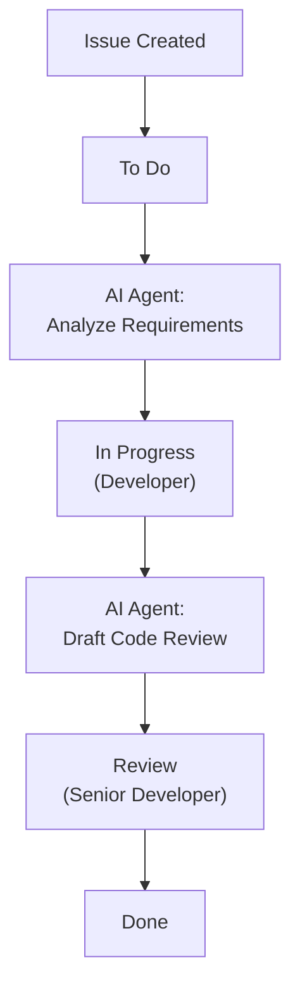
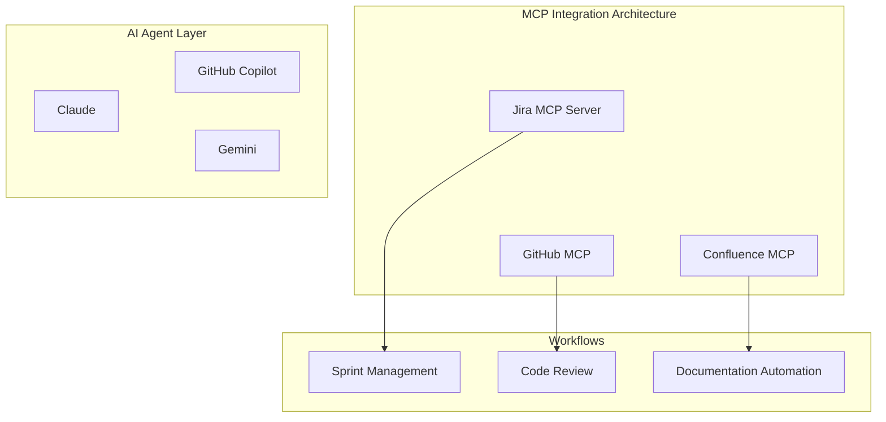

## Overview

On February 25, 2026, Atlassian <strong>officially launched AI agents in Jira</strong>. This isn't just another chatbot feature. AI agents now operate directly within the Jira workflow — they <strong>receive task assignments, collaborate via comments, and automatically execute workflow steps</strong>.

Simultaneously, Atlassian has <strong>embraced the Model Context Protocol (MCP)</strong> across its platform, enabling external AI agents like GitHub Copilot, Claude, and Gemini to connect directly with Jira alongside Rovo (Atlassian's own AI).

From an engineering manager's perspective, this isn't just a feature update. It's a <strong>signal that your team's operating model is about to change</strong>. This article breaks down what's shifting and how to prepare.

## What's Changed — Three Core Capabilities of Jira AI Agents

### 1. Assigning work to AI agents like team members

You can now assign Jira issues to AI agents using the same assignee field as humans. This means you can integrate AI without disrupting existing workflows.

```
# Traditional workflow
Issue created → Assign to developer → Work → Code review → Done

# AI agent integrated workflow
Issue created → Assign to AI agent (draft/research) → Developer review → Work → Done
```

### 2. Collaboration via @mention in comments

You can @mention AI agents in issue comments to get summaries, research, and solution proposals within the issue's context. No need to switch tools — AI collaboration happens right inside Jira.

### 3. Automated workflow triggers

You can position AI agents at specific workflow statuses, and they automatically perform tasks when status transitions occur.



## Why MCP Matters — Breaking Free from Vendor Lock-in

Atlassian's adoption of MCP isn't merely a technical choice. It represents <strong>liberation from vendor lock-in</strong>.

### Current MCP Integration Status

Through Atlassian's hosted MCP servers, the following AI clients connect directly to Jira and Confluence:

| AI Client | Connection Method |
|---|---|
| Claude (Anthropic) | Native MCP |
| GitHub Copilot | MCP Integration |
| Gemini CLI (Google) | MCP Integration |
| Cursor | MCP Integration |
| Lovable | MCP Integration |
| WRITER | MCP Integration |

### The Rovo MCP Gallery

Through Atlassian's Rovo MCP Gallery, third-party tools like GitHub, Box, and Figma can run agents within Jira. What's notable: <strong>approximately one-third of MCP usage is for write operations</strong>. This isn't just data retrieval — agents are actually performing work.

### Enterprise Adoption Status

- <strong>93% of MCP usage originates from paid customers</strong>
- Enterprise accounts account for <strong>roughly half of all MCP operations</strong>
- Clear evidence of real-world production adoption

## Five Things Engineering Managers Need to Prepare

### 1. Establish AI agent governance framework

When AI agents join your team, you need <strong>clear boundaries around permissions and accountability</strong>.

```yaml
# AI Agent Governance Checklist
permissions:
  - Define which projects agents can access
  - Set criteria for write permission grants
  - Require human approval for production-impacting tasks

audit:
  - Establish monitoring schedule for agent activity logs
  - Define anomaly detection criteria
  - Create monthly agent performance review process

escalation:
  - Plan fallback process when agents fail
  - Define escalation triggers from agent to human
  - Create procedures to halt agents in emergencies
```

### 2. Redefine team roles

When AI agents take on repetitive work, your team's responsibilities shift.

<strong>Before</strong>: Developers manually handle issue triage, draft code reviews, update documentation
<strong>After</strong>: AI generates drafts, developers focus on validation and decision-making

As an engineering manager, it's crucial to position this transition as <strong>opportunity, not threat</strong>. Design clear boundaries between work agents handle and work people handle, so your team can focus on higher-value activities.

### 3. Build a tool integration strategy around MCP

MCP is now a <strong>de facto standard</strong>. Though created by Anthropic, it was donated to the Linux Foundation, and is supported by OpenAI, Google, Microsoft, and AWS.



### 4. Create a phased rollout roadmap

Don't try to change everything at once. Introduce agents in phases.

<strong>Phase 1 (1〜2 weeks)</strong>: Start with read-only agents
- Automatic issue summaries, sprint report generation
- Risk: Low, Value: Immediate

<strong>Phase 2 (3〜4 weeks)</strong>: Limited write agent deployment
- Issue labeling, priority suggestions
- Require human approval gates

<strong>Phase 3 (2 months+)</strong>: Workflow automation
- Status transition triggered agents
- Integration with CI/CD pipelines
- Regular impact measurement and refinement

### 5. Design measurement metrics

You need quantifiable metrics to measure the success of AI agent adoption.

| Metric | Measurement | Goal |
|---|---|---|
| Issue triage time | Time from issue creation to first response | 50% reduction |
| Repetitive work ratio | Tasks handled by AI / Total tasks | 30%+ |
| Developer satisfaction | Monthly survey (1–5 scale) | 3.5+ |
| Agent accuracy | AI suggestion adoption rate | 70%+ |
| Sprint velocity change | Points per sprint | 20% improvement |

## Real-World Scenario — How an EM's Day Changes

### Before: Traditional sprint management

```
09:00 - Issue triage (30 min)
09:30 - Standup prep (check team status, 15 min)
10:00 - Standup meeting
10:30 - Resolve blockers (coordinate with teams, 1 hour)
14:00 - Code review (1 hour)
15:00 - Sprint review prep (30 min)
```

### After: With AI agents

```
09:00 - Review AI triage results (10 min)
09:10 - Review AI-generated standup summary (5 min)
09:30 - Standup meeting (more productive with AI summary)
10:00 - Focus on strategic blocker resolution (AI provides pre-analysis)
14:00 - Code review based on AI draft (30 min)
14:30 - Use saved time for 1:1s and technical debt cleanup
```

<strong>Key shift</strong>: Your role transforms from "task manager" to "decision maker."

## Important Caveats

### AI agents are not omnipotent

- Agents are tools. <strong>Judgment remains a human responsibility</strong>
- Early on, agent output quality may be inconsistent. Establish validation processes
- Consider team psychological safety. Proactively address fears that "AI will replace my job"

### Security and compliance

- Jira's existing permission system is fully respected
- All agent activities are logged in audit trails
- Production changes always require human approval
- Agents operate in isolated sandbox environments per developer

## Conclusion

Atlassian's launch of Jira AI agents plus MCP adoption represents <strong>a paradigm shift in project management tooling</strong>. As MCP becomes the standard, the pace of AI agent integration across development tools will only accelerate.

As an engineering manager, your priorities are clear:

1. <strong>Understand the MCP ecosystem</strong> and find the right AI agent combination for your team
2. <strong>Design governance frameworks first</strong>, then implement
3. <strong>Roll out gradually</strong>, paired with measurable metrics
4. <strong>Position role transitions as opportunities</strong> for your team

2026 is the year AI agents move from demo to production. The change happening in Jira—a platform used by millions of teams—is the clearest signal of that shift.

## References

- [Atlassian Official Announcement — AI Agents in Jira](https://www.atlassian.com/blog/announcements/ai-agents-in-jira)
- [TechCrunch — Jira's latest update allows AI agents and humans to work side by side](https://techcrunch.com/2026/02/25/jiras-latest-update-allows-ai-agents-and-humans-to-work-side-by-side/)
- [SiliconANGLE — Atlassian embeds agents into Jira and embraces MCP](https://siliconangle.com/2026/02/25/atlassian-embeds-agents-jira-embraces-mcp-third-party-integrations/)
- [MCP Official Site](https://modelcontextprotocol.io/)
