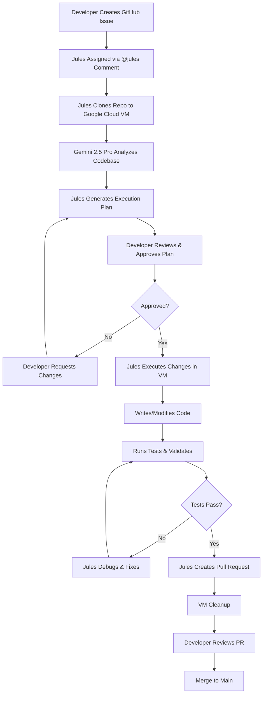

## Overview: Enter the Era of Autonomous Coding

The landscape of AI-assisted development is shifting from <strong>real-time copilots</strong> to <strong>autonomous agents</strong>. Google's Jules represents this paradigm shift—an AI coding agent that works independently in the background while you focus on other tasks.

Unlike traditional coding assistants that require constant interaction, Jules operates asynchronously. You assign it a task through a GitHub issue, approve its plan, and come back later to find a fully-formed pull request waiting for review. It's like having a junior developer who never sleeps, never complains, and works entirely in the cloud.

### What Makes Jules Different

<strong>Jules is Google's asynchronous autonomous AI coding agent</strong> powered by Gemini 2.5 Pro. Here's what sets it apart:

- <strong>GitHub-Native Integration</strong>: Works directly within your GitHub workflow—no IDE plugins required
- <strong>Asynchronous Execution</strong>: Runs tasks in isolated Google Cloud VMs while you work on other things
- <strong>Transparent Planning</strong>: Shows its reasoning and waits for your approval before making changes
- <strong>Full Autonomy</strong>: Handles file modifications, test execution, and PR creation end-to-end
- <strong>Codebase Comprehension</strong>: Leverages Gemini 2.5 Pro's 2M token context window to understand entire repositories

The core value proposition is simple: <strong>delegate entire coding tasks, not just snippets</strong>. While GitHub Copilot suggests the next line and Claude Code assists with interactive coding sessions, Jules takes ownership of complete workflows from issue to pull request.

## Core Features: What Jules Can Do

### 1. GitHub-Native Integration

Jules lives where your code lives. Install it as a GitHub App, and it gains access to:

- Repository source code (with your permission)
- Issues and comments for task assignment
- Branch creation and management
- Pull request creation and updates

No context switching between tools. No copying code to external interfaces. Everything happens in GitHub.

### 2. Asynchronous Workflow Architecture

This is Jules' killer feature. When you assign a task:

1. Jules clones your repository to a secure Google Cloud VM
2. Analyzes the codebase using Gemini 2.5 Pro
3. Generates an execution plan
4. Waits for your approval
5. Executes changes autonomously (writes code, runs tests, fixes errors)
6. Creates a pull request with all changes
7. Cleans up the VM

You can close your laptop and come back hours later to a completed PR. This asynchronous model is perfect for:

- Overnight batch tasks (update all dependencies)
- Long-running refactors (migrate to new API)
- Background quality improvements (add test coverage)

### 3. Transparent Planning and Reasoning

Before making any changes, Jules presents a detailed plan:

````
Plan Preview:

1. Analyze current authentication implementation in src/auth/
2. Identify OAuth 2.0 integration points
3. Add JWT token validation middleware
4. Update user session management
5. Add comprehensive unit tests
6. Update documentation in README.md

Estimated files affected: 7
Estimated time: 15-20 minutes
````

You review, approve, or request modifications. This human-in-the-loop approach ensures you maintain control while delegating execution.

### 4. Automatic Pull Request Generation

When Jules completes a task, it doesn't just dump code—it creates production-ready PRs with:

- Descriptive titles and detailed descriptions
- Commit history (logical, well-messaged commits)
- Test results and coverage reports
- Links back to the original issue

The PR is ready for team review and CI/CD pipeline validation.

### 5. Full Codebase Comprehension

Gemini 2.5 Pro's 2 million token context window means Jules can:

- Understand monorepos with hundreds of files
- Maintain consistency across frontend and backend
- Respect existing code patterns and conventions
- Make changes that consider the entire system architecture

It's not just pattern matching—it's architectural understanding.

## Technical Architecture: How Jules Works Under the Hood

Understanding Jules' architecture helps you use it effectively. Here's the complete workflow:



### Step-by-Step Breakdown

<strong>1. Task Assignment</strong>

You create a GitHub issue or comment on an existing one:

````markdown
@jules Please add input validation to the user registration endpoint.
Check for email format, password strength, and username uniqueness.
Add appropriate error messages for each validation failure.
````

<strong>2. Repository Cloning</strong>

Jules spins up an isolated Google Cloud VM and clones your repository. This ensures:

- No interference with your local development
- Secure execution in Google's infrastructure
- Ability to run tests requiring specific environments

<strong>3. Analysis and Planning</strong>

Gemini 2.5 Pro reads your entire codebase:

- Identifies relevant files (`src/api/auth/register.ts`)
- Understands existing validation patterns
- Locates test files (`tests/auth/register.test.ts`)
- Reviews error handling conventions

It generates a plan detailing every file it will modify and why.

<strong>4. Developer Approval</strong>

Jules posts the plan as a comment. You can:

- Approve immediately (`@jules approve`)
- Request clarifications (`@jules can you also add rate limiting?`)
- Reject and reassign (`@jules cancel, different approach needed`)

<strong>5. Autonomous Execution</strong>

After approval, Jules:

- Creates a new branch (`jules/add-registration-validation`)
- Modifies files according to the plan
- Runs your existing test suite
- If tests fail, debugs and fixes the code
- May iterate multiple times until tests pass

<strong>6. Pull Request Creation</strong>

Jules commits changes with clear messages:

````
feat: add input validation to user registration

- Add email format validation with regex
- Implement password strength checker (min 8 chars, special chars)
- Add username uniqueness check against database
- Create custom error messages for each validation type
- Add comprehensive test coverage (95% coverage achieved)

Closes #123
````

<strong>7. Cleanup</strong>

The VM is destroyed, and all temporary resources are cleaned up. You're left with a clean PR ready for review.

## Integration Methods: Three Ways to Use Jules

Google offers three ways to interact with Jules, each suited to different workflows.

### 1. GitHub Web Interface (Easiest)

<strong>Setup</strong>:

1. Install the Jules GitHub App from the marketplace
2. Grant repository access (public or private)
3. Start using `@jules` mentions in issues and comments

<strong>Usage Example</strong>:

````markdown
# In a GitHub issue:

Title: Upgrade React Router to v7

Body:
Our app currently uses React Router v5. We need to upgrade to v7 for:
- Improved performance
- Better TypeScript support
- Data loading APIs

@jules Please upgrade React Router from v5 to v7 across the entire codebase.
Update all route configurations and component imports.
Ensure all tests pass after the migration.
````

Jules responds with a plan, you approve, and the PR appears in your repository.

### 2. Jules Tools CLI (For Power Users)

Released in October 2025, the CLI brings Jules into your terminal workflow.

<strong>Installation</strong>:

````bash
npm install -g @google/jules-tools
````

<strong>Authentication</strong>:

````bash
jules auth login
# Opens browser for Google account authentication
````

<strong>Usage Examples</strong>:

````bash
# Create a new task
jules task create \
  --repo="myorg/myproject" \
  --title="Fix memory leak in dashboard component" \
  --description="Users report browser slowdown after 30 minutes. Profile and fix."

# List active tasks
jules task list --status=active

# Get task status
jules task status --id=task_abc123

# Approve a plan
jules task approve --id=task_abc123

# Cancel a task
jules task cancel --id=task_abc123
````

The CLI is perfect for:

- Batch task creation from scripts
- CI/CD integration
- Custom automation workflows
- Teams preferring terminal-based tools

### 3. Public API (Early Access, Most Flexible)

The Jules API enables programmatic integration for advanced use cases.

<strong>Authentication</strong>:

````bash
export JULES_API_KEY="your_api_key_here"
````

<strong>API Example</strong>:

````javascript
const axios = require('axios');

const createJulesTask = async () => {
  const response = await axios.post(
    'https://api.jules.google.com/v1/tasks',
    {
      repository: 'myorg/myproject',
      title: 'Add Redis caching layer',
      description: 'Implement Redis caching for user profile queries to reduce database load',
      options: {
        auto_approve: false, // Require manual approval
        target_branch: 'develop',
        labels: ['performance', 'infrastructure']
      }
    },
    {
      headers: {
        'Authorization': `Bearer ${process.env.JULES_API_KEY}`,
        'Content-Type': 'application/json'
      }
    }
  );

  console.log(`Task created: ${response.data.task_id}`);
  console.log(`View at: ${response.data.github_url}`);
};

createJulesTask();
````

<strong>API Capabilities</strong>:

- Create tasks programmatically
- Monitor task progress
- Retrieve execution logs
- Manage multiple repositories
- Integrate with custom dashboards

<strong>Use Cases</strong>:

- Automated dependency updates (run weekly via cron)
- Integration with issue tracking systems (Jira, Linear)
- Custom developer portals
- Automated code quality improvements

## Real-World Use Cases: When to Delegate to Jules

Jules excels at specific types of tasks. Here are proven use cases from real development teams.

### 1. Bug Triage and Fixes

<strong>Scenario</strong>: Your issue tracker has 47 open bugs. Some are simple null pointer exceptions or off-by-one errors that don't require deep architectural knowledge.

<strong>Jules Workflow</strong>:

````markdown
@jules Please fix the null pointer exception in UserProfileService.java line 247.
The error occurs when user.profile is null. Add proper null checking and
fallback to default profile values.
````

Jules:

1. Analyzes the code path leading to line 247
2. Identifies the root cause (missing null check after database query)
3. Adds defensive programming (null check + default values)
4. Updates related tests
5. Creates a PR with before/after comparison

<strong>Time Saved</strong>: 30 minutes per bug × 20 simple bugs = 10 hours saved

### 2. Test Coverage Improvement

<strong>Scenario</strong>: You're launching soon, but test coverage is 62%. You need 80%+ for confidence.

<strong>Jules Workflow</strong>:

````markdown
@jules Improve test coverage for src/payment/ directory to 85%.
Focus on edge cases: failed transactions, refunds, currency conversion.
Use our existing Jest testing patterns.
````

Jules:

1. Analyzes existing test structure in `tests/payment/`
2. Identifies untested code paths using coverage reports
3. Generates comprehensive test cases for:
   - Payment processing failures
   - Partial refunds
   - Multi-currency transactions
   - Timeout scenarios
4. Ensures tests follow project conventions
5. Achieves 87% coverage

<strong>Time Saved</strong>: Writing tests for complex payment logic = 4-6 hours → Jules does it in 20 minutes

### 3. Dependency Updates

<strong>Scenario</strong>: You have 23 outdated npm packages. Some require code changes (breaking changes in APIs).

<strong>Jules Workflow</strong>:

````bash
# Using CLI for batch updates
jules task create \
  --repo="myorg/frontend" \
  --title="Update all dependencies to latest stable versions" \
  --description="Update package.json dependencies. Fix breaking changes. Ensure all tests pass."
````

Jules:

1. Reads `package.json` and identifies outdated packages
2. Checks changelogs for breaking changes
3. Updates dependencies incrementally (not all at once—smart!)
4. Modifies code to accommodate API changes
5. Runs the full test suite after each update
6. Rolls back if tests fail and tries alternative approaches

<strong>Result</strong>: All 23 packages updated, 0 breaking changes shipped to production

### 4. Code Refactoring

<strong>Scenario</strong>: You're migrating from class components to React hooks. 30+ components need conversion.

<strong>Jules Workflow</strong>:

````markdown
@jules Convert all class components in src/components/legacy/ to functional
components with hooks. Maintain existing functionality and prop interfaces.
Update tests accordingly.
````

Jules:

1. Identifies 32 class components
2. Analyzes lifecycle methods (componentDidMount, etc.)
3. Converts to equivalent hooks (useEffect, useState)
4. Preserves prop types and TypeScript interfaces
5. Updates enzyme tests to React Testing Library
6. Creates one PR with all conversions

<strong>Time Saved</strong>: 30 components × 15 minutes each = 7.5 hours → Jules completes in 45 minutes

### 5. Documentation Generation

<strong>Scenario</strong>: Your API endpoints lack documentation. Onboarding new developers is painful.

<strong>Jules Workflow</strong>:

````markdown
@jules Generate comprehensive API documentation for all endpoints in src/api/v2/.
Include request/response examples, error codes, and authentication requirements.
Output as OpenAPI 3.0 spec.
````

Jules:

1. Scans all route handlers in `src/api/v2/`
2. Analyzes request validation schemas
3. Examines response structures
4. Identifies error handling patterns
5. Generates OpenAPI 3.0 YAML with:
   - All endpoints documented
   - Request/response examples
   - Error code descriptions
   - Authentication schemes

<strong>Result</strong>: Production-ready API docs in 30 minutes vs. days of manual writing

## Comparison with Other AI Coding Tools

How does Jules stack up against the competition? Let's compare:

| Feature | Jules | Claude Code | GitHub Copilot | Cursor |
|---------|-------|-------------|----------------|--------|
| <strong>Execution Model</strong> | Asynchronous (background) | Synchronous (interactive) | Synchronous (autocomplete) | Synchronous (chat + edit) |
| <strong>Task Autonomy</strong> | Full (issue to PR) | Partial (requires guidance) | Minimal (suggestions only) | Partial (multi-step edits) |
| <strong>Integration</strong> | GitHub-native | CLI-based | IDE plugin | IDE (VS Code fork) |
| <strong>Context Window</strong> | 2M tokens (Gemini 2.5 Pro) | 200K tokens (Claude Sonnet 3.5) | Limited (file-level) | Configurable |
| <strong>Best For</strong> | Background tasks, refactors | Interactive development | Code completion | Rapid prototyping |
| <strong>Pricing (Pro Tier)</strong> | $19.99/month (75 tasks/day) | $20/month (unlimited) | $10/month (unlimited) | $20/month (unlimited) |
| <strong>Test Execution</strong> | ✅ Runs tests in VM | ✅ Via terminal commands | ❌ No | ⚠️ Limited |
| <strong>PR Creation</strong> | ✅ Automatic | ⚠️ Manual (you commit) | ❌ No | ⚠️ Manual |
| <strong>Multi-file Changes</strong> | ✅ Excellent | ✅ Good | ⚠️ Limited | ✅ Good |

### When to Use Each Tool

<strong>Use Jules when</strong>:

- You have a well-defined task that will take 30+ minutes
- You can describe the goal clearly in natural language
- The task can run asynchronously (no immediate decisions needed)
- You want a complete PR, not just code suggestions

<strong>Examples</strong>: Dependency updates, test coverage, refactoring, bug fixes, documentation

<strong>Use Claude Code when</strong>:

- You're actively coding and need an intelligent pair programmer
- The problem is exploratory (you're figuring it out as you go)
- You need back-and-forth discussion about implementation approaches
- You want control over every step

<strong>Examples</strong>: Architecting new features, debugging complex issues, learning new codebases

<strong>Use GitHub Copilot when</strong>:

- You need fast autocomplete while typing
- You're writing boilerplate or repetitive code
- You want inline suggestions without breaking flow
- You're working in an IDE all day

<strong>Examples</strong>: Writing CRUD endpoints, creating test cases, generating utility functions

<strong>Use Cursor when</strong>:

- You want an AI-first IDE experience
- You're building a new project from scratch
- You value rapid iteration and multi-file edits
- You prefer chat-based interaction within your editor

<strong>Examples</strong>: MVP development, prototyping, full-stack projects

### The Optimal Combination

Smart teams use <strong>multiple tools</strong>:

- <strong>Jules</strong> for overnight batch work (update dependencies, improve test coverage)
- <strong>Claude Code</strong> for complex feature development (AI pair programming)
- <strong>GitHub Copilot</strong> for day-to-day autocomplete (productivity boost)

This isn't zero-sum—it's additive. Each tool handles what it does best.

## Pricing and Availability

Jules operates on a tiered pricing model designed for individuals and teams.

### Free Plan

<strong>Limits</strong>:

- 15 individual tasks per day
- 3 concurrent tasks at a time

<strong>Best For</strong>:

- Personal projects
- Trying out Jules
- Small-scale automation

<strong>Cost</strong>: $0/month

### AI Pro Plan

<strong>Limits</strong>:

- ~75 individual tasks per day (5× free tier)
- ~15 concurrent tasks

<strong>Best For</strong>:

- Professional developers
- Active open-source maintainers
- Small teams (2-5 developers)

<strong>Cost</strong>: $19.99/month

### AI Ultra Plan

<strong>Limits</strong>:

- ~300 individual tasks per day (20× free tier)
- ~60 concurrent tasks

<strong>Best For</strong>:

- Large teams
- Enterprises with multiple repositories
- High-volume automation workflows

<strong>Cost</strong>: $124.99/month

### What Counts as a "Task"?

- Each GitHub issue assigned to Jules = 1 task
- Each CLI `jules task create` = 1 task
- Each API task creation = 1 task

Task limits reset daily at midnight UTC.

### Concurrent Task Limits

If you hit the concurrent limit, new tasks queue until active ones complete. For example:

- Free tier: 3 tasks running → 4th task waits
- Pro tier: 15 tasks running → 16th task queues

This prevents resource exhaustion and ensures quality execution.

### How Jules Pricing Compares

| Tool | Free Tier | Pro Tier | Notes |
|------|-----------|----------|-------|
| Jules | 15 tasks/day | $19.99 (75 tasks/day) | Task-based limits |
| Claude Code | ❌ None | $20/month (unlimited) | Usage-based |
| GitHub Copilot | ❌ None | $10/month (unlimited) | Autocomplete-focused |
| Cursor | 14-day trial | $20/month (unlimited) | IDE subscription |

Jules' task-based pricing is unique. If you average 3-4 Jules tasks per workday (~20/week), the Pro plan ($19.99) provides excellent value.

## Limitations and Considerations

Jules is powerful, but it's not perfect. Understanding its limitations helps you use it effectively.

### 1. Language Support (Currently Limited)

<strong>Supported</strong>:

- Python (excellent)
- JavaScript/TypeScript (excellent)
- React, Node.js, Express (good)

<strong>Not Yet Supported</strong>:

- Java, C++, Rust, Go, C#
- Mobile development (Swift, Kotlin)
- Emerging languages (Zig, Elixir)

Google is expanding language support. Check the official docs for updates.

### 2. English-Only Interface

Jules currently only understands English prompts:

- GitHub issue descriptions must be in English
- Code comments can be in any language
- Generated documentation will be in English

This limits adoption for non-English-speaking teams.

### 3. Asynchronous Latency

Tasks typically take 15-45 minutes to complete:

- Simple bug fix: 10-15 minutes
- Test coverage improvement: 20-30 minutes
- Large refactor: 30-60 minutes

This is <strong>not suitable for</strong>:

- Urgent hotfixes (use Claude Code or manual coding)
- Rapid iteration during development
- Real-time pair programming

It <strong>is suitable for</strong>:

- Overnight batch jobs
- Work you assign before lunch
- Background quality improvements

### 4. GitHub-Only Integration

Jules only works with GitHub repositories:

- Not compatible with GitLab, Bitbucket, Azure DevOps
- Requires GitHub account and repository access
- No local-only usage (always needs GitHub connection)

If your organization uses GitLab, Jules won't work (yet).

### 5. Security and Privacy Considerations

<strong>What Jules Accesses</strong>:

- Full repository source code (cloned to Google Cloud VM)
- GitHub issues, PRs, and comments
- Repository settings and branch protections

<strong>Security Measures</strong>:

- Isolated VMs per task (no data persistence between tasks)
- Encrypted data in transit and at rest
- OAuth-based authentication (no password storage)
- Compliance with SOC 2, ISO 27001

<strong>Best Practices</strong>:

- Review Jules' plan before approval (don't auto-approve everything)
- Audit PRs before merging (treat Jules like a junior developer)
- Use branch protection rules (require human review)
- Don't share API keys in repository code

### 6. Not a Replacement for Human Judgment

Jules can write code, but it:

- Doesn't understand business context deeply
- Can't make product decisions
- May miss non-obvious edge cases
- Requires human review before merging

Always review Jules' PRs. It's a tool, not a team member.

## Best Practices: Getting the Most from Jules

### 1. Write Clear, Specific GitHub Issues

<strong>Bad Example</strong>:

````markdown
@jules Fix the bug in authentication
````

Jules will struggle with:

- Which bug? (too vague)
- Where in authentication? (no specificity)
- What's the expected behavior? (no acceptance criteria)

<strong>Good Example</strong>:

````markdown
@jules Fix authentication bug: users remain logged in after password reset

Steps to reproduce:
1. User requests password reset
2. User changes password via email link
3. User's old session remains valid (should be invalidated)

Expected behavior:
- After password reset, all existing sessions should be invalidated
- User should be forced to log in with new password

Files likely involved:
- src/auth/password-reset.ts
- src/session/session-manager.ts

Please add tests to prevent regression.
````

Jules now has:

- Clear problem statement
- Reproduction steps
- Expected outcome
- Hints about file locations
- Test requirements

### 2. Leverage the Plan Review Process

When Jules presents a plan:

<strong>✅ Do This</strong>:

- Read the plan carefully (what files, what changes?)
- Ask questions if anything is unclear (`@jules why are you modifying config.ts?`)
- Request additions (`@jules please also add integration tests`)
- Suggest alternatives (`@jules consider using the existing EmailService instead`)

<strong>❌ Don't Do This</strong>:

- Auto-approve without reading
- Approve plans that seem too broad ("modify 47 files")
- Skip verification of affected files

The plan review is your opportunity to course-correct before Jules invests compute time.

### 3. Integrate with CI/CD Pipelines

Make Jules' PRs go through your standard pipeline:

````yaml
# .github/workflows/jules-pr-validation.yml
name: Validate Jules PRs

on:
  pull_request:
    branches: [main, develop]

jobs:
  test:
    runs-on: ubuntu-latest
    steps:
      - uses: actions/checkout@v3
      - name: Install dependencies
        run: npm install
      - name: Run linter
        run: npm run lint
      - name: Run tests
        run: npm test
      - name: Check test coverage
        run: npm run coverage
      - name: Build
        run: npm run build
````

Jules' PRs should pass:

- Linting (ESLint, Prettier)
- Unit tests
- Integration tests
- Build process
- Code coverage thresholds

Don't lower standards for AI-generated code.

### 4. Use Batch Operations Wisely

Jules excels at batch work. Examples:

<strong>Batch Dependency Updates</strong>:

````bash
# Instead of 10 individual tasks:
jules task create --title="Update React to v19"
jules task create --title="Update TypeScript to v5.3"
# ... 8 more tasks

# Do this (one task):
jules task create --title="Update all frontend dependencies to latest stable versions"
````

<strong>Batch Test Coverage</strong>:

````markdown
@jules Improve test coverage across src/api/, src/services/, and src/utils/
to 85%. Focus on untested edge cases and error handling.
````

Batching reduces overhead and lets Jules optimize globally.

### 5. Create Task Templates for Recurring Work

If you do certain tasks weekly/monthly, create templates:

<strong>Dependency Update Template</strong>:

````markdown
# .github/ISSUE_TEMPLATE/weekly-dependency-update.md
---
name: Weekly Dependency Update
about: Update all dependencies to latest stable versions
labels: maintenance, dependencies
---

@jules Please update all dependencies in package.json to their latest stable versions.

Requirements:
- Check for breaking changes in changelogs
- Update code to accommodate API changes
- Ensure all tests pass
- Update documentation if APIs changed
- Create a single PR with all updates

Packages to prioritize:
- Security updates (always include)
- Framework updates (React, Next.js)
- Testing libraries (Jest, Testing Library)
````

Create the issue weekly, and Jules handles it automatically.

### 6. Monitor and Iterate

Track Jules' performance over time:

- How many tasks succeed on first try?
- Which tasks require human intervention?
- Where does Jules consistently struggle?

Use this data to:

- Improve task descriptions
- Adjust expectations
- Identify areas where Jules needs better prompting

## Conclusion: The Future of Autonomous Coding

Jules represents a fundamental shift in how we think about AI coding assistance. It's not about <strong>faster autocomplete</strong> or <strong>smarter suggestions</strong>—it's about <strong>delegation</strong>.

### When to Use Jules

Jules is ideal when:

- You have a clearly defined task (bug fix, refactor, test coverage)
- The task will take 30+ minutes of focused work
- You can describe the desired outcome in natural language
- You don't need immediate results (asynchronous is fine)
- You want a complete pull request, not code snippets

### When to Use Other Tools

Use Claude Code, GitHub Copilot, or Cursor when:

- You're actively developing and need real-time assistance
- The problem is exploratory (you're figuring out the approach)
- You need to make decisions during implementation
- You're pair programming with AI

### Combining Tools for Maximum Productivity

The most productive developers use a portfolio of AI tools:

1. <strong>Jules</strong> for overnight batch work
   - "Update all dependencies"
   - "Improve test coverage to 85%"
   - "Refactor authentication to OAuth 2.0"

2. <strong>Claude Code</strong> for complex feature development
   - "Help me architect a real-time chat feature"
   - "Debug this memory leak"
   - "Explain this legacy code"

3. <strong>GitHub Copilot</strong> for day-to-day coding
   - Autocomplete as you type
   - Generate boilerplate
   - Quick function implementations

This isn't about replacing one tool with another—it's about using the right tool for each job.

### The Road Ahead

Google is actively developing Jules. Expect:

- Expanded language support (Java, C++, Rust coming)
- Multi-language interface (Spanish, Japanese, Korean)
- GitLab and Bitbucket integration
- Enhanced IDE integration (VS Code, IntelliJ)
- Improved planning accuracy
- Faster execution times

As models improve and infrastructure scales, the line between "AI assistant" and "AI teammate" will blur. Jules is an early glimpse of that future.

### Getting Started

Ready to try Jules?

1. <strong>Install the GitHub App</strong>: Visit the GitHub Marketplace
2. <strong>Grant Repository Access</strong>: Choose repositories to enable
3. <strong>Create Your First Task</strong>: Open an issue and mention `@jules`
4. <strong>Review the Plan</strong>: See what Jules proposes
5. <strong>Approve and Wait</strong>: Let Jules work in the background
6. <strong>Review the PR</strong>: Merge when satisfied

Start with simple tasks (bug fixes, documentation) and gradually move to complex work (refactors, migrations) as you build confidence.

The future of coding isn't writing every line yourself—it's orchestrating AI agents to multiply your impact. Jules is one of the first production-ready tools in this new paradigm.

Welcome to the era of autonomous coding.

---

<strong>Resources</strong>:

- [Official Jules Documentation](https://ai.google.dev/jules)
- [Jules GitHub App](https://github.com/marketplace/jules-ai)
- [Jules CLI on npm](https://www.npmjs.com/package/@google/jules-tools)
- [Google AI Blog: Introducing Jules](https://blog.google/technology/google-labs/jules-tools-jules-api/)
