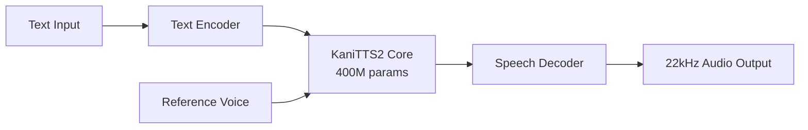

## Overview

Text-to-speech (TTS) technology has traditionally required large-scale models and high-end GPUs. However, the release of <strong>KaniTTS2</strong> significantly lowers these barriers. With just <strong>400 million parameters</strong> and <strong>3GB of VRAM</strong>, this model enables real-time voice cloning, making it one of the latest examples of voice AI democratization.

Released by the nineninesix-ai team under the Apache 2.0 license, this project goes beyond model weights — it includes the <strong>complete pretraining code</strong>, allowing anyone to train their own TTS model from scratch.

## KaniTTS2 Key Specs

| Specification | Details |
|---------------|---------|
| Parameters | 400M (BF16) |
| Sample Rate | 22kHz |
| GPU VRAM | 3GB |
| RTF (Real-Time Factor) | ~0.2 (on RTX 5090) |
| Training Data | ~10,000 hours of speech |
| Training Time | 6 hours on 8x H100s |
| Languages | English, Spanish (more coming) |
| License | Apache 2.0 |

An <strong>RTF of 0.2</strong> means generating 1 second of speech takes only 0.2 seconds — more than fast enough for real-time conversational use cases.

## Why KaniTTS2 Matters

### 1. Extreme Lightweight Design

Previous high-quality TTS models often required billions of parameters and 10GB+ of VRAM. KaniTTS2 achieves competitive quality with 400M parameters, running on <strong>consumer-grade GPUs like the RTX 3060</strong>.

### 2. Complete Open-Source Pretraining Framework

Beyond model weights, the <strong>entire pretraining codebase</strong> is publicly available. This opens up possibilities for:

- Training TTS models for underrepresented languages
- Building domain-specific voice models (medical, legal, etc.)
- Customizing for specific accents and dialects

### 3. Built-in Voice Cloning

Voice cloning is <strong>built into the model</strong> without requiring separate fine-tuning. Simply provide a reference audio sample, and the model generates speech in that speaker's voice.

## Architecture and Training



Training uses approximately 10,000 hours of speech data and completes in <strong>just 6 hours on 8 H100 GPUs</strong>. This is remarkably efficient compared to large-scale TTS models that can take days or weeks to train.

## Getting Started

### Download from HuggingFace

KaniTTS2 offers two model variants:

- <strong>Multilingual Model (Pretrained)</strong>: English and Spanish support
- <strong>English-Only Model</strong>: Optimized for English with local accent support

```bash
# Download from HuggingFace
# Multilingual model
git clone https://huggingface.co/nineninesix/kani-tts-2-pt

# English-only model
git clone https://huggingface.co/nineninesix/kani-tts-2-en
```

### Try the Demo on HuggingFace Spaces

Experience the model directly in your browser without installation:

- Multilingual: [HF Spaces (Pretrained)](https://huggingface.co/spaces/nineninesix/kani-tts-2-pt)
- English: [HF Spaces (English)](https://huggingface.co/spaces/nineninesix/kanitts-2-en)

### Train Your Own Model

With the pretraining code, you can build a TTS model from scratch:

```bash
# Clone the pretraining code
git clone https://github.com/nineninesix-ai/kani-tts-2-pretrain
cd kani-tts-2-pretrain

# Follow the README for setup and training instructions
```

## Lightweight TTS Model Comparison

Several locally-runnable TTS models have emerged recently:

| Model | Parameters | VRAM | Voice Cloning | Open-Source Training Code |
|-------|-----------|------|:---:|:---:|
| <strong>KaniTTS2</strong> | 400M | 3GB | ✅ | ✅ |
| Bark | ~1B | 6GB+ | ✅ | ❌ |
| XTTS v2 | ~500M | 4GB+ | ✅ | Partial |
| Piper | ~60M | <1GB | ❌ | ✅ |

KaniTTS2 stands out by providing <strong>both voice cloning and complete pretraining code</strong> while maintaining a lightweight footprint.

## What Voice AI Democratization Means

The release of KaniTTS2 goes beyond a simple model drop — it's a significant milestone for voice AI democratization:

1. <strong>Underrepresented Language Support</strong>: Open pretraining code enables communities to build TTS models for their own languages
2. <strong>Cost Barrier Removal</strong>: 3GB VRAM is enough, eliminating the need for expensive GPUs
3. <strong>Research Acceleration</strong>: Full training pipeline disclosure improves reproducibility and speeds up TTS research
4. <strong>Personal Privacy</strong>: Running locally instead of through cloud APIs ensures voice data privacy

## Conclusion

KaniTTS2 exemplifies the <strong>"small but mighty"</strong> model philosophy. With voice cloning capabilities packed into just 400M parameters, it challenges the notion that only large models can deliver high-quality speech synthesis.

The complete release of pretraining code is expected to positively impact the entire voice AI ecosystem — from underrepresented language support to domain-specific optimization and personalized voice assistant development.

As local AI continues to grow more powerful, KaniTTS2 proves that the <strong>"local-first"</strong> approach is becoming a reality in voice AI as well.

## References

- [KaniTTS2 Pretrained Model (HuggingFace)](https://huggingface.co/nineninesix/kani-tts-2-pt)
- [KaniTTS2 English Model (HuggingFace)](https://huggingface.co/nineninesix/kani-tts-2-en)
- [KaniTTS2 Pretrain Code (GitHub)](https://github.com/nineninesix-ai/kani-tts-2-pretrain)
- [Reddit: KaniTTS2 Discussion (r/LocalLLaMA)](https://www.reddit.com/r/LocalLLaMA/comments/1r4sivv/kanitts2_opensource_400m_tts_model_with_voice/)
