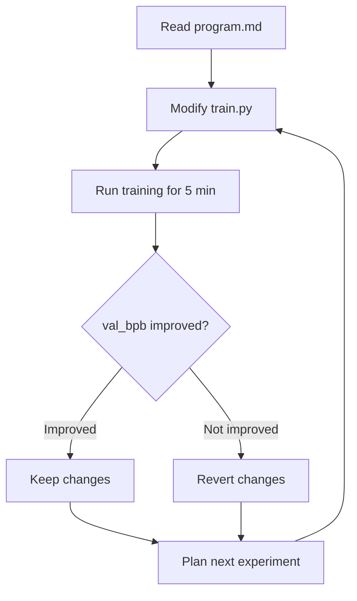

## Overview

In March 2026, Andrej Karpathy (former Tesla AI Director and OpenAI co-founder) open-sourced [autoresearch](https://github.com/karpathy/autoresearch). The core idea is simple — <strong>give an AI agent a single GPU and training code, and let it run experiments autonomously overnight</strong>.

The agent modifies code, runs training for 5 minutes, evaluates results, keeps improvements, and reverts failures. This cycle repeats roughly 12 times per hour, yielding about 100 experiments in a single night. The project garnered over 8,000 GitHub stars shortly after release, and on the night of March 8–9, 35 agents on the Hyperspace network executed 333 experiments in a fully unattended run.

In this post, we analyze autoresearch's architecture and how it works, then examine its implications for R&D teams from an Engineering Manager's perspective.

## Design Philosophy of autoresearch

Karpathy's design philosophy can be summed up as <strong>"one GPU, one file, one metric."</strong>

### Why 630 Lines?

The entire training code (`train.py`) in autoresearch is roughly 630 lines. This is an intentional constraint:

- The full code fits within modern LLM context windows (128K+ tokens)
- The agent can modify code while "understanding" the entire codebase
- Limited scope of changes makes debugging and change tracking easier

```python
# train.py — the only file the agent modifies
# Contains GPT model definition, Muon + AdamW optimizers, and training loop
# Approximately 630 lines — fully fits within LLM context windows
```

### Core File Structure

```
autoresearch/
├── prepare.py    # Data preparation (run once) — tokenizer training, data loading
├── train.py      # Training code — the only file the agent modifies
└── program.md    # Agent instructions — a "research directive" written by humans
```

Each file has a clearly defined role:

- <strong>prepare.py</strong>: Dataset download, BPE tokenizer training, data loading utilities. Fixed infrastructure that neither humans nor agents modify
- <strong>train.py</strong>: The complete GPT model, optimizers (Muon + AdamW), and training loop. The only file the agent modifies
- <strong>program.md</strong>: A markdown directive written by humans. The "research directive" that determines the agent's research direction

## Agent Experiment Loop

The autonomous experiment cycle in autoresearch works as follows:



### Fixed 5-Minute Time Budget

Every experiment runs for exactly 5 minutes. This constraint is key:

- Same time budget whether changing architecture or tuning hyperparameters
- Enables fair comparison between experiments
- 12 experiments per hour × 8 hours = approximately 100 experiments overnight

### Evaluation Metric: val_bpb

<strong>val_bpb</strong> (validation bits per byte) is an evaluation metric independent of vocabulary size. It allows consistent comparison even when changing the tokenizer or completely swapping out the architecture. Lower values indicate better performance.

## EM Perspective: Implications for R&D Teams

Looking at autoresearch as an Engineering Manager, there are signals of structural change that go beyond just an "interesting project."

### 1. Automating Repetitive Work, Not Thinking

What autoresearch automates is <strong>the repetitive loop of "modify → train → evaluate."</strong> What researchers still need to do:

- Set experiment directions in `program.md`
- Interpret results and decide the next research direction
- Extract insights from successful experiments

This is <strong>"automation of iteration,"</strong> not <strong>"automation of thinking."</strong> It is also a key message that EMs need to communicate to their team members.

### 2. Redefining Research Productivity

Let's compare this with traditional ML research workflows:

| Category | Traditional Approach | autoresearch |
|----------|---------------------|--------------|
| Experiment execution | Manual (edit code → train → wait) | Automated (agent runs continuously) |
| Experiments per day | 3–5 | 100+ |
| Researcher role | Execution + analysis | Direction setting + analysis |
| Nights/weekends | 1 long training run | 100 short experiments |
| Cost of failure | Hours wasted | 5 minutes (auto-rollback) |

### 3. Considerations for Team Adoption

If you are introducing autoresearch to an R&D team, consider the following:

<strong>Technical requirements</strong>:
- 1 NVIDIA GPU (validated on H100)
- Python 3.10+, PyTorch
- `uv` package manager

<strong>Organizational considerations</strong>:
- The ability to write `program.md` is now a core research skill — you need senior researchers who can craft good directives
- Interpreting experiment results and setting the next direction remains a human responsibility
- "100 experiments overnight" does not always mean "better research"

## Practical Getting Started Guide

### Basic Setup (Start in 5 Minutes)

```bash
# 1. Clone the repository and install dependencies
git clone https://github.com/karpathy/autoresearch.git
cd autoresearch
uv sync

# 2. Prepare data (approximately 2 minutes)
uv run prepare.py

# 3. Manual test (verify GPU is working)
uv run train.py
```

### Example program.md

`program.md` is the key file that determines the agent's research direction. Here is an example of a well-written directive:

```markdown
# Research Direction

## Goal
Reduce val_bpb by optimizing the attention mechanism.

## Constraints
- Do not change the tokenizer or vocabulary size
- Keep total training time under 5 minutes
- Maintain model parameter count within 2x of baseline

## Suggested Experiments
1. Try multi-head attention with different head counts
2. Experiment with rotary position embeddings
3. Test grouped query attention (GQA)
```

### Analyzing Results

After an overnight run, analyze the logs left by the agent. You can review val_bpb changes, applied modifications, and success/failure status for each experiment.

## The Bigger Picture: The Trend of Automating AI Research

autoresearch is not an isolated phenomenon. It is part of a broader <strong>"AI researching AI"</strong> trend emerging in early 2026:

- <strong>Anthropic Code Review</strong>: Multi-agent systems that automatically analyze AI-generated code and detect logic errors
- <strong>OpenAI's automated red teaming</strong>: AI models that automatically probe other AI models for vulnerabilities
- <strong>Google's AutoML evolution</strong>: AI designing neural network architectures themselves

What sets autoresearch apart is its <strong>accessibility</strong>. Anyone can experience this paradigm with a single H100 and 630 lines of code. This is also why it rapidly accumulated over 8,000 GitHub stars.

## Conclusion

Karpathy's autoresearch is a practical framework that delegates the "repetitive execution" part of ML research to an agent. Its design philosophy is clear: an intentional 630-line constraint, a fixed 5-minute time budget, and single-metric comparison.

Key takeaways from an EM/VPoE perspective:

1. <strong>Shifting the definition of research productivity</strong>: From "how many experiments did you run today?" to "how good were the experiment directions you set?"
2. <strong>Evolving role of senior researchers</strong>: From hands-on experimenters to designers of the agent's research direction
3. <strong>The value of GPU idle time</strong>: Nighttime and weekend GPU idle hours become opportunities for 100 experiments

More important than the raw number of "100 experiments overnight" is the structural shift: <strong>the researcher's role is moving from "execution" to "direction setting."</strong>

## References

- [karpathy/autoresearch (GitHub)](https://github.com/karpathy/autoresearch)
- [Andrej Karpathy Open-Sources 'Autoresearch' (MarkTechPost)](https://www.marktechpost.com/2026/03/08/andrej-karpathy-open-sources-autoresearch-a-630-line-python-tool-letting-ai-agents-run-autonomous-ml-experiments-on-single-gpus/)
- [Karpathy Just Turned One GPU Into a Research Lab (Garry's List)](https://garryslist.org/posts/karpathy-just-turned-one-gpu-into-a-research-lab-f55754a6)
- [Autoresearch: Karpathy's Overnight AI Researcher (Top AI Product)](https://topaiproduct.com/2026/03/07/autoresearch-karpathys-overnight-ai-researcher-that-runs-100-experiments-while-you-sleep/)
