## Overview

The era of "small is powerful" has arrived in voice AI. <strong>Kitten TTS V0.8</strong> is an ultra-compact text-to-speech model that achieves cloud-grade TTS quality with just <strong>14M parameters and under 25MB</strong> in size.

As local voice AI models like KaniTTS2, Qwen3-TTS.cpp, and FreeFlow continue to emerge, Kitten TTS breaks new ground with its extreme lightweight design. This article provides a thorough analysis of Kitten TTS V0.8's technical features, a comparison of its three model variants, and an assessment of edge device deployment potential.

## What Is Kitten TTS V0.8?

Developed by [Kitten ML](https://github.com/KittenML/KittenTTS), this is an open-source TTS model released under the Apache 2.0 license. The major update from V0.1 to V0.8 brings significant improvements in quality, expressivity, and realism.

### Three Model Variants


| Model | Parameters | Size | Key Feature |
|-------|-----------|------|-------------|
| <strong>Mini</strong> | 80M | ~150MB | Highest quality, excellent expressivity for longer chunks |
| <strong>Micro</strong> | 40M | ~80MB | Balance between quality and size |
| <strong>Nano</strong> | 14M | <strong><25MB</strong> | Ultra-lightweight, optimized for edge devices |

All three models include <strong>8 expressive voices</strong> (4 female, 4 male). English is currently supported, with multilingual support planned for future releases.

## Key Technical Highlights

### 1. CPU-Only Execution

Beyond simply "no GPU required," Kitten TTS is <strong>designed from the ground up for resource-constrained edge devices</strong>. It can run on low-spec environments like Raspberry Pi and IoT devices — great news for GPU-poor developers.

### 2. Cloud-Quality TTS On-Device


All inference happens entirely on-device without any cloud API calls:

- <strong>Dramatically reduced latency</strong>: No network round-trip
- <strong>Privacy guaranteed</strong>: Voice data never leaves the device
- <strong>Zero cost</strong>: No API billing
- <strong>Offline operation</strong>: No network connection needed

### 3. Evolution from V0.1

V0.8 includes these major improvements:

- <strong>10x larger training dataset</strong>: Massive expansion of training data
- <strong>Improved training pipelines</strong>: Overhauled optimization methods
- <strong>Enhanced quality, expressivity, and realism</strong>: Natural prosody and intonation

## Position in the Local Voice AI Landscape

The localization of voice AI has accelerated rapidly from 2025 to 2026.

| Model | Highlight | Size |
|-------|-----------|------|
| <strong>KaniTTS2</strong> | Japanese-specialized, high-quality TTS | Medium–Large |
| <strong>Qwen3-TTS.cpp</strong> | Multilingual, llama.cpp integration | Medium |
| <strong>FreeFlow</strong> | Natural prosody, emotional expression | Medium |
| <strong>Kitten TTS V0.8</strong> | <strong>SOTA quality at extreme miniaturization</strong> | <strong>Ultra-small (14M–80M)</strong> |

Kitten TTS's biggest differentiator is <strong>size</strong>. At 14M parameters and under 25MB, it operates in an entirely different dimension from other models.

## Edge Device Deployment Potential

### Use Case Analysis

```mermaid
graph TD
    K[Kitten TTS Nano<br/>14M / 25MB] --> U1[🏠 Smart Home<br/>Voice Assistants]
    K --> U2[🎮 Gaming Devices<br/>NPC Voices]
    K --> U3[📱 Mobile Apps<br/>Offline TTS]
    K --> U4[🤖 Robotics<br/>Voice Interaction]
    K --> U5[🏭 Industrial IoT<br/>Voice Alerts]
    K --> U6[♿ Accessibility<br/>Screen Readers]
```



### Concrete Deployment Scenarios

<strong>1. Smart Home Devices</strong>

At under 25MB, the model can potentially run on low-cost microcontrollers like the ESP32. Local voice assistants without cloud dependency become a real possibility.

<strong>2. Mobile Applications</strong>

Small enough to bundle with an app, enabling TTS functionality even offline. This improves accessibility in areas with poor connectivity.

<strong>3. Voice Agents</strong>

Low-latency TTS via local inference is ideal for conversational voice agents. Combined with LLMs, fully local voice dialogue systems become achievable.

## Quick Start

```bash
# Clone the repository
git clone https://github.com/KittenML/KittenTTS.git
cd KittenTTS

# Download model (Nano)
# From HuggingFace
# https://huggingface.co/KittenML/kitten-tts-nano-0.8
```

Models available on HuggingFace:

- [Mini 80M](https://huggingface.co/KittenML/kitten-tts-mini-0.8) — Highest quality
- [Micro 40M](https://huggingface.co/KittenML/kitten-tts-micro-0.8) — Balanced
- [Nano 14M](https://huggingface.co/KittenML/kitten-tts-nano-0.8) — Ultra-lightweight

## Future Outlook

Kitten TTS V0.8 currently supports English only, but <strong>multilingual support</strong> is planned for future releases. Once additional languages are supported, the impact on edge AI markets worldwide will be significant.

With Apache 2.0 licensing, commercial use is unrestricted. From startups to enterprises, the barrier to integrating voice features into products has dropped dramatically.

## Conclusion

Kitten TTS V0.8 embodies the new paradigm of <strong>"small models, big quality."</strong> With an astonishing 14M parameters and under 25MB, it delivers quality comparable to cloud TTS services.

In the wave of local voice AI models including KaniTTS2, Qwen3-TTS.cpp, and FreeFlow, Kitten TTS stands out as the <strong>definitive solution for edge device deployment</strong>. A GPU-free, API-free, fully local ultra-compact TTS model — it represents the next step in voice AI democratization.

## References

- [Kitten TTS GitHub Repository](https://github.com/KittenML/KittenTTS)
- [Reddit — Kitten TTS V0.8 Release Thread](https://www.reddit.com/r/LocalLLaMA/comments/1r8pztp/kitten_tts_v08_is_out_new_sota_supertiny_tts/)
- [HuggingFace — Kitten TTS Mini 0.8](https://huggingface.co/KittenML/kitten-tts-mini-0.8)
- [HuggingFace — Kitten TTS Micro 0.8](https://huggingface.co/KittenML/kitten-tts-micro-0.8)
- [HuggingFace — Kitten TTS Nano 0.8](https://huggingface.co/KittenML/kitten-tts-nano-0.8)
