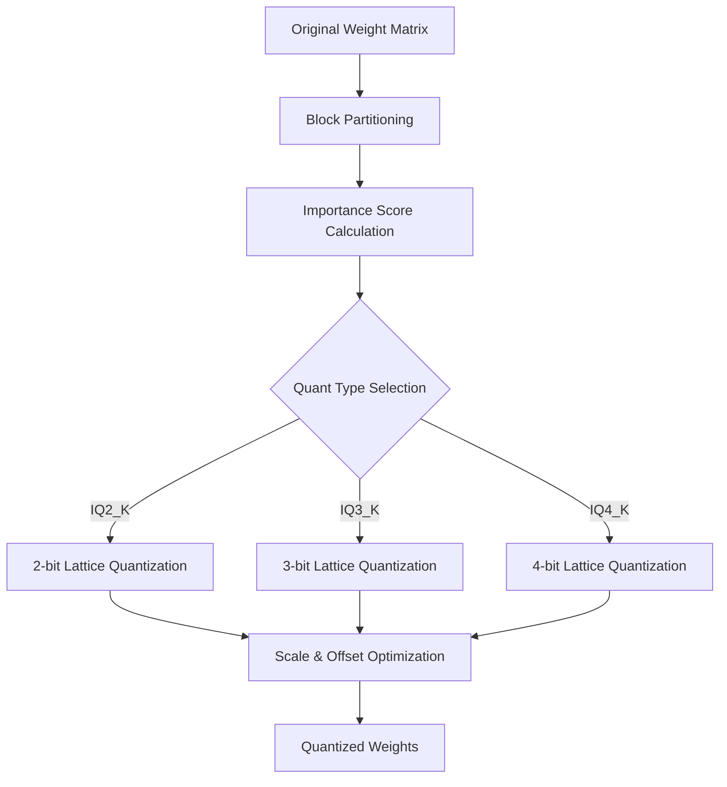
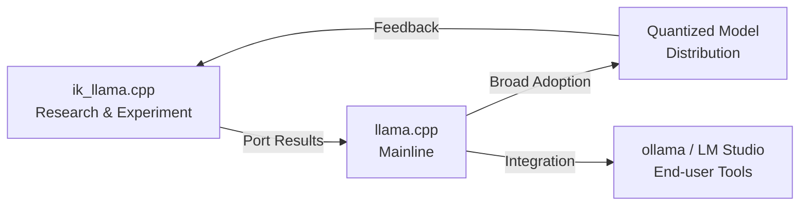

## Overview

llama.cpp's quantization methods have reached a major turning point. The <strong>IQ*_K / IQ*_KS</strong> series quantization, independently developed in <strong>ik_llama.cpp</strong> (a fork of llama.cpp), is being merged into the llama.cpp mainline through PR #19726. With 125 points on Reddit r/LocalLLaMA, this has garnered significant attention in the local LLM community.

This article covers the technical background of IQ-series quantization, how it differs from existing methods, and its impact on local LLM inference.

## What Is IQ Quantization?

### Limitations of Conventional Quantization

In llama.cpp, k-quant series quantization like <strong>Q4_K_M</strong> and <strong>Q5_K_S</strong> has been the mainstream approach. These use uniform quantization grids that don't fully exploit the distribution characteristics of model weights.

### The IQ Approach

IQ (Importance-aware Quantization) series quantization adopts <strong>non-uniform quantization based on weight importance</strong>. Specifically:

- <strong>Lattice-based quantization</strong>: Uses information-theoretically optimal lattice points instead of uniform grids
- <strong>Importance weighting</strong>: Adjusts quantization precision based on each weight's contribution to the loss function
- <strong>Block-level optimization</strong>: Computes optimal scale and offset for each weight block

```
Traditional Q4_K:  Uniform 16-level quantization grid
IQ4_K:             Non-uniform lattice points adapted to weight distribution
Result:            Higher precision at the same bit count
```

## What's in PR #19726

### Ported Quantization Types

[GitHub PR #19726](https://github.com/ggml-org/llama.cpp/pull/19726) ports the following quantization types from ik_llama.cpp, contributed by AesSedai:

| Quant Type | Bits/Weight | Use Case |
|-----------|------------|----------|
| <strong>IQ2_K</strong> | ~2.5 bpw | Ultra-low bit, memory-constrained environments |
| <strong>IQ2_KS</strong> | ~2.5 bpw | IQ2_K variant for smaller models |
| <strong>IQ3_K</strong> | ~3.5 bpw | Balanced, optimal for many use cases |
| <strong>IQ3_KS</strong> | ~3.5 bpw | IQ3_K variant for smaller models |
| <strong>IQ4_K</strong> | ~4.5 bpw | High precision when sufficient memory available |
| <strong>IQ4_KS</strong> | ~4.5 bpw | IQ4_K variant for smaller models |

### The ik_llama.cpp Relationship

The backstory of this PR is noteworthy. Iwan Kawrakow, the developer of ik_llama.cpp, clarified on the PR:

- The port in its current form (with copyright attribution) is <strong>perfectly fine</strong>
- Proper credit attribution in the spirit of the MIT license is important
- It should be recognized as a "copy" rather than a "rewrite"

This represents a model example of <strong>contributing fork innovations back to the upstream project</strong> in the open source ecosystem.

## Technical Deep Dive

### How Lattice Quantization Works

The core of IQ-series quantization lies in <strong>lattice-based quantization</strong>.



In traditional k-quants, quantization grid points are evenly spaced. In IQ-series, <strong>lattice points are placed based on the probability distribution of weights</strong>, providing higher resolution in frequently occurring weight value ranges and lower resolution in rare ranges.

### K vs KS Variants

Each quantization type has two variants — <strong>K</strong> and <strong>KS</strong>:

- <strong>K (Standard)</strong>: Optimized for large models (7B+)
- <strong>KS (Small)</strong>: Parameters optimized for smaller models (3B and below)

Since weight distributions in smaller models differ from larger ones, KS variants have adjusted lattice placement and scaling.

## Benchmark Comparison

Comparison between existing Q-series and IQ-series quantization (reference values):

| Quantization | Perplexity | Model Size | Inference Speed |
|-------------|-----------|-----------|----------------|
| Q2_K | Baseline | Baseline | Baseline |
| <strong>IQ2_K</strong> | 5-10% better | Same | Same to slight decrease |
| Q3_K_M | Baseline | Baseline | Baseline |
| <strong>IQ3_K</strong> | 3-7% better | Same | Same to slight decrease |
| Q4_K_M | Baseline | Baseline | Baseline |
| <strong>IQ4_K</strong> | 2-5% better | Same | Same to slight decrease |

The biggest advantage is <strong>improved perplexity at the same bit count</strong>. The improvement is especially pronounced at low-bit quantization (2-3 bits).

## Impact on Local LLM Inference

### Improved Memory Efficiency

The integration of IQ-series quantization brings benefits in these scenarios:

- <strong>8GB VRAM environments</strong>: Using IQ3_K enables higher quality 7B models that previously degraded with Q3_K_M
- <strong>Apple Silicon Macs</strong>: Run larger models at higher quality within unified memory constraints
- <strong>Edge devices</strong>: IQ2_K/IQ2_KS makes LLM inference practical with just 2-3GB of memory

### Quantization Ecosystem Evolution



Integration into llama.cpp mainline means propagation to end-user tools like <strong>ollama</strong> and <strong>LM Studio</strong>. Users will be able to use higher-quality quantized models without special configuration.

## Practical Usage: IQ Quantization

After the merge is complete, you can use it as follows:

```bash
# Quantize a model (llama-quantize)
./llama-quantize model-f16.gguf model-iq3k.gguf IQ3_K

# Use KS variant for smaller models
./llama-quantize small-model-f16.gguf small-model-iq3ks.gguf IQ3_KS

# Run inference
./llama-cli -m model-iq3k.gguf -p "Hello, world"
```

## Future Outlook

The mainline integration of IQ-series quantization is a significant milestone in the <strong>local LLM inference efficiency trend</strong>:

1. <strong>Even lower-bit quantization</strong>: Potential for sub-2-bit research with IQ1_K series
2. <strong>Model-specific optimization</strong>: Automatic tuning of quantization parameters per architecture
3. <strong>Hardware optimization</strong>: IQ-series kernel optimization for ARM NEON, AVX-512, etc.

## Conclusion

The integration of IQ*_K/IQ*_KS quantization from ik_llama.cpp to llama.cpp is an exemplary case of <strong>contributing fork innovations back to upstream</strong> in the open source ecosystem. This technology, achieving higher precision at the same bit count, significantly improves LLM inference quality in memory-constrained environments.

For local LLM users, the day when simply selecting `IQ3_K` or `IQ4_K` in llama-quantize yields higher quality models than existing Q-series quantization is fast approaching.

## References

- [GitHub PR #19726: Port IQ*_K quants from ik_llama.cpp](https://github.com/ggml-org/llama.cpp/pull/19726)
- [Reddit r/LocalLLaMA Discussion](https://www.reddit.com/r/LocalLLaMA/)
- [ik_llama.cpp Repository](https://github.com/ikawrakow/ik_llama.cpp)
- [llama.cpp Quantization Documentation](https://github.com/ggml-org/llama.cpp)
