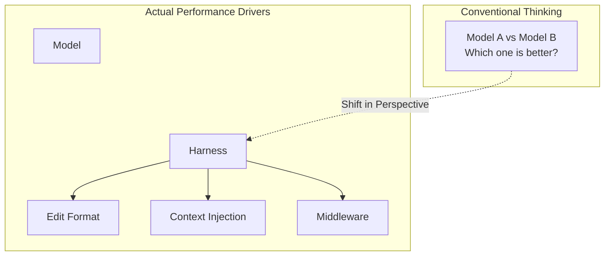
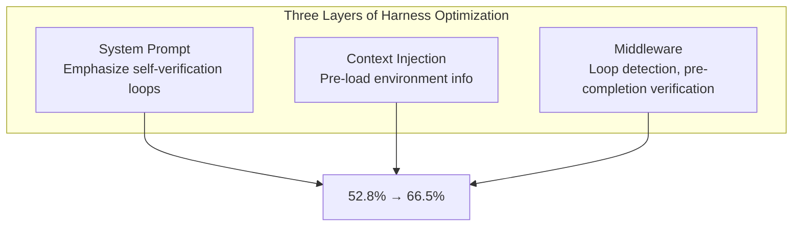

## Overview

"Which LLM is best at coding?"

Every time this question comes up in engineering teams, we overlook one critical variable: the <strong>harness</strong>. A harness refers to the entire <strong>interface layer</strong> through which an LLM reads files, receives prompts, and applies edits.

In February 2026, Can Bölük published "[I Improved 15 LLMs at Coding in One Afternoon. Only the Harness Changed](https://blog.can.ac/2026/02/12/the-harness-problem/)," tackling this harness problem head-on. By changing just the edit format, <strong>coding performance improved by 5 to 14 points across 15 LLMs</strong>, and <strong>output tokens decreased by roughly 20%</strong>.



This article covers the concept of harness engineering, benchmark data, and practical strategies from an Engineering Manager/CTO perspective.

## What Is a Harness?

A harness encompasses <strong>all the infrastructure</strong> between an LLM and actual code.

| Component | Description | Examples |
|-----------|-------------|----------|
| Edit Format | How the model modifies code | diff, string_replace, hashline |
| System Prompt | Instructions given to the model | Self-verification loops, problem-solving strategies |
| Tool Interface | Tool definitions available to the model | read_file, edit_file, run_test |
| Context Injection | Pre-loaded environment information | Directory structure, evaluation criteria |
| Middleware | Execution flow control | Loop detection, pre-completion verification |

Here is the key insight: <strong>the same model can perform dramatically differently depending on the harness.</strong>

In the Aider benchmark, simply changing the edit format caused GPT-4 Turbo's accuracy to jump <strong>from 26% to 59%</strong>, proving this point.

## Comparing Three Edit Formats

Today's major AI coding tools use different edit formats.

### 1. apply_patch (OpenAI Codex Approach)

This is the diff-based patch format used by OpenAI in Codex. The model outputs modifications in unified diff format, and the harness parses and applies them to files.

<strong>Pros</strong>: Models familiar with diffs perform reliably.
<strong>Cons</strong>: High failure rates for models with insufficient diff format training. Grok 4 recorded a <strong>50.7% failure rate</strong>.

### 2. string_replace (Claude Code, Gemini Approach)

This approach specifies the exact string to find and the exact string to replace it with. Claude Code's `str_replace` tool is a prime example.

<strong>Pros</strong>: Intuitive and simple to implement.
<strong>Cons</strong>: A single mismatched space or indent triggers a "String to replace not found" error. <strong>Perfect string reproduction</strong> is required.

### 3. hashline (A New Approach)

Proposed by Can Bölük, this method assigns a 2-3 character content hash to each line of a file.

```
11:a3|function hello() {
22:f1|  return "world";
33:0e|}
```

Instead of reproducing the entire source code, the model <strong>references hash tags</strong> to specify edit locations. For example, "replace line `2:f1`" or "insert after `3:0e`."

<strong>Pros</strong>:
- No need for perfect string reproduction, reducing errors
- Hash mismatches automatically detect file state changes, preventing conflicts
- Approximately 20% reduction in output tokens

<strong>Cons</strong>: Does not guarantee the same results across all models (GPT-3.5 struggles with hash reproduction itself).

## What the Benchmarks Tell Us

Can Bölük's benchmark ran 180 tasks across 16 models and 3 edit formats, with 3 runs each.

| Model | Previous Format | hashline Format | Improvement |
|-------|----------------|-----------------|-------------|
| Grok Code Fast 1 | 6.7% | 68.3% | +61.6pp |
| Gemini 3 Flash | — | 78.3% | — |
| Grok 4 | Low | Improved | 61% reduction in output tokens |
| MiniMax | — | 2x improvement | — |

<strong>The Grok Code Fast 1 case is particularly striking.</strong> The model itself was identical, yet simply changing the edit format produced a <strong>10x improvement from 6.7% to 68.3%</strong>. This is the potential of harness engineering.

### Cursor's Acknowledgment

The case that best illustrates the severity of this problem is Cursor. Cursor deployed a <strong>separate 70B-parameter neural network</strong> to fix edit failures. They acknowledged the edit format problem and committed an entire large-scale model to compensate for it.

## Harness Engineering in Practice: LangChain's Terminal Bench

Another case demonstrating the real-world impact of harness optimization comes from LangChain. Their team achieved a <strong>13.7-point improvement from 52.8% to 66.5%</strong> on Terminal Bench 2.0 by <strong>optimizing only the harness without changing the model</strong>. They jumped from Top 30 to Top 5 on the leaderboard.

They employed three harness optimization techniques:



### 1. Self-Verification Loops

Agents tend to terminate at the first plausible solution. LangChain enforced a "build-verify-fix" loop across all three layers: system prompt, context injection, and middleware.

### 2. Reasoning Compute Allocation Strategy ("Reasoning Sandwich")

Rather than allocating uniformly high reasoning to every step, they <strong>distributed it strategically</strong>:

- <strong>Planning phase</strong>: Maximum level (xhigh)
- <strong>Implementation phase</strong>: High (high)
- <strong>Verification phase</strong>: Maximum level (xhigh)

This "sandwich" strategy produced <strong>better results</strong> than uniform xhigh reasoning. It wisely allocated reasoning resources within timeout constraints.

### 3. Environment Onboarding

They <strong>pre-loaded environment information</strong> for the agent, much like onboarding a new engineer:
- Available tool inventory
- Directory structure
- Evaluation criteria
- Time constraints

This prevents the agent from wasting time exploring the environment.

## Three Takeaways for EMs and CTOs

### 1. Harness Optimization May Offer Higher ROI Than Model Switching

Instead of switching vendors every time a new model launches, <strong>optimizing the harness for your current model</strong> can be more cost-effective. Model switching requires readjusting API keys, prompt formats, token limits, and more, while harness optimization allows incremental improvement on top of existing infrastructure.

### 2. Open-Source Harnesses May Beat Vendor Lock-In

One of Can Bölük's key arguments: <strong>open-source harnesses benefit from a diverse community of model users, each fixing the failures they encounter</strong>, often outperforming vendor-specific harnesses in general-purpose scenarios.

In contrast, Anthropic blocking OpenCode and Google deactivating the author's Gemini account illustrate the risks of vendor lock-in.

### 3. The Gap Between "Cool Demo" and "Reliable Tool"

> "The gap between 'cool demo' and 'reliable tool' isn't model magic. It's careful, rather boring, empirical engineering at the tool boundary."
> — Can Bölük

When evaluating AI coding tools as a CTO, you should measure <strong>actual edit success rates, retry ratios, and token efficiency</strong> rather than flashy code generation in demos.

## Practical Implementation Guide

### What Teams Can Do

1. <strong>Measure edit success rates</strong>: Track the ratio of successful edits to total edit attempts by your AI coding tools. Frequent "String not found" errors indicate a harness problem.

2. <strong>Introduce middleware</strong>: Add middleware for loop detection, pre-completion verification, and automatic context injection.

3. <strong>Differentiate reasoning strategies</strong>: Assign different reasoning levels to the planning, implementation, and verification phases.

4. <strong>Trace-based debugging</strong>: Use tools like LangSmith to track all agent actions, latency, and token consumption, then systematically optimize.

### Practical Tools Shared by the HN Community

| Tool | Purpose | Approach |
|------|---------|----------|
| Serena | Code intelligence | AST-based structural analysis |
| RepoMapper | Codebase mapping | Directory structure visualization |
| Tilth | Editing tool | Line hash + semantic sections (17-25% cost reduction) |
| Tree-sitter integration | AST-aware editing | Significant reduction in round-trips |

## Conclusion

In the 2026 AI coding tool competition, the deciding factor is not just "which model you use." <strong>What harness you build on top of that model</strong> creates the real performance difference.

- A single edit format change: <strong>6.7% to 68.3%</strong> (10x improvement)
- Harness optimization alone: <strong>Top 30 to Top 5</strong> (13.7 points)
- Output token reduction: <strong>20-61%</strong>

As an Engineering Manager looking to boost your team's AI coding productivity, before waiting for the next model release, <strong>start by measuring your current harness's edit success rate</strong>. That number may reveal more than you expect.

## References

- [I Improved 15 LLMs at Coding in One Afternoon. Only the Harness Changed](https://blog.can.ac/2026/02/12/the-harness-problem/) — Can Bölük
- [Harness Engineering for Agentic Coding Systems](https://www.zenml.io/llmops-database/harness-engineering-for-agentic-coding-systems) — ZenML
- [Hacker News Discussion](https://news.ycombinator.com/item?id=46988596)
- [Addy Osmani's LLM Coding Workflow 2026](https://medium.com/@addyosmani/my-llm-coding-workflow-going-into-2026-52fe1681325e)
