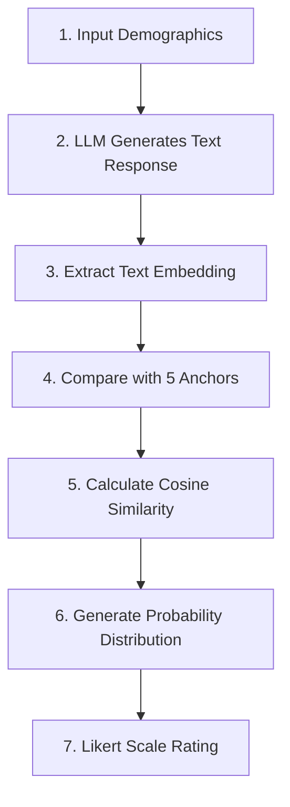
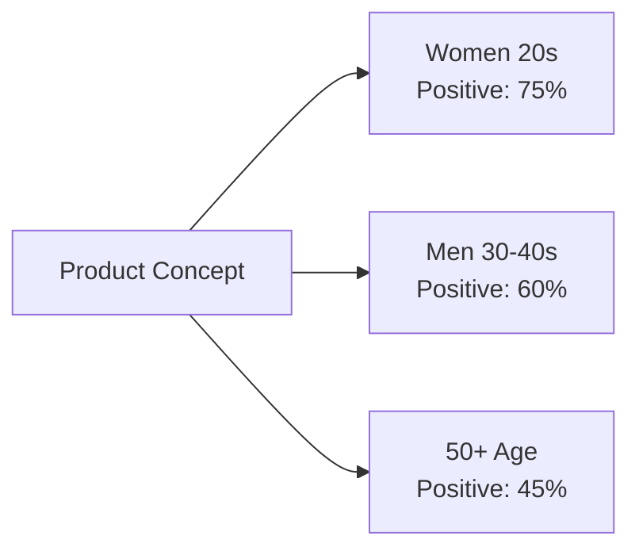

## Overview

Consumer research costs companies billions annually, yet suffers from persistent issues of panel bias and limited scale. A recent arXiv paper presents an innovative methodology that uses Large Language Models (LLMs) to generate "synthetic consumers" capable of reproducing actual consumer purchase intent with 90% reliability.

The **Semantic Similarity Rating (SSR)** method proposed in this research solves the problem of unrealistic response distributions that occur when converting LLM-generated text responses to Likert scales.

## Limitations of Traditional Consumer Research

### Cost and Scale Issues

Companies invest massive resources in consumer research but face significant constraints:

- **High Costs**: Large-scale surveys require substantial time and financial investment
- **Panel Bias**: Survey participants often fail to represent the overall population
- **Limited Scale**: Difficult to achieve sufficient statistical reliability
- **Slow Response**: Hard to react quickly to market changes

### Emergence of LLM-Based Synthetic Consumers

LLMs offered the possibility of simulating "synthetic consumers" with diverse demographic characteristics. However, early research encountered a critical problem:

**Issues with Direct Numerical Rating Requests**:
- When LLMs are directly asked to "choose a number from 1 to 5"
- They produce unrealistically extreme or biased distributions
- Results differ significantly from actual human response patterns

## The SSR Methodology Innovation

### Core Concept

SSR is a clever approach that leverages LLMs' strength in "natural language generation" while meeting the need for structured survey data.



### Three-Stage Process

#### Stage 1: Textual Response Generation

Provide the LLM with demographic attributes (age, gender, region, etc.) and product concept to generate free-form text responses.

**Prompt Example**:
```
You are a 35-year-old female living in New York.
Please freely describe your purchase intent for the following new product:
[Product Description]
```

#### Stage 2: Semantic Mapping

Convert the generated text into an embedding vector using OpenAI's `text-embedding-3-small` model.

#### Stage 3: Anchor Statement Similarity Calculation

Calculate cosine similarity with five reference anchor statements (corresponding to each Likert scale level):

- **1 point**: "I definitely don't want to purchase this"
- **2 points**: "I probably don't want to purchase this"
- **3 points**: "I'm neutral about this"
- **4 points**: "I would like to purchase this"
- **5 points**: "I definitely want to purchase this"

Normalize the calculated similarity values to generate a probability mass function (PMF) over the Likert scale.

### Mathematical Representation

Probability distribution generation based on cosine similarity:

```typescript
function computeLikertDistribution(
  responseEmbedding: number[],
  anchorEmbeddings: number[][]
): number[] {
  // Calculate cosine similarity with each anchor
  const similarities = anchorEmbeddings.map(anchor =>
    cosineSimilarity(responseEmbedding, anchor)
  );

  // Normalize via softmax
  const probabilities = softmax(similarities);

  return probabilities; // [P(1), P(2), P(3), P(4), P(5)]
}

function cosineSimilarity(vec1: number[], vec2: number[]): number {
  const dotProduct = vec1.reduce((sum, val, i) => sum + val * vec2[i], 0);
  const mag1 = Math.sqrt(vec1.reduce((sum, val) => sum + val * val, 0));
  const mag2 = Math.sqrt(vec2.reduce((sum, val) => sum + val * val, 0));
  return dotProduct / (mag1 * mag2);
}
```

## Experimental Results: Remarkable Accuracy

### Dataset

The research team utilized 57 actual product surveys conducted by a leading personal care corporation:
- **Total Responses**: 9,300 human responses
- **Product Category**: Personal care (cosmetics, household products, etc.)
- **Evaluation Metrics**: Test-retest reliability, KS similarity

### Key Achievements

**90% Human Test-Retest Reliability**:
- Compared with consistency when actual humans take the same survey twice
- SSR method achieved 90% of human response consistency level

**KS Similarity > 0.85**:
- Distribution similarity measured using Kolmogorov-Smirnov statistics
- High similarity above 0.85 indicates synthetic response distribution closely matches actual human response distribution

### Additional Benefit: Qualitative Feedback

A unique advantage of SSR is that it **provides both quantitative ratings and qualitative explanations**:

- Not just Likert scale ratings
- Also provides detailed text explanations of why respondents rated as they did
- Marketers can gain deeper understanding of consumer psychology

## Practical Use Cases

### 1. New Product Concept Testing

```python
# Example of new product testing using SSR
from semantic_similarity_rating import SSRModel

# Generate synthetic consumer panel
synthetic_panel = [
    {"age": 25, "gender": "female", "region": "NYC"},
    {"age": 35, "gender": "male", "region": "LA"},
    {"age": 45, "gender": "female", "region": "Chicago"},
    # ... thousands of profiles
]

# Product concept
product_concept = """
Eco-friendly bamboo toothbrush: Premium toothbrush made
from 100% biodegradable materials, priced 20% higher
than conventional products
"""

# Evaluate purchase intent with SSR model
ssr_model = SSRModel(model="gpt-4")
results = ssr_model.evaluate(synthetic_panel, product_concept)

# Analyze results
print(f"Average purchase intent: {results.mean_rating:.2f}")
print(f"Positive response rate: {results.positive_ratio:.1%}")
print(f"Top purchase motivations: {results.top_reasons}")
```

### 2. A/B Test Simulation

Quickly test at scale how subtle differences in product descriptions affect purchase intent:

- **Version A**: "Eco-friendly bamboo toothbrush"
- **Version B**: "Bamboo toothbrush for a sustainable future"

Test with thousands of synthetic consumers to immediately see which message is more effective.

### 3. Segmented Target Analysis

Analyze responses by various demographic segments:



## Limitations and Considerations

### Bias Issues

Biases inherent in LLMs can be reflected in synthetic consumer responses:

- **Geographic Bias**: Better performance for Western, English-speaking, developed countries
- **Demographic Bias**: Biases exist related to gender, ethnicity, age, and education level
- **Cultural Context**: May not accurately reflect consumption patterns in certain cultures

### Mitigation Methods

- **Validation with Real Data**: Verify SSR results with small-scale actual surveys
- **Bias Mitigation Techniques**: Minimize bias through prompt engineering
- **Multiple Model Usage**: Reduce bias by ensembling results from multiple LLMs

## Future Outlook

### Paradigm Shift in Consumer Research

As technologies like SSR mature:

1. **Cost Reduction**: Large-scale surveys possible at less than 10% of traditional costs
2. **Speed Improvement**: Complete in hours what previously took weeks
3. **Scale Expansion**: Test with tens of thousands of synthetic respondents instead of hundreds
4. **Iterative Experimentation**: Product optimization through rapid iteration

### Digital Twin Consumers

Creating "digital twin" consumers for each individual:
- Personalized product recommendations
- Customized marketing message testing
- Real-time market response prediction

## Implementation Guide

### Open Source Implementation

PyMC Labs has released an open-source implementation of the SSR algorithm on GitHub:

```bash
# Installation
pip install semantic-similarity-rating

# Basic usage
from ssr import SemanticSimilarityRating

# Create SSR instance
ssr = SemanticSimilarityRating(
    llm_model="gpt-4",
    embedding_model="text-embedding-3-small"
)

# Define anchor statements
anchors = [
    "I definitely don't want to purchase this",
    "I probably don't want to purchase this",
    "I'm neutral about this",
    "I would like to purchase this",
    "I definitely want to purchase this"
]

# Perform evaluation
result = ssr.evaluate(
    product_description="Eco-friendly bamboo toothbrush",
    consumer_profile={"age": 30, "gender": "female"},
    anchors=anchors
)

print(f"Likert distribution: {result.distribution}")
print(f"Response text: {result.text_response}")
```

### Best Practices

1. **Optimize Anchor Statements**: Adjust anchor statements to fit product category
2. **Prompt Engineering**: Clearly define demographic characteristics
3. **Validate Results**: Initially run in parallel with actual surveys to verify accuracy
4. **Continuous Improvement**: Improve prompts and anchors through feedback

## Conclusion

Semantic Similarity Rating (SSR) represents a breakthrough in LLM-based consumer research. This methodology achieves 90% human reliability while providing rich qualitative feedback, opening up possibilities such as:

**Key Contributions**:
- ✓ Cost-effective large-scale consumer research
- ✓ Product optimization through rapid iterative experimentation
- ✓ Integration of quantitative ratings and qualitative insights
- ✓ Analysis across diverse demographic segments

**Cautions**:
- Continuous monitoring needed for bias issues
- Ensure reliability through validation with real data
- Ethical considerations (privacy, manipulation potential, etc.)

The consumer research industry is facing a new turning point in the AI era. Technologies like SSR will become powerful tools for companies to create better products and gain deeper understanding of consumers.

## References

- [arXiv Paper: LLMs Reproduce Human Purchase Intent via Semantic Similarity Elicitation of Likert Ratings](https://arxiv.org/abs/2510.08338)
- [GitHub Implementation: PyMC Labs SSR Algorithm](https://github.com/pymc-labs/semantic-similarity-rating)
- [VentureBeat: Digital Twin Consumers](https://venturebeat.com/ai/this-new-ai-technique-creates-digital-twin-consumers-and-it-could-kill-the)
- [Research on LLM Bias in Survey Research](https://www.nature.com/articles/s41599-024-03609-x)
