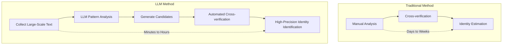
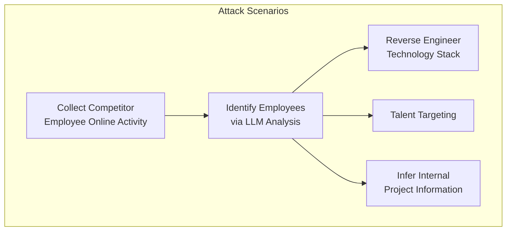
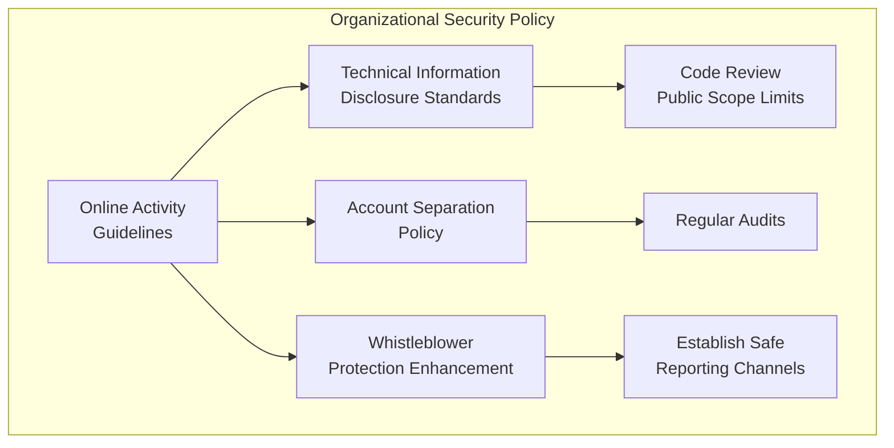

## Out of 338 Anonymous Posts, 226 Identities Revealed — 67% Success Rate

In February 2026, a paper titled <strong>"Large-scale online deanonymization with LLMs"</strong> released by MATS (Model Alignment Technical Studies) sent shockwaves through the security community. In experiments targeting Hacker News, Reddit, LinkedIn, and anonymous interview transcripts, LLMs successfully identified 226 out of 338 target individuals. A precision rate of 90% and success rate of 67% represent results far beyond traditional manual analysis.

Security expert Bruce Schneier himself addressed this research on March 3, 2026, on his blog, sounding an alarm. As <strong>Engineering Manager, VP of Engineering, and CTO</strong>, let's examine how this research impacts organizations and what defense strategies we need to implement.

## How LLM-Based Deanonymization Works

### Traditional Methods vs. LLM Approach

Traditional deanonymization relied on manual analysis and cross-verification by humans. While it has long been known that a small number of data points can identify individuals, <strong>automating this from unstructured text was practically impossible</strong>.

LLMs have completely overcome this limitation.



### Core Attack Mechanisms

The research reveals the following key mechanisms behind LLM deanonymization:

<strong>1. Stylometry Analysis</strong>: LLMs analyze individual writing patterns with precision — specific expressions, sentence structures, frequency of technical term usage — capturing subtle patterns that humans unconsciously maintain even when trying to disguise their identity.

<strong>2. Semantic Cross-Referencing</strong>: LLMs semantically connect posts scattered across multiple platforms. They determine whether a technical discussion on Hacker News and a hobby post on Reddit belong to the same individual.

<strong>3. Contextual Inference</strong>: Even without direct identifying information, LLMs narrow down candidates by synthesizing indirect details — work environment, technology stack, geographic location.

<strong>4. Scale</strong>: The most dangerous aspect is processing tens of thousands of candidates simultaneously. Traditionally, attackers had to target specific individuals; LLMs can "find the prey first, then attack."

## Real Threats to Organizations

### Employee Privacy Risks

Developers and engineers ask technical questions or share opinions on Stack Overflow, Hacker News, and Reddit. When these posts connect to specific employees at specific companies, several problems emerge:

<strong>Headhunting Targeting</strong>: Competitors can precisely identify internal technology stacks and personnel for targeted recruitment. While this might benefit individuals in the job market, from an organizational perspective it's a talent loss risk.

<strong>Internal Information Exposure</strong>: Employee technical questions and discussions can indirectly reveal the infrastructure, architecture, and technical challenges they're working with.

<strong>Social Engineering</strong>: Based on identified employees' online activity patterns, sophisticated phishing attacks become possible.

### Weakening Whistleblower Protection

One of the most serious concerns is the <strong>weakening of whistleblower anonymity</strong>. If employees attempting to report unethical corporate practices can be identified by LLMs, this poses a serious threat to healthy corporate governance.

### Competitive Intelligence Abuse



## Defense Strategies for Engineering Leaders

### 1. Organizational Awareness Training

The first step is <strong>alerting team members to this threat</strong>. Many developers believe their activity on anonymous platforms is safe.

```markdown
# Team Education Checklist

- [ ] Share LLM-based deanonymization risks
- [ ] Distribute online activity security guidelines
- [ ] Establish company-related technical information sharing policy
- [ ] Conduct regular security awareness training
```

### 2. Technical Defense Measures

<strong>Stylometric Obfuscation</strong>: When posting anonymously, provide tools that intentionally change writing style. Emerging tools automatically modify word choice and sentence structure to make stylometric analysis difficult for LLMs.

<strong>Metadata Minimization</strong>: Minimize supplementary information like posting time, IP address, and browser information. Recommend VPN usage, Tor browser, and privacy-focused browsers.

<strong>Account Separation Principle</strong>: Completely separate accounts for work-related and personal activities. Establish policies prohibiting identical email addresses or similar usernames across accounts.

### 3. Policy Framework



### 4. Monitoring and Response Systems

<strong>Self-Exposure Audits</strong>: Regularly use LLMs to audit your own employees' online exposure. Discovering vulnerabilities before attackers is key.

<strong>Incident Response Planning</strong>: Establish procedures in advance for when employee anonymity is compromised. Include legal response, social media management, and internal communication plans.

## Immediate Action Items for CTO/VPoE

<strong>Week 1 — Situation Assessment</strong>

- Survey team members' public online activity status (voluntary survey)
- Collect examples of company technical information exposed externally
- Check whether existing security policies include online privacy provisions

<strong>Within One Month — Policy Establishment</strong>

- Draft online activity guidelines
- Review and strengthen whistleblower protection channels
- Add LLM deanonymization risks to security training curriculum

<strong>Within Quarter — Technical Implementation</strong>

- Evaluate adoption of stylometric obfuscation tools
- Strengthen privacy settings in internal communication tools
- Establish regular exposure audit processes

## The Dual Nature of This Technology

LLM-based deanonymization isn't used solely for harm.

<strong>Positive Applications</strong>: Law enforcement can use it to track cybercriminals, identify misinformation spreaders, and pinpoint online harassment perpetrators.

<strong>Negative Abuse</strong>: It can be weaponized for stalking, doxxing, activist repression, corporate surveillance, and government surveillance.

While the technology itself is neutral, <strong>the current defense capabilities lag far behind attack capabilities</strong>. Attackers can execute large-scale deanonymization at low cost, while defenders must respond individually — an asymmetric structure.

## Conclusion

Large-scale LLM-based deanonymization is <strong>already a present reality</strong>. A 67% success rate and 90% precision rate completely invert existing assumptions about online anonymity.

As Engineering Leaders, our responsibilities are clear:

1. Take this threat seriously and share it with teams
2. Establish organizational-level online activity guidelines
3. Implement technical defense measures and audit regularly
4. Strengthen whistleblower protection systems

<strong>The assumption that posting anonymously protects identity is no longer valid.</strong>

## References

- [Large-scale online deanonymization with LLMs (arXiv)](https://arxiv.org/abs/2602.16800)
- [LLM-Assisted Deanonymization — Schneier on Security](https://www.schneier.com/blog/archives/2026/03/llm-assisted-deanonymization.html)
- [AI takes a swing at online anonymity — The Register](https://www.theregister.com/2026/02/26/llms_killed_privacy_star/)
- [Large-Scale Online Deanonymization with LLMs — LessWrong](https://www.lesswrong.com/posts/xwCWyy8RvAKsSoBRF/large-scale-online-deanonymization-with-llms)
