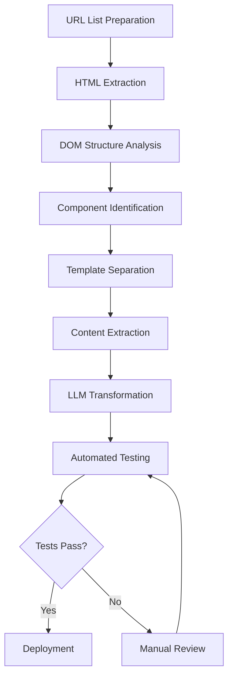

## Introduction

Web page migration has traditionally been a time-consuming and error-prone process. Whether you're modernizing a legacy system, redesigning your site architecture, or migrating to a new framework, the challenges are similar: maintaining consistency, ensuring functionality, and avoiding regressions.

Enter <strong>Large Language Models (LLMs)</strong>. In 2024-2025, companies like Google, Airbnb, and Zalando have demonstrated that LLMs can transform code migration from a manual, tedious task into an intelligent, semi-automated process. This article explores how to leverage LLMs, Web Components, and modern testing frameworks to standardize and accelerate web page migration workflows.

## The Challenge: Traditional Migration Approaches Fall Short

Traditional approaches to web migration typically involve:

- Manual code rewriting (time-intensive, error-prone)
- Simple find-and-replace scripts (fragile, no semantic understanding)
- Transpilers (1:1 syntax mapping, poor code quality)
- Outsourcing to contractors (expensive, knowledge loss)

These methods struggle with:
- Understanding business intent behind code
- Maintaining consistent design patterns
- Handling edge cases gracefully
- Generating comprehensive tests
- Ensuring accessibility and SEO compliance

## Why LLM-Based Automation Changes Everything

### Semantic Understanding vs Syntax Mapping

Unlike traditional transpilers that perform mechanical 1:1 syntax transformations, LLMs understand the <strong>semantic meaning</strong> of code. This enables:

| Capability | Traditional Transpiler | LLM-Based Approach |
|------------|----------------------|-------------------|
| Code transformation | Syntax-only mapping | Context-aware refactoring |
| Code quality | Mechanical output | Optimized + best practices |
| Error handling | Manual fixes required | Automatic contextual fixes |
| Test generation | Separate manual task | Automated generation |
| Documentation | Not included | Inline comments generated |

### Real-World Success Stories (2024-2025)

#### Google: Large-Scale Code Migration

In their 2024 research paper "Migrating Code At Scale With LLMs At Google", Google demonstrated:

- <strong>Automated Abstract Data Type (ADT) refactoring</strong> across millions of lines of code
- <strong>Relational representation invariants</strong> for specifying data type changes
- <strong>Consistent pattern enforcement</strong> across massive codebases
- Significant reduction in engineering hours

Key insight: LLMs don't just translate code—they understand and preserve architectural patterns.

#### Airbnb: Test Migration at Scale

Airbnb's "Accelerating Large-Scale Test Migration with LLMs" project (2024) achieved:

- Migration of thousands of tests to React Testing Library
- <strong>Hundreds of engineering hours saved</strong>
- Automatic handling of edge cases
- Maintained 100% test coverage throughout migration

Their approach: Use LLMs to understand test intent, then generate modern, maintainable test code.

#### Zalando: UI Component Library Migration

Zalando's engineering team used GPT-4o (September 2024) to migrate UI component libraries:

- Python-based LLM automation pipeline
- GitHub PR-based review workflow
- Model selection optimization for accurate transformations
- Successful migration of complex component patterns

## Web Components: The Foundation for Portable, Reusable UI

### Why Web Components in 2025?

Web Components have matured into a production-ready standard with:

- <strong>Universal browser support</strong> (Chrome, Firefox, Safari, Edge)
- <strong>No polyfills required</strong> for modern browsers
- <strong>Framework-agnostic</strong> (works with React, Vue, Svelte, or vanilla JS)
- <strong>Native performance</strong> (no framework overhead)
- <strong>True style encapsulation</strong> via Shadow DOM

The three core technologies:

1. <strong>Custom Elements</strong>: Define your own HTML tags
2. <strong>Shadow DOM</strong>: Style and DOM isolation
3. <strong>HTML Templates</strong>: Reusable markup patterns

### Shadow DOM Design Patterns

Shadow DOM provides true encapsulation, preventing CSS leakage and DOM conflicts:

```javascript
// Basic Web Component with Shadow DOM
class AdvancedTooltip extends HTMLElement {
  constructor() {
    super();
    // Create isolated Shadow DOM
    this.attachShadow({ mode: 'open' });
  }

  connectedCallback() {
    const text = this.getAttribute('text');
    this.shadowRoot.innerHTML = `
      <style>
        :host {
          position: relative;
          display: inline-block;
        }
        .tooltip {
          position: absolute;
          background: #333;
          color: white;
          padding: 8px;
          border-radius: 4px;
          font-size: 14px;
          z-index: 1000;
        }
      </style>
      <div class="tooltip">${text}</div>
    `;
  }
}

customElements.define('advanced-tooltip', AdvancedTooltip);
```

### Composition with Slots

Slots enable flexible content projection:

```html
<!-- Component definition -->
<template id="card-template">
  <style>
    .card { border: 1px solid #ddd; padding: 16px; }
    .card-header { font-weight: bold; }
  </style>
  <div class="card">
    <div class="card-header">
      <slot name="header">Default Header</slot>
    </div>
    <div class="card-body">
      <slot>Default Content</slot>
    </div>
  </div>
</template>

<!-- Usage -->
<my-card>
  <span slot="header">Custom Header</span>
  <p>Custom content goes here</p>
</my-card>
```

## Lit vs Stencil: Choosing Your Web Components Framework

### Lit 3.0 (2024-2025)

<strong>Characteristics:</strong>
- Ultra-lightweight (4.3MB memory footprint)
- Reactive property management
- Native TypeScript support
- No compilation required (runtime library)
- Declarative templates

<strong>Performance Benchmarks (2025):</strong>
- Initial load: 235ms
- Memory usage: 4.3MB
- Update speed: 17% faster than Stencil

<strong>Code Example:</strong>

```typescript
import { LitElement, html, css } from 'lit';
import { customElement, property } from 'lit/decorators.js';

@customElement('my-counter')
export class MyCounter extends LitElement {
  static styles = css`
    button {
      background: blue;
      color: white;
      padding: 8px 16px;
      border-radius: 4px;
    }
  `;

  @property({ type: Number })
  count = 0;

  render() {
    return html`
      <div>
        <p>Count: ${this.count}</p>
        <button @click=${this._increment}>Increment</button>
      </div>
    `;
  }

  private _increment() {
    this.count++;
  }
}
```

### Stencil 4.0 (2024-2025)

<strong>Characteristics:</strong>
- JSX template support (React-like syntax)
- Build-time optimization
- Automatic lazy loading
- Framework-agnostic output
- TypeScript-first

<strong>Performance Benchmarks (2025):</strong>
- Initial load: 284ms
- Memory usage: 6.2MB
- Build-time optimization minimizes runtime overhead

<strong>Code Example:</strong>

```typescript
import { Component, Prop, State, h } from '@stencil/core';

@Component({
  tag: 'my-counter',
  styleUrl: 'my-counter.css',
  shadow: true,
})
export class MyCounter {
  @Prop() initialCount = 0;
  @State() count = this.initialCount;

  private increment = () => {
    this.count++;
  };

  render() {
    return (
      <div>
        <p>Count: {this.count}</p>
        <button onClick={this.increment}>Increment</button>
      </div>
    );
  }
}
```

### Selection Guide

| Project Requirement | Recommended Framework | Reason |
|-------------------|---------------------|--------|
| Minimal bundle size | Lit | 30% smaller memory footprint |
| React-style syntax | Stencil | JSX template support |
| Rapid prototyping | Lit | No compilation step |
| Large enterprise apps | Stencil | Build-time optimizations |
| Team learning curve | Lit | Simpler API surface |

## CMS Template System Integration

### Static Site Generator Comparison

#### Astro 5.14+ (2024-2025)

<strong>Key Features:</strong>
- Islands Architecture (partial hydration)
- Multi-framework support (mix React, Vue, Svelte)
- Content Collections (type-safe content management)
- Zero JavaScript by default

<strong>Use Cases:</strong>
- Marketing sites and blogs
- Documentation sites
- Portfolios

<strong>Example:</strong>

```astro
---
// src/pages/blog/[slug].astro
import { getCollection } from 'astro:content';

export async function getStaticPaths() {
  const posts = await getCollection('blog');
  return posts.map(post => ({
    params: { slug: post.slug },
    props: { post },
  }));
}

const { post } = Astro.props;
const { Content } = await post.render();
---

<html>
  <head>
    <title>{post.data.title}</title>
  </head>
  <body>
    <article>
      <h1>{post.data.title}</h1>
      <Content />
    </article>
  </body>
</html>
```

#### Hugo (Go-based)

<strong>Key Features:</strong>
- Blazing-fast build speeds (thousands of pages in seconds)
- Built-in multilingual support
- Powerful templating system
- Rich theme ecosystem

<strong>Performance:</strong>
- 1000 pages: ~1 second
- 10000 pages: ~5 seconds

<strong>Use Cases:</strong>
- Large documentation sites
- Multilingual content sites
- Static blogs at scale

#### Eleventy (11ty)

<strong>Key Features:</strong>
- JavaScript-based (Node.js)
- Multiple template engines (Nunjucks, Liquid, Handlebars)
- Flexible data pipeline
- Zero client-side JavaScript

<strong>Use Cases:</strong>
- Highly customized projects
- Legacy system migrations
- Developer-friendly workflows

### Comparison Matrix

| Feature/Framework | Astro | Hugo | 11ty |
|------------------|-------|------|------|
| <strong>Build Speed</strong> (1000 pages) | ~3s | ~1s | ~5s |
| <strong>Learning Curve</strong> | Medium | High | Low |
| <strong>React Components</strong> | ✅ | ❌ | ⚠️ (limited) |
| <strong>Image Optimization</strong> | Built-in | Plugin | Plugin |
| <strong>Multilingual Support</strong> | Manual | Built-in | Plugin |
| <strong>Community Size</strong> | Growing | Large | Medium |
| <strong>GitHub Stars</strong> | 47k+ | 76k+ | 16k+ |

## Comprehensive Test Automation Strategy

### E2E Testing: Playwright (2024-2025 Standard)

Playwright has emerged as the de facto standard for E2E testing:

<strong>Advantages:</strong>
- Microsoft-backed, active maintenance
- Cross-browser support (Chromium, Firefox, WebKit)
- Auto-wait mechanisms (improved stability)
- Parallel execution
- Video recording and screenshots

<strong>Example Test:</strong>

```typescript
import { test, expect } from '@playwright/test';

test('verify migrated page functionality', async ({ page }) => {
  await page.goto('https://example.com/migrated-page');

  // Click button
  await page.click('button[data-testid="submit"]');

  // Verify result
  await expect(page.locator('.success-message')).toBeVisible();

  // Screenshot comparison
  await expect(page).toHaveScreenshot('migrated-page.png', {
    maxDiffPixels: 100,
  });
});
```

### Link Checking

Automated link validation prevents broken links:

```typescript
import { test, expect } from '@playwright/test';

test('validate all links', async ({ page }) => {
  await page.goto('https://example.com');

  const links = await page.locator('a[href]').all();
  const results = [];

  for (const link of links) {
    const href = await link.getAttribute('href');
    if (!href || href.startsWith('#')) continue;

    const response = await page.request.get(href);
    results.push({
      url: href,
      status: response.status(),
      ok: response.ok(),
    });
  }

  const brokenLinks = results.filter(r => !r.ok);
  expect(brokenLinks).toHaveLength(0);
});
```

### Visual Regression Testing

<strong>Percy by BrowserStack:</strong>
- CI/CD pipeline integration
- Cross-browser screenshots
- Automatic diff generation
- PR review workflow

```javascript
// Playwright + Percy
import { test } from '@playwright/test';
import percySnapshot from '@percy/playwright';

test('homepage visual test', async ({ page }) => {
  await page.goto('https://example.com');
  await percySnapshot(page, 'Homepage');
});
```

<strong>Native Playwright:</strong>

```typescript
import { test, expect } from '@playwright/test';

test('visual regression test', async ({ page }) => {
  await page.goto('https://example.com');

  // Full page screenshot
  await expect(page).toHaveScreenshot('full-page.png', {
    fullPage: true,
    maxDiffPixelRatio: 0.02,
  });

  // Specific element
  const header = page.locator('header');
  await expect(header).toHaveScreenshot('header.png');
});
```

### Accessibility Testing (a11y)

<strong>axe-core</strong> has become the industry standard:

- WCAG 2.1/2.2 compliance checking
- Integration with Playwright, Cypress, Selenium
- Detailed violation reports
- Automatic fix suggestions

```typescript
import { test, expect } from '@playwright/test';
import AxeBuilder from '@axe-core/playwright';

test('accessibility check', async ({ page }) => {
  await page.goto('https://example.com');

  const accessibilityScanResults = await new AxeBuilder({ page })
    .withTags(['wcag2a', 'wcag2aa'])
    .analyze();

  expect(accessibilityScanResults.violations).toEqual([]);
});
```

### SEO and Core Web Vitals Testing

<strong>Lighthouse:</strong>

Google's official tool for comprehensive audits:

```typescript
import { test } from '@playwright/test';
import { playAudit } from 'playwright-lighthouse';

test('Lighthouse performance test', async ({ page }) => {
  await page.goto('https://example.com');

  await playAudit({
    page,
    thresholds: {
      performance: 90,
      accessibility: 90,
      'best-practices': 90,
      seo: 90,
    },
    port: 9222,
  });
});
```

<strong>Core Web Vitals monitoring:</strong>

```typescript
// Using web-vitals library
import { getLCP, getFID, getCLS, getTTFB, getFCP } from 'web-vitals';

function sendToAnalytics(metric) {
  console.log(metric);
  // Send to analytics service
}

getLCP(sendToAnalytics);
getFID(sendToAnalytics);
getCLS(sendToAnalytics);
getTTFB(sendToAnalytics);
getFCP(sendToAnalytics);
```

### AEO (Answer Engine Optimization) Check

With the rise of AI-powered search engines, structured data validation is critical:

```typescript
import { test, expect } from '@playwright/test';

test('validate Schema.org markup', async ({ page }) => {
  await page.goto('https://example.com/article');

  const structuredData = await page.evaluate(() => {
    const scripts = Array.from(
      document.querySelectorAll('script[type="application/ld+json"]')
    );
    return scripts.map(s => JSON.parse(s.textContent));
  });

  // Verify Article Schema
  const article = structuredData.find(d => d['@type'] === 'Article');
  expect(article).toBeDefined();
  expect(article.headline).toBeDefined();
  expect(article.author).toBeDefined();
  expect(article.datePublished).toBeDefined();
});
```

<strong>FAQ Schema Generator:</strong>

```typescript
interface FAQItem {
  question: string;
  answer: string;
}

function generateFAQSchema(items: FAQItem[]) {
  return {
    '@context': 'https://schema.org',
    '@type': 'FAQPage',
    mainEntity: items.map(item => ({
      '@type': 'Question',
      name: item.question,
      acceptedAnswer: {
        '@type': 'Answer',
        text: item.answer,
      },
    })),
  };
}
```

### Code Quality Automation

<strong>ESLint 10 + Prettier 5 (2025):</strong>

```javascript
// eslint.config.js (Flat Config)
import eslint from '@eslint/js';
import tseslint from 'typescript-eslint';
import prettier from 'eslint-config-prettier';

export default [
  eslint.configs.recommended,
  ...tseslint.configs.recommended,
  prettier,
  {
    rules: {
      'no-console': 'warn',
      '@typescript-eslint/no-unused-vars': 'error',
      '@typescript-eslint/explicit-function-return-type': 'warn',
    },
  },
];
```

<strong>Biome.js</strong> (ESLint + Prettier alternative):

- 10x faster than ESLint
- Single tool for linting + formatting
- Zero configuration
- Rust-based

```json
{
  "formatter": {
    "enabled": true,
    "indentStyle": "space",
    "indentWidth": 2
  },
  "linter": {
    "enabled": true,
    "rules": {
      "recommended": true
    }
  }
}
```

### LLM-Based Code Review

Automated code review with LLMs:

```yaml
# .github/workflows/ai-code-review.yml
name: AI Code Review

on:
  pull_request:
    types: [opened, synchronize]

jobs:
  ai-review:
    runs-on: ubuntu-latest
    steps:
      - uses: actions/checkout@v4

      - name: Run AI Code Review
        uses: your-org/ai-code-reviewer@v1
        with:
          llm-provider: openai
          model: gpt-4o
          api-key: ${{ secrets.OPENAI_API_KEY }}
          review-scope: changed-files

      - name: Post Review Comments
        uses: actions/github-script@v7
        with:
          script: |
            const fs = require('fs');
            const reviews = JSON.parse(fs.readFileSync('ai-review.json'));

            for (const review of reviews) {
              await github.rest.pulls.createReviewComment({
                owner: context.repo.owner,
                repo: context.repo.repo,
                pull_number: context.issue.number,
                body: review.comment,
                path: review.file,
                line: review.line,
              });
            }
```

## Practical Workflow Implementation

### Complete Migration Pipeline



### Step 1: HTML Extraction with Playwright

```typescript
import { chromium } from 'playwright';
import * as fs from 'fs/promises';

async function extractHTML(url: string) {
  const browser = await chromium.launch();
  const page = await browser.newPage();

  await page.goto(url, { waitUntil: 'networkidle' });

  // Full HTML
  const html = await page.content();

  // Extract specific sections
  const mainContent = await page.locator('main').innerHTML();

  await fs.writeFile(
    `extracted/${url.replace(/[^a-z0-9]/gi, '_')}.html`,
    html
  );

  await browser.close();
  return { html, mainContent };
}
```

### Step 2: DOM Structure Analysis

```typescript
import { parse } from 'node-html-parser';

interface ComponentStructure {
  tag: string;
  classes: string[];
  children: ComponentStructure[];
  text?: string;
}

function analyzeDOM(html: string): ComponentStructure {
  const root = parse(html);

  function traverse(node): ComponentStructure {
    return {
      tag: node.tagName || 'text',
      classes: node.classList?.value || [],
      text: node.textContent?.trim(),
      children: node.childNodes.map(traverse),
    };
  }

  return traverse(root);
}
```

### Step 3: LLM-Powered Component Transformation

```typescript
import OpenAI from 'openai';

const openai = new OpenAI({ apiKey: process.env.OPENAI_API_KEY });

async function convertToComponent(
  html: string,
  targetFramework: 'react' | 'vue' | 'webcomponent'
): Promise<string> {
  const prompt = `
Convert the following HTML to a ${targetFramework} component:

HTML:
${html}

Requirements:
- Use TypeScript
- Add proper types
- Extract reusable logic
- Add accessibility attributes
- Include inline documentation

Output only the component code without explanation.
  `;

  const response = await openai.chat.completions.create({
    model: 'gpt-4o',
    messages: [{ role: 'user', content: prompt }],
    temperature: 0.2,
  });

  return response.choices[0].message.content;
}
```

### Step 4: Automated Test Generation

```typescript
async function generateTests(
  componentCode: string,
  originalURL: string
): Promise<string> {
  const prompt = `
Generate Playwright tests for the following component:

Component:
${componentCode}

Original URL: ${originalURL}

Requirements:
- Test user interactions
- Verify visual consistency
- Check accessibility
- Test responsive behavior

Generate comprehensive test suite.
  `;

  const response = await openai.chat.completions.create({
    model: 'gpt-4o',
    messages: [{ role: 'user', content: prompt }],
  });

  return response.choices[0].message.content;
}
```

### Progressive Deployment Strategies

<strong>A/B Testing Pattern:</strong>

```typescript
// Edge Function (Vercel/Netlify)
export default async function handler(req) {
  const url = new URL(req.url);
  const useLegacy = Math.random() < 0.5; // 50/50 split

  if (useLegacy) {
    return fetch(`https://legacy.example.com${url.pathname}`);
  } else {
    return fetch(`https://new.example.com${url.pathname}`);
  }
}
```

<strong>Canary Deployment:</strong>

```yaml
# Kubernetes Canary Deployment
apiVersion: v1
kind: Service
metadata:
  name: website
spec:
  selector:
    app: website
  ports:
    - port: 80

---
apiVersion: apps/v1
kind: Deployment
metadata:
  name: website-v1
spec:
  replicas: 9  # 90%
  template:
    metadata:
      labels:
        app: website
        version: v1

---
apiVersion: apps/v1
kind: Deployment
metadata:
  name: website-v2
spec:
  replicas: 1  # 10%
  template:
    metadata:
      labels:
        app: website
        version: v2
```

### Rollback Strategy

```typescript
interface MigrationCheckpoint {
  id: string;
  timestamp: Date;
  files: string[];
  commit: string;
  testResults: TestResult[];
}

class MigrationManager {
  private checkpoints: MigrationCheckpoint[] = [];

  async createCheckpoint(): Promise<string> {
    const checkpoint = {
      id: crypto.randomUUID(),
      timestamp: new Date(),
      files: await this.getChangedFiles(),
      commit: await this.getCurrentCommit(),
      testResults: await this.runTests(),
    };

    this.checkpoints.push(checkpoint);
    return checkpoint.id;
  }

  async rollback(checkpointId: string): Promise<void> {
    const checkpoint = this.checkpoints.find(c => c.id === checkpointId);
    if (!checkpoint) throw new Error('Checkpoint not found');

    await exec(`git reset --hard ${checkpoint.commit}`);
    console.log(`Rolled back to ${checkpoint.timestamp}`);
  }
}
```

## Tech Stack Recommendations by Project Scale

### Small Projects (~50 pages)

```yaml
SSG: Astro 5.14
Web Components: Lit 3.0
Testing:
  - E2E: Playwright
  - Visual: Playwright native
  - A11y: axe-core
  - SEO: Lighthouse CLI
Linting: Biome.js
CI/CD: GitHub Actions
Hosting: Vercel / Netlify
```

<strong>Estimated Cost:</strong> Free ~ $20/month

### Medium Projects (50~500 pages)

```yaml
SSG: Astro 5.14 + Contentful (Headless CMS)
Web Components: Stencil 4.0
Testing:
  - E2E: Playwright
  - Visual: Percy
  - A11y: Pa11y CI
  - SEO: Lighthouse CI + Core Web Vitals API
Linting: ESLint 10 + Prettier 5
Code Review: GitHub Actions + GPT-4o
CI/CD: GitHub Actions
Hosting: Vercel Pro
```

<strong>Estimated Cost:</strong> $50~$200/month

### Large Projects (500+ pages)

```yaml
SSG: Hugo (build speed priority)
Web Components: Stencil 4.0 (enterprise optimized)
Testing:
  - E2E: Playwright (distributed execution)
  - Visual: Chromatic Enterprise
  - A11y: axe-core + manual testing
  - SEO: Custom Lighthouse + WebPageTest
  - Performance: DebugBear
Linting: ESLint 10 + custom rules
Code Review: LLM-based + human review
CI/CD: GitHub Actions + Kubernetes
Monitoring: Sentry + Datadog
Hosting: AWS CloudFront + S3
```

<strong>Estimated Cost:</strong> $500~$2000/month

### Decision Tree

```
Project page count?
├─ <50: Astro + Lit + Playwright
├─ 50-500: Astro + Stencil + Percy
└─ >500: Hugo + Stencil + Chromatic

Build speed critical?
├─ Yes: Hugo
└─ No: Astro (developer experience priority)

React component reuse?
├─ Yes: Astro (Islands)
└─ No: Hugo or 11ty

Budget constraints?
├─ Tight: Open-source stack (Playwright, axe-core)
└─ Flexible: Commercial tools (Percy, Chromatic)
```

## Conclusion: Key Takeaways and Next Steps

### Core Insights

1. <strong>LLM-Based Migration:</strong> Beyond simple transformation, LLMs enable semantic understanding and refactoring. Proven at scale by Google, Airbnb, and Zalando in 2024-2025 production environments.

2. <strong>Web Components:</strong> Lit and Stencil have become 2025 standards, with native browser support eliminating polyfill requirements.

3. <strong>SSG Selection:</strong> Astro excels in developer experience, Hugo in build speed, and 11ty in flexibility—choose based on your priorities.

4. <strong>Test Automation:</strong> Playwright has emerged as the E2E testing standard, while axe-core dominates accessibility testing.

5. <strong>AEO Optimization:</strong> Schema.org structured data is now essential for the AI-powered search era.

### Implementation Roadmap

<strong>Phase 1 (1-2 weeks):</strong> Environment Setup
- Select and install SSG
- Configure Web Components framework
- Set up CI/CD pipeline

<strong>Phase 2 (2-4 weeks):</strong> Migration Pilot
- Start with 10-20 page pilot
- Optimize LLM prompts
- Develop automation scripts

<strong>Phase 3 (4-8 weeks):</strong> Large-Scale Migration
- Batch processing automation
- Run automated test suites
- Progressive deployment (Canary/A/B)

<strong>Phase 4 (Ongoing):</strong> Monitoring and Optimization
- Performance monitoring
- Continuous SEO/AEO improvement
- User feedback integration

### What to Explore Next

Based on this research, consider diving deeper into:

1. <strong>Framework Comparison:</strong> "Web Components in 2025: Complete Lit vs Stencil Comparison"
2. <strong>Practical Tutorial:</strong> "Migrating Legacy Sites to Astro with LLMs"
3. <strong>Testing Guide:</strong> "Building Perfect E2E Test Pipelines with Playwright"
4. <strong>AEO Optimization:</strong> "SEO for the AI Era: Complete Answer Engine Optimization Guide"

The future of web migration is intelligent, automated, and scalable. By combining LLMs, Web Components, and comprehensive testing frameworks, you can transform what was once a painful manual process into a streamlined, repeatable workflow.

---

## References

- [Google: Migrating Code At Scale With LLMs](https://arxiv.org/abs/2504.09691)
- [Airbnb: Large-Scale Test Migration with LLMs](https://medium.com/airbnb-engineering/accelerating-large-scale-test-migration-with-llms-9565c208023b)
- [Zalando: LLM Migration UI Components](https://engineering.zalando.com/posts/2025/02/llm-migration-ui-component-libraries.html)
- [Lit 3.0 Documentation](https://lit.dev)
- [Stencil 4.0 Documentation](https://stenciljs.com)
- [Playwright Documentation](https://playwright.dev)
- [Web Components 2025 Benchmark](https://markaicode.com/web-components-2025-lit-stencil-enterprise/)
- [Answer Engine Optimization Guide 2025](https://cxl.com/blog/answer-engine-optimization-aeo-the-comprehensive-guide-for-2025/)
- [Astro Documentation](https://docs.astro.build)
- [Schema.org](https://schema.org/)
